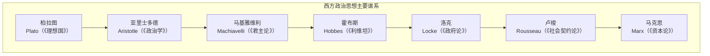
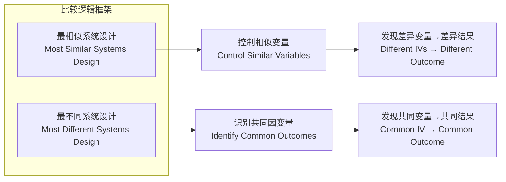

---
aliases:
  - Political Theory and Comparative Politics
  - 政治学理论
  - 比较政治
  - PoliticalScience
tags:
  - PoliticalScience
  - PoliticalTheory
  - ComparativePolitics
  - Governance
---

# 政治学理论与比较政治（Political Theory and Comparative Politics）

政治学理论（Political Theory）研究政治的本质、权力与正义——探讨"应当如何治理"的规范性问题；比较政治（Comparative Politics）通过跨国比较分析政治制度、行为和过程——回答"实际如何治理"的经验性问题。二者构成政治学学科的两大方法论支柱，前者提供概念框架和价值标准，后者提供经验证据和因果推论。这种规范与经验的双重视角使得政治学既不同于纯粹的哲学思辨（因为它需要面对实际政治世界的复杂性），也不同于单纯的统计建模（因为价值问题无法被还原为数据）。

## 西方政治思想的谱系

这一思想谱系的核心线索是社会契约论（Social Contract Theory）的演变：霍布斯的"一切人对一切人的战争"（Bellum Omnium Contra Omnes）——为避免恐怖的"自然状态"而将全部权利让渡给主权者；洛克的"生命、自由与财产"——人民只让渡部分权利，保留反抗权，政府因此是有限的；卢梭的"公意"（General Will）——人民作为整体才是主权者，政府只是执行者；马克思对自由主义和资本主义契约论的彻底批判——指出形式上的政治平等掩盖了实质性的经济不平等。

| 思想家 | 核心著作 | 关键概念 | 国家观 | 对后世影响 |
|--------|---------|---------|-------|-----------|
| 柏拉图（Plato） | 《理想国》 | 哲人王、理念论、正义即和谐 | 等级分工的有机体 | 精英统治理论的原型 |
| 亚里士多德（Aristotle） | 《政治学》 | 人天生是政治动物、中庸政体 | 城邦至善共同体 | 政治学的学科奠基 |
| 马基雅维利（Machiavelli） | 《君主论》 | 有效真理、君主之恶的正当性 | 权力保持的技术 | 现代政治现实主义起源 |
| 霍布斯（Hobbes） | 《利维坦》 | 自然状态、社会契约、主权不可分 | 绝对主义国家 | 现代主权理论奠基 |
| 洛克（Locke） | 《政府论》 | 自然权利、有限政府、反抗权 | 宪政自由主义 | 美国革命与宪法的思想源头 |
| 卢梭（Rousseau） | 《社会契约论》 | 公意、人民主权、公民宗教 | 直接民主共和国 | 法国大革命的精神旗帜 |
| 马克思（Marx） | 《资本论》《共产党宣言》| 阶级冲突、异化、国家是工具 | 国家消亡论 | 20世纪社会主义运动的理论基础 |

## 核心政治概念（Core Political Concepts）

### 权力与权威（Power and Authority）

Max Weber 对权威的三分法是社会科学中引用最广泛的分析框架之一：

| 权威类型 | 合法性基础 | 权力运作机制 | 典型制度 | 内在脆弱性 |
|---------|-----------|-------------|---------|-----------|
| 传统型（Traditional） | 习俗与神圣——"历来如此" | 世袭传承 | 君主制、部落酋长制 | 僵化——无法应对外部变化 |
| 魅力型（Charismatic） | 个人超凡魅力——"天选之人" | 领袖的直接感召 | 革命政权、宗教先知 | 不持久——领袖继任危机 |
| 法理型（Legal-Rational） | 法律与程序——"依法治理" | 非人格化的官僚体系 | 现代民主国家 | 过度官僚化——形式理性压倒实质理性 |

Weber 的核心洞见：合法性（Legitimacy）——被统治者对统治权的自愿认同——是任何政治秩序持久运转的前提条件，而合法性的基础会随社会的理性化进程从传统型向法理型过渡。法理型权威的基础形式是对规则本身的信任，而非对人的信任——这是现代官僚制和法治国家的核心特征。

### 正义理论（Theories of Justice）

当代政治哲学关于正义的三大竞争性框架：

$$
\begin{aligned}
&\text{功利主义（Utilitarianism）}: \max \sum_{i=1}^{n} U_i \\
&\text{自由至上主义（Libertarianism）}: \text{权利优先于善——最小国家，最大自由} \\
&\text{罗尔斯正义论（Rawlsian Justice）}: \text{无知之幕（Veil of Ignorance）+ 差别原则（Difference Principle）}
\end{aligned}
$$

**功利主义**（Bentham, Mill）追求"最大多数人的最大幸福"——可量化但可能牺牲少数。**自由至上主义**（Nozick）否定任何再分配——只要获取过程正义，结果如何不构成正义问题。**罗尔斯正义论**（John Rawls, 1971）在"无知之幕"下推导出两条原则：平等的自由原则（每个人都享有最广泛的基本自由）和差别原则（社会和经济不平等必须使最不利者受益）。罗尔斯的理论被广泛认为是 20 世纪英语世界政治哲学中最具影响力的贡献。

### 自由、平等与民主的三角关系

$$D_{\text{民主}} = f(\text{参与广度}, \text{竞争程度}, \text{公民自由})$$

Robert Dahl 的多元民主（Polyarchy）理论将民主操作化为两个核心维度：参与（Participation）——多大比例的公民有权参与政治竞争；以及竞争（Competition）——反对派有多大的自由组织和竞争权力的空间：

- 高参与 + 高竞争 = 多元民主（理想型）
- 低参与 + 低竞争 = 封闭威权（传统专制）
- 高参与 + 低竞争 = 大众威权（选举式威权）
- 低参与 + 高竞争 = 竞争性寡头（精英民主）

## 政体类型（Types of Regime）

### 民主政体的要素

Robert Dahl 提出民主的五个必要条件（1989 年修正版）：

- **有效参与（Effective Participation）**：公民有充分且平等的机会表达政策偏好
- **投票平等（Voting Equality）**：每票等值——一人一票，票票等值
- **知情公民（Informed Citizenry）**：公民有获取多元信息和公开讨论的机会
- **议程控制（Agenda Control）**：公民有权决定哪些议题进入政治议程
- **包容性（Inclusiveness）**：所有受决策影响的常住成人均享有完整公民权利

### 威权政体的分类与内部差异

| 子类型 | 核心特征 | 权力基础 | 典型脆弱性 | 代表案例 |
| :--- | :--- | :--- | :--- | :--- |
| 个人独裁（Personalist） | 个人绝对控制、无制度化继任 | 军队/家族/商业精英忠诚 | 继任危机——领导人健康或更替 | 萨达姆时期的伊拉克 |
| 一党制（Single-Party） | 政党垄断政治、社会全面渗透 | 组织网络、意识形态控制 | 意识形态衰减、经济绩效压力 | 中国、越南（演变中） |
| 军事政权（Military Regime） | 军队直接统治、宪法暂停 | 武力垄断 | 经济治理能力显著不足 | 缅甸、历史上的智利 |
| 神权政体（Theocracy） | 宗教权威即政治权威 | 神圣文本解释权、宗教组织 | 现代化与世俗化压力 | 伊朗 |
| 选举威权（Electoral Authoritarianism） | 形式上有选举但实质不竞争 | 选举操控、媒体控制、司法依附 | 合法性赤字——过度依赖操纵 | 俄罗斯、委内瑞拉 |

## 比较政治方法论（Comparative Methodology）

比较政治的方法论核心是解决"太多变量、太少案例"（"Too Many Variables, Too Few Cases"——Arend Lijphart）的困境。Mill 的求同法（Method of Agreement）和求异法（Method of Difference）在政治学中被操作化为最相似系统设计（选择背景相似但结果不同的国家对比以识别关键差异变量）和最不同系统设计（选择背景不同但结果相同的国家寻找共同原因）。

## 政府制度（Government Institutions）

| 制度类型 | 行政-立法关系 | 制度优势 | 制度风险 | 代表国家 |
| :--- | :--- | :--- | :--- | :--- |
| 总统制（Presidential） | 严格分离、各自独立选举 | 权力制衡、稳定任期 | 行政立法僵局（Gridlock） | 美国 |
| 议会制（Parliamentary） | 融合——行政从立法产生 | 灵活高效、可快速立法 | 不信任投票导致政府更迭频繁 | 英国、德国、日本 |
| 半总统制（Semi-Presidential） | 双首长——总统+总理 | 结合两制优点 | 共治（Cohabitation）时的内耗 | 法国、俄罗斯 |

**选举制度与政党体系**：Duverger 定律指出——单名制多数决（First-Past-the-Post）倾向于产生两党制，比例代表制（Proportional Representation）倾向于多党制。席位分配的 d'Hondt 公式：

$$s_i = \frac{v_i}{\sum_{j=1}^{n} v_j} \times S$$

d'Hondt 法对大党有利，而 Sainte-Laguë 法对小党更友好。

## 政治文化类型（Almond & Verba）

| 类型 | 公民对政治体系的态度 | 政治参与水平 | 典型社会背景 |
|:--- |:--- |:--- |:--- |
| 地域型（Parochial） | 无认知、无期望——政治远离生活 | 几乎为零 | 传统部落、前现代 |
| 臣民型（Subject） | 被动接受政府输出，不参与输入 | 低——仅限于服从 | 威权传统 |
| 参与型（Participant） | 积极认知，参与输入和输出 | 高 | 成熟民主社会 |

## 当代核心议题

- **民粹主义（Populism）**：反建制、反精英、"人民 vs. 腐败精英"的话语框架在全球范围兴起——左翼民粹（如 Bernie Sanders）和右翼民粹（如 Donald Trump）尽管意识形态方向完全不同，但共享了"对抗腐败建制"的话语结构。
- **民主倒退（Democratic Backsliding）**：选举威权扩张、司法独立侵蚀、媒体自由收缩、反对派空间压缩。Freedom House 的年度报告自 2006 年以来持续记录全球民主质量的下降趋势——这一趋势被学者称为"民主衰退"（Democratic Recession）。
- **全球化与国家主权（Globalization vs. Sovereignty）**：跨国资本流动、国际制度约束、全球供应链对民族国家边界的消解——以及随之而来的反向运动：保护主义、经济民族主义和"脱钩"趋势。
- **数字治理（Digital Governance）**：数据监控（社会信用体系）、算法治理（公共服务的自动化决策）、数字民主（网络参与、电子投票）——以及数字威权主义（Digital Authoritarianism）的兴起。社交媒体在政治动员中的角色（从"阿拉伯之春"到"国会山骚乱"）是数字政治学最活跃的研究领域之一。
- **气候变化政治（Climate Politics）**：全球公共品的集体行动困境——《巴黎协定》的承诺-执行落差以及对发展中国家和发达国家的非对称责任分配。

## 政治学的重要分析概念

### 路径依赖（Path Dependence）

政治制度和政策选择一旦形成就会产生自我强化的反馈效应——"历史的惯性"使得制度变迁趋于锁定在既有路径上。关键节点（Critical Junctures）是制度发展中的短暂开放窗口，此时的大规模变革成为可能；一旦方向确定，制度将沿着新的路径自我固化直到下一次关键节点。

### 委托人-代理人问题（Principal-Agent Problem）

在政治委托关系中（选民↔政治家、政治家↔官僚），代理人可能追求自身利益而非委托人的目标。解决这一问题的机制包括：选举问责（定期考核）、制度制衡（分权与监督）、信息透明（阳光法则）和第三方审计。

### 集体行动问题（Collective Action Problem）

由 Mancur Olson 在其里程碑著作《集体行动的逻辑》（The Logic of Collective Action, 1965）中系统阐述：理性的个体行为者不会自愿参与实现群体共同利益的行动，因为即使不参与也能享受利益（搭便车问题 Free Rider Problem）。解决集体行动问题需要选择性激励（Selective Incentives）——对参与者给予额外奖励或对不参与者施加成本。

## 中国政治研究中的理论视角

当代中国政治研究在国际比较政治学中的位置日益重要。主要分析框架包括：

- **威权韧性（Authoritarian Resilience）**：解释中国政治体系在面对经济危机、社会抗议和精英冲突时的持续稳定性——强调制度化建设、绩效合法性和社会控制技术的升级。
- **碎片化威权主义（Fragmented Authoritarianism）**：描述决策过程中不同政府部门和地方利益之间的博弈与协调——尽管顶层权威集中，执行和决策过程存在显著的分权化特征。
- **国家能力（State Capacity）**：国家有效实施政策、提取资源、维持秩序的能力——中国的国家能力因其官僚体系的专业化和数字监控技术的部署而显著增强。

## 政治学研究方法

政治学的研究方法在 20 世纪经历了从定性到定量再到混合方法的演变：

- **案例研究法（Case Study Method）**：对一个或少数几个案例的深入分析——优势在于因果机制的揭示，局限在于外部有效性不足
- **过程追踪法（Process Tracing）**：通过追踪因果链中的中间变量验证因果关系——特别适用于单一案例中的因果推断
- **大样本定量分析（Large-N Quantitative Analysis）**：利用统计方法检验变量之间的相关性——优势在于一般化能力，局限在于因果识别的困难
- **自然实验（Natural Experiment）**：利用外生冲击（如自然灾害、政策突变）构造实验条件——在无法进行随机对照实验的政治学中具有特殊价值
- **形式模型（Formal Modeling）**：用数学语言表述政治行为的博弈论和理性选择模型——精确性极高但简化假设可能脱离现实

## 政治学与相邻学科的关系

| 学科 | 共享领域 | 差异 |
|:--- |:--- |:--- |
| 经济学（Economics） | 公共选择、制度经济学、政治经济学 | 经济学关注市场行为——政治学关注非市场决策和权力 |
| 社会学（Sociology） | 政治社会学、社会运动、社会分层 | 社会学关注社会结构——政治学关注权威和权力的组织 |
| 心理学（Psychology） | 政治心理学、投票行为 | 心理学关注个体认知——政治学关注集体决策 |
| 历史学（History） | 政治史、制度史 | 历史学关注具体叙事——政治学关注一般化的因果解释 |

## 政治学理论的经典阅读路径

对于希望系统了解政治学理论的读者，以下路径按照从入门到进阶排列：

1. **入门**：Andrew Heywood《政治学》（Politics）——最全面的导论教科书
2. **进阶**：David Held《民主的模式》（Models of Democracy）——民主理论的分类与演变
3. **经典原著**：柏拉图《理想国》、霍布斯《利维坦》、洛克《政府论》、卢梭《社会契约论》——政治哲学不可绕过的源头
4. **当代理论**：John Rawls《正义论》（A Theory of Justice, 1971）——20 世纪最重要的政治哲学著作
5. **比较政治方法论**：Arend Lijphart《民主的模式》（Patterns of Democracy, 1999）——比较政治制度分析的典范

## 相关条目

- [[DemocracyTheory|民主理论]]
- [[ComparativeGovernment|比较政府]]
- [[03_HumanitiesAndSocialSciences/Philosophy/PoliticalPhilosophy|政治哲学]]
- [[07_InterdisciplinarySciences/RegionalAndCountryStudies/InternationalRelations|国际关系]]
- [[INDEX|当前目录索引]]

