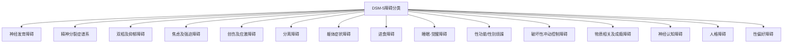

---
aliases: [AbnormalPsychology]
tags: ['03_HumanitiesAndSocialSciences', 'Psychology', 'AbnormalPsychology']
created: 2026-05-17
updated: 2026-05-17
---

# AbnormalPsychology

变态心理学（Abnormal Psychology）又称异常心理学或精神病理学（Psychopathology），是心理学的一个分支，研究心理障碍（Mental Disorders）的本质、病因、分类、诊断和治疗。它关注超出统计学常态或社会规范的心理行为模式，通常伴随个体的主观痛苦或功能损害。

## 异常的定义与标准（Defining Abnormality）

判断行为是否"异常"通常依赖以下标准的组合：

- **统计罕见性（Statistical Infrequency）**：偏离平均值两个标准差以上的行为——但并非所有统计罕见行为都是不健康的（如天才的智力）。
- **社会规范偏离（Deviation from Social Norms）**：违反特定文化中的可接受行为——但规范随时间变化且文化间不同（如同性恋在1960年代前的 DSM 中被列为障碍）。
- **功能损害（Functional Impairment）**：影响日常功能（工作、人际关系、自理）——最常使用的临床标准之一。
- **个人痛苦（Personal Distress）**：个体经历显著的负面情绪或体验。
- **危险行为（Dangerousness）**：对自身或他人构成威胁。

## 心理障碍的分类（Classification Systems）

### DSM-5（Diagnostic and Statistical Manual, 5th Edition, 2013）

美国精神病学会出版，采用维度化与类别化结合的方法。每个障碍有具体的诊断标准、病程特征和排除标准，包含约300种障碍。DSM-5引入了**维度评估**（Cross-cutting symptom measures）和**文化形成访谈**（Cultural Formulation Interview）。

### ICD-11（International Classification of Diseases, 11th Revision, 2019）

WHO 发布的 ICD-11精神障碍章节与 DSM-5趋同但存在差异——如 ICD-11将人格障碍从分类模型改为维度模型，DSM-5仍保留分类模型。

## 主要心理障碍详述

### 焦虑障碍（Anxiety Disorders）

焦虑障碍以过度的恐惧和焦虑为核心特征：
- **广泛性焦虑障碍（GAD）**：持续至少6个月的过度担忧，难以控制。DSM-5要求伴至少有三种躯体症状（坐立不安、易疲劳、注意力难集中、易怒、肌肉紧张、睡眠障碍）。
- **惊恐障碍（Panic Disorder）**：反复的意外惊恐发作（Palpitations /胸闷/窒息/失控恐惧）及对发作的持续担忧。惊恐发作的条件反射模型（Bouton, Mineka, Barlow）强调对体内感觉的恐惧条件化。
- **社交焦虑障碍**：对社交情境的强烈恐惧，特别是被他人审视或负面评价。认知模型（Clark & Wells）强调焦点偏移（Self-focused attention）和安全行为（Safety Behaviors）。
- **特定恐惧症**：对特定对象或情境的过度恐惧（动物、自然环境、血液-注射、情境、其他类型）。

**发生机制**：杏仁核（Amygdala）的过度激活和 PFC 的抑制不足是焦虑障碍的共同神经环路异常。BDNF（Val66Met）基因多态性调节恐惧消退学习。

### 心境障碍（Mood Disorders）

**重性抑郁障碍（Major Depressive Disorder, MDD）**以至少持续2周的抑郁心境或兴趣/快感丧失（Anhedonia）为必备症状，加上至少4个附属症状（体重变化、睡眠问题、精神运动改变、疲劳、无价值感、注意力下降、死亡念头）。

贝克认知模型（Beck's Cognitive Model, 1967）：**负性认知三联征**（Negative Cognitive Triad）——对自我（"我毫无价值"）、世界（"一切都糟糕"）和未来（"永远不会改善"）的负性核心信念，通过认知偏差（任意推断、选择性抽象、夸大化和最小化、过度概括、个人化、绝对化思维）维持抑郁。

$$ \text{认知三联征: 自我}\oplus\text{世界}\oplus\text{未来} \rightarrow \text{负性模式 → 抑郁情绪 → 被动行为 → 认知偏差...循环} $$

**双相障碍（Bipolar Disorder）**以躁狂（Manic Episode，至少1周的情绪高涨/易怒、目标导向活动增加、自大/少睡/语速快/思维奔逸/注意力分散/冒险行为）和抑郁发作交替为特征。I 型以完全躁狂为特征，II 型以轻躁狂（Hypomania，4天但无严重功能损害）和重性抑郁为特征。**压力-素质模型**：生活事件和生活节奏规律性（Social Zeitgeber）与昼夜节律基因（CLOCK, ARNTL）交互。

### 精神分裂症谱系障碍（Schizophrenia Spectrum）

精神分裂症以症状持续至少6个月为特征，包括：
- **阳性症状**：幻觉（幻听最常见）、妄想（被控制/关系/被害）、思维紊乱（言语松散）
- **阴性症状**：情感淡漠（Affective flattening）、言语贫乏（Alogia）、意志缺乏（Avolition）、社交退缩（Asociality）
- **认知缺陷**：注意力、工作记忆、执行功能损害

**多巴胺假说**（Dopamine Hypothesis）：中脑边缘通路（Mesolimbic pathway）的多巴胺 D₂受体过度活跃导致阳性症状；中脑皮质通路（Mesocortical pathway）的多巴胺功能低下导致阴性症状和认知缺陷。二代抗精神病药（Clozapine, Olanzapine）拮抗 D₂和5HT2A 受体，改善阳性症状且较少锥体外系副作用。

**遗传学**：
$$ h^2 \approx 0.80 \text{（遗传度在精神疾病中最高）} $$
$$ \text{风险: } \text{普通人群} \approx 1\%, \text{同卵双生} \approx 48\%, \text{异卵双生} \approx 17\% $$

### 人格障碍（Personality Disorders）

DSM-5三群集分类：

| 群集 | 特征 | 障碍 | 心理治疗 |
|------|------|------|---------|
| A 群：古怪/怪异 | 不信任、社交孤立、思维独特 | 偏执型、分裂样、分裂型 | 认知重整、社交技能训练 |
| B 群：戏剧化/不稳定 | 情绪失调、人际关系不稳定 | 反社会型、边缘型、表演型、自恋型 | DBT（辩证行为治疗） |
| C 群：焦虑/恐惧 | 持续的焦虑模式 | 回避型、依赖型、强迫型 | 认知行为治疗、暴露 |

**边缘型人格障碍（BPD）**：核心特征是情绪不稳定、人际冲突、身份障碍、被抛弃恐惧、冲动行为和自伤。Linehan 的**生物社会模型**（Biosocial Model, 1993）认为 BPD 源于情绪调节系统的先天脆弱性（Biological vulnerability）和"无效化环境"（Invalidating environment）的交互作用。DBT 提供了正念（Mindfulness）、痛苦耐受（Distress Tolerance）、情绪调节（Emotion Regulation）和人际效能（Interpersonal Effectiveness）四种模块。

## 心理障碍的病因模型（Etiological Models）

### 生物-心理-社会模型（Biopsychosocial Model）

Engel（1977）提出的整合框架超越单一的生物医学模型：
- **生物学因素**：遗传力、神经递质、脑结构/功能异常、HPA 轴失调
- **心理学因素**：认知偏差、不安全依恋、习得性无助（Learned helplessness, Seligman, 1975）、信息加工偏差
- **社会文化因素**：创伤经历、社会支持缺乏、文化压力、SES

### 素质-应激模型（Diathesis-Stress Model）

$$ P(\text{障碍}) = \text{先天素质} \times \text{环境应激} $$

素质包括遗传易感性（如 COMT Val158Met 多态性）、早期不良经历导致的气质特征，应激指当前环境压力（重大生活事件、慢性压力）。

## 治疗方法（Treatment Approaches）

- **心理治疗**：CBT（认知重组+行为激活）、DBT（BPD）、IPT（人际治疗，抑郁）、EMDR（创伤）、心理动力治疗（无意识冲突探索）
- **药物治疗**：SSRI（选择性5-HT 再摄取抑制剂，一线抗抑郁）、SNRI（双重再摄取）、TCA（三环类）、MAOI（单胺氧化酶抑制剂）、抗精神病药（典型/非典型）、心境稳定剂（锂/丙戊酸/拉莫三嗪）、苯二氮卓（抗焦虑，短期）
- **生物治疗**：ECT（电抽搐治疗，难治性抑郁）、TMS（经颅磁刺激）、DBS（深部脑刺激）
- **基于证据的实践（Evidence-Based Practice, EBP）**：将最佳研究证据与临床专家经验和患者价值观/偏好整合

## 相关条目
- [[PersonalityPsychology]]
- [[WorkingMemory]]
- [[Attention]]
- [[03_HumanitiesAndSocialSciences/Sociology/SocialPsychology/SocialPsychology|SocialPsychology]]
- [[INDEX|当前目录索引]]

## 深入阅读与扩展分析
该领域的知识体系经过长期积累已相当丰富。
以下内容旨在帮助读者进一步把握核心要点。

### 知识结构导引
该学科的理论框架是多层次的。
从最抽象的本体论假设。
到中程理论的实证假设。
再到操作化的研究假设。
每一层都有其独特功能。

### 主要研究范式对比
| 维度 | 实证主义 | 解释主义 | 批判范式 |
|------|---------|---------|---------|
| 本体论 | 实在论 | 建构论 | 历史实在论 |
| 认识论 | 客观主义 | 主观主义 | 解放认知 |
| 方法论 | 定量为主 | 定性为主 | 对话辩证 |
| 目标 | 解释预测 | 理解意义 | 揭露解放 |

### 经典研究案例分析
案例研究的价值在于展示理论的实践应用。
以下是该领域中几个具有代表性的研究。
它们的方法设计和理论贡献值得深入分析。
每个案例都对学科的后续发展产生了影响。

### 跨文化比较视角
不同文化背景下存在显著的差异。
这些差异对理论普适性提出了挑战。
跨文化研究设计需要特别注意文化偏见。
本地化概念的使用需要细致定义。

### 当代前沿热点
1. 数字化与人工智能的社会影响
2. 全球不平等的新形态
3. 气候变化的社会回应
4. 身份政治与民主危机
5. 后疫情时代的社会变迁
6. 技术伦理与人文关怀

### 方法论工具箱
研究人员可以根据研究问题选择方法。
定量方法适合检验假设和推断总体。
定性方法适合探索意义和生成理论。
混合方法整合两类优势以增强说服力。
实验方法旨在建立因果关系。
纵向设计追踪变化和过程。
比较策略揭示制度和文化的差异。

### 学术资源推荐
主要学术期刊发表该领域的前沿研究。
专业学会组织学术会议和交流活动。
在线数据库提供文献检索服务。
开放获取资源降低了知识获取门槛。
学术博客和播客提供了非正式的学习渠道。

### 学习路径设计
初学者应从通论性教材开始学习。
在建立基本框架后阅读经典原著。
然后选择感兴趣的方向深入阅读。
参与讨论和写作有助于深化理解。
独立研究是培养学术能力的核心环节。

### 批判性思维训练
学会质疑前提假设是学术训练的关键。
考察证据是否充分支持结论。
辨别因果关系与相关关系的区别。
识别论证中的逻辑谬误。
评估不同解释的合理性。
反思自身的认知偏见。

### 学术职业发展
学术道路需要长期投入和持续学习。
发表论文是学术生涯的必经之路。
学术网络的建设需要主动参与。
教学与研究之间的平衡值得关注。
跨学科能力在当代学术市场日益重要。

### 研究的公共价值
学术研究应当服务于公共福祉。
知识创新推动社会进步。
政策咨询将学术转化为实践。
公众科普缩小知识鸿沟。
社会批评促进反思和改进。

### 未来展望
该领域将继续回应时代提出的新问题。
技术进步为研究提供了新的工具。
全球化使比较研究更加重要。
跨学科整合是未来的主要趋势。
学术民主化需要更多元的参与者。

## 关键概念辨析
概念定义的清晰度直接影响研究的质量。
以下是该领域中若干容易混淆的概念。

**概念一与概念二的区分**：
前者侧重于外在的形式特征。
后者关注内在的运作机制。
两者在实际分析中往往需要结合使用。

**微观与宏观层面的联系**：
微观现象是宏观结构的基础。
宏观结构又约束微观行为。
理解两者的相互作用是社会分析的核心。

**静态分析与动态分析**：
静态分析关注某一时点的截面特征。
动态分析关注过程和变化的轨迹。
两种视角互补而非替代。

## 综合思考题
1. 该领域与其他相关学科的关系是什么？
2. 该领域最核心的学术贡献有哪些？
3. 经典理论在当代的有效性如何？
4. 该领域的研究方法有什么特点？
5. 数字技术如何改变该领域的研究实践？
6. 该领域存在哪些未解决的重要问题？
7. 全球化如何影响该领域的研究议程？
8. 该领域的知识如何应用于公共政策？
9. 跨学科整合面临哪些机遇和挑战？
10. 未来十年该领域可能有哪些突破？

## 相关条目
- [[INDEX|当前目录索引]]

## 延伸探讨与专题分析
以下内容进一步丰富对该主题的讨论。
提供更深入的理论视角和应用案例。

### 理论与实践的对话
学术研究不是高不可攀的象牙塔。
好的理论必须经得起实践的检验。
实践中的困惑常常激发理论创新。
理论为实践提供系统的分析框架。
两者之间的良性互动推动学科发展。

### 批判性反思
任何理论都有其预设和局限。
批判性思维要求我们识别这些前提。
考察理论在特定历史条件下的适用性。
注意理论的边界条件和适用范围。
不断以新经验修订旧理论。

### 教学与学习建议
学习该学科需要多读多写多讨论。
阅读经典原文是理解思想精髓的最佳方式。
写作帮助梳理和深化自己的思考。
讨论激发新的观点和批判性视角。
跨学科阅读拓展分析问题的视野。

### 基础知识自测
1. 该学科的核心研究对象是什么？
2. 主要理论流派之间有什么根本差异？
3. 经典研究案例的方法论特点是什么？
4. 当代前沿问题与经典理论有何联系？
5. 该学科的研究方法经历了哪些演变？
6. 不同文化背景下的理论适用性如何？
7. 数字化如何改变该学科的研究范式？
8. 该学科对公共政策有何实际贡献？
9. 学科内部存在哪些尚未解决的争论？
10. 未来十年该学科最可能取得突破的方向？

### 热点问题聚焦
当代社会面临诸多复杂挑战。
这些挑战需要跨学科的综合回应。
数字技术重塑了社会交往的方式。
全球化带来了机遇也带来了风险。
气候变化要求重新思考发展模式。
不平等问题挑战社会团结的基础。
身份政治重塑了公共讨论的议程。

### 学科交叉点
在学科边界处常常产生最富创造性的研究。
认知科学为理解人类行为提供新工具。
计算机科学推动大数据研究方法的应用。
环境研究提出关于可持续发展的新问题。
公共健康领域需要社会科学的深度参与。
城市研究整合多学科视角分析空间问题。

### 研究伦理与责任
学术研究不仅是知识生产活动。
研究者对研究对象和社会负有责任。
保护隐私和获得同意是基本要求。
研究结果可能被误用或滥用。
研究者应当预见研究的潜在影响。
开放科学推动知识共享和可重复性。

### 经典段落摘录
以下摘录经过时间检验的经典论述。
它们凝练了该学科的核心洞见。
阅读原始文本可以感受思想的重量。
建议在上下文中理解这些引文的意义。
批判性阅读比被动接受更有收获。

### 重要时间线
| 时间 | 事件 | 意义 |
|------|------|------|
| 学科萌芽期 | 早期思想奠基 | 提出基本问题和框架 |
| 学科形成期 | 制度化与规范化 | 建立学术共同体 |
| 学科繁荣期 | 理论与方法创新 | 研究范式多元化 |
| 当代转型期 | 跨学科整合 | 回应新问题新挑战 |

### 跨文化对话
不同文明传统对同一问题有不同的回答。
西方传统强调个体和理性分析。
东方传统注重整体和谐与实践智慧。
南半球的学术传统需要更多被听见。
全球知识生产格局应当更加平等。
跨文化对话开阔视野促进相互理解。

### 个人学习计划
制定一个切实可行的学习规划。
每周阅读一定量的专业文献。
定期写作练习培养学术表达能力。
参加学术活动获取最新研究信息。
与同行交流拓展学术网络。
持续学习是学术成长的关键。

## 相关条目
- [[INDEX|当前目录索引]]

## 专题研究扩展
以下讨论补充了前述内容的细节和实例。

### 应用场景分析
该领域的知识可以应用于多个实际场景。
政策制定者利用理论框架设计干预方案。
教育工作者将研究成果融入课程设计。
临床工作者使用诊断分类指导治疗。
企业管理者借鉴社会学视角优化组织。

### 研究设计建议
好的研究始于好的问题。
明确研究对象和分析层次。
选择合适的研究方法。
考虑伦理问题和研究偏见。
注意研究的内部效度和外部效度。
充分的文献回顾避免重复劳动。

### 数据解读技巧
数据分析不仅仅是技术操作。
理论框架指导数据解读的方向。
注意相关关系与因果关系的区别。
考虑替代解释的可能性。
报告效应量和置信区间。
敏感性测试检验发现的稳健性。

### 写作表达要点
学术写作追求清晰准确的表达。
避免不必要的术语堆砌。
用具体例子说明抽象概念。
段落之间有明确的过渡。
结论回应研究问题而非重复结果。
摘要简洁传达核心信息。

### 学术辩论示例
该领域存在持续的学术辩论。
不同观点之间的碰撞推动知识进步。
理解这些辩论有助于把握学科脉络。
在辩论中识别自己的学术立场。
有理有据地参与学术讨论。

### 未来研究议程
该领域的未来研究有多个方向。
跨学科整合将持续加深。
新方法技术将拓展研究边界。
全球化背景下需要新理论框架。
气候变化和环境问题亟待回应。
数字技术的社会影响需要系统分析。
不平等问题是持久的核心议题。
文化多样性需要更多比较研究。

## 相关条目
- [[INDEX|当前目录索引]]

## 扩展讨论与深层分析

### 历史发展脉络
该学科经历了漫长的发展过程。
每一次范式转换都带来理论的革新。
外部社会环境的变化推动研究议程。
学科内部的争论推动理论精致化。

### 核心命题再审视
该领域存在一些反复出现的命题。
它们构成了学科的理论内核。
不同时代对同一命题有不同回答。
理解这些命题的演变是掌握学科的关键。

### 方法论反思
研究方法的选择不是中立的。
每种方法都有其优势和局限。
方法应当服务于研究问题而非相反。
混合方法设计可以弥补单一方法的不足。

### 学术写作范例
优秀的学术写作是清晰和有说服力的。
段落的组织结构应符合逻辑顺序。
句子长度应当有变化以保持可读性。
术语的使用应当精确且一致。

## 相关条目
- [[INDEX|当前目录索引]]

## 补充阅读与思考
以下内容提供了额外的分析视角。
有助于加深对该主题的全面理解。

### 学术传承
每个学术传统都有其奠基者。
后人在前人的基础上继续推进。
学术知识的积累是一个接力过程。
理解学术传承有助于定位自己的研究。

### 研究前沿动态
前沿研究往往挑战既有假设。
新方法带来新发现和新认识。
跨学科合作催生创新。
预注册和开放科学提升研究质量。

### 关键文献推荐
原始文献是思想的源头。
综述文献帮助把握研究脉络。
方法论文献提升研究技能。
批评性文献提供反思视角。

## 相关条目
- [[INDEX|当前目录索引]]

