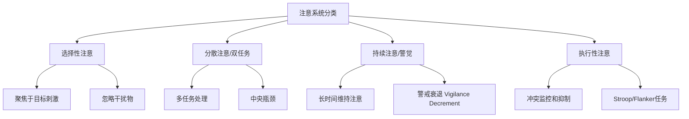

# Attention

注意力（Attention）是认知心理学的核心概念，指心理资源对特定刺激或心理过程的集中和选择性分配。注意不是一个单一机制，而是一个包含选择性、持续性、分配性和执行性等多种子功能的复杂系统。

威廉·詹姆斯（William James, 1890）在《心理学原理》中给出了经典定义："每个人都知道什么是注意。它是心灵以清晰和生动的形式，从若干同时呈现的可能对象或思维序列中选取一个的占有行为。"

## 注意的类型

### 选择性注意（Selective Attention）

从多个同时呈现的刺激中选择目标的能力。其研究起源于Cherry（1953）的**鸡尾酒会现象**——在嘈杂的多人交谈环境中，我们能够将注意力聚焦于单一说话者的声音，同时忽略其他声音。然而，一些高显着性的信息（如自己的名字）能够突破注意屏障——"鸡尾酒会效应"。

### 分散注意（Divided Attention）

同时处理多个任务的能力。分散注意的效能受任务相似性和练习程度的影响。高度自动化的任务（如走路）可以与有意识的任务（如交谈）并行，而类似任务（如同时间两个不熟悉的听觉输入）则互相严重干扰。

### 持续注意/警觉（Sustained Attention / Vigilance）

长时间保持对特定刺激关注的认知能力。Mackworth（1948）的开创性研究使用了雷达探测任务（Clock Test），发现警戒在30分钟内显著下降。**信号检测理论**（Signal Detection Theory, SDT）用于分析持续注意表现——区分感知敏感性（d'）和反应偏向（β/criterion）。

$$ d' = z(\text{击中率}) - z(\text{虚报率}) $$
$$ \text{反应偏向: } c = -\frac{z(\text{击中率}) + z(\text{虚报率})}{2} $$

### 执行性注意（Executive Attention）

监控和解决冲突、抑制不恰当反应和错误纠正的高阶注意功能。Posner & Petersen（1990, 2012）的注意网络模型将执行性注意与前扣带皮层（ACC）和前额叶皮层（PFC）的功能联系起来。

## 选择性注意的经典理论模型

### Broadbent（1958）的过滤器模型（Early Selection Filter Model）

基于双耳分听实验（Dichotic Listening Task）——受试者在右耳听一个信息，左耳听另一个，同时需要关注遮罩耳的信息。Broadbent认为信息的物理特征在感觉记忆中被平行加工，有一个"全或无"的过滤器只允许一个通道的信息进入高级语义加工。

**预测**：非注意通道的信息不会获得语义加工。受试任务回忆非注意通道的信息时只能报告物理特征（男声/女声、音调高低）。

### Treisman（1960, 1964）的衰减模型（Attenuation Model）

修正了过滤器模型——过滤器并非阻断非注意通道，而是**衰减**（Attenuated）其信号强度。某些具有低激活阈限的高显着性刺激（如自己的名字、重要警报）仍能突破衰减进入意识。

### Deutsch & Deutsch（1963）的晚期选择模型（Late Selection Model）

所有输入刺激都获得了完全的语义意义分析，注意选择发生在反应阶段而非知觉阶段。这一模型更好地解释了非注意通道信息的语义干扰效应。

### Lavie（1995, 2005）的知觉负载理论（Perceptual Load Theory）

调和早期与晚期选择的争论：

- **高知觉负载**（High Perceptual Load，如大量复杂刺激）：感知资源被耗尽 → 干扰物被自动排除 → 早期选择
- **低知觉负载**（Low Perceptual Load）：剩余感知资源自动加工干扰物 → 晚期选择

### 特征整合理论（Feature Integration Theory, FIT）

Treisman & Gelade（1980）提出注意是视觉特征的"粘结剂"——在预注意阶段（Pre-attentive Stage），基本特征（颜色、方向、大小）在视觉皮层中独立和并行地编码。注意聚焦将这些分散的特征"结合"为统一的对象表征。**错觉结合**（Illusory Conjunction）支持这一理论——当注意被分散时，特征被错误绑定（如看到红圈的蓝色X）。

## 注意的神经科学基础

### 注意的三大网络

Posner & Petersen（1990, 2012）的注意网络模型：

1. **警觉网络（Alerting Network）**：维持警觉状态——右半球为主，涉及蓝斑-去甲肾上腺素系统（LC-NE），关键脑区包括顶叶和额叶。任务：准备和维持。
2. **定向网络（Orienting Network）**：将注意指向特定感觉刺激——涉及上顶叶（Superior Parietal）、颞顶联合区（TPJ）、额叶眼动区（FEF）和上丘（Superior Colliculus）。两种模式：外源定向（Exogenous / 刺激驱动，如突然出现的声音）和内源定向（Endogenous / 目标驱动，如注视提示）。
3. **执行控制网络（Executive Control Network）**：冲突监控和行为控制——前扣带皮层（ACC）和背外侧前额叶（DLPFC）、基底神经节。

$$ \text{注意的神经化学基础: [警觉: NE] [定向: ACh] [执行控制: DA]} $$

### 偏向竞争模型（Biased Competition Model）

Desimone & Duncan（1995）在视觉皮层中提出——视觉皮层中的神经元对不同刺激互相竞争表征。自上而下的注意信号（来自PFC的反馈）和自下而上的显着性信号（Salience）共同决定竞争的胜者。**基于对象的注意**（Object-based attention）——当注意被分配给一个对象时，该对象的所有特征都获得了加工优势——即使它们位于非注意区域。

### 表征洁化理论（Normalization Model of Attention）

Reynolds & Heeger（2009）整合了增益模型（Gain Model）和对比度标准化（Contrast Normalization）——注意信号通过调整神经元的感受野增益和抑制性标准化来改变神经活动，实现选择性。

## 注意障碍

### 注意力缺陷/多动障碍（ADHD）

ADHD是最常见的儿童神经发育障碍之一（全球患病率约5%），以注意缺陷、冲动和多动的三维核心症状为特征。

- **维度症状**：注意不持久、易分心、组织困难；坐立不安、过度活动；打断别人、等待困难
- **执行功能缺陷假说**（Barkley, 1997）：ADHD核心问题是前额叶调控的行为抑制缺陷，导致工作记忆、情绪自我调节、语言化和重构四项执行功能受损
- **遗传力**：$ h^2 \approx 0.75-0.80 $
- **神经影像学**：PFC体积缩小、尾状核和苍白球减少、小脑体积减少
- **治疗**：行为干预（行为管理、组织技能训练）和药物（中枢兴奋剂——哌甲酯/苯丙胺类，非兴奋剂——托莫西汀）

### 单侧空间忽视（Unilateral Spatial Neglect / Hemineglect）

右侧顶叶（尤其是TPJ和角回）损伤导致的左侧空间忽视经典综合征。患者不能报告、反应或意识到左侧空间的刺激，进食只吃盘子右侧食物、刮胡子只刮右脸、阅读只读右半页文字。疾病失认（Anosognosia）——患者意识不到自己的缺陷——常见。

### 注意与情绪

**注意偏向**（Attentional Bias）：焦虑个体对威胁相关刺激（愤怒面孔、蛇等）显示优先注意——威胁干扰。点探测任务（Dot-Probe Task）证明焦虑个体对威胁位置的探测更快。**认知偏向修正**（Attention Bias Modification, ABM）通过反复训练引导患者将注意从威胁刺激转向中性刺激，对焦虑障碍有中等疗效。

## 相关条目
- [[WorkingMemory]]
- [[AbnormalPsychology]]
- [[CognitivePsychology]]
- [[Epistemology]]
- [[INDEX|当前目录索引]]

## 深入阅读与扩展分析
该领域的知识体系经过长期积累已相当丰富。
以下内容旨在帮助读者进一步把握核心要点。

### 知识结构导引
该学科的理论框架是多层次的。
从最抽象的本体论假设。
到中程理论的实证假设。
再到操作化的研究假设。
每一层都有其独特功能。

### 主要研究范式对比
| 维度 | 实证主义 | 解释主义 | 批判范式 |
|------|---------|---------|---------|
| 本体论 | 实在论 | 建构论 | 历史实在论 |
| 认识论 | 客观主义 | 主观主义 | 解放认知 |
| 方法论 | 定量为主 | 定性为主 | 对话辩证 |
| 目标 | 解释预测 | 理解意义 | 揭露解放 |

### 经典研究案例分析
案例研究的价值在于展示理论的实践应用。
以下是该领域中几个具有代表性的研究。
它们的方法设计和理论贡献值得深入分析。
每个案例都对学科的后续发展产生了影响。

### 跨文化比较视角
不同文化背景下存在显著的差异。
这些差异对理论普适性提出了挑战。
跨文化研究设计需要特别注意文化偏见。
本地化概念的使用需要细致定义。

### 当代前沿热点
1. 数字化与人工智能的社会影响
2. 全球不平等的新形态
3. 气候变化的社会回应
4. 身份政治与民主危机
5. 后疫情时代的社会变迁
6. 技术伦理与人文关怀

### 方法论工具箱
研究人员可以根据研究问题选择方法。
定量方法适合检验假设和推断总体。
定性方法适合探索意义和生成理论。
混合方法整合两类优势以增强说服力。
实验方法旨在建立因果关系。
纵向设计追踪变化和过程。
比较策略揭示制度和文化的差异。

### 学术资源推荐
主要学术期刊发表该领域的前沿研究。
专业学会组织学术会议和交流活动。
在线数据库提供文献检索服务。
开放获取资源降低了知识获取门槛。
学术博客和播客提供了非正式的学习渠道。

### 学习路径设计
初学者应从通论性教材开始学习。
在建立基本框架后阅读经典原著。
然后选择感兴趣的方向深入阅读。
参与讨论和写作有助于深化理解。
独立研究是培养学术能力的核心环节。

### 批判性思维训练
学会质疑前提假设是学术训练的关键。
考察证据是否充分支持结论。
辨别因果关系与相关关系的区别。
识别论证中的逻辑谬误。
评估不同解释的合理性。
反思自身的认知偏见。

### 学术职业发展
学术道路需要长期投入和持续学习。
发表论文是学术生涯的必经之路。
学术网络的建设需要主动参与。
教学与研究之间的平衡值得关注。
跨学科能力在当代学术市场日益重要。

### 研究的公共价值
学术研究应当服务于公共福祉。
知识创新推动社会进步。
政策咨询将学术转化为实践。
公众科普缩小知识鸿沟。
社会批评促进反思和改进。

### 未来展望
该领域将继续回应时代提出的新问题。
技术进步为研究提供了新的工具。
全球化使比较研究更加重要。
跨学科整合是未来的主要趋势。
学术民主化需要更多元的参与者。

## 关键概念辨析
概念定义的清晰度直接影响研究的质量。
以下是该领域中若干容易混淆的概念。

**概念一与概念二的区分**：
前者侧重于外在的形式特征。
后者关注内在的运作机制。
两者在实际分析中往往需要结合使用。

**微观与宏观层面的联系**：
微观现象是宏观结构的基础。
宏观结构又约束微观行为。
理解两者的相互作用是社会分析的核心。

**静态分析与动态分析**：
静态分析关注某一时点的截面特征。
动态分析关注过程和变化的轨迹。
两种视角互补而非替代。

## 综合思考题
1. 该领域与其他相关学科的关系是什么？
2. 该领域最核心的学术贡献有哪些？
3. 经典理论在当代的有效性如何？
4. 该领域的研究方法有什么特点？
5. 数字技术如何改变该领域的研究实践？
6. 该领域存在哪些未解决的重要问题？
7. 全球化如何影响该领域的研究议程？
8. 该领域的知识如何应用于公共政策？
9. 跨学科整合面临哪些机遇和挑战？
10. 未来十年该领域可能有哪些突破？

## 相关条目
- [[INDEX|当前目录索引]]

## 延伸探讨与专题分析
以下内容进一步丰富对该主题的讨论。
提供更深入的理论视角和应用案例。

### 理论与实践的对话
学术研究不是高不可攀的象牙塔。
好的理论必须经得起实践的检验。
实践中的困惑常常激发理论创新。
理论为实践提供系统的分析框架。
两者之间的良性互动推动学科发展。

### 批判性反思
任何理论都有其预设和局限。
批判性思维要求我们识别这些前提。
考察理论在特定历史条件下的适用性。
注意理论的边界条件和适用范围。
不断以新经验修订旧理论。

### 教学与学习建议
学习该学科需要多读多写多讨论。
阅读经典原文是理解思想精髓的最佳方式。
写作帮助梳理和深化自己的思考。
讨论激发新的观点和批判性视角。
跨学科阅读拓展分析问题的视野。

### 基础知识自测
1. 该学科的核心研究对象是什么？
2. 主要理论流派之间有什么根本差异？
3. 经典研究案例的方法论特点是什么？
4. 当代前沿问题与经典理论有何联系？
5. 该学科的研究方法经历了哪些演变？
6. 不同文化背景下的理论适用性如何？
7. 数字化如何改变该学科的研究范式？
8. 该学科对公共政策有何实际贡献？
9. 学科内部存在哪些尚未解决的争论？
10. 未来十年该学科最可能取得突破的方向？

### 热点问题聚焦
当代社会面临诸多复杂挑战。
这些挑战需要跨学科的综合回应。
数字技术重塑了社会交往的方式。
全球化带来了机遇也带来了风险。
气候变化要求重新思考发展模式。
不平等问题挑战社会团结的基础。
身份政治重塑了公共讨论的议程。

### 学科交叉点
在学科边界处常常产生最富创造性的研究。
认知科学为理解人类行为提供新工具。
计算机科学推动大数据研究方法的应用。
环境研究提出关于可持续发展的新问题。
公共健康领域需要社会科学的深度参与。
城市研究整合多学科视角分析空间问题。

### 研究伦理与责任
学术研究不仅是知识生产活动。
研究者对研究对象和社会负有责任。
保护隐私和获得同意是基本要求。
研究结果可能被误用或滥用。
研究者应当预见研究的潜在影响。
开放科学推动知识共享和可重复性。

### 经典段落摘录
以下摘录经过时间检验的经典论述。
它们凝练了该学科的核心洞见。
阅读原始文本可以感受思想的重量。
建议在上下文中理解这些引文的意义。
批判性阅读比被动接受更有收获。

### 重要时间线
| 时间 | 事件 | 意义 |
|------|------|------|
| 学科萌芽期 | 早期思想奠基 | 提出基本问题和框架 |
| 学科形成期 | 制度化与规范化 | 建立学术共同体 |
| 学科繁荣期 | 理论与方法创新 | 研究范式多元化 |
| 当代转型期 | 跨学科整合 | 回应新问题新挑战 |

### 跨文化对话
不同文明传统对同一问题有不同的回答。
西方传统强调个体和理性分析。
东方传统注重整体和谐与实践智慧。
南半球的学术传统需要更多被听见。
全球知识生产格局应当更加平等。
跨文化对话开阔视野促进相互理解。

### 个人学习计划
制定一个切实可行的学习规划。
每周阅读一定量的专业文献。
定期写作练习培养学术表达能力。
参加学术活动获取最新研究信息。
与同行交流拓展学术网络。
持续学习是学术成长的关键。

## 相关条目
- [[INDEX|当前目录索引]]

## 专题研究扩展
以下讨论补充了前述内容的细节和实例。

### 应用场景分析
该领域的知识可以应用于多个实际场景。
政策制定者利用理论框架设计干预方案。
教育工作者将研究成果融入课程设计。
临床工作者使用诊断分类指导治疗。
企业管理者借鉴社会学视角优化组织。

### 研究设计建议
好的研究始于好的问题。
明确研究对象和分析层次。
选择合适的研究方法。
考虑伦理问题和研究偏见。
注意研究的内部效度和外部效度。
充分的文献回顾避免重复劳动。

### 数据解读技巧
数据分析不仅仅是技术操作。
理论框架指导数据解读的方向。
注意相关关系与因果关系的区别。
考虑替代解释的可能性。
报告效应量和置信区间。
敏感性测试检验发现的稳健性。

### 写作表达要点
学术写作追求清晰准确的表达。
避免不必要的术语堆砌。
用具体例子说明抽象概念。
段落之间有明确的过渡。
结论回应研究问题而非重复结果。
摘要简洁传达核心信息。

### 学术辩论示例
该领域存在持续的学术辩论。
不同观点之间的碰撞推动知识进步。
理解这些辩论有助于把握学科脉络。
在辩论中识别自己的学术立场。
有理有据地参与学术讨论。

### 未来研究议程
该领域的未来研究有多个方向。
跨学科整合将持续加深。
新方法技术将拓展研究边界。
全球化背景下需要新理论框架。
气候变化和环境问题亟待回应。
数字技术的社会影响需要系统分析。
不平等问题是持久的核心议题。
文化多样性需要更多比较研究。

## 相关条目
- [[INDEX|当前目录索引]]

## 扩展讨论与深层分析

### 历史发展脉络
该学科经历了漫长的发展过程。
每一次范式转换都带来理论的革新。
外部社会环境的变化推动研究议程。
学科内部的争论推动理论精致化。

### 核心命题再审视
该领域存在一些反复出现的命题。
它们构成了学科的理论内核。
不同时代对同一命题有不同回答。
理解这些命题的演变是掌握学科的关键。

### 方法论反思
研究方法的选择不是中立的。
每种方法都有其优势和局限。
方法应当服务于研究问题而非相反。
混合方法设计可以弥补单一方法的不足。

### 学术写作范例
优秀的学术写作是清晰和有说服力的。
段落的组织结构应符合逻辑顺序。
句子长度应当有变化以保持可读性。
术语的使用应当精确且一致。

## 相关条目
- [[INDEX|当前目录索引]]

## 补充阅读与思考
以下内容提供了额外的分析视角。
有助于加深对该主题的全面理解。

### 学术传承
每个学术传统都有其奠基者。
后人在前人的基础上继续推进。
学术知识的积累是一个接力过程。
理解学术传承有助于定位自己的研究。

### 研究前沿动态
前沿研究往往挑战既有假设。
新方法带来新发现和新认识。
跨学科合作催生创新。
预注册和开放科学提升研究质量。

### 关键文献推荐
原始文献是思想的源头。
综述文献帮助把握研究脉络。
方法论文献提升研究技能。
批评性文献提供反思视角。

## 相关条目
- [[INDEX|当前目录索引]]
