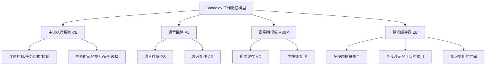

# WorkingMemory

工作记忆（Working Memory, WM）是认知心理学的核心概念，指一个容量有限的系统，负责信息的临时存储和操作。它是学习、推理、理解和认知控制的枢纽。工作记忆的概念由短时记忆（Short-Term Memory, STM）发展而来，但更强调对信息的主动加工（Active Manipulation）而非被动存储。

## Baddeley & Hitch 的多成分模型（Multi-Component Model）

Baddeley 和 Hitch（1974）提出了经典的工作记忆模型，后经多次修订（Baddeley, 1986, 2000, 2012）：

### 中央执行系统（Central Executive, CE）

中央执行系统是一个注意力控制系统，Baddeley 将其与 Norman & Shallice（1986）的**监督性注意系统**（Supervisory Attentional System, SAS）联系。主要功能：
- 注意的聚焦、分割和转移
- 语音回路和视空间模板的协调
- 任务切换（Task Switching）的认知灵活性
- 抑制（Inhibition）不相关信息
- 提取和使用长时记忆的策略

CE 容量有限——当需要同时执行两个依赖 CE 的任务时，双任务干扰（Dual-Task Interference）效应会显著增大。CE 的损耗与前额叶皮层（PFC）的功能状态相关。

### 语音回路（Phonological Loop, PL）

语音回路负责言语和听觉信息的临时存储：
- **语音存储（Phonological Store）**：保持语音编码信息约2秒，随时间的推移自然衰退
- **发音复述（Articulatory Rehearsal / Subvocal Rehearsal）**：内部发声过程刷新存储

PL 的关键效应：
- **词长效应（Word Length Effect）**：发音时间短的单词（"cat, dog, bus"）比长的单词（"caterpillar, university"）复述更多、记忆更好——因为复述通道的单位时间容量固定
- **语音相似性效应（Phonological Similarity Effect）**：语音相似的单词（"C, D, G, T, V"）混淆更多——因为记忆痕迹基于语音编码
- **发音抑制效应（Articulatory Suppression）**：在记忆保持期间重复无意义音（"the, the, the"）使复述不可能——消除了词长效应但保留语音相似效应

### 视空间模板（Visuospatial Sketchpad, VSSP）

VSSP 处理视觉和空间信息。Logie（1995）区分了两个子系统：
- **视觉缓存（Visual Cache）**：存储静态视觉特征（颜色、形状、纹理）
- **内在线索/空间习字板（Inner Scribe）**：处理空间序列和运动信息

**双分离**：脑损伤患者存在选择性视觉记忆缺失或空间记忆缺失。神经影像学显示视觉客体信息由腹侧通路（Ventral Stream / "What"通路）处理，空间位置信息由背侧通路（Dorsal Stream / "Where"通路）处理。

### 情境缓冲器（Episodic Buffer, EB）

Baddeley（2000）增加了第四成分——EB 是容量有限的独立系统（约4个组块），将来自 PL、VSSP 和 LTM 的信息整合为统一的情境表征。EB 的独特特征：它是一个多维编码的临时存储系统，通过绑定（Binding）维持整合表征，并且是意识觉知（Conscious Awareness）的窗口。

## 工作记忆容量（Working Memory Capacity, WMC）

### 测量任务

- **数字广度（Digit Span）**：顺背和倒背
- **运算广度（Operation Span, OSPAN）**：交替呈现运算和单词，结束时要求按顺序回忆单词
- **阅读广度（Reading Span, RSPAN）**（Daneman & Carpenter, 1980）：阅读句子并记忆末词，同时验证句子语义——是 WMC 的经典测量，高 RSPAN 的个体理解和推理能力更强
- **N-Back**：判断当前刺激是否与 N 次前的刺激匹配——使用最广泛的功能性神经影像任务
- **Corsi 积木敲击（Corsi Block-Tapping）**：空间广度任务——模仿实验者敲击积木的顺序

### 容量限制

$$ \text{Cowan（2001）核心焦点容量} \approx 4 \pm 1 \text{ 组块} $$

**组块化（Chunking）**：将多个信息单元组合成有意义的单一单元以扩展容量。Miller（1956）的"神奇数字7±2"实际上反映了组块化的产物，而非基本的工作记忆容量——在排除复述和组块化后，真实容量约为3-5个组块。

### 个体差异

WMC 是个体认知能力的重要预测因子——WMC 高者：
- 更强的阅读理解能力和听力理解能力（Daneman & Carpenter, 1980）
- 更强的流体智力（Fluid Intelligence）——$ r = 0.50-0.70 $
- 更好的注意力控制和抗干扰能力
- 更有效的问题解决和推理

## 工作记忆的理论模型

### Cowan 的嵌套加工模型（Embedded-Processes Model, 1988, 1999）

工作记忆是长时记忆的激活部分——包含三层结构：
1. **长时记忆（LTM）**：巨大的知识存储
2. **激活区域（Region of Activation）**：LTM 中当前被激活的部分——容量相对较大
3. **核心注意焦点（Focus of Attention）**：容量极为有限（约4个组块）——当前处于意识中的信息

**改变检测（Change Detection）**：Luck & Vogel（1997）使用视觉阵列任务——对简单物体（颜色块）的变化探测精度约为3-4个项目。容量不受项目复杂度（多特征绑定）的影响。

### Ericsson & Kintsch（1995）的长期工作记忆（Long-Term Working Memory, LTWM）

专业人员在专业领域可以利用 LTM 中的**提取结构**（Retrieval Structures）来高效地存取大量信息——相当于创建了容量近乎无限的"长期工作记忆"。例子：餐馆服务员在不使用笔记的情况下记忆多张复杂订单；棋手的闪电对弈（Blitz Chess）记忆。

## 工作记忆的神经基础

**持续性放电（Persistent Neural Activity）**：
- Funahashi, Bruce & Goldman-Rakic（1989）在猴子 DLPFC 的单细胞记录中发现——延迟期（Delay Period，刺激消失与反应之间的间隔）中，特定神经元持续放电，表征记忆内容。PFC 的这一特征被认为是工作记忆基础机制中最确凿的证据。

**脑网络**：
- **PFC（主要是 DLPFC）**：保持和操纵信息、规则表征和策略控制
- **顶叶皮层（Posterior Parietal Cortex, PPC）**：空间工作记忆和注意指向
- **前扣带皮层（ACC）**：冲突监控和更新控制
- **基底神经节（Basal Ganglia）**：工作记忆内容的门控（Gating）——决定哪些信息进入 PFC 输出

## 工作记忆的发展与老化

**儿童发展**：从幼儿到青少年期，WMC 逐步增长，与 PFC 的成熟同步。4岁儿童约2个组块，7岁约4个，15岁接近成人水平。

**老化**：WMC 在正常老化中显著下降——CE 功能（任务切换、抑制）比 PL 和 VSSP 存储更受老化影响。**执行功能衰退假说**（Hasher & Zacks, 1988）主张老化导致的 WMC 衰退主要源于抑制功能（Inhibition Function）的下降——无关信息侵入和占据了有限的 WMC 容量。

## 相关条目
- [[Attention]]
- [[AbnormalPsychology]]
- [[PersonalityPsychology]]
- [[Epistemology]]
- [[INDEX|当前目录索引]]

## 深入阅读与扩展分析
该领域的知识体系经过长期积累已相当丰富。
以下内容旨在帮助读者进一步把握核心要点。

### 知识结构导引
该学科的理论框架是多层次的。
从最抽象的本体论假设。
到中程理论的实证假设。
再到操作化的研究假设。
每一层都有其独特功能。

### 主要研究范式对比
| 维度 | 实证主义 | 解释主义 | 批判范式 |
|------|---------|---------|---------|
| 本体论 | 实在论 | 建构论 | 历史实在论 |
| 认识论 | 客观主义 | 主观主义 | 解放认知 |
| 方法论 | 定量为主 | 定性为主 | 对话辩证 |
| 目标 | 解释预测 | 理解意义 | 揭露解放 |

### 经典研究案例分析
案例研究的价值在于展示理论的实践应用。
以下是该领域中几个具有代表性的研究。
它们的方法设计和理论贡献值得深入分析。
每个案例都对学科的后续发展产生了影响。

### 跨文化比较视角
不同文化背景下存在显著的差异。
这些差异对理论普适性提出了挑战。
跨文化研究设计需要特别注意文化偏见。
本地化概念的使用需要细致定义。

### 当代前沿热点
1. 数字化与人工智能的社会影响
2. 全球不平等的新形态
3. 气候变化的社会回应
4. 身份政治与民主危机
5. 后疫情时代的社会变迁
6. 技术伦理与人文关怀

### 方法论工具箱
研究人员可以根据研究问题选择方法。
定量方法适合检验假设和推断总体。
定性方法适合探索意义和生成理论。
混合方法整合两类优势以增强说服力。
实验方法旨在建立因果关系。
纵向设计追踪变化和过程。
比较策略揭示制度和文化的差异。

### 学术资源推荐
主要学术期刊发表该领域的前沿研究。
专业学会组织学术会议和交流活动。
在线数据库提供文献检索服务。
开放获取资源降低了知识获取门槛。
学术博客和播客提供了非正式的学习渠道。

### 学习路径设计
初学者应从通论性教材开始学习。
在建立基本框架后阅读经典原著。
然后选择感兴趣的方向深入阅读。
参与讨论和写作有助于深化理解。
独立研究是培养学术能力的核心环节。

### 批判性思维训练
学会质疑前提假设是学术训练的关键。
考察证据是否充分支持结论。
辨别因果关系与相关关系的区别。
识别论证中的逻辑谬误。
评估不同解释的合理性。
反思自身的认知偏见。

### 学术职业发展
学术道路需要长期投入和持续学习。
发表论文是学术生涯的必经之路。
学术网络的建设需要主动参与。
教学与研究之间的平衡值得关注。
跨学科能力在当代学术市场日益重要。

### 研究的公共价值
学术研究应当服务于公共福祉。
知识创新推动社会进步。
政策咨询将学术转化为实践。
公众科普缩小知识鸿沟。
社会批评促进反思和改进。

### 未来展望
该领域将继续回应时代提出的新问题。
技术进步为研究提供了新的工具。
全球化使比较研究更加重要。
跨学科整合是未来的主要趋势。
学术民主化需要更多元的参与者。

## 关键概念辨析
概念定义的清晰度直接影响研究的质量。
以下是该领域中若干容易混淆的概念。

**概念一与概念二的区分**：
前者侧重于外在的形式特征。
后者关注内在的运作机制。
两者在实际分析中往往需要结合使用。

**微观与宏观层面的联系**：
微观现象是宏观结构的基础。
宏观结构又约束微观行为。
理解两者的相互作用是社会分析的核心。

**静态分析与动态分析**：
静态分析关注某一时点的截面特征。
动态分析关注过程和变化的轨迹。
两种视角互补而非替代。

## 综合思考题
1. 该领域与其他相关学科的关系是什么？
2. 该领域最核心的学术贡献有哪些？
3. 经典理论在当代的有效性如何？
4. 该领域的研究方法有什么特点？
5. 数字技术如何改变该领域的研究实践？
6. 该领域存在哪些未解决的重要问题？
7. 全球化如何影响该领域的研究议程？
8. 该领域的知识如何应用于公共政策？
9. 跨学科整合面临哪些机遇和挑战？
10. 未来十年该领域可能有哪些突破？

## 相关条目
- [[INDEX|当前目录索引]]

## 延伸探讨与专题分析
以下内容进一步丰富对该主题的讨论。
提供更深入的理论视角和应用案例。

### 理论与实践的对话
学术研究不是高不可攀的象牙塔。
好的理论必须经得起实践的检验。
实践中的困惑常常激发理论创新。
理论为实践提供系统的分析框架。
两者之间的良性互动推动学科发展。

### 批判性反思
任何理论都有其预设和局限。
批判性思维要求我们识别这些前提。
考察理论在特定历史条件下的适用性。
注意理论的边界条件和适用范围。
不断以新经验修订旧理论。

### 教学与学习建议
学习该学科需要多读多写多讨论。
阅读经典原文是理解思想精髓的最佳方式。
写作帮助梳理和深化自己的思考。
讨论激发新的观点和批判性视角。
跨学科阅读拓展分析问题的视野。

### 基础知识自测
1. 该学科的核心研究对象是什么？
2. 主要理论流派之间有什么根本差异？
3. 经典研究案例的方法论特点是什么？
4. 当代前沿问题与经典理论有何联系？
5. 该学科的研究方法经历了哪些演变？
6. 不同文化背景下的理论适用性如何？
7. 数字化如何改变该学科的研究范式？
8. 该学科对公共政策有何实际贡献？
9. 学科内部存在哪些尚未解决的争论？
10. 未来十年该学科最可能取得突破的方向？

### 热点问题聚焦
当代社会面临诸多复杂挑战。
这些挑战需要跨学科的综合回应。
数字技术重塑了社会交往的方式。
全球化带来了机遇也带来了风险。
气候变化要求重新思考发展模式。
不平等问题挑战社会团结的基础。
身份政治重塑了公共讨论的议程。

### 学科交叉点
在学科边界处常常产生最富创造性的研究。
认知科学为理解人类行为提供新工具。
计算机科学推动大数据研究方法的应用。
环境研究提出关于可持续发展的新问题。
公共健康领域需要社会科学的深度参与。
城市研究整合多学科视角分析空间问题。

### 研究伦理与责任
学术研究不仅是知识生产活动。
研究者对研究对象和社会负有责任。
保护隐私和获得同意是基本要求。
研究结果可能被误用或滥用。
研究者应当预见研究的潜在影响。
开放科学推动知识共享和可重复性。

### 经典段落摘录
以下摘录经过时间检验的经典论述。
它们凝练了该学科的核心洞见。
阅读原始文本可以感受思想的重量。
建议在上下文中理解这些引文的意义。
批判性阅读比被动接受更有收获。

### 重要时间线
| 时间 | 事件 | 意义 |
|------|------|------|
| 学科萌芽期 | 早期思想奠基 | 提出基本问题和框架 |
| 学科形成期 | 制度化与规范化 | 建立学术共同体 |
| 学科繁荣期 | 理论与方法创新 | 研究范式多元化 |
| 当代转型期 | 跨学科整合 | 回应新问题新挑战 |

### 跨文化对话
不同文明传统对同一问题有不同的回答。
西方传统强调个体和理性分析。
东方传统注重整体和谐与实践智慧。
南半球的学术传统需要更多被听见。
全球知识生产格局应当更加平等。
跨文化对话开阔视野促进相互理解。

### 个人学习计划
制定一个切实可行的学习规划。
每周阅读一定量的专业文献。
定期写作练习培养学术表达能力。
参加学术活动获取最新研究信息。
与同行交流拓展学术网络。
持续学习是学术成长的关键。

## 相关条目
- [[INDEX|当前目录索引]]

## 专题研究扩展
以下讨论补充了前述内容的细节和实例。

### 应用场景分析
该领域的知识可以应用于多个实际场景。
政策制定者利用理论框架设计干预方案。
教育工作者将研究成果融入课程设计。
临床工作者使用诊断分类指导治疗。
企业管理者借鉴社会学视角优化组织。

### 研究设计建议
好的研究始于好的问题。
明确研究对象和分析层次。
选择合适的研究方法。
考虑伦理问题和研究偏见。
注意研究的内部效度和外部效度。
充分的文献回顾避免重复劳动。

### 数据解读技巧
数据分析不仅仅是技术操作。
理论框架指导数据解读的方向。
注意相关关系与因果关系的区别。
考虑替代解释的可能性。
报告效应量和置信区间。
敏感性测试检验发现的稳健性。

### 写作表达要点
学术写作追求清晰准确的表达。
避免不必要的术语堆砌。
用具体例子说明抽象概念。
段落之间有明确的过渡。
结论回应研究问题而非重复结果。
摘要简洁传达核心信息。

### 学术辩论示例
该领域存在持续的学术辩论。
不同观点之间的碰撞推动知识进步。
理解这些辩论有助于把握学科脉络。
在辩论中识别自己的学术立场。
有理有据地参与学术讨论。

### 未来研究议程
该领域的未来研究有多个方向。
跨学科整合将持续加深。
新方法技术将拓展研究边界。
全球化背景下需要新理论框架。
气候变化和环境问题亟待回应。
数字技术的社会影响需要系统分析。
不平等问题是持久的核心议题。
文化多样性需要更多比较研究。

## 相关条目
- [[INDEX|当前目录索引]]

## 扩展讨论与深层分析

### 历史发展脉络
该学科经历了漫长的发展过程。
每一次范式转换都带来理论的革新。
外部社会环境的变化推动研究议程。
学科内部的争论推动理论精致化。

### 核心命题再审视
该领域存在一些反复出现的命题。
它们构成了学科的理论内核。
不同时代对同一命题有不同回答。
理解这些命题的演变是掌握学科的关键。

### 方法论反思
研究方法的选择不是中立的。
每种方法都有其优势和局限。
方法应当服务于研究问题而非相反。
混合方法设计可以弥补单一方法的不足。

### 学术写作范例
优秀的学术写作是清晰和有说服力的。
段落的组织结构应符合逻辑顺序。
句子长度应当有变化以保持可读性。
术语的使用应当精确且一致。

## 相关条目
- [[INDEX|当前目录索引]]
