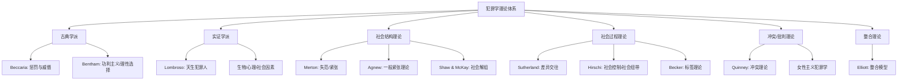

# 犯罪学 (Criminology)

## 一、犯罪学概述

### 1.1 定义与研究范围

犯罪学（Criminology）是研究犯罪（Crime）现象、犯罪原因、犯罪类型及社会反应的交叉学科。犯罪学结合社会学、心理学、法学等多个学科视角，系统分析个体为何犯罪、犯罪的空间分布模式、刑事司法系统（Criminal Justice System）的运作机制以及犯罪预防策略的有效性。

### 1.2 犯罪的定义

| 定义维度 | 核心内容 |
|---------|---------|
| 法律定义 | 违反刑法（Criminal Law）且应受国家惩罚的行为 |
| 社会危害性（Social Harm） | 行为是否对他人或社会造成伤害 |
| 社会共识（Social Consensus） | 行为是否被社会大多数成员所谴责 |
| 权力维度 | 谁有权定义"犯罪"——标签理论（Labeling Theory）由此出发 |

### 1.3 犯罪学理论体系

## 二、犯罪学主要理论

### 2.1 古典学派（Classical School）

贝卡里亚（Cesare Beccaria, 1764）在《论犯罪与刑罚》（On Crimes and Punishments）中提出：
- 人类是理性的快乐—痛苦计算者
- 惩罚的目的是威慑（Deterrence）——确定、及时、与罪行相称的惩罚最能有效威慑犯罪
- 反对酷刑和死刑

边沁（Jeremy Bentham）的全景监狱（Panopticon）和功利主义刑罚哲学——惩罚带来的痛苦必须大于犯罪带来的快乐。当代的理性选择理论（Rational Choice Theory）继承了古典传统。

### 2.2 实证学派（Positivist School）

龙勃罗梭（Cesare Lombroso, 1876）主张"天生犯罪人"（Born Criminal）概念。虽然这一理论已被驳斥，但实证学派的开创性在于将科学方法引入犯罪学研究。

当代实证研究关注：

| 因素类型 | 具体内容 |
|---------|---------|
| 生物因素 | MAOA基因（"战士基因"）与反社会行为；前额叶皮层功能缺陷与冲动控制障碍 |
| 心理因素 | 精神变态（Psychopathy）、低自我控制（Gottfredson & Hirschi） |
| 社会因素 | 贫困、社区解组、同伴影响、家庭教养 |

### 2.3 社会结构理论（Social Structure Theories）

**默顿的失范理论**（Merton's Anomie/Strain Theory, 1938）：美国社会的文化目标是财富成功，但制度化手段（教育和就业）分布不平等。当目标和手段之间出现脱节时，个体经历失范（Anomie），采用不同的适应方式：

| 适应方式 | 文化目标 | 制度化手段 |
|---------|---------|-----------|
| 遵从（Conformity） | + | + |
| 创新（Innovation） | + | - |
| 仪式主义（Ritualism） | - | + |
| 退却主义（Retreatism） | - | - |
| 反叛（Rebellion） | ± | ± |

**一般紧张理论**（General Strain Theory, Agnew, 1992）：压力不仅来自经济目标—手段的错位，还包括：①未能达到积极目标 ②失去积极刺激（亲人去世、分手）③消极刺激的呈现（受欺凌、虐待）。这些压力引发负面情绪（愤怒、沮丧），增加犯罪风险。

**社会解组理论**（Social Disorganization Theory, Shaw & McKay, 1942）：在芝加哥的生态学研究中发现——贫困、种族异质性和人口流动率导致非正式社会控制削弱和犯罪率上升。

### 2.4 社会过程理论（Social Process Theories）

**差异交往理论**（Differential Association, Sutherland, 1939, 1947）：
1. 犯罪是习得的
2. 通过与密切群体的交往习得犯罪
3. 当支持违法的定义超过不支持违法的定义时，个体从事犯罪
4. 差异交往的频率、持续时间、优先级和强度决定习得程度

**社会控制理论**（Social Control / Social Bonding Theory, Hirschi, 1969）：
- 为什么大多数人不犯罪？因为与社会的社会纽带（Social Bonds）约束了越轨倾向
- 四个纽带要素：依恋（Attachment）、投入（Commitment）、参与（Involvement）、信念（Belief）

**标签理论**（Labeling Theory, Becker, 1963）：越轨不是行为的固有属性，而是社会对行为施加的标签。"局外人"（Outsider）标签的施加导致初级越轨（Primary Deviance）发展为次级越轨（Secondary Deviance）——自我实现预言（Self-Fulfilling Prophecy）。

### 2.5 犯罪学理论的综合分析

犯罪学理论可以按照分析层次进行分类：

$$
\text{分析层次框架} = \begin{cases}
\text{宏观层次：社会结构、文化、制度} \\
\text{中观层次：社区、组织、群体} \\
\text{微观层次：个体心理、生物因素}
\end{cases}
$$

| 理论 | 分析层次 | 核心解释变量 |
|------|---------|------------|
| 失范/紧张理论 | 宏观 | 文化目标与制度化手段的脱节 |
| 社会解组理论 | 中观 | 社区非正式社会控制的削弱 |
| 差异交往理论 | 微观—中观 | 与越轨群体的交往学习 |
| 社会控制理论 | 微观 | 个体与社会纽带的强弱 |
| 一般紧张理论 | 微观 | 负面刺激与负面情绪 |
| 标签理论 | 微观—宏观 | 社会反应与自我认同 |

## 三、犯罪类型

### 3.1 主要犯罪类型

| 犯罪类型 | 定义 | 典型形式 |
|---------|------|---------|
| 暴力犯罪（Violent Crime） | 使用或威胁使用暴力的犯罪 | 谋杀（Homicide）、伤害（Assault）、抢劫（Robbery）、强奸（Rape） |
| 财产犯罪（Property Crime） | 侵犯他人财产权的犯罪 | 盗窃（Larceny）、入室盗窃（Burglary）、纵火（Arson） |
| 白领犯罪（White-Collar Crime） | 社会地位高的人在职业活动中实施的犯罪 | 公司欺诈、贪污、内幕交易 |
| 有组织犯罪（Organized Crime） | 有组织的犯罪集团实施的犯罪 | 黑手党、贩毒集团、人口走私 |
| 网络犯罪（Cybercrime） | 利用计算机和网络实施的犯罪 | 黑客攻击、网络诈骗、身份盗窃 |
| 仇恨犯罪（Hate Crime） | 基于身份偏见的犯罪 | 基于种族、宗教、性取向等的攻击 |
| 无被害人犯罪（Victimless Crimes） | 涉及自愿成年人之间交换的犯罪 | 自愿毒品使用、赌博、卖淫 |

### 3.2 白领犯罪的理论贡献

Sutherland（1949）首次提出白领犯罪（White-Collar Crime）概念，挑战了犯罪学仅关注底层犯罪的偏见。这一概念的提出扩展了犯罪学的研究视野，促使学界关注权力、财富与犯罪的关系。

## 四、刑事司法系统

### 4.1 系统运作流程

$$
\text{警察(逮捕)} \rightarrow \text{检察官(起诉)} \rightarrow \text{法院(审判/量刑)} \rightarrow \text{矫正机构(监禁/缓刑/社区矫正)}
$$

### 4.2 刑罚哲学

| 刑罚目的 | 核心逻辑 | 实践形式 |
|---------|---------|---------|
| 惩罚（Retribution） | 罪有应得，按罪行严重程度施以相应惩罚 | 量刑指南 |
| 威慑（Deterrence） | 特殊威慑（使该犯不再犯）和一般威慑（阻止其他人犯） | 严刑峻法 |
| 改造（Rehabilitation） | 教育、职业培训、心理治疗——减少再犯 | 矫正项目 |
| 剥夺能力（Incapacitation） | 监禁使犯罪者在物理上无法继续犯罪 | 长期监禁 |

### 4.3 大规模监禁

**大规模监禁**（Mass Incarceration）：美国是监禁率最高的国家之一——每10万成年人约有698人被监禁（2019年），显著高于其他发达国家（如加拿大约100、日本约40）。

## 五、犯罪预防

### 5.1 情境犯罪预防

情境犯罪预防（Situational Crime Prevention, Clarke, 1992）通过改变环境来减少犯罪机会：

| 策略 | 具体措施 |
|------|---------|
| 增加犯罪难度 | 目标加固（锁具、防盗门） |
| 增加犯罪风险 | 监控系统、社区巡逻 |
| 减少犯罪收益 | 财产标记、防盗追踪 |
| 减少挑衅 | 环境设计减少冲突诱因 |
| 消除借口 | 明确规则和警示标识 |

### 5.2 发展性预防

发展性犯罪预防（Developmental Crime Prevention）针对高风险儿童——家访、父母技能训练、社交技能训练。Bronfenbrenner的生态模型在个体—家庭—同伴—学校—社区—社会的多层次系统中实施干预。

### 5.3 社区警务

社区警务（Community Policing）强调警察与社区合作解决问题，而非仅仅回应紧急呼叫。这一模式注重建立信任关系、识别社区问题和共同制定解决方案。

## 六、犯罪学的热点议题

1. **数字时代的犯罪转型**：网络犯罪、加密货币洗钱、AI辅助犯罪
2. **警务改革与社会正义**：种族与警务、警察暴力问责
3. **全球犯罪治理**：跨国犯罪组织、人口贩运的国际治理
4. **恢复性司法**（Restorative Justice）：加害者与受害者的对话与和解
5. **性别与犯罪**：女性犯罪率变化、性别化的犯罪体验
6. **环境犯罪学**：犯罪的空间分布与预防

## 七、犯罪学研究方法

| 方法类型 | 特点 | 典型应用 |
|---------|------|---------|
| 官方统计数据 | 系统、可比，但有报告偏差 | 犯罪率趋势分析 |
| 自我报告调查 | 了解隐蔽犯罪，但存在说谎可能 | 青少年犯罪研究 |
| 受害调查 | 弥补官方统计不足 | 犯罪受害情况研究 |
| 纵向追踪研究 | 揭示因果顺序和发展过程 | 犯罪生涯研究 |
| 质性研究 | 深入理解意义和过程 | 帮派文化、犯罪动机 |
| 实验研究 | 检验因果假设 | 预防项目效果评估 |

## 关键概念辨析

**初级越轨与次级越轨**：前者是偶尔的越轨行为，后者是因被标签后形成的越轨身份认同。区分两者的关键在于社会反应的作用。

**微观与宏观层面的联系**：微观层面的个体犯罪决策受到宏观层面社会结构（不平等、文化价值观）的深刻影响。理解两者的相互作用是犯罪学分析的核心。

## 综合思考题

1. 犯罪学与刑法学、社会学、心理学的交叉关系如何？
2. 古典学派与实证学派在犯罪观上有何根本差异？
3. 紧张理论与差异交往理论的逻辑分别是什么？
4. 情境犯罪预防的理论基础是什么？
5. 大规模监禁的社会代价有哪些？
6. 恢复性司法与传统刑罚有何不同？
7. 网络犯罪对传统犯罪学理论提出哪些挑战？
8. 女性主义犯罪学如何批判传统犯罪学？
9. 跨文化比较研究如何影响犯罪学理论的普适性？
10. 犯罪学的未来发展方向是什么？

## 相关条目

- [[SocialStratification]]
- [[PoliticalSociology]]
- [[SocialMovements]]
- [[EthnicRelations]]
- [[GenderStudies]]
- [[INDEX|当前目录索引]]
