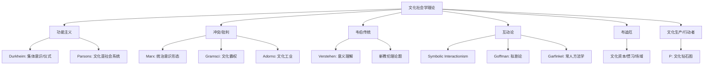

# CulturalSociology

文化社会学（Cultural Sociology）是社会学的重要分支，研究文化（Culture）与社会结构之间的相互作用。它探讨意义系统（Systems of Meaning）、象征实践（Symbolic Practices）和社会规范如何在社会生活中被生产、传播、分配和变革。文化社会学的基本前提是：文化不仅是经济和政治的"反映"，它本身是构成社会现实的核心组成部分。

## 文化的定义

文化在社会学中被定义为一个社会群体共享的信念、价值观、规范、符号、语言和物质产品的总和。社会学区分两种层次：
- **窄文化（Narrow Culture）**：艺术、文学、高雅文化——"文化"的日常理解
- **宽文化（Broad / Anthropological Culture）**：群体的整体生活方式，包括日常实践、常识和默认假设

## 文化社会学的核心理论

### 涂尔干的功能主义

涂尔干（Émile Durkheim）在《宗教生活的基本形式》（1912）中揭示了宗教仪式的社会功能——通过集体欢腾（Collective Effervescence）和仪式实践强化集体意识（Collective Conscience），维持社会团结。核心论点是：宗教是社会自身的象征再现——宗教崇拜的终极对象是社会本身。这一分析为文化社会学提供了强有力的方法论工具：文化分析应寻找潜伏在社会实践下的象征编码。

帕森斯（Talcott Parsons）将文化整合进AGIL模型——文化系统执行**模式维持**（Latent Pattern Maintenance）功能：通过社会化（Socialization）将文化价值观内在化为个体的动机结构。

### 冲突论视角

马克思（Karl Marx）的**统治意识形态**（Dominant Ideology）论——"统治阶级的思想是每一时代的统治思想"。文化是阶级统治的意识形态工具。

**葛兰西**（Antonio Gramsci）的**文化霸权**（Cultural Hegemony）超过了简单的统治意识形态论——统治不仅通过强制（Coercion），更通过被统治者的"同意"（Consent）实现。资产阶级的文化领导权是通过日常制度（教育、媒体、宗教）将资产阶级的世界观传播为"常识"（Common Sense）实现的。霸权不是静态的——它是持续争夺和协商的过程，为文化抵抗和反霸权留下空间。

### 韦伯的解释社会学

韦伯（Max Weber）在《新教伦理与资本主义精神》（1904-1905）中展示了宗教观念如何影响经济行为——加尔文宗的**预选说**（Predestination）使信徒寻找自身被选的"标志"（Signs），勤奋工作和财富积累被视为荣耀神的手段。资本主义精神——以努力和节俭系统地追求财富而不是奢侈——由此产生。韦伯的文化社会学强调**理解**（Verstehen）——社会行为需要理解行动者对行为的**主观意义**（Subjective Meaning）。

### 布迪厄的实践理论

皮埃尔·布迪厄（Pierre Bourdieu, 1930-2002）的文化生产理论整合了结构与能动性：

**文化资本（Cultural Capital）**（《区分》, 1979）：不限于经济收入的社会地位资源，文化资本有三种状态：
- **具身状态（Embodied State）**：通过社会化内化的品味、知识和技能（如礼仪、口音、对古典音乐的鉴赏力）
- **客观状态（Objectified State）**：文化物品（书籍、艺术品、乐器）
- **制度化状态（Institutionalized State）**：教育证书和头衔

**惯习（Habitus）**：社会位置的客观结构被内化为个体的感知、判断和行动倾向系统。惯习是"内化的外在社会结构"——决定个体的品味和实践。

**场域（Field）**：相对自治的社会行动领域（学术场、艺术场、经济场），每个场域有自己的规则和资源（资本）分配逻辑。场域是行动者争夺位置和资本的竞技场。

$$ \text{(惯习) } \times \text{ (资本) } + \text{ (场域) } = \text{ 实践 } $$
$$ \text{(Habitus)} \times \text{(Capital)} + \text{(Field)} = \text{Practice} $$

**象征暴力（Symbolic Violence）**：通过将统治关系合法化和自然化而施加的"温和暴力"——被统治者"误识"（Misrecognition）其统治性质，自愿接受统治。教育系统通过传递和认证统治阶级的文化，系统性地再生产不平等——但将这种不平等表现为"天赋"和"能力"。

## 流行文化与文化研究（Popular Culture & Cultural Studies）

伯明翰学派的斯图亚特·霍尔（Stuart Hall）将文化研究引入社会学。霍尔区分了三种解读媒体文本的方式：
1. **主导-霸权解读**（Dominant-Hegemonic）：完全接受制作人意图
2. **协商解读**（Negotiated）：部分接受但保留修改
3. **对抗解读**（Oppositional）：拒绝并反转信息

费斯克（John Fiske）坚持受众是"狡黠的抵抗者"——通过"战术"（tactics）在消费中创造自己的意义。

## 文化生产与市场

文化的社会生产在当代制度化：艺术世界（Art Worlds, Becker, 1982）——艺术是集体合作活动的产物，包括艺术家、经销商、评论家、博物馆、观众等协作网络。文化生产视角强调制度条件和经济情境如何形塑文化产品的内容——市场、组织、技术、法律网络和职业体系。

## 文化全球化

- **文化同质化（Cultural Homogenization）**：跨国公司传播全球统一的消费文化（麦当劳化Ritzer, 1993；迪士尼化Bryman, 2004）
- **文化异质化（Cultural Heterogenization）**：全球化反而激活了本地文化的复兴和强调
- **文化杂糅/混杂（Cultural Hybridity）**：全球与本地互动的产物（世界音乐、融合菜）——文化不是被西方化而是创造性挪用
- **文化本地化**（Glocalization, Robertson, 1992）：全球性产品调整以适应本地市场

## 相关条目
- [[EconomicSociology]]
- [[GenderStudies]]
- [[EthnicRelations]]
- [[SocialMovements]]
- [[SocialStratification]]
- [[INDEX|当前目录索引]]

## 深入阅读与扩展分析
该领域的知识体系经过长期积累已相当丰富。
以下内容旨在帮助读者进一步把握核心要点。

### 知识结构导引
该学科的理论框架是多层次的。
从最抽象的本体论假设。
到中程理论的实证假设。
再到操作化的研究假设。
每一层都有其独特功能。

### 主要研究范式对比
| 维度 | 实证主义 | 解释主义 | 批判范式 |
|------|---------|---------|---------|
| 本体论 | 实在论 | 建构论 | 历史实在论 |
| 认识论 | 客观主义 | 主观主义 | 解放认知 |
| 方法论 | 定量为主 | 定性为主 | 对话辩证 |
| 目标 | 解释预测 | 理解意义 | 揭露解放 |

### 经典研究案例分析
案例研究的价值在于展示理论的实践应用。
以下是该领域中几个具有代表性的研究。
它们的方法设计和理论贡献值得深入分析。
每个案例都对学科的后续发展产生了影响。

### 跨文化比较视角
不同文化背景下存在显著的差异。
这些差异对理论普适性提出了挑战。
跨文化研究设计需要特别注意文化偏见。
本地化概念的使用需要细致定义。

### 当代前沿热点
1. 数字化与人工智能的社会影响
2. 全球不平等的新形态
3. 气候变化的社会回应
4. 身份政治与民主危机
5. 后疫情时代的社会变迁
6. 技术伦理与人文关怀

### 方法论工具箱
研究人员可以根据研究问题选择方法。
定量方法适合检验假设和推断总体。
定性方法适合探索意义和生成理论。
混合方法整合两类优势以增强说服力。
实验方法旨在建立因果关系。
纵向设计追踪变化和过程。
比较策略揭示制度和文化的差异。

### 学术资源推荐
主要学术期刊发表该领域的前沿研究。
专业学会组织学术会议和交流活动。
在线数据库提供文献检索服务。
开放获取资源降低了知识获取门槛。
学术博客和播客提供了非正式的学习渠道。

### 学习路径设计
初学者应从通论性教材开始学习。
在建立基本框架后阅读经典原著。
然后选择感兴趣的方向深入阅读。
参与讨论和写作有助于深化理解。
独立研究是培养学术能力的核心环节。

### 批判性思维训练
学会质疑前提假设是学术训练的关键。
考察证据是否充分支持结论。
辨别因果关系与相关关系的区别。
识别论证中的逻辑谬误。
评估不同解释的合理性。
反思自身的认知偏见。

### 学术职业发展
学术道路需要长期投入和持续学习。
发表论文是学术生涯的必经之路。
学术网络的建设需要主动参与。
教学与研究之间的平衡值得关注。
跨学科能力在当代学术市场日益重要。

### 研究的公共价值
学术研究应当服务于公共福祉。
知识创新推动社会进步。
政策咨询将学术转化为实践。
公众科普缩小知识鸿沟。
社会批评促进反思和改进。

### 未来展望
该领域将继续回应时代提出的新问题。
技术进步为研究提供了新的工具。
全球化使比较研究更加重要。
跨学科整合是未来的主要趋势。
学术民主化需要更多元的参与者。

## 关键概念辨析
概念定义的清晰度直接影响研究的质量。
以下是该领域中若干容易混淆的概念。

**概念一与概念二的区分**：
前者侧重于外在的形式特征。
后者关注内在的运作机制。
两者在实际分析中往往需要结合使用。

**微观与宏观层面的联系**：
微观现象是宏观结构的基础。
宏观结构又约束微观行为。
理解两者的相互作用是社会分析的核心。

**静态分析与动态分析**：
静态分析关注某一时点的截面特征。
动态分析关注过程和变化的轨迹。
两种视角互补而非替代。

## 综合思考题
1. 该领域与其他相关学科的关系是什么？
2. 该领域最核心的学术贡献有哪些？
3. 经典理论在当代的有效性如何？
4. 该领域的研究方法有什么特点？
5. 数字技术如何改变该领域的研究实践？
6. 该领域存在哪些未解决的重要问题？
7. 全球化如何影响该领域的研究议程？
8. 该领域的知识如何应用于公共政策？
9. 跨学科整合面临哪些机遇和挑战？
10. 未来十年该领域可能有哪些突破？

## 相关条目
- [[INDEX|当前目录索引]]

## 延伸探讨与专题分析
以下内容进一步丰富对该主题的讨论。
提供更深入的理论视角和应用案例。

### 理论与实践的对话
学术研究不是高不可攀的象牙塔。
好的理论必须经得起实践的检验。
实践中的困惑常常激发理论创新。
理论为实践提供系统的分析框架。
两者之间的良性互动推动学科发展。

### 批判性反思
任何理论都有其预设和局限。
批判性思维要求我们识别这些前提。
考察理论在特定历史条件下的适用性。
注意理论的边界条件和适用范围。
不断以新经验修订旧理论。

### 教学与学习建议
学习该学科需要多读多写多讨论。
阅读经典原文是理解思想精髓的最佳方式。
写作帮助梳理和深化自己的思考。
讨论激发新的观点和批判性视角。
跨学科阅读拓展分析问题的视野。

### 基础知识自测
1. 该学科的核心研究对象是什么？
2. 主要理论流派之间有什么根本差异？
3. 经典研究案例的方法论特点是什么？
4. 当代前沿问题与经典理论有何联系？
5. 该学科的研究方法经历了哪些演变？
6. 不同文化背景下的理论适用性如何？
7. 数字化如何改变该学科的研究范式？
8. 该学科对公共政策有何实际贡献？
9. 学科内部存在哪些尚未解决的争论？
10. 未来十年该学科最可能取得突破的方向？

### 热点问题聚焦
当代社会面临诸多复杂挑战。
这些挑战需要跨学科的综合回应。
数字技术重塑了社会交往的方式。
全球化带来了机遇也带来了风险。
气候变化要求重新思考发展模式。
不平等问题挑战社会团结的基础。
身份政治重塑了公共讨论的议程。

### 学科交叉点
在学科边界处常常产生最富创造性的研究。
认知科学为理解人类行为提供新工具。
计算机科学推动大数据研究方法的应用。
环境研究提出关于可持续发展的新问题。
公共健康领域需要社会科学的深度参与。
城市研究整合多学科视角分析空间问题。

### 研究伦理与责任
学术研究不仅是知识生产活动。
研究者对研究对象和社会负有责任。
保护隐私和获得同意是基本要求。
研究结果可能被误用或滥用。
研究者应当预见研究的潜在影响。
开放科学推动知识共享和可重复性。

### 经典段落摘录
以下摘录经过时间检验的经典论述。
它们凝练了该学科的核心洞见。
阅读原始文本可以感受思想的重量。
建议在上下文中理解这些引文的意义。
批判性阅读比被动接受更有收获。

### 重要时间线
| 时间 | 事件 | 意义 |
|------|------|------|
| 学科萌芽期 | 早期思想奠基 | 提出基本问题和框架 |
| 学科形成期 | 制度化与规范化 | 建立学术共同体 |
| 学科繁荣期 | 理论与方法创新 | 研究范式多元化 |
| 当代转型期 | 跨学科整合 | 回应新问题新挑战 |

### 跨文化对话
不同文明传统对同一问题有不同的回答。
西方传统强调个体和理性分析。
东方传统注重整体和谐与实践智慧。
南半球的学术传统需要更多被听见。
全球知识生产格局应当更加平等。
跨文化对话开阔视野促进相互理解。

### 个人学习计划
制定一个切实可行的学习规划。
每周阅读一定量的专业文献。
定期写作练习培养学术表达能力。
参加学术活动获取最新研究信息。
与同行交流拓展学术网络。
持续学习是学术成长的关键。

## 相关条目
- [[INDEX|当前目录索引]]

## 专题研究扩展
以下讨论补充了前述内容的细节和实例。

### 应用场景分析
该领域的知识可以应用于多个实际场景。
政策制定者利用理论框架设计干预方案。
教育工作者将研究成果融入课程设计。
临床工作者使用诊断分类指导治疗。
企业管理者借鉴社会学视角优化组织。

### 研究设计建议
好的研究始于好的问题。
明确研究对象和分析层次。
选择合适的研究方法。
考虑伦理问题和研究偏见。
注意研究的内部效度和外部效度。
充分的文献回顾避免重复劳动。

### 数据解读技巧
数据分析不仅仅是技术操作。
理论框架指导数据解读的方向。
注意相关关系与因果关系的区别。
考虑替代解释的可能性。
报告效应量和置信区间。
敏感性测试检验发现的稳健性。

### 写作表达要点
学术写作追求清晰准确的表达。
避免不必要的术语堆砌。
用具体例子说明抽象概念。
段落之间有明确的过渡。
结论回应研究问题而非重复结果。
摘要简洁传达核心信息。

### 学术辩论示例
该领域存在持续的学术辩论。
不同观点之间的碰撞推动知识进步。
理解这些辩论有助于把握学科脉络。
在辩论中识别自己的学术立场。
有理有据地参与学术讨论。

### 未来研究议程
该领域的未来研究有多个方向。
跨学科整合将持续加深。
新方法技术将拓展研究边界。
全球化背景下需要新理论框架。
气候变化和环境问题亟待回应。
数字技术的社会影响需要系统分析。
不平等问题是持久的核心议题。
文化多样性需要更多比较研究。

## 相关条目
- [[INDEX|当前目录索引]]

## 扩展讨论与深层分析

### 历史发展脉络
该学科经历了漫长的发展过程。
每一次范式转换都带来理论的革新。
外部社会环境的变化推动研究议程。
学科内部的争论推动理论精致化。

### 核心命题再审视
该领域存在一些反复出现的命题。
它们构成了学科的理论内核。
不同时代对同一命题有不同回答。
理解这些命题的演变是掌握学科的关键。

### 方法论反思
研究方法的选择不是中立的。
每种方法都有其优势和局限。
方法应当服务于研究问题而非相反。
混合方法设计可以弥补单一方法的不足。

### 学术写作范例
优秀的学术写作是清晰和有说服力的。
段落的组织结构应符合逻辑顺序。
句子长度应当有变化以保持可读性。
术语的使用应当精确且一致。

## 相关条目
- [[INDEX|当前目录索引]]

## 补充阅读与思考
以下内容提供了额外的分析视角。
有助于加深对该主题的全面理解。

### 学术传承
每个学术传统都有其奠基者。
后人在前人的基础上继续推进。
学术知识的积累是一个接力过程。
理解学术传承有助于定位自己的研究。

### 研究前沿动态
前沿研究往往挑战既有假设。
新方法带来新发现和新认识。
跨学科合作催生创新。
预注册和开放科学提升研究质量。

### 关键文献推荐
原始文献是思想的源头。
综述文献帮助把握研究脉络。
方法论文献提升研究技能。
批评性文献提供反思视角。

## 相关条目
- [[INDEX|当前目录索引]]

## 简要补充
该主题的深入学习需要持续的积累。
建议结合相关条目进行系统性阅读。
通过比较分析加深对核心概念的理解。
跨学科视角有助于拓展分析框架。
理论与实践的结合是最有效的学习方式。
持续的写作和讨论锻炼批判思维。

## 相关条目
- [[INDEX|当前目录索引]]

该主题具有重要的学术价值和实践意义。
希望以上内容能够帮助读者建立基本的理解框架。

## 相关条目
- [[INDEX|当前目录索引]]
