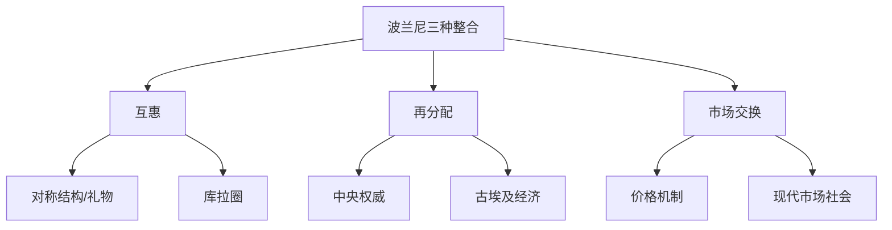
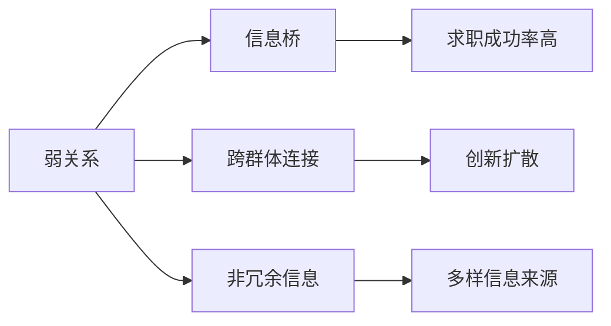
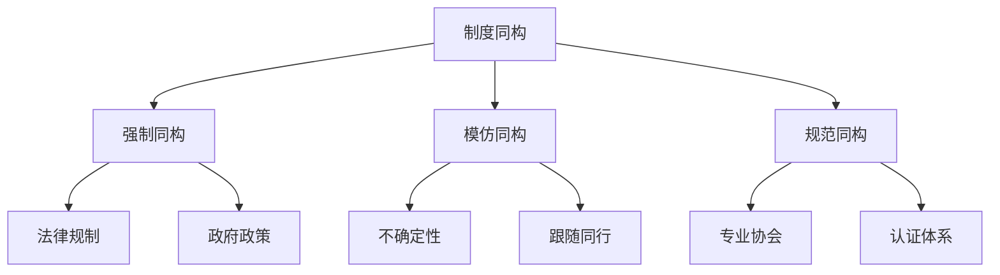

# EconomicSociology

经济社会学（Economic Sociology）
研究经济现象的社会基础和嵌入性。
与主流经济学不同。
它强调经济活动
嵌入于社会关系、文化规范、
政治制度和历史语境之中。

## 学科定位

经济社会学的基本假设：
经济行动总是在社会网络中展开。
市场不仅是价格机制。
它也是社会结构。

### 波兰尼的嵌入性概念

波兰尼（Karl Polanyi）
在《大转型》（1944）中首次提出。

三种经济整合模式：

1. **互惠（Reciprocity）**
   对称社会结构中的礼物交换。
   库拉圈是经典案例。

2. **再分配（Redistribution）**
   向中央权威汇集后重新分配。
   古埃及国教经济为代表。

3. **市场交换（Market Exchange）**
   在价格系统中供需匹配。
   是现代社会的特征。

波兰尼的核心论点：
在19世纪以前，
经济嵌入于社会关系之中。
市场社会的建立
使劳动/土地/货币成为虚拟商品。
这是一个充满冲突的过程。

**双向运动（Double Movement）**：
一方面是市场扩张。
另一方面是社会自我保护。

## 新经济社会学

### Granovetter 与嵌入性网络

格兰诺维特（1985）
在《经济行动与社会结构》中
将嵌入性操作化为社会关系网络。

**弱关系的力量（1973）**：
在他的求职研究中发现。
54%通过人际关系找到工作。
这些大多是弱关系。
弱关系连接不同社交圈。
强关系网络内部重叠。

### 结构洞理论

伯特（Ronald Burt, 1992）
提出结构洞（Structural Holes）。
指社会网络中
非冗余联系之间的间隙。

占据结构洞位置者获得：
- **信息优势**：接触不同来源
- **控制优势**：调节信息流动

$$ \text{结构洞收益} = \text{信息收益}
- \text{控制收益} $$

该理论在商业网络和
内部劳动力市场中被广泛验证。

### 市场作为社会结构

怀特（Harrison White, 1981）
在《市场从哪里来》中提出：
市场不是抽象的价格机制。
而是相互观察的生产者
构成的社会角色结构。
生产者通过与竞争对手比较
确定价格和产量。
形成稳定的生产市场。

### Zelizer 的多种货币

泽利泽（Viviana Zelizer）
展示文化如何塑造经济实践。

主要著作：
- 《人类价值与市场》（1979）
  人寿保险如何从道德争议中走出。

- 《金钱的社会意义》（1994）
  金钱不是同质的。
  补偿金/红包/工资
  是不同的"标记货币"。

- 《亲密关系的经济》（2005）
  亲密关系中的经济交换
  遵循独特规则。

## 制度与经济行为

### 新制度主义

**制度同构**
（DiMaggio & Powell, 1983）：
组织在相同制度环境中趋于同质。

三种压力：
1. **强制同构**：法律/政府规制
2. **模仿同构**：不确定中的模仿
3. **规范同构**：专业化压力

**路径依赖**（Path Dependence）：
技术选择逐步锁定。
QWERTY 键盘标准。
VHS 制式。
早期偶然选择
因递增回报被固定。

## 经济文化

### 消费社会学

消费不仅是满足需求。
更是身份建构和社会区分。
凡伯伦（Thorstein Veblen, 1899）
提出炫耀消费（Conspicuous Consumption）。
上层阶级通过炫耀性消费
展示社会地位。

### 礼物经济

莫斯（Marcel Mauss, 1925）
在《礼物》中分析：
礼物交换的三重义务：
给予-接受-回礼。
礼物具有神圣性（Hau）。
回礼是必要的。
当代仍以节日礼物等形式存在。

### 布迪厄的区分

布迪厄（Bourdieu, 1979）
在《区分》中展示：
消费品味是阶级位置的标记。
文化资本通过消费实践
再生产社会不平等。

## 当代议题

### 平台经济劳动

零工经济（Gig Economy）。
Uber 司机、外卖骑手
在算法管理下工作。
算法控制形式：
自动评价/动态定价/绩效考核。
新形式的劳动控制与抵抗。

### 金融社会学

金融市场的社会建构。
卡鲁瑟斯（Carruthers）：
美国债券市场的制度分析。

麦肯齐（MacKenzie）：
金融模型的演行理论（Performativity）。
经济理论帮助建构
而非描述经济现实。

### 经济与道德

市场逻辑与非市场逻辑的协调。
过度合理化效应：
外部激励减少内在动机。

### 嵌入性与发展

埃文斯（Peter Evans, 1995）：
嵌入的自治（Embedded Autonomy）。
发展型国家成功的关键：
官僚机构既独立于社会利益。
又嵌入于商业网络。

## 相关条目
- [[PoliticalSociology]]
- [[CulturalSociology]]
- [[SocialStratification]]
- [[SocialMovements]]
- [[INDEX|当前目录索引]]

## 深入阅读与扩展分析
该领域的知识体系经过长期积累已相当丰富。
以下内容旨在帮助读者进一步把握核心要点。

### 知识结构导引
该学科的理论框架是多层次的。
从最抽象的本体论假设。
到中程理论的实证假设。
再到操作化的研究假设。
每一层都有其独特功能。

### 主要研究范式对比
| 维度 | 实证主义 | 解释主义 | 批判范式 |
|------|---------|---------|---------|
| 本体论 | 实在论 | 建构论 | 历史实在论 |
| 认识论 | 客观主义 | 主观主义 | 解放认知 |
| 方法论 | 定量为主 | 定性为主 | 对话辩证 |
| 目标 | 解释预测 | 理解意义 | 揭露解放 |

### 经典研究案例分析
案例研究的价值在于展示理论的实践应用。
以下是该领域中几个具有代表性的研究。
它们的方法设计和理论贡献值得深入分析。
每个案例都对学科的后续发展产生了影响。

### 跨文化比较视角
不同文化背景下存在显著的差异。
这些差异对理论普适性提出了挑战。
跨文化研究设计需要特别注意文化偏见。
本地化概念的使用需要细致定义。

### 当代前沿热点
1. 数字化与人工智能的社会影响
2. 全球不平等的新形态
3. 气候变化的社会回应
4. 身份政治与民主危机
5. 后疫情时代的社会变迁
6. 技术伦理与人文关怀

### 方法论工具箱
研究人员可以根据研究问题选择方法。
定量方法适合检验假设和推断总体。
定性方法适合探索意义和生成理论。
混合方法整合两类优势以增强说服力。
实验方法旨在建立因果关系。
纵向设计追踪变化和过程。
比较策略揭示制度和文化的差异。

### 学术资源推荐
主要学术期刊发表该领域的前沿研究。
专业学会组织学术会议和交流活动。
在线数据库提供文献检索服务。
开放获取资源降低了知识获取门槛。
学术博客和播客提供了非正式的学习渠道。

### 学习路径设计
初学者应从通论性教材开始学习。
在建立基本框架后阅读经典原著。
然后选择感兴趣的方向深入阅读。
参与讨论和写作有助于深化理解。
独立研究是培养学术能力的核心环节。

### 批判性思维训练
学会质疑前提假设是学术训练的关键。
考察证据是否充分支持结论。
辨别因果关系与相关关系的区别。
识别论证中的逻辑谬误。
评估不同解释的合理性。
反思自身的认知偏见。

### 学术职业发展
学术道路需要长期投入和持续学习。
发表论文是学术生涯的必经之路。
学术网络的建设需要主动参与。
教学与研究之间的平衡值得关注。
跨学科能力在当代学术市场日益重要。

### 研究的公共价值
学术研究应当服务于公共福祉。
知识创新推动社会进步。
政策咨询将学术转化为实践。
公众科普缩小知识鸿沟。
社会批评促进反思和改进。

### 未来展望
该领域将继续回应时代提出的新问题。
技术进步为研究提供了新的工具。
全球化使比较研究更加重要。
跨学科整合是未来的主要趋势。
学术民主化需要更多元的参与者。

## 关键概念辨析
概念定义的清晰度直接影响研究的质量。
以下是该领域中若干容易混淆的概念。

**概念一与概念二的区分**：
前者侧重于外在的形式特征。
后者关注内在的运作机制。
两者在实际分析中往往需要结合使用。

**微观与宏观层面的联系**：
微观现象是宏观结构的基础。
宏观结构又约束微观行为。
理解两者的相互作用是社会分析的核心。

**静态分析与动态分析**：
静态分析关注某一时点的截面特征。
动态分析关注过程和变化的轨迹。
两种视角互补而非替代。

## 综合思考题
1. 该领域与其他相关学科的关系是什么？
2. 该领域最核心的学术贡献有哪些？
3. 经典理论在当代的有效性如何？
4. 该领域的研究方法有什么特点？
5. 数字技术如何改变该领域的研究实践？
6. 该领域存在哪些未解决的重要问题？
7. 全球化如何影响该领域的研究议程？
8. 该领域的知识如何应用于公共政策？
9. 跨学科整合面临哪些机遇和挑战？
10. 未来十年该领域可能有哪些突破？

## 相关条目
- [[INDEX|当前目录索引]]

## 延伸探讨与专题分析
以下内容进一步丰富对该主题的讨论。
提供更深入的理论视角和应用案例。

### 理论与实践的对话
学术研究不是高不可攀的象牙塔。
好的理论必须经得起实践的检验。
实践中的困惑常常激发理论创新。
理论为实践提供系统的分析框架。
两者之间的良性互动推动学科发展。

### 批判性反思
任何理论都有其预设和局限。
批判性思维要求我们识别这些前提。
考察理论在特定历史条件下的适用性。
注意理论的边界条件和适用范围。
不断以新经验修订旧理论。

### 教学与学习建议
学习该学科需要多读多写多讨论。
阅读经典原文是理解思想精髓的最佳方式。
写作帮助梳理和深化自己的思考。
讨论激发新的观点和批判性视角。
跨学科阅读拓展分析问题的视野。

### 基础知识自测
1. 该学科的核心研究对象是什么？
2. 主要理论流派之间有什么根本差异？
3. 经典研究案例的方法论特点是什么？
4. 当代前沿问题与经典理论有何联系？
5. 该学科的研究方法经历了哪些演变？
6. 不同文化背景下的理论适用性如何？
7. 数字化如何改变该学科的研究范式？
8. 该学科对公共政策有何实际贡献？
9. 学科内部存在哪些尚未解决的争论？
10. 未来十年该学科最可能取得突破的方向？

### 热点问题聚焦
当代社会面临诸多复杂挑战。
这些挑战需要跨学科的综合回应。
数字技术重塑了社会交往的方式。
全球化带来了机遇也带来了风险。
气候变化要求重新思考发展模式。
不平等问题挑战社会团结的基础。
身份政治重塑了公共讨论的议程。

### 学科交叉点
在学科边界处常常产生最富创造性的研究。
认知科学为理解人类行为提供新工具。
计算机科学推动大数据研究方法的应用。
环境研究提出关于可持续发展的新问题。
公共健康领域需要社会科学的深度参与。
城市研究整合多学科视角分析空间问题。

### 研究伦理与责任
学术研究不仅是知识生产活动。
研究者对研究对象和社会负有责任。
保护隐私和获得同意是基本要求。
研究结果可能被误用或滥用。
研究者应当预见研究的潜在影响。
开放科学推动知识共享和可重复性。

### 经典段落摘录
以下摘录经过时间检验的经典论述。
它们凝练了该学科的核心洞见。
阅读原始文本可以感受思想的重量。
建议在上下文中理解这些引文的意义。
批判性阅读比被动接受更有收获。

### 重要时间线
| 时间 | 事件 | 意义 |
|------|------|------|
| 学科萌芽期 | 早期思想奠基 | 提出基本问题和框架 |
| 学科形成期 | 制度化与规范化 | 建立学术共同体 |
| 学科繁荣期 | 理论与方法创新 | 研究范式多元化 |
| 当代转型期 | 跨学科整合 | 回应新问题新挑战 |

### 跨文化对话
不同文明传统对同一问题有不同的回答。
西方传统强调个体和理性分析。
东方传统注重整体和谐与实践智慧。
南半球的学术传统需要更多被听见。
全球知识生产格局应当更加平等。
跨文化对话开阔视野促进相互理解。

### 个人学习计划
制定一个切实可行的学习规划。
每周阅读一定量的专业文献。
定期写作练习培养学术表达能力。
参加学术活动获取最新研究信息。
与同行交流拓展学术网络。
持续学习是学术成长的关键。

## 相关条目
- [[INDEX|当前目录索引]]
