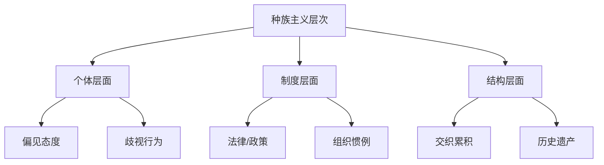

---
aliases: [EthnicRelations]
tags: ['03_HumanitiesAndSocialSciences', 'Sociology', 'EthnicRelations']
created: 2026-05-17
updated: 2026-05-17
---

# EthnicRelations

族群关系（Ethnic Relations）
研究种族、族群和民族之间的
社会关系、权力结构、
不平等和冲突。
它探讨种族和族群身份的
社会建构过程。
偏见、歧视和种族主义的
社会根源与后果。

## 核心概念

### 种族作为社会建构

种族是依据身体特征的社会分类。
现代遗传学明确证实：
人类基因变异中约94%
发生在所谓种族内部。
种族间差异仅约6%。
种族的生物学基础微乎其微。
但社会效应真实深刻。

### 族群与文化基础

族群指基于文化特征的
社会群体认同。

**巴斯（Barth, 1969）**：
族群边界理论。
关键不是共享的文化内容。
而是边界的维持。
族群身份具有情境性。
个体根据情境展示或隐藏族群标记。

### 偏见、歧视与种族主义

| 概念 | 定义 | 层面 |
|------|------|------|
| 刻板印象 | 对群体的简化认知概括 | 认知 |
| 偏见 | 先入为主的负面态度 | 情感 |
| 歧视 | 基于身份的不平等待遇 | 行为 |
| 种族主义 | 支持不平等的系统 | 制度+意识形态 |

**制度种族主义**：
制度运作本身再生产种族不平等。
即使没有恶意个体。

**结构种族主义**：
不同制度之间交织累积的
种族不平等系统。

## 族群关系理论

### 同化理论

帕克（Robert Park, 1928）：
种族关系周期。
接触→竞争→适应→同化。

戈登（Milton Gordon, 1964）
分解同化的七个维度：

1. **文化同化**：采纳主流文化
2. **结构同化**：进入核心制度
3. **婚姻同化**：族群间通婚
4. **认同同化**：认同主流社会
5. **态度同化**：偏见消失
6. **行为同化**：歧视消失
7. **公民同化**：价值冲突消失

### 分段同化理论

Portes & Zhou（1993）：
移民同化不是直线式融入。

三种可能路径：

1. **向上融入主流**
   传统同化模式。

2. **向下融入底层**
   以城市底层为参照群体。

3. **选择性融入**
   保留族群文化网络。
   同时经济向上流动。
   如古巴裔在迈阿密的成功。
   依赖族群经济飞地。

### 种族形成理论

Omi & Winant（1994, 2015）：
种族是穿越历史的
不稳定社会结构。

通过**种族项目**持续被创造。
种族项目连接：
种族结构（社会关系的种族组织）
和意义表征。

种族是社会结构。
不是固定身份。
也不是偏见产物。

## 偏见的社会心理学

**替罪羊理论**：
挫折产生攻击性。
转移至弱势群体。

**权威人格理论**（Adorno, 1950）：
某种人格类型更易产生偏见。
以两个维度测量：
右翼权威主义（RWA）。
社会主导取向（SDO）。

**社会认同理论**
（Tajfel & Turner, 1979）：
内群体偏袒和外群体贬损
维护自尊。
最简群体范式足以产生效应。

**现实冲突理论**（Sherif, 1961）：
罗伯斯山洞实验。
两组童军竞争产生敌意。
通过超级目标合作解决冲突。

**接触假说**（Allport, 1954）：
最优条件下群体接触减少偏见。

必要条件：
- 平等地位
- 共同目标
- 制度支持
- 合作互动

元分析确认：
接触效应稳健。
$$ r \approx -0.26 $$

## 多元文化主义

政策包括：
承认文化差异。
支持少数群体文化维持。
反对同化主义。

批评者认为：
导致文化碎片化。
弱化国家认同。

Kymlicka 辩护：
少数群体权利
在自由主义框架内
满足正义和社会稳定。

## 当代议题

**种族化的不平等**
美国白人家庭财富中位数
是黑人的近8倍。

**色盲种族主义**
（Bonilla-Silva, 2003）：
后民权时代的新型种族主义。
宣称不再看种族。
但维持种族分层。

**交叉性**（Crenshaw, 1989）：
种族、阶级、性别交织。
黑人女性经历独特压迫。

**移民与整合**
难民危机。
公民身份制度。
无证移民权利。

**全球种族流动**
全球化重塑种族身份。
跨国种族等级。
亚洲人作为模型少数族裔。

## 相关条目
- [[SocialStratification]]
- [[GenderStudies]]
- [[PoliticalSociology]]
- [[CulturalSociology]]
- [[03_HumanitiesAndSocialSciences/Sociology/Ethnology/Ethnography|Ethnography]]
- [[INDEX|当前目录索引]]

## 深入阅读与扩展分析
该领域的知识体系经过长期积累已相当丰富。
以下内容旨在帮助读者进一步把握核心要点。

### 知识结构导引
该学科的理论框架是多层次的。
从最抽象的本体论假设。
到中程理论的实证假设。
再到操作化的研究假设。
每一层都有其独特功能。

### 主要研究范式对比
| 维度 | 实证主义 | 解释主义 | 批判范式 |
|------|---------|---------|---------|
| 本体论 | 实在论 | 建构论 | 历史实在论 |
| 认识论 | 客观主义 | 主观主义 | 解放认知 |
| 方法论 | 定量为主 | 定性为主 | 对话辩证 |
| 目标 | 解释预测 | 理解意义 | 揭露解放 |

### 经典研究案例分析
案例研究的价值在于展示理论的实践应用。
以下是该领域中几个具有代表性的研究。
它们的方法设计和理论贡献值得深入分析。
每个案例都对学科的后续发展产生了影响。

### 跨文化比较视角
不同文化背景下存在显著的差异。
这些差异对理论普适性提出了挑战。
跨文化研究设计需要特别注意文化偏见。
本地化概念的使用需要细致定义。

### 当代前沿热点
1. 数字化与人工智能的社会影响
2. 全球不平等的新形态
3. 气候变化的社会回应
4. 身份政治与民主危机
5. 后疫情时代的社会变迁
6. 技术伦理与人文关怀

### 方法论工具箱
研究人员可以根据研究问题选择方法。
定量方法适合检验假设和推断总体。
定性方法适合探索意义和生成理论。
混合方法整合两类优势以增强说服力。
实验方法旨在建立因果关系。
纵向设计追踪变化和过程。
比较策略揭示制度和文化的差异。

### 学术资源推荐
主要学术期刊发表该领域的前沿研究。
专业学会组织学术会议和交流活动。
在线数据库提供文献检索服务。
开放获取资源降低了知识获取门槛。
学术博客和播客提供了非正式的学习渠道。

### 学习路径设计
初学者应从通论性教材开始学习。
在建立基本框架后阅读经典原著。
然后选择感兴趣的方向深入阅读。
参与讨论和写作有助于深化理解。
独立研究是培养学术能力的核心环节。

### 批判性思维训练
学会质疑前提假设是学术训练的关键。
考察证据是否充分支持结论。
辨别因果关系与相关关系的区别。
识别论证中的逻辑谬误。
评估不同解释的合理性。
反思自身的认知偏见。

### 学术职业发展
学术道路需要长期投入和持续学习。
发表论文是学术生涯的必经之路。
学术网络的建设需要主动参与。
教学与研究之间的平衡值得关注。
跨学科能力在当代学术市场日益重要。

### 研究的公共价值
学术研究应当服务于公共福祉。
知识创新推动社会进步。
政策咨询将学术转化为实践。
公众科普缩小知识鸿沟。
社会批评促进反思和改进。

### 未来展望
该领域将继续回应时代提出的新问题。
技术进步为研究提供了新的工具。
全球化使比较研究更加重要。
跨学科整合是未来的主要趋势。
学术民主化需要更多元的参与者。

## 关键概念辨析
概念定义的清晰度直接影响研究的质量。
以下是该领域中若干容易混淆的概念。

**概念一与概念二的区分**：
前者侧重于外在的形式特征。
后者关注内在的运作机制。
两者在实际分析中往往需要结合使用。

**微观与宏观层面的联系**：
微观现象是宏观结构的基础。
宏观结构又约束微观行为。
理解两者的相互作用是社会分析的核心。

**静态分析与动态分析**：
静态分析关注某一时点的截面特征。
动态分析关注过程和变化的轨迹。
两种视角互补而非替代。

## 综合思考题
1. 该领域与其他相关学科的关系是什么？
2. 该领域最核心的学术贡献有哪些？
3. 经典理论在当代的有效性如何？
4. 该领域的研究方法有什么特点？
5. 数字技术如何改变该领域的研究实践？
6. 该领域存在哪些未解决的重要问题？
7. 全球化如何影响该领域的研究议程？
8. 该领域的知识如何应用于公共政策？
9. 跨学科整合面临哪些机遇和挑战？
10. 未来十年该领域可能有哪些突破？

## 相关条目
- [[INDEX|当前目录索引]]

## 延伸探讨与专题分析
以下内容进一步丰富对该主题的讨论。
提供更深入的理论视角和应用案例。

### 理论与实践的对话
学术研究不是高不可攀的象牙塔。
好的理论必须经得起实践的检验。
实践中的困惑常常激发理论创新。
理论为实践提供系统的分析框架。
两者之间的良性互动推动学科发展。

### 批判性反思
任何理论都有其预设和局限。
批判性思维要求我们识别这些前提。
考察理论在特定历史条件下的适用性。
注意理论的边界条件和适用范围。
不断以新经验修订旧理论。

### 教学与学习建议
学习该学科需要多读多写多讨论。
阅读经典原文是理解思想精髓的最佳方式。
写作帮助梳理和深化自己的思考。
讨论激发新的观点和批判性视角。
跨学科阅读拓展分析问题的视野。

### 基础知识自测
1. 该学科的核心研究对象是什么？
2. 主要理论流派之间有什么根本差异？
3. 经典研究案例的方法论特点是什么？
4. 当代前沿问题与经典理论有何联系？
5. 该学科的研究方法经历了哪些演变？
6. 不同文化背景下的理论适用性如何？
7. 数字化如何改变该学科的研究范式？
8. 该学科对公共政策有何实际贡献？
9. 学科内部存在哪些尚未解决的争论？
10. 未来十年该学科最可能取得突破的方向？

### 热点问题聚焦
当代社会面临诸多复杂挑战。
这些挑战需要跨学科的综合回应。
数字技术重塑了社会交往的方式。
全球化带来了机遇也带来了风险。
气候变化要求重新思考发展模式。
不平等问题挑战社会团结的基础。
身份政治重塑了公共讨论的议程。

### 学科交叉点
在学科边界处常常产生最富创造性的研究。
认知科学为理解人类行为提供新工具。
计算机科学推动大数据研究方法的应用。
环境研究提出关于可持续发展的新问题。
公共健康领域需要社会科学的深度参与。
城市研究整合多学科视角分析空间问题。

### 研究伦理与责任
学术研究不仅是知识生产活动。
研究者对研究对象和社会负有责任。
保护隐私和获得同意是基本要求。
研究结果可能被误用或滥用。
研究者应当预见研究的潜在影响。
开放科学推动知识共享和可重复性。

### 经典段落摘录
以下摘录经过时间检验的经典论述。
它们凝练了该学科的核心洞见。
阅读原始文本可以感受思想的重量。
建议在上下文中理解这些引文的意义。
批判性阅读比被动接受更有收获。

### 重要时间线
| 时间 | 事件 | 意义 |
|------|------|------|
| 学科萌芽期 | 早期思想奠基 | 提出基本问题和框架 |
| 学科形成期 | 制度化与规范化 | 建立学术共同体 |
| 学科繁荣期 | 理论与方法创新 | 研究范式多元化 |
| 当代转型期 | 跨学科整合 | 回应新问题新挑战 |

### 跨文化对话
不同文明传统对同一问题有不同的回答。
西方传统强调个体和理性分析。
东方传统注重整体和谐与实践智慧。
南半球的学术传统需要更多被听见。
全球知识生产格局应当更加平等。
跨文化对话开阔视野促进相互理解。

### 个人学习计划
制定一个切实可行的学习规划。
每周阅读一定量的专业文献。
定期写作练习培养学术表达能力。
参加学术活动获取最新研究信息。
与同行交流拓展学术网络。
持续学习是学术成长的关键。

## 相关条目
- [[INDEX|当前目录索引]]

