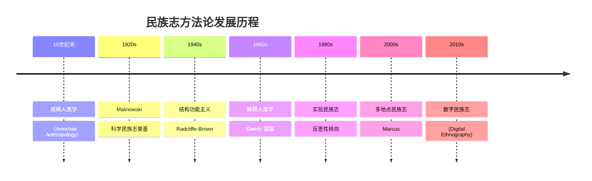
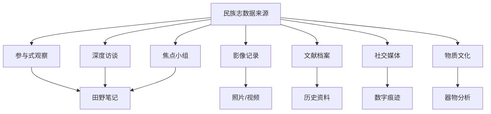

---
aliases:
  - 民族志
  - 田野调查
  - 参与式观察
  - 人种志
tags:
  - ethnography
  - fieldwork
  - qualitative-research
  - anthropology
  - participant-observation
  - cultural-description
---

# 民族志

## 概述

**民族志（Ethnography）** 是人类学和社会学的核心研究方法，指研究者通过**长期深入的田野工作（fieldwork）**，对特定人群的文化、行为和生活方式进行**系统和整体性**的描述与解释。

## 定义与本质

$$
\text{Ethnography} = \text{Fieldwork} + \text{Thick Description} + \text{Cultural Interpretation}
$$

| 维度 | 特征 |
|------|------|
| 时间 | 长期（通常 12 个月以上） |
| 空间 | 田野现场（field site） |
| 方法 | 参与式观察为主，多方法并用 |
| 产出 | 民族志文本（monograph / article） |
| 认识论 | 解释主义（interpretivism） |

## 历史发展

## 核心方法

### 1. 参与式观察

**参与式观察（Participant Observation）** 是民族志的**标志性方法**。研究者同时在两个身份间切换：

$$
\text{身份} = \alpha \cdot \text{Participant} + (1 - \alpha) \cdot \text{Observer}
$$

其中 $\alpha \in [0, 1]$ 表示参与程度，因研究阶段和情境而异。

| 参与程度 | 角色 | 典型场景 |
|----------|------|----------|
| 完全参与 | 隐蔽成员 | 亚文化群体 |
| 主动参与 | 公开成员 | 社区活动 |
| 适度参与 | 友好访客 | 日常互动 |
| 被动观察 | 旁观者 | 公共场合 |

### 2. 深度访谈

民族志访谈不同于问卷调查：

- **非结构化**（unstructured）—— 跟随受访者的叙事
- **情境化**（contextual）—— 在田野中进行
- **重复性**（repeated）—— 同一受访者多次访谈

### 3. 田野笔记

田野笔记（Field Notes）是民族志的**基础数据**。分为两类：

| 类型 | 特点 | 写作时机 |
|------|------|----------|
| 速记笔记（Jottings） | 关键词、短语 | 现场即时记录 |
| 扩展笔记（Expanded Notes） | 详细描述、初步分析 | 每天结束后 |
| 分析备忘录（Analytic Memos） | 理论反思、模式识别 | 每周整理 |

#### 深描（Thick Description）

Clifford Geertz 提出的 **深描** 概念，指的是超越表面行为、揭示意义网络的文化解释：

$$
\text{文化} = \text{人类编织的意义之网} \quad \text{—— Geertz}
$$

深描的经典例子——**眨眼与抽动的区别**：同样的生理动作，在文化中有截然不同的含义。

### 4. 多模态方法

现代民族志日益采用多种数据来源：

## 伦理规范

### 核心原则

1. **知情同意（Informed Consent）**—— 告知研究目的，获取同意
2. **匿名与保密（Anonymity & Confidentiality）**—— 保护受访者身份
3. **互惠（Reciprocity）**—— 回馈社区
4. **脱身策略（Exit Strategy）**—— 安全退出田野

### 伦理困境

- **隐蔽研究**：何时可以隐藏研究者身份？
- **敏感信息**：看到违法/危险行为怎么办？
- **权力关系**：研究者与被研究者的不平等关系
- **写作伦理**：如何平衡真实与保护？

## 分析路径

### 编码方法

民族志分析通常采用**扎根理论（Grounded Theory）**的编码策略：

$$
\text{Open Coding} \rightarrow \text{Axial Coding} \rightarrow \text{Selective Coding}
$$

| 编码阶段 | 操作 | 目标 |
|----------|------|------|
| 开放编码 | 逐行编码 | 识别概念 |
| 轴心编码 | 关联类别 | 建立关系 |
| 选择编码 | 核心范畴 | 建构理论 |

### 三角验证

**三角验证（Triangulation）** 增强研究的可信度：

$$
\text{Credibility} \propto \sum_{\text{source}} w_i \cdot \text{evidence}_i
$$

- 数据三角：多种数据类型
- 方法三角：多种方法
- 研究者三角：多位研究者
- 理论三角：多种理论视角

## 写作民族志

### 经典结构

| 章节 | 内容 |
|------|------|
| 引言 | 田野进入、研究问题 |
| 背景 | 田野地点的社会文化语境 |
| 方法 | 田野工作过程、伦理考量 |
| 分析章节 | 主题式呈现发现 |
| 讨论 | 理论对话、比较 |
| 结论 | 贡献、局限、展望 |

### 反思性写作

1980 年代的 **实验民族志** 转向强调反思性（reflexivity）：

> 民族志写作不是中性的"记录"，而是一种**修辞建构**。

研究者需在文本中明确自己的位置性（positionality）：

$$
\text{positionality} = f(\text{race}, \text{class}, \text{gender}, \text{sexuality}, \text{history})
$$

## 田野策略

| 策略 | 描述 |
|------|------|
| 大门开启者 | 通过关键informant进入 |
| 雪球抽样 | 由一人推荐下一人 |
| 渐进式参与 | 从观察到参与逐步深入 |
| 关键事件法 | 聚焦重大事件 |
| 日常追踪 | 记录典型日常 |

## 数字民族志

随着数字社会的发展，民族志方法也延伸到线上：

- 虚拟社区研究（Reddit / Discord / 微博）
- 数字痕迹分析（帖子、评论、点赞）
- 网络民族志（Netnography）
- 数字田野中"在场"的新定义

## 经典民族志作品

| 作品 | 作者 | 年份 | 贡献 |
|------|------|------|------|
| *Argonauts of the Western Pacific* | Malinowski | 1922 | 奠定科学民族志范式 |
| *The Nuer* | Evans-Pritchard | 1940 | 结构功能主义经典 |
| *The Interpretation of Cultures* | Geertz | 1973 | 深描与解释人类学 |
| *Writing Culture* | Clifford & Marcus | 1986 | 反思性转向 |
| *A Thrice-Told Tale* | Wolf | 1992 | 实验民族志 |

## 推荐阅读入门

- Agar, M. (1996). *The Professional Stranger*
- Emerson, R. M. et al. (2011). *Writing Ethnographic Fieldnotes*
- Geertz, C. (1973). Thick Description: Toward an Interpretive Theory of Culture
- Madden, R. (2010). *Being Ethnographic*
- 高丙中. (2006). *写文化——民族志的诗学与政治学*
