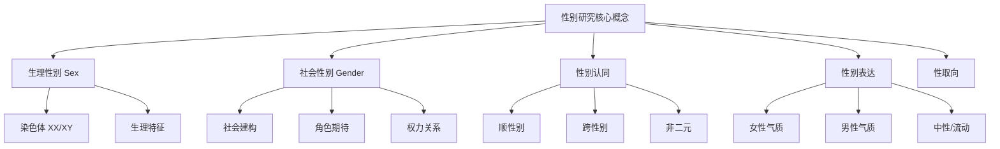

---
aliases:
  - 性别研究
  - 女性主义
  - 性别理论
  - 酷儿理论
tags:
  - gender-studies
  - feminism
  - queer-theory
  - intersectionality
  - sociology
  - social-construction
---

# 性别研究

## 概述

**性别研究（Gender Studies）** 是一个跨学科领域，探讨性别认同、性别表达、性别角色和权力结构等议题。它起源于 20 世纪中期的女性主义运动，现已涵盖女性主义理论、男性研究（Masculinity Studies）、酷儿理论（Queer Theory）和跨性别研究（Transgender Studies）等多个分支。

## 核心概念框架

## 理论谱系

### 女性主义理论的三波

| 波次 | 时期 | 核心议题 | 代表人物 |
|------|------|----------|----------|
| 第一波 | 19世纪末—1920s | 选举权、教育权、财产权 | Mary Wollstonecraft, Emmeline Pankhurst |
| 第二波 | 1960s—1980s | 生育权、职场平等、家庭暴力 | Simone de Beauvoir, Betty Friedan |
| 第三波 | 1990s—2010s | 个体差异、多元女性主义、身体自主 | Judith Butler, bell hooks |
| 第四波 | 2010s 至今 | 交叉性、社交媒体维权、#MeToo | Kimberlé Crenshaw, Chimamanda Ngozi Adichie |

### 关键理论流派

#### 自由主义女性主义

追求**法律平等**与**机会均等**。认为男女差异主要源于不平等的社会化过程。

$$
\text{gender equality} \iff \text{equal rights} \land \text{equal opportunities}
$$

#### 激进女性主义

认为**父权制（Patriarchy）**是一切压迫的根源。主张女性需从根本上摆脱男性统治体系。

#### 社会主义女性主义

结合马克思主义与女性主义，认为 **资本主义 + 父权制** 共同构成压迫的双重结构。

#### 后现代女性主义

质疑"女性"作为统一范畴，强调身份的**碎片化**与**流动性**。代表人物 Judith Butler 提出**性别操演理论（Gender Performativity）**：

$$
\text{gender} = \sum_{t} \text{performative acts}(t)
$$

性别不是本质属性，而是一系列重复表演的**结果**而非**原因**。

## 社会建构论

### 性别的社会建构

**社会建构论（Social Constructionism）** 认为，性别差异在很大程度上是文化和社会制度的产物，而非生物决定论的结果。

| 领域 | 常见建构 | 跨文化差异 |
|------|----------|------------|
| 服饰 | 粉色=女/蓝色=男 | 20 世纪初相反 |
| 职业 | 护士=女/工程师=男 | 北欧女性工程师比例更高 |
| 情绪 | 女性可哭/男性不应哭 | 不同文化对男性哭泣接受度不同 |
| 家务 | 女性主内 | 北欧国家男性休产假比例更高 |

### 性别社会化过程

## 交叉性

### Kimberlé Crenshaw 的贡献

**交叉性（Intersectionality）** 由法律学者 Kimberlé Crenshaw 在 1989 年提出，用以描述多重身份类别如何产生独特的压迫体验：

$$
\text{Oppression} = \sum_{i} \text{identity}_i \cdot \text{power}_i + \sum_{i \neq j} \text{interaction}(\text{identity}_i, \text{identity}_j)
$$

例如，黑人女性面临的歧视既不同于白人女性（性别+种族），也不同于黑人男性（种族+性别）。

### 交叉身份维度

| 维度 | 特权方向 | 压迫方向 |
|------|----------|----------|
| 性别 | 男性 | 女性/非二元 |
| 种族 | 白人 | 有色人种 |
| 阶级 | 上层/中产 | 劳工/贫困 |
| 性取向 | 直人 | 性少数 |
| 能力 | 健全 | 残障 |

## 酷儿理论

### 核心主张

**酷儿理论（Queer Theory）** 兴起于 1990 年代，对一切"正常"的性别和性取向分类提出质疑：

- **反本质主义**：性取向不是固定的本质
- **解构二元**：挑战男/女、同/异的二分法
- **权力批判**：揭示分类背后的权力机制

### 关键概念

- **异性恋矩阵（Heterosexual Matrix）**—— Butler 提出的强制性异性恋框架
- **酷儿时间（Queer Time）**—— 挑战线性、生育导向的时间观
- **跨性别具身（Trans Embodiment）**—— 性别认同与身体的多元关系

## 性别与权力

### 父权制的表现

$$
\text{Patriarchy} = \text{男性主导} + \text{男性认同} + \text{男性中心} + \text{男性控制}
$$

| 领域 | 表现 |
|------|------|
| 政治 | 女性议员比例不足 30%（全球均值） |
| 经济 | 性别薪酬差距 15—20% |
| 家庭 | 女性承担 2—3 倍无酬家务劳动 |
| 媒体 | 女性被客体化，男性被权力化 |
| 教育 | STEM 领域女性占比不足 30% |

## 当代中国性别议题

| 议题 | 现状 |
|------|------|
| 职场歧视 | 隐性玻璃天花板，生育惩罚 |
| 彩礼与婚房 | 高额彩礼加重男性家庭负担 |
| 冠姓权 | 传统随父姓，少数协商 |
| 家庭暴力 | 立法完善，执行困难 |
| 性教育 | 学校性教育不足，HPV 疫苗接种推广 |
| 跨性别权利 | 法律认可困难，医疗资源有限 |

## 研究方法

| 方法 | 适用场景 |
|------|----------|
| 深度访谈 | 个人经验与身份叙事 |
| 话语分析 | 媒体与政策中的性别表征 |
| 民族志 | 社群文化与性别实践 |
| 问卷调研 | 态度与行为的量化测量 |
| 实验法 | 偏见与歧视的隐性测量 |

## 推荐阅读

- Beauvoir, S. de (1949). *The Second Sex*
- Butler, J. (1990). *Gender Trouble*
- Crenshaw, K. (1989). Demarginalizing the Intersection of Race and Sex
- hooks, b. (1984). *Feminist Theory: From Margin to Center*
- Foucault, M. (1976). *The History of Sexuality*
- 李银河. (2005). *女性主义*
