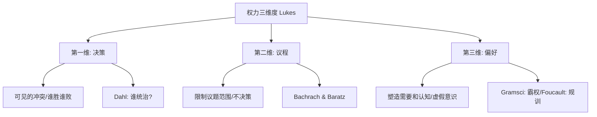

# PoliticalSociology

政治社会学（Political Sociology）是社会学和政治学的交叉学科，研究权力（Power）、国家（State）与社会之间的互动关系。它探讨权力的社会基础——谁掌握权力、如何获得、行使和维持权力，以及社会群体如何影响和回应政治决策。

## 权力（Power）的概念

### 韦伯的定义

韦伯（Max Weber, 1914）定义权力为"在社会关系中个体即使在遭遇抵抗的情况下也能实现自身意志的可能性"。这是"零和"的权力概念——A 使 B 做 B 否则不会做的事。

### 卢克斯的三维权力观

卢克斯（Steven Lukes, 1974）在《权力：一种激进观点》中提出了权力分析的三维层次，逐渐深入：

1. **第一维（决策权力）**：A 使 B 做 B 本不会做的事——决策中的胜负(F 可见的冲突)
2. **第二维（议程设定权力）**：A 限制决策范围，阻止某些议题被讨论——非决策制定（Bachrach & Baratz, 1962）
3. **第三维（意识形态权力）**：A 塑造 B 的认知和偏好，使 B 接受现有的权力安排甚至为自己的统治地位辩护——"最有效的权力是使人们看不见权力运作"

### 福柯的权力-知识分析

福柯（Michel Foucault）将权力分析从中心（国家）转向微观层面——权力是弥散的、生产性的、毛细血管状的。权力不是某人拥有的"东西"，而是关系网络，通过话语（Discourse）、身体规训（Discipline）和生命政治（Biopolitics）运作。**权力-知识**（Power-Knowledge）：权力生产知识，知识也使权力行使合法化。全景监狱（Panopticon）不是监狱模型——它是一种权力运作的逻辑：被观察者的不确定性和可见性维护权力。

## 国家（State）的理论

### 韦伯的定义

韦伯：国家是在一定领土内垄断合法暴力使用权的人类共同体。三个要件：领土（Territory）、垄断暴力（Monopoly of Violence）、合法性（Legitimacy）。

### 多元主义（Pluralism）

达尔（Robert Dahl, 1961）在《谁统治？》中研究纽黑文市——权力分散于不同利益群体中，没有单一的统治精英。民主是不同利益集团竞争的政治市场。

### 精英理论（Elite Theory）

米尔斯（C. Wright Mills, 1956）《权力精英》——美国由来自企业、军事和政府顶层的"权力精英"所统治，这三种机构的顶层互相关联：退伍将军成为大公司 CEO、国防部长是企业董事。

**寡头统治铁律**（Iron Law of Oligarchy, Michels, 1911）：任何大规模组织——即使是宣称民主的社会党和工会——最终都会产生小寡头统治。

### 马克思主义国家理论

- **工具主义**（Instrumentalism, Miliband, 1969）：国家是统治阶级的工具——国家精英大多来自资产阶级，与国家权力直接服务于资本积累
- **结构主义**（Structuralism, Poulantzas, 1968）：国家有"相对自主性"——在资本主义矛盾中，国家有时必须违背资产阶级短期利益以维护长期利益。国家不是工具而是阶级关系的凝结
- **战略关系理论**（Jessop, 1990）：国家是"战略选择场域"——不同力量通过国家争夺霸权

### 回归国家理论（Bringing the State Back In）

斯考切波（Theda Skocpol, 1979, 1985）：国家不仅是社会冲突的"舞台"，而是具有**自主性**（Autonomy）和能力（Capacity）的行为者——国家管理者有自己的利益（维护领土、税收、秩序）。《国家与社会革命》比较法国、俄国和中国的革命——国家危机创造了革命条件。

## 政治文化（Political Culture）

阿尔蒙德和维巴（Almond & Verba, 1963）在《公民文化》中比较美国、英国、德国、意大利和墨西哥五国的政治文化，区分：
- **偏狭型（Parochial）**：公民不期望政府提供什么也不参与
- **顺从型（Subject）**：公民意识到政府但不积极参与
- **参与型（Participant）**：公民积极影响政治

英格尔哈特（Ronald Inglehart, 1971, 1977）提出的**后物质主义**（Postmaterialism）理论——经济发展使安全感普及，导致从"物质主义"价值观（经济安全/法律秩序）转向"后物质主义"价值观（言论自由/政治参与/环境保护/生活方式自主）。

## 政治参与与投票行为

- **SEI 模型**（Socioeconomic Status Model）：教育、收入和职业地位越高 → 政治参与越多
- **资源模型**（Resource Model）：时间、金钱和公民技能影响参与
- **动员模型**（Mobilization Model）：政党、社会运动和社交网络动员个体参与
- **理性选民假说**（Rational Voter Hypothesis, Downs, 1957）：选民权衡投票的成本和收益——投票悖论（Paradox of Voting）：为什么有人投票？投票的个人收益微乎其微，成本却需要时间精力。

$$ \text{投票: } P(\text{影响结果}) \times \text{收益} + \text{公民义务感} - \text{成本} > 0 $$

## 社会运动与政治变革

详见[[SocialMovements]]条目。社会运动的**政治机会结构**（Political Opportunity Structure）——政治制度的开放性是决定运动出现与否和结果的关键变量（Tilly, 1978; McAdam, 1982）。

## 当代议题

- **全球化与主权**：跨国资本、国际组织、全球公民社会挑战民族国家的主权
- **民粹主义**（Populism）：21世纪全球右翼民粹主义浪潮（特朗普、勒庞、莫迪、欧尔班）的社会根源——文化反弹（Cultural Backlash, Norris & Inglehart）vs. 经济不安全感
- **数字威权主义**：中国的社会信用体系、俄罗斯的数字监控、选举干预
- **福利国家危机**：人口老龄化、经济低增长、财政紧张
- **社会资本与民主**：帕特南（Robert Putnam, 2000）《独自打保龄》——美国社会资本（投入社区和社会网络的）在20世纪后半叶持续下降

## 相关条目
- [[SocialMovements]]
- [[SocialStratification]]
- [[GenderStudies]]
- [[EconomicSociology]]
- [[Criminology]]
- [[INDEX|当前目录索引]]

## 深入阅读与扩展分析
该领域的知识体系经过长期积累已相当丰富。
以下内容旨在帮助读者进一步把握核心要点。

### 知识结构导引
该学科的理论框架是多层次的。
从最抽象的本体论假设。
到中程理论的实证假设。
再到操作化的研究假设。
每一层都有其独特功能。

### 主要研究范式对比
| 维度 | 实证主义 | 解释主义 | 批判范式 |
|------|---------|---------|---------|
| 本体论 | 实在论 | 建构论 | 历史实在论 |
| 认识论 | 客观主义 | 主观主义 | 解放认知 |
| 方法论 | 定量为主 | 定性为主 | 对话辩证 |
| 目标 | 解释预测 | 理解意义 | 揭露解放 |

### 经典研究案例分析
案例研究的价值在于展示理论的实践应用。
以下是该领域中几个具有代表性的研究。
它们的方法设计和理论贡献值得深入分析。
每个案例都对学科的后续发展产生了影响。

### 跨文化比较视角
不同文化背景下存在显著的差异。
这些差异对理论普适性提出了挑战。
跨文化研究设计需要特别注意文化偏见。
本地化概念的使用需要细致定义。

### 当代前沿热点
1. 数字化与人工智能的社会影响
2. 全球不平等的新形态
3. 气候变化的社会回应
4. 身份政治与民主危机
5. 后疫情时代的社会变迁
6. 技术伦理与人文关怀

### 方法论工具箱
研究人员可以根据研究问题选择方法。
定量方法适合检验假设和推断总体。
定性方法适合探索意义和生成理论。
混合方法整合两类优势以增强说服力。
实验方法旨在建立因果关系。
纵向设计追踪变化和过程。
比较策略揭示制度和文化的差异。

### 学术资源推荐
主要学术期刊发表该领域的前沿研究。
专业学会组织学术会议和交流活动。
在线数据库提供文献检索服务。
开放获取资源降低了知识获取门槛。
学术博客和播客提供了非正式的学习渠道。

### 学习路径设计
初学者应从通论性教材开始学习。
在建立基本框架后阅读经典原著。
然后选择感兴趣的方向深入阅读。
参与讨论和写作有助于深化理解。
独立研究是培养学术能力的核心环节。

### 批判性思维训练
学会质疑前提假设是学术训练的关键。
考察证据是否充分支持结论。
辨别因果关系与相关关系的区别。
识别论证中的逻辑谬误。
评估不同解释的合理性。
反思自身的认知偏见。

### 学术职业发展
学术道路需要长期投入和持续学习。
发表论文是学术生涯的必经之路。
学术网络的建设需要主动参与。
教学与研究之间的平衡值得关注。
跨学科能力在当代学术市场日益重要。

### 研究的公共价值
学术研究应当服务于公共福祉。
知识创新推动社会进步。
政策咨询将学术转化为实践。
公众科普缩小知识鸿沟。
社会批评促进反思和改进。

### 未来展望
该领域将继续回应时代提出的新问题。
技术进步为研究提供了新的工具。
全球化使比较研究更加重要。
跨学科整合是未来的主要趋势。
学术民主化需要更多元的参与者。

## 关键概念辨析
概念定义的清晰度直接影响研究的质量。
以下是该领域中若干容易混淆的概念。

**概念一与概念二的区分**：
前者侧重于外在的形式特征。
后者关注内在的运作机制。
两者在实际分析中往往需要结合使用。

**微观与宏观层面的联系**：
微观现象是宏观结构的基础。
宏观结构又约束微观行为。
理解两者的相互作用是社会分析的核心。

**静态分析与动态分析**：
静态分析关注某一时点的截面特征。
动态分析关注过程和变化的轨迹。
两种视角互补而非替代。

## 综合思考题
1. 该领域与其他相关学科的关系是什么？
2. 该领域最核心的学术贡献有哪些？
3. 经典理论在当代的有效性如何？
4. 该领域的研究方法有什么特点？
5. 数字技术如何改变该领域的研究实践？
6. 该领域存在哪些未解决的重要问题？
7. 全球化如何影响该领域的研究议程？
8. 该领域的知识如何应用于公共政策？
9. 跨学科整合面临哪些机遇和挑战？
10. 未来十年该领域可能有哪些突破？

## 相关条目
- [[INDEX|当前目录索引]]

## 延伸探讨与专题分析
以下内容进一步丰富对该主题的讨论。
提供更深入的理论视角和应用案例。

### 理论与实践的对话
学术研究不是高不可攀的象牙塔。
好的理论必须经得起实践的检验。
实践中的困惑常常激发理论创新。
理论为实践提供系统的分析框架。
两者之间的良性互动推动学科发展。

### 批判性反思
任何理论都有其预设和局限。
批判性思维要求我们识别这些前提。
考察理论在特定历史条件下的适用性。
注意理论的边界条件和适用范围。
不断以新经验修订旧理论。

### 教学与学习建议
学习该学科需要多读多写多讨论。
阅读经典原文是理解思想精髓的最佳方式。
写作帮助梳理和深化自己的思考。
讨论激发新的观点和批判性视角。
跨学科阅读拓展分析问题的视野。

### 基础知识自测
1. 该学科的核心研究对象是什么？
2. 主要理论流派之间有什么根本差异？
3. 经典研究案例的方法论特点是什么？
4. 当代前沿问题与经典理论有何联系？
5. 该学科的研究方法经历了哪些演变？
6. 不同文化背景下的理论适用性如何？
7. 数字化如何改变该学科的研究范式？
8. 该学科对公共政策有何实际贡献？
9. 学科内部存在哪些尚未解决的争论？
10. 未来十年该学科最可能取得突破的方向？

### 热点问题聚焦
当代社会面临诸多复杂挑战。
这些挑战需要跨学科的综合回应。
数字技术重塑了社会交往的方式。
全球化带来了机遇也带来了风险。
气候变化要求重新思考发展模式。
不平等问题挑战社会团结的基础。
身份政治重塑了公共讨论的议程。

### 学科交叉点
在学科边界处常常产生最富创造性的研究。
认知科学为理解人类行为提供新工具。
计算机科学推动大数据研究方法的应用。
环境研究提出关于可持续发展的新问题。
公共健康领域需要社会科学的深度参与。
城市研究整合多学科视角分析空间问题。

### 研究伦理与责任
学术研究不仅是知识生产活动。
研究者对研究对象和社会负有责任。
保护隐私和获得同意是基本要求。
研究结果可能被误用或滥用。
研究者应当预见研究的潜在影响。
开放科学推动知识共享和可重复性。

### 经典段落摘录
以下摘录经过时间检验的经典论述。
它们凝练了该学科的核心洞见。
阅读原始文本可以感受思想的重量。
建议在上下文中理解这些引文的意义。
批判性阅读比被动接受更有收获。

### 重要时间线
| 时间 | 事件 | 意义 |
|------|------|------|
| 学科萌芽期 | 早期思想奠基 | 提出基本问题和框架 |
| 学科形成期 | 制度化与规范化 | 建立学术共同体 |
| 学科繁荣期 | 理论与方法创新 | 研究范式多元化 |
| 当代转型期 | 跨学科整合 | 回应新问题新挑战 |

### 跨文化对话
不同文明传统对同一问题有不同的回答。
西方传统强调个体和理性分析。
东方传统注重整体和谐与实践智慧。
南半球的学术传统需要更多被听见。
全球知识生产格局应当更加平等。
跨文化对话开阔视野促进相互理解。

### 个人学习计划
制定一个切实可行的学习规划。
每周阅读一定量的专业文献。
定期写作练习培养学术表达能力。
参加学术活动获取最新研究信息。
与同行交流拓展学术网络。
持续学习是学术成长的关键。

## 相关条目
- [[INDEX|当前目录索引]]

## 专题研究扩展
以下讨论补充了前述内容的细节和实例。

### 应用场景分析
该领域的知识可以应用于多个实际场景。
政策制定者利用理论框架设计干预方案。
教育工作者将研究成果融入课程设计。
临床工作者使用诊断分类指导治疗。
企业管理者借鉴社会学视角优化组织。

### 研究设计建议
好的研究始于好的问题。
明确研究对象和分析层次。
选择合适的研究方法。
考虑伦理问题和研究偏见。
注意研究的内部效度和外部效度。
充分的文献回顾避免重复劳动。

### 数据解读技巧
数据分析不仅仅是技术操作。
理论框架指导数据解读的方向。
注意相关关系与因果关系的区别。
考虑替代解释的可能性。
报告效应量和置信区间。
敏感性测试检验发现的稳健性。

### 写作表达要点
学术写作追求清晰准确的表达。
避免不必要的术语堆砌。
用具体例子说明抽象概念。
段落之间有明确的过渡。
结论回应研究问题而非重复结果。
摘要简洁传达核心信息。

### 学术辩论示例
该领域存在持续的学术辩论。
不同观点之间的碰撞推动知识进步。
理解这些辩论有助于把握学科脉络。
在辩论中识别自己的学术立场。
有理有据地参与学术讨论。

### 未来研究议程
该领域的未来研究有多个方向。
跨学科整合将持续加深。
新方法技术将拓展研究边界。
全球化背景下需要新理论框架。
气候变化和环境问题亟待回应。
数字技术的社会影响需要系统分析。
不平等问题是持久的核心议题。
文化多样性需要更多比较研究。

## 相关条目
- [[INDEX|当前目录索引]]

## 扩展讨论与深层分析

### 历史发展脉络
该学科经历了漫长的发展过程。
每一次范式转换都带来理论的革新。
外部社会环境的变化推动研究议程。
学科内部的争论推动理论精致化。

### 核心命题再审视
该领域存在一些反复出现的命题。
它们构成了学科的理论内核。
不同时代对同一命题有不同回答。
理解这些命题的演变是掌握学科的关键。

### 方法论反思
研究方法的选择不是中立的。
每种方法都有其优势和局限。
方法应当服务于研究问题而非相反。
混合方法设计可以弥补单一方法的不足。

### 学术写作范例
优秀的学术写作是清晰和有说服力的。
段落的组织结构应符合逻辑顺序。
句子长度应当有变化以保持可读性。
术语的使用应当精确且一致。

## 相关条目
- [[INDEX|当前目录索引]]

## 补充阅读与思考
以下内容提供了额外的分析视角。
有助于加深对该主题的全面理解。

### 学术传承
每个学术传统都有其奠基者。
后人在前人的基础上继续推进。
学术知识的积累是一个接力过程。
理解学术传承有助于定位自己的研究。

### 研究前沿动态
前沿研究往往挑战既有假设。
新方法带来新发现和新认识。
跨学科合作催生创新。
预注册和开放科学提升研究质量。

### 关键文献推荐
原始文献是思想的源头。
综述文献帮助把握研究脉络。
方法论文献提升研究技能。
批评性文献提供反思视角。

## 相关条目
- [[INDEX|当前目录索引]]

## 简要补充
该主题的深入学习需要持续的积累。
建议结合相关条目进行系统性阅读。
通过比较分析加深对核心概念的理解。
跨学科视角有助于拓展分析框架。
理论与实践的结合是最有效的学习方式。
持续的写作和讨论锻炼批判思维。

## 相关条目
- [[INDEX|当前目录索引]]

该主题具有重要的学术价值和实践意义。
希望以上内容能够帮助读者建立基本的理解框架。

## 相关条目
- [[INDEX|当前目录索引]]
