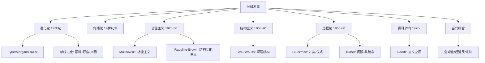

# SocialAnthropology

社会人类学（Social Anthropology）是人类学的重要分支，研究人类社会结构、社会组织、亲属制度、宗教仪式和政治体系的跨文化比较。它传统上关注非西方的小型社会，通过比较方法揭示人类社会行为的多样性及其普遍规律。当代社会人类学的范围已经扩展到现代国家、全球流动、数字文化等几乎一切社会领域。

## 学科发展

社会人类学在英国传统（社会人类学）和法国传统（民族学）中发展，区别于美国的"文化人类学"传统：

### 结构功能主义

拉德克利夫-布朗（Radcliffe-Brown）认为社会就像生物有机体——社会结构由社会关系网络构成，各种制度（Kinship, Politics, Economy, Religion）的功能是维持社会系统的整体均衡。埃文斯-普里查德（Evans-Pritchard）的《努尔人》（1940）——无国家的线性裂变分支制度：

$$ \text{裂变分支: } A < B < C \text{(整合等级)} $$
$$ \text{政治原则: "针对我兄弟，我和我兄弟；针对表兄弟，我和我兄弟和我表兄弟；针对外姓，我们整族"} $$

### 结构主义

列维-斯特劳斯（Lévi-Strauss）的结构主义人类学关注心智的深层结构。他将文化（神话、亲属关系、烹饪）视为深层二元对立系统（深层语法），并在表面无限的多样性背后找到有限的普遍模式。

**亲属关系的原子结构**（1949）：婚姻是女人的交换——其中最基础的“舅舅”（Maternal Uncle）分析揭示了"父-子"和"母-子"、"夫-妻"和"舅-甥"之间的结构同构关系。

### 解释人类学

格尔茨（Clifford Geertz）在《文化的解释》（1973）定义文化为"人类编织的意义之网"——人悬在自己编织的意义网中。他改变了"文化是行为模式"到"文化是为行为提供的框架"。巴厘岛斗鸡的厚描——斗鸡不是赌博，而是巴厘社会的戏剧——身份地位隐喻和自我沉醉。（深玩: Deep Play）。

## 亲属制度（Kinship）

亲属制度是社会人类学的核心——它理解社会组织的基本原则（地位、继承、居住、生产、权力）如何嵌入血缘和姻亲关系：

**继嗣（Descent）**：
- **父系继嗣**（Patrilineal）：继承权通过父亲线传递——典型于牧业社会（努尔人、中国宗族）
- **母系继嗣**（Matrilineal）：继承权通过母亲线传递——典型于农业社会（米南加保人、纳瓦霍人）
- **双系继嗣**（Cognatic）：血缘通过父母双方，如东南亚

**居住模式**（Residence Rules）：
- 从父居（Patrilocal）：新婚夫妇居住在丈夫家
- 从母居（Matrilocal）：居住在妻子家
- 从舅居（Avunculocal）：居住在丈夫的舅舅家
- 双居（Bilocal）：自由选择亲属附近
- 新居（Neolocal）：现代核心家庭模式

**婚姻交换**：
- **聘礼**（Bridewealth / Brideprice）：新郎向新娘家支付的资产——补偿家庭损失了一个劳动者和生育者
- **嫁妆**（Dowry）：新娘家带到新郎家的资产——在父系社会中保证女性生活
- **夫兄弟婚**（Levirate）：寡妇嫁给亡夫的兄弟
- **妻姐妹婚**（Sororate）：鳏夫娶亡妻的姐妹

**亲属称谓制度**（Murdock, 1949）：分为六种类型（夏威夷制Eskimo/Sudanese/Omaha/Crow/Iroquois/Hawaiian）——不同社会对"同一个人"的不同称谓方式反映了社会组织逻辑。

## 宗教与仪式

涂尔干（1912）的《宗教生活的基本形式》：宗教是"关于神圣事物的统一的信念和实践系统，它将所有遵循者团结在一个道德共同体中——教会。他的"神圣/世俗"二元划分成为分析宗教的基础框架。

### 通过仪式（Rites of Passage）

热内普（van Gennep, 1909）：通过仪式有三个阶段——分离（Separation）、阈限（Liminality）、聚合（Aggregation）。每个社会都有标志社会地位转变的仪式：出生、成年、结婚、死亡。

维克多·特纳（Victor Turner, 1969）扩展了**阈限**（Liminality）概念——阈限人处于"既非此亦非彼"的中间状态，在社会结构中模糊不定。阈限性创造了**共睦态**（Communitas）——超越一切社会层级界线的强烈集体社区感。朝圣和政治运动中都能见到这种共睦态。

### 萨满与巫术

**萨满**（Shaman）是"生态心理学——通过灵魂出窍旅行到其他世界与神灵互动"的仪式专家。**巫术**（Witchcraft/Wizardry）是阿赞德人（Evans-Pritchard, 1937）日常解释不幸事件的系统。巫术不是超自然现象——它解释了"为什么某事发生在某人身上"（"为什么是这木桩扎破了我的脚？"的因果解释中的"为何"问题）。

## 经济人类学

萨林斯（Marshall Sahlins, 1972）的《石器时代经济学》——早期狩猎采集者不是生存边缘挣扎，而是**原始的富裕社会**（Original Affluent Society）——每天工作只需3-5小时就能满足基本生存，获得"花在休闲上大量的剩余时间"。

莫斯（Marcel Mauss, 1925）《礼物》——礼物远不是自愿、无偿的施舍。在"初民社会"中，礼物交换包括"给予-接受-回礼"的三重义务，礼物本身具有神圣性（Hau / 礼物之灵）。礼物经济在整个社会结构中起关键作用——生产、政治、宗教、法律、道德全都整合在一次"总体的社会事实"中。**夸富宴**（Potlatch）是西北海岸美洲原住民的竞争性礼物经济仪式，通过极端的施舍获得和维持社会地位。

## 政治人类学

- **无国家社会**（Stateless / Acephalous Societies）：通过裂变分支、年龄组、秘密社团和跨社区仪式交换来实现秩序
- **酋邦**（Chiefdom）：社会不平等开始制度化——有首领但无强制权力的制度化暴力垄断
- **国家起源**：冲突理论（战争）vs 服务功能论（水利灌溉、人口增长与集中管理）
- **去殖民化政治人类学**：当代殖民遗产的政治形式、国家暴力、民族主义

## 当代社会人类学的新方向

- **本体论转向**（Ontological Turn, Viveiros de Castro, Holbraad）：不是认识论问题（不同文化如何"看"世界），而是本体论（不同文化生活在不同的"世界里"）——"多自然主义"（Multinaturalism）：一个心智，多个自然
- **全球人类学**：研究跨国流动、移民、全球治理、难民
- **认知人类学**：cultural transmission, mind modularity, evolved human nature

## 相关条目
- [[Ethnography]]
- [[CulturalSociology]]
- [[EthnicRelations]]
- [[GenderStudies]]
- [[INDEX|当前目录索引]]

## 深入阅读与扩展分析
该领域的知识体系经过长期积累已相当丰富。
以下内容旨在帮助读者进一步把握核心要点。

### 知识结构导引
该学科的理论框架是多层次的。
从最抽象的本体论假设。
到中程理论的实证假设。
再到操作化的研究假设。
每一层都有其独特功能。

### 主要研究范式对比
| 维度 | 实证主义 | 解释主义 | 批判范式 |
|------|---------|---------|---------|
| 本体论 | 实在论 | 建构论 | 历史实在论 |
| 认识论 | 客观主义 | 主观主义 | 解放认知 |
| 方法论 | 定量为主 | 定性为主 | 对话辩证 |
| 目标 | 解释预测 | 理解意义 | 揭露解放 |

### 经典研究案例分析
案例研究的价值在于展示理论的实践应用。
以下是该领域中几个具有代表性的研究。
它们的方法设计和理论贡献值得深入分析。
每个案例都对学科的后续发展产生了影响。

### 跨文化比较视角
不同文化背景下存在显著的差异。
这些差异对理论普适性提出了挑战。
跨文化研究设计需要特别注意文化偏见。
本地化概念的使用需要细致定义。

### 当代前沿热点
1. 数字化与人工智能的社会影响
2. 全球不平等的新形态
3. 气候变化的社会回应
4. 身份政治与民主危机
5. 后疫情时代的社会变迁
6. 技术伦理与人文关怀

### 方法论工具箱
研究人员可以根据研究问题选择方法。
定量方法适合检验假设和推断总体。
定性方法适合探索意义和生成理论。
混合方法整合两类优势以增强说服力。
实验方法旨在建立因果关系。
纵向设计追踪变化和过程。
比较策略揭示制度和文化的差异。

### 学术资源推荐
主要学术期刊发表该领域的前沿研究。
专业学会组织学术会议和交流活动。
在线数据库提供文献检索服务。
开放获取资源降低了知识获取门槛。
学术博客和播客提供了非正式的学习渠道。

### 学习路径设计
初学者应从通论性教材开始学习。
在建立基本框架后阅读经典原著。
然后选择感兴趣的方向深入阅读。
参与讨论和写作有助于深化理解。
独立研究是培养学术能力的核心环节。

### 批判性思维训练
学会质疑前提假设是学术训练的关键。
考察证据是否充分支持结论。
辨别因果关系与相关关系的区别。
识别论证中的逻辑谬误。
评估不同解释的合理性。
反思自身的认知偏见。

### 学术职业发展
学术道路需要长期投入和持续学习。
发表论文是学术生涯的必经之路。
学术网络的建设需要主动参与。
教学与研究之间的平衡值得关注。
跨学科能力在当代学术市场日益重要。

### 研究的公共价值
学术研究应当服务于公共福祉。
知识创新推动社会进步。
政策咨询将学术转化为实践。
公众科普缩小知识鸿沟。
社会批评促进反思和改进。

### 未来展望
该领域将继续回应时代提出的新问题。
技术进步为研究提供了新的工具。
全球化使比较研究更加重要。
跨学科整合是未来的主要趋势。
学术民主化需要更多元的参与者。

## 关键概念辨析
概念定义的清晰度直接影响研究的质量。
以下是该领域中若干容易混淆的概念。

**概念一与概念二的区分**：
前者侧重于外在的形式特征。
后者关注内在的运作机制。
两者在实际分析中往往需要结合使用。

**微观与宏观层面的联系**：
微观现象是宏观结构的基础。
宏观结构又约束微观行为。
理解两者的相互作用是社会分析的核心。

**静态分析与动态分析**：
静态分析关注某一时点的截面特征。
动态分析关注过程和变化的轨迹。
两种视角互补而非替代。

## 综合思考题
1. 该领域与其他相关学科的关系是什么？
2. 该领域最核心的学术贡献有哪些？
3. 经典理论在当代的有效性如何？
4. 该领域的研究方法有什么特点？
5. 数字技术如何改变该领域的研究实践？
6. 该领域存在哪些未解决的重要问题？
7. 全球化如何影响该领域的研究议程？
8. 该领域的知识如何应用于公共政策？
9. 跨学科整合面临哪些机遇和挑战？
10. 未来十年该领域可能有哪些突破？

## 相关条目
- [[INDEX|当前目录索引]]

## 延伸探讨与专题分析
以下内容进一步丰富对该主题的讨论。
提供更深入的理论视角和应用案例。

### 理论与实践的对话
学术研究不是高不可攀的象牙塔。
好的理论必须经得起实践的检验。
实践中的困惑常常激发理论创新。
理论为实践提供系统的分析框架。
两者之间的良性互动推动学科发展。

### 批判性反思
任何理论都有其预设和局限。
批判性思维要求我们识别这些前提。
考察理论在特定历史条件下的适用性。
注意理论的边界条件和适用范围。
不断以新经验修订旧理论。

### 教学与学习建议
学习该学科需要多读多写多讨论。
阅读经典原文是理解思想精髓的最佳方式。
写作帮助梳理和深化自己的思考。
讨论激发新的观点和批判性视角。
跨学科阅读拓展分析问题的视野。

### 基础知识自测
1. 该学科的核心研究对象是什么？
2. 主要理论流派之间有什么根本差异？
3. 经典研究案例的方法论特点是什么？
4. 当代前沿问题与经典理论有何联系？
5. 该学科的研究方法经历了哪些演变？
6. 不同文化背景下的理论适用性如何？
7. 数字化如何改变该学科的研究范式？
8. 该学科对公共政策有何实际贡献？
9. 学科内部存在哪些尚未解决的争论？
10. 未来十年该学科最可能取得突破的方向？

### 热点问题聚焦
当代社会面临诸多复杂挑战。
这些挑战需要跨学科的综合回应。
数字技术重塑了社会交往的方式。
全球化带来了机遇也带来了风险。
气候变化要求重新思考发展模式。
不平等问题挑战社会团结的基础。
身份政治重塑了公共讨论的议程。

### 学科交叉点
在学科边界处常常产生最富创造性的研究。
认知科学为理解人类行为提供新工具。
计算机科学推动大数据研究方法的应用。
环境研究提出关于可持续发展的新问题。
公共健康领域需要社会科学的深度参与。
城市研究整合多学科视角分析空间问题。

### 研究伦理与责任
学术研究不仅是知识生产活动。
研究者对研究对象和社会负有责任。
保护隐私和获得同意是基本要求。
研究结果可能被误用或滥用。
研究者应当预见研究的潜在影响。
开放科学推动知识共享和可重复性。

### 经典段落摘录
以下摘录经过时间检验的经典论述。
它们凝练了该学科的核心洞见。
阅读原始文本可以感受思想的重量。
建议在上下文中理解这些引文的意义。
批判性阅读比被动接受更有收获。

### 重要时间线
| 时间 | 事件 | 意义 |
|------|------|------|
| 学科萌芽期 | 早期思想奠基 | 提出基本问题和框架 |
| 学科形成期 | 制度化与规范化 | 建立学术共同体 |
| 学科繁荣期 | 理论与方法创新 | 研究范式多元化 |
| 当代转型期 | 跨学科整合 | 回应新问题新挑战 |

### 跨文化对话
不同文明传统对同一问题有不同的回答。
西方传统强调个体和理性分析。
东方传统注重整体和谐与实践智慧。
南半球的学术传统需要更多被听见。
全球知识生产格局应当更加平等。
跨文化对话开阔视野促进相互理解。

### 个人学习计划
制定一个切实可行的学习规划。
每周阅读一定量的专业文献。
定期写作练习培养学术表达能力。
参加学术活动获取最新研究信息。
与同行交流拓展学术网络。
持续学习是学术成长的关键。

## 相关条目
- [[INDEX|当前目录索引]]

## 专题研究扩展
以下讨论补充了前述内容的细节和实例。

### 应用场景分析
该领域的知识可以应用于多个实际场景。
政策制定者利用理论框架设计干预方案。
教育工作者将研究成果融入课程设计。
临床工作者使用诊断分类指导治疗。
企业管理者借鉴社会学视角优化组织。

### 研究设计建议
好的研究始于好的问题。
明确研究对象和分析层次。
选择合适的研究方法。
考虑伦理问题和研究偏见。
注意研究的内部效度和外部效度。
充分的文献回顾避免重复劳动。

### 数据解读技巧
数据分析不仅仅是技术操作。
理论框架指导数据解读的方向。
注意相关关系与因果关系的区别。
考虑替代解释的可能性。
报告效应量和置信区间。
敏感性测试检验发现的稳健性。

### 写作表达要点
学术写作追求清晰准确的表达。
避免不必要的术语堆砌。
用具体例子说明抽象概念。
段落之间有明确的过渡。
结论回应研究问题而非重复结果。
摘要简洁传达核心信息。

### 学术辩论示例
该领域存在持续的学术辩论。
不同观点之间的碰撞推动知识进步。
理解这些辩论有助于把握学科脉络。
在辩论中识别自己的学术立场。
有理有据地参与学术讨论。

### 未来研究议程
该领域的未来研究有多个方向。
跨学科整合将持续加深。
新方法技术将拓展研究边界。
全球化背景下需要新理论框架。
气候变化和环境问题亟待回应。
数字技术的社会影响需要系统分析。
不平等问题是持久的核心议题。
文化多样性需要更多比较研究。

## 相关条目
- [[INDEX|当前目录索引]]

## 扩展讨论与深层分析

### 历史发展脉络
该学科经历了漫长的发展过程。
每一次范式转换都带来理论的革新。
外部社会环境的变化推动研究议程。
学科内部的争论推动理论精致化。

### 核心命题再审视
该领域存在一些反复出现的命题。
它们构成了学科的理论内核。
不同时代对同一命题有不同回答。
理解这些命题的演变是掌握学科的关键。

### 方法论反思
研究方法的选择不是中立的。
每种方法都有其优势和局限。
方法应当服务于研究问题而非相反。
混合方法设计可以弥补单一方法的不足。

### 学术写作范例
优秀的学术写作是清晰和有说服力的。
段落的组织结构应符合逻辑顺序。
句子长度应当有变化以保持可读性。
术语的使用应当精确且一致。

## 相关条目
- [[INDEX|当前目录索引]]

## 补充阅读与思考
以下内容提供了额外的分析视角。
有助于加深对该主题的全面理解。

### 学术传承
每个学术传统都有其奠基者。
后人在前人的基础上继续推进。
学术知识的积累是一个接力过程。
理解学术传承有助于定位自己的研究。

### 研究前沿动态
前沿研究往往挑战既有假设。
新方法带来新发现和新认识。
跨学科合作催生创新。
预注册和开放科学提升研究质量。

### 关键文献推荐
原始文献是思想的源头。
综述文献帮助把握研究脉络。
方法论文献提升研究技能。
批评性文献提供反思视角。

## 相关条目
- [[INDEX|当前目录索引]]
