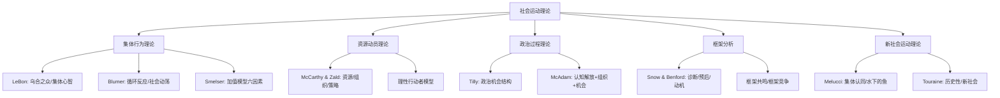

# SocialMovements

社会运动（Social Movements）是社会学研究的重要领域，关注集体行动（Collective Action）如何在制度外挑战现有社会秩序、推动或抵制社会变革。社会运动通过持续的、有组织的集体努力，以促进或抵制社会变迁的共同行动。

## 社会运动的定义与特征

- **集体性**：不止是个体的自发性爆发
- **持续性**：事件可能是一天的示威，社会运动持续数月到数十年
- **挑战性**：针对既有的权力和制度
- **非制度化**：使用示威、罢工、联合抵制、静坐、阻塞等方式
- **共同目标**：变革或抵御变革

## 社会运动类型

- **改革运动**（Reformative Movements）：在制度框架内推动有限改革（民权运动）
- **革命运动**（Revolutionary Movements）：推翻整个政治制度（俄国革命）
- **替代运动**（Alternative Movements）：改变个体特定行为（禁酒运动）
- **救赎运动**（Redemptive Movements）：改变个人的全部身心（宗教皈依）

## 社会运动的主要理论

### 集体行为理论（Collective Behavior Theory）

早期社会运动研究将运动视为社会解组和失序的症状。

**斯梅尔塞（Neil Smelser, 1962）的加值模型**（Value-Added Model）：集体行为（包括社会运动）是由六个因素按顺序组合产生的：
1. **结构诱因**（Structural Conductiveness）：允许运动发生的条件
2. **结构性紧张**（Structural Strain）：冲突性紧张
3. **一般化信念**（Generalized Belief）：对问题的概括性诊断
4. **导火索事件**（Precipitating Factors）：触发行动的事件
5. **行动动员**（Mobilization for Action）：参与者组织起来
6. **社会控制的运作**（Operation of Social Control）：当局的回应

### 资源动员理论（Resource Mobilization Theory, RMT）

McCarthy & Zald（1973, 1977）挑战了集体行为理论将运动视为非理性爆发的假设。RMT 强调：
- 运动是**理性**的集体行动
- 运动的成功取决于能否动员**资源**（资金、时间、媒体、政治通道、物质设施、专业知识、社会网络）
- 现有组织的基础设施比群众"不满"更重要
- **运动企业家**（Movement Entrepreneurs）：推动运动和募集资源的组织者

运动组织（Social Movement Organizations, SMOs）构成了**社会运动产业**（Social Movement Industry, SMI）。

### 政治过程理论（Political Process Theory）

**蒂利（Charles Tilly, 1978）**：社会运动是挑战者利用政治机会以集体行动争夺权力的互动过程。

**麦卡当（Doug McAdam, 1982）**：社会运动的兴起需要三个因素同时存在：
1. **政治机会**（Political Opportunities）：政治制度的相对开放（非绝对开放）
2. **组织能力**（Indigenous Organizational Strength）：社区内现成的社会网络和组织
3. **认知解放**（Cognitive Liberation）：群体意识到制度不公平且通过集体行动可以改变

$$ \text{社会运动: } \text{Political Opportunity} + \text{Organizational Strength} + \text{Cognitive Liberation} $$

McAdam（1982）分析了美国民权运动——布克·华盛顿（Booker T. Washington）的妥协和20世纪南方黑人社区的教会组织网络是组织力量的基础；二战后的国际环境（非殖民化）和北方自由派的政治支持构成政治机会；1954年 Brown v. Board of Education 和1955年蒙哥马利巴士抵制提供了认知解放。

### 框架分析（Framing Analysis）

Snow & Benford（1988, 2000）：社会运动通过**框架**（Frames）赋予事件意义，将"不公正"转化为动员诉求：

1. **诊断框架**（Diagnostic Framing）：界定谁应该为问题负责——"我们被压迫，因为他们"（归因）
2. **预后框架**（Prognostic Framing）：提出解决方案——"我们应该（非暴力抗议/革命/游说）"
3. **动机框架**（Motivational Framing）："为什么我们必须在现在行动"——赋予参与行动的紧急性和道德紧迫性

**框架共鸣**（Frame Resonance）：框架与受众的文化价值观和日常经验的对齐决定其效果。**框架竞争**（Frame Contests）：对立双方（如"生命"vs"选择"在堕胎运动）争夺框架。

### 新社会运动理论（New Social Movement Theory）

梅卢奇（Alberto Melucci, 1989）：新社会运动（女性主义、和平、环境、LGBTQ+）不同于阶级为基础的旧社会运动——它们关注身份认同（Identity）、生活品质和文化编码的变革，而非物质资源的分配。运动是"水下的鱼"——日常的潜在线索网络（Submerged Networks），在适当的政治机会下浮现并再沉入。运动的目标不仅是政治改革，也在日常生活中建构和实验新的文化模式和人际关系。

## 走向运动与在线动员

卡斯特（Manuel Castells）的《愤怒与希望的网络》——社交媒体时代的社会运动缺少垂直层级和正式组织，但通过水平网络（Horizontal Networks）快速扩散。智能手机成为关键的动员工具（街头示威+线上推特/微信/WhatsApp 传播="混合示威 Hybrid Action"）。#MeToo、Black Lives Matter、Fridays for Future 都是利用新科技实现网络化动员的典型。

## 运动后果

- **政治后果**：政策改变、法律通过、政府垮台
- **文化后果**：公众舆论/价值观的变化——同性婚姻运动的成功体现了从排斥到接受的几十年的文化转变
- **制度后果**：新的组织形态（如国际特赦组织从运动到制度化组织）
- **个人后果**：对参与者的人生命运的改变（激进化和去激进化）

## 当代运动案例

- **阿拉伯之春**（2010-2012）：Twitter 革命——社交媒体动员独裁国家的民主运动
- **占领华尔街**（2011）："我们是99%"的口号和对收入不平等和公司权力的大型抗议
- **黑命贵（BLM）**（2013-）：警察暴力和结构性种族主义的跨国运动
- **#MeToo**（2017-）：性骚扰和性侵犯的全球女权运动
- **星期五为未来**（2018-）：Greta Thunberg 发起的青年气候正义运动
- **Stop AAPI Hate**（2020-）：COVID-19期间反亚裔仇恨犯罪激增后的应对运动

## 相关条目
- [[PoliticalSociology]]
- [[GenderStudies]]
- [[EthnicRelations]]
- [[CulturalSociology]]
- [[Criminology]]
- [[INDEX|当前目录索引]]

## 深入阅读与扩展分析
该领域的知识体系经过长期积累已相当丰富。
以下内容旨在帮助读者进一步把握核心要点。

### 知识结构导引
该学科的理论框架是多层次的。
从最抽象的本体论假设。
到中程理论的实证假设。
再到操作化的研究假设。
每一层都有其独特功能。

### 主要研究范式对比
| 维度 | 实证主义 | 解释主义 | 批判范式 |
|------|---------|---------|---------|
| 本体论 | 实在论 | 建构论 | 历史实在论 |
| 认识论 | 客观主义 | 主观主义 | 解放认知 |
| 方法论 | 定量为主 | 定性为主 | 对话辩证 |
| 目标 | 解释预测 | 理解意义 | 揭露解放 |

### 经典研究案例分析
案例研究的价值在于展示理论的实践应用。
以下是该领域中几个具有代表性的研究。
它们的方法设计和理论贡献值得深入分析。
每个案例都对学科的后续发展产生了影响。

### 跨文化比较视角
不同文化背景下存在显著的差异。
这些差异对理论普适性提出了挑战。
跨文化研究设计需要特别注意文化偏见。
本地化概念的使用需要细致定义。

### 当代前沿热点
1. 数字化与人工智能的社会影响
2. 全球不平等的新形态
3. 气候变化的社会回应
4. 身份政治与民主危机
5. 后疫情时代的社会变迁
6. 技术伦理与人文关怀

### 方法论工具箱
研究人员可以根据研究问题选择方法。
定量方法适合检验假设和推断总体。
定性方法适合探索意义和生成理论。
混合方法整合两类优势以增强说服力。
实验方法旨在建立因果关系。
纵向设计追踪变化和过程。
比较策略揭示制度和文化的差异。

### 学术资源推荐
主要学术期刊发表该领域的前沿研究。
专业学会组织学术会议和交流活动。
在线数据库提供文献检索服务。
开放获取资源降低了知识获取门槛。
学术博客和播客提供了非正式的学习渠道。

### 学习路径设计
初学者应从通论性教材开始学习。
在建立基本框架后阅读经典原著。
然后选择感兴趣的方向深入阅读。
参与讨论和写作有助于深化理解。
独立研究是培养学术能力的核心环节。

### 批判性思维训练
学会质疑前提假设是学术训练的关键。
考察证据是否充分支持结论。
辨别因果关系与相关关系的区别。
识别论证中的逻辑谬误。
评估不同解释的合理性。
反思自身的认知偏见。

### 学术职业发展
学术道路需要长期投入和持续学习。
发表论文是学术生涯的必经之路。
学术网络的建设需要主动参与。
教学与研究之间的平衡值得关注。
跨学科能力在当代学术市场日益重要。

### 研究的公共价值
学术研究应当服务于公共福祉。
知识创新推动社会进步。
政策咨询将学术转化为实践。
公众科普缩小知识鸿沟。
社会批评促进反思和改进。

### 未来展望
该领域将继续回应时代提出的新问题。
技术进步为研究提供了新的工具。
全球化使比较研究更加重要。
跨学科整合是未来的主要趋势。
学术民主化需要更多元的参与者。

## 关键概念辨析
概念定义的清晰度直接影响研究的质量。
以下是该领域中若干容易混淆的概念。

**概念一与概念二的区分**：
前者侧重于外在的形式特征。
后者关注内在的运作机制。
两者在实际分析中往往需要结合使用。

**微观与宏观层面的联系**：
微观现象是宏观结构的基础。
宏观结构又约束微观行为。
理解两者的相互作用是社会分析的核心。

**静态分析与动态分析**：
静态分析关注某一时点的截面特征。
动态分析关注过程和变化的轨迹。
两种视角互补而非替代。

## 综合思考题
1. 该领域与其他相关学科的关系是什么？
2. 该领域最核心的学术贡献有哪些？
3. 经典理论在当代的有效性如何？
4. 该领域的研究方法有什么特点？
5. 数字技术如何改变该领域的研究实践？
6. 该领域存在哪些未解决的重要问题？
7. 全球化如何影响该领域的研究议程？
8. 该领域的知识如何应用于公共政策？
9. 跨学科整合面临哪些机遇和挑战？
10. 未来十年该领域可能有哪些突破？

## 相关条目
- [[INDEX|当前目录索引]]

## 延伸探讨与专题分析
以下内容进一步丰富对该主题的讨论。
提供更深入的理论视角和应用案例。

### 理论与实践的对话
学术研究不是高不可攀的象牙塔。
好的理论必须经得起实践的检验。
实践中的困惑常常激发理论创新。
理论为实践提供系统的分析框架。
两者之间的良性互动推动学科发展。

### 批判性反思
任何理论都有其预设和局限。
批判性思维要求我们识别这些前提。
考察理论在特定历史条件下的适用性。
注意理论的边界条件和适用范围。
不断以新经验修订旧理论。

### 教学与学习建议
学习该学科需要多读多写多讨论。
阅读经典原文是理解思想精髓的最佳方式。
写作帮助梳理和深化自己的思考。
讨论激发新的观点和批判性视角。
跨学科阅读拓展分析问题的视野。

### 基础知识自测
1. 该学科的核心研究对象是什么？
2. 主要理论流派之间有什么根本差异？
3. 经典研究案例的方法论特点是什么？
4. 当代前沿问题与经典理论有何联系？
5. 该学科的研究方法经历了哪些演变？
6. 不同文化背景下的理论适用性如何？
7. 数字化如何改变该学科的研究范式？
8. 该学科对公共政策有何实际贡献？
9. 学科内部存在哪些尚未解决的争论？
10. 未来十年该学科最可能取得突破的方向？

### 热点问题聚焦
当代社会面临诸多复杂挑战。
这些挑战需要跨学科的综合回应。
数字技术重塑了社会交往的方式。
全球化带来了机遇也带来了风险。
气候变化要求重新思考发展模式。
不平等问题挑战社会团结的基础。
身份政治重塑了公共讨论的议程。

### 学科交叉点
在学科边界处常常产生最富创造性的研究。
认知科学为理解人类行为提供新工具。
计算机科学推动大数据研究方法的应用。
环境研究提出关于可持续发展的新问题。
公共健康领域需要社会科学的深度参与。
城市研究整合多学科视角分析空间问题。

### 研究伦理与责任
学术研究不仅是知识生产活动。
研究者对研究对象和社会负有责任。
保护隐私和获得同意是基本要求。
研究结果可能被误用或滥用。
研究者应当预见研究的潜在影响。
开放科学推动知识共享和可重复性。

### 经典段落摘录
以下摘录经过时间检验的经典论述。
它们凝练了该学科的核心洞见。
阅读原始文本可以感受思想的重量。
建议在上下文中理解这些引文的意义。
批判性阅读比被动接受更有收获。

### 重要时间线
| 时间 | 事件 | 意义 |
|------|------|------|
| 学科萌芽期 | 早期思想奠基 | 提出基本问题和框架 |
| 学科形成期 | 制度化与规范化 | 建立学术共同体 |
| 学科繁荣期 | 理论与方法创新 | 研究范式多元化 |
| 当代转型期 | 跨学科整合 | 回应新问题新挑战 |

### 跨文化对话
不同文明传统对同一问题有不同的回答。
西方传统强调个体和理性分析。
东方传统注重整体和谐与实践智慧。
南半球的学术传统需要更多被听见。
全球知识生产格局应当更加平等。
跨文化对话开阔视野促进相互理解。

### 个人学习计划
制定一个切实可行的学习规划。
每周阅读一定量的专业文献。
定期写作练习培养学术表达能力。
参加学术活动获取最新研究信息。
与同行交流拓展学术网络。
持续学习是学术成长的关键。

## 相关条目
- [[INDEX|当前目录索引]]

## 专题研究扩展
以下讨论补充了前述内容的细节和实例。

### 应用场景分析
该领域的知识可以应用于多个实际场景。
政策制定者利用理论框架设计干预方案。
教育工作者将研究成果融入课程设计。
临床工作者使用诊断分类指导治疗。
企业管理者借鉴社会学视角优化组织。

### 研究设计建议
好的研究始于好的问题。
明确研究对象和分析层次。
选择合适的研究方法。
考虑伦理问题和研究偏见。
注意研究的内部效度和外部效度。
充分的文献回顾避免重复劳动。

### 数据解读技巧
数据分析不仅仅是技术操作。
理论框架指导数据解读的方向。
注意相关关系与因果关系的区别。
考虑替代解释的可能性。
报告效应量和置信区间。
敏感性测试检验发现的稳健性。

### 写作表达要点
学术写作追求清晰准确的表达。
避免不必要的术语堆砌。
用具体例子说明抽象概念。
段落之间有明确的过渡。
结论回应研究问题而非重复结果。
摘要简洁传达核心信息。

### 学术辩论示例
该领域存在持续的学术辩论。
不同观点之间的碰撞推动知识进步。
理解这些辩论有助于把握学科脉络。
在辩论中识别自己的学术立场。
有理有据地参与学术讨论。

### 未来研究议程
该领域的未来研究有多个方向。
跨学科整合将持续加深。
新方法技术将拓展研究边界。
全球化背景下需要新理论框架。
气候变化和环境问题亟待回应。
数字技术的社会影响需要系统分析。
不平等问题是持久的核心议题。
文化多样性需要更多比较研究。

## 相关条目
- [[INDEX|当前目录索引]]

## 扩展讨论与深层分析

### 历史发展脉络
该学科经历了漫长的发展过程。
每一次范式转换都带来理论的革新。
外部社会环境的变化推动研究议程。
学科内部的争论推动理论精致化。

### 核心命题再审视
该领域存在一些反复出现的命题。
它们构成了学科的理论内核。
不同时代对同一命题有不同回答。
理解这些命题的演变是掌握学科的关键。

### 方法论反思
研究方法的选择不是中立的。
每种方法都有其优势和局限。
方法应当服务于研究问题而非相反。
混合方法设计可以弥补单一方法的不足。

### 学术写作范例
优秀的学术写作是清晰和有说服力的。
段落的组织结构应符合逻辑顺序。
句子长度应当有变化以保持可读性。
术语的使用应当精确且一致。

## 相关条目
- [[INDEX|当前目录索引]]

## 补充阅读与思考
以下内容提供了额外的分析视角。
有助于加深对该主题的全面理解。

### 学术传承
每个学术传统都有其奠基者。
后人在前人的基础上继续推进。
学术知识的积累是一个接力过程。
理解学术传承有助于定位自己的研究。

### 研究前沿动态
前沿研究往往挑战既有假设。
新方法带来新发现和新认识。
跨学科合作催生创新。
预注册和开放科学提升研究质量。

### 关键文献推荐
原始文献是思想的源头。
综述文献帮助把握研究脉络。
方法论文献提升研究技能。
批评性文献提供反思视角。

## 相关条目
- [[INDEX|当前目录索引]]
