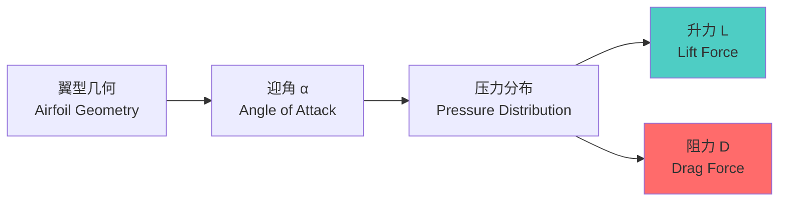
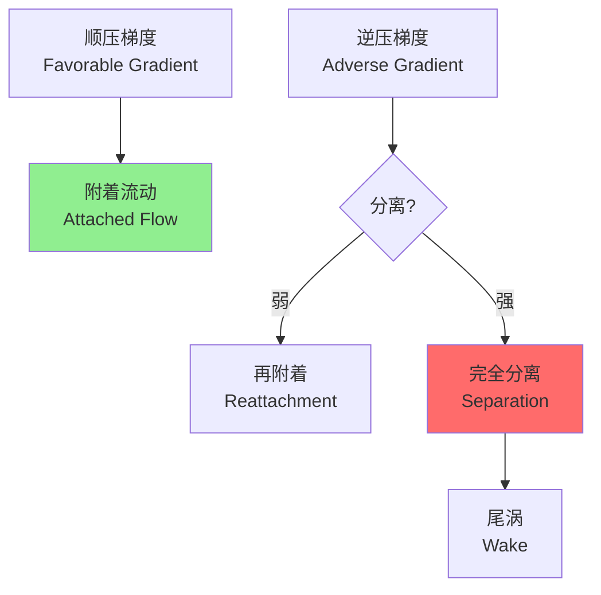
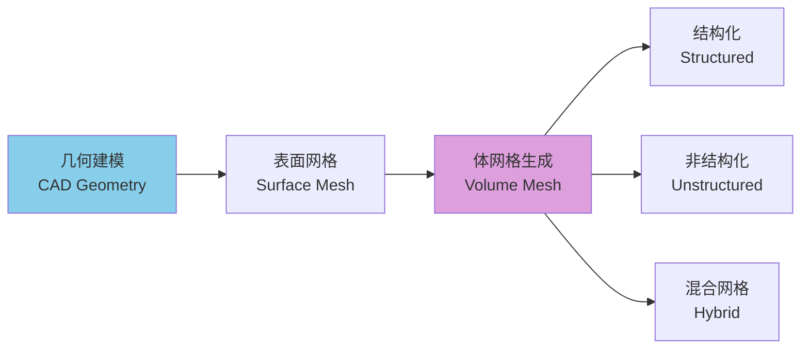

---
aliases:
  - Aerodynamics
  - Fluid Dynamics
  - Aerodynamic Forces
  - Computational Fluid Dynamics
tags:
created: 2026-05-17
updated: 2026-05-13
  - engineering
  - aerospace
  - fluid-mechanics
  - physics
  - CFD
  - aviation
---

# 空气动力学 (Aerodynamics)

## 概述 (Overview)

空气动力学（Aerodynamics）是研究空气或其他气体与运动物体之间相互作用规律的学科。它是航空航天工程（Aerospace Engineering）、汽车设计、风力发电等领域的核心理论基础。

## 流体力学基础 (Fundamentals of Fluid Dynamics)

### 连续介质假设 (Continuum Hypothesis)

空气动力学基于连续介质假设，将流体视为连续分布的物质。描述流体运动的基本方程组包括：

**连续性方程（Continuity Equation）**：

$$\frac{\partial \rho}{\partial t} + \nabla \cdot (\rho \mathbf{V}) = 0$$

**动量方程（Momentum Equation）——Navier-Stokes 方程**：

$$\rho \left(\frac{\partial \mathbf{V}}{\partial t} + \mathbf{V} \cdot \nabla \mathbf{V}\right) = -\nabla p + \mu \nabla^2 \mathbf{V} + \rho \mathbf{g}$$

**能量方程（Energy Equation）**：

$$\rho c_p \left(\frac{\partial T}{\partial t} + \mathbf{V} \cdot \nabla T\right) = \nabla \cdot (k \nabla T) + \Phi$$

其中 $\Phi$ 为黏性耗散函数。

### 雷诺数 (Reynolds Number)

雷诺数是判断流动状态的关键无量纲数：

$$Re = \frac{\rho V L}{\mu} = \frac{V L}{\nu}$$

| 流动状态 | 雷诺数范围 | 特征 |
|----------|------------|------|
| 层流（Laminar） | $Re < 5 \times 10^5$ | 流线规则，黏性主导 |
| 过渡流（Transitional） | $5 \times 10^5 < Re < 10^7$ | 流动不稳定 |
| 湍流（Turbulent） | $Re > 10^7$ | 脉动强烈，混合充分 |

## 空气动力 (Aerodynamic Forces)

### 升力 (Lift)

升力是垂直于来流方向的力，由压力差和黏性剪切共同产生。

**库塔-茹科夫斯基定理（Kutta-Joukowski Theorem）**：

$$L' = \rho_{\infty} V_{\infty} \Gamma$$

单位展长升力与环量 $\Gamma$ 成正比。

升力系数（Lift Coefficient）：

$$C_L = \frac{L}{\frac{1}{2} \rho V^2 S}$$

对于薄翼型，小迎角下的升力系数：

$$C_L = 2\pi \alpha$$

### 阻力 (Drag)

阻力是平行于来流方向的力，包括多个分量：

| 阻力类型 | 成因 | 减小方法 |
|----------|------|----------|
| 摩擦阻力（Skin Friction） | 边界层黏性剪切 | 层流化设计 |
| 压差阻力（Pressure Drag） | 边界层分离 | 流线型外形 |
| 诱导阻力（Induced Drag） | 三维翼尖涡 | 增大展弦比 |
| 波阻（Wave Drag） | 激波产生 | 超临界翼型 |

总阻力系数：

$$C_D = C_{D,0} + C_{D,i} = C_{D,0} + \frac{C_L^2}{\pi A \cdot e}$$

其中 $A$ 为展弦比，$e$ 为奥斯瓦尔德效率因子。

### 气动力矩 (Aerodynamic Moments)

绕三个轴的力矩：

- **滚转力矩（Rolling Moment）** $M_x$：绕纵轴
- **俯仰力矩（Pitching Moment）** $M_y$：绕横轴
- **偏航力矩（Yawing Moment）** $M_z$：绕立轴

俯仰力矩系数：

$$C_m = \frac{M_y}{\frac{1}{2} \rho V^2 S \bar{c}}$$

压力中心（Center of Pressure）位置：

$$x_{cp} = -\frac{C_m}{C_L} \cdot \bar{c}$$

## 边界层理论 (Boundary Layer Theory)

### 层流边界层 (Laminar Boundary Layer)

平板层流边界层厚度：

$$\delta(x) = \frac{5.0 x}{\sqrt{Re_x}}$$

壁面剪切应力：

$$\tau_w = 0.332 \frac{\rho U^2}{\sqrt{Re_x}}$$

### 湍流边界层 (Turbulent Boundary Layer)

湍流边界层更厚，但抗分离能力更强：

$$\delta(x) = \frac{0.37 x}{Re_x^{0.2}}$$

壁面摩擦速度：

$$u_{\tau} = \sqrt{\frac{\tau_w}{\rho}}$$

对数律速度分布：

$$\frac{u}{u_{\tau}} = \frac{1}{\kappa} \ln\left(\frac{y u_{\tau}}{\nu}\right) + B$$

其中 $\kappa \approx 0.41$ 为冯·卡门常数。

### 边界层分离 (Boundary Layer Separation)

分离条件（壁面速度梯度为零）：

$$\left(\frac{\partial u}{\partial y}\right)_{y=0} = 0$$

分离导致压差阻力急剧增加。

## 可压缩流动 (Compressible Flow)

### 马赫数效应 (Mach Number Effects)

马赫数定义为流速与当地音速之比：

$$Ma = \frac{V}{a} = \frac{V}{\sqrt{\gamma R T}}$$

对于空气，$\gamma = 1.4$，$R = 287 \, \text{J/(kg·K)}$。

| 马赫数范围 | 流动类型 | 特征 |
|------------|----------|------|
| $Ma < 0.3$ | 不可压缩 | 密度变化 < 5% |
| $0.3 < Ma < 0.8$ | 亚音速可压缩 | 局部可能达到音速 |
| $0.8 < Ma < 1.2$ | 跨音速 | 激波出现，阻力发散 |
| $1.2 < Ma < 5$ | 超音速 | 头部激波，膨胀波 |
| $Ma > 5$ | 高超音速 | 高温真实气体效应 |

### 激波理论 (Shock Wave Theory)

正激波（Normal Shock）前后关系：

$$\frac{p_2}{p_1} = 1 + \frac{2\gamma}{\gamma+1}(Ma_1^2 - 1)$$

$$\frac{T_2}{T_1} = \frac{\left[1 + \frac{\gamma-1}{2}Ma_1^2\right]\left[\frac{2\gamma}{\gamma-1}Ma_1^2 - 1\right]}{\left[\frac{(\gamma+1)^2}{2(\gamma-1)}\right]Ma_1^2}$$

总压损失：

$$\frac{p_{0,2}}{p_{0,1}} = \left[\frac{\frac{\gamma+1}{2}Ma_1^2}{1 + \frac{\gamma-1}{2}Ma_1^2}\right]^{\frac{\gamma}{\gamma-1}} \cdot \left[\frac{1}{\frac{2\gamma}{\gamma+1}Ma_1^2 - \frac{\gamma-1}{\gamma+1}}\right]^{\frac{1}{\gamma-1}}$$

### 普朗特-迈耶膨胀 (Prandtl-Meyer Expansion)

超音速绕外折角的膨胀流动，膨胀角：

$$\nu(Ma) = \sqrt{\frac{\gamma+1}{\gamma-1}} \arctan\sqrt{\frac{\gamma-1}{\gamma+1}(Ma^2 - 1)} - \arctan\sqrt{Ma^2 - 1}$$

## 计算流体力学 (CFD)

### 控制方程离散 (Discretization Methods)

| 方法 | 特点 | 适用 |
|------|------|------|
| 有限差分法（FDM） | 直接离散导数 | 结构化网格 |
| 有限体积法（FVM） | 守恒性好 | 复杂几何 |
| 有限元法（FEM） | 变分基础 | 结构耦合 |
| 谱方法（Spectral） | 高精度 | 简单几何 |

### 湍流模型 (Turbulence Models)

雷诺平均 Navier-Stokes（RANS）方法：

$$\frac{\partial \bar{u}_i}{\partial t} + \bar{u}_j \frac{\partial \bar{u}_i}{\partial x_j} = -\frac{1}{\rho} \frac{\partial \bar{p}}{\partial x_i} + \nu \frac{\partial^2 \bar{u}_i}{\partial x_j \partial x_j} - \frac{\partial \overline{u_i' u_j'}}{\partial x_j}$$

常用湍流模型：

- **k-ε模型**：标准 k-ε，RNG k-ε，Realizable k-ε
- **k-ω模型**：标准 k-ω，SST k-ω
- **雷诺应力模型（RSM）**：直接求解雷诺应力输运方程
- **大涡模拟（LES）**：直接求解大尺度涡，模型化小尺度涡

### 网格生成 (Mesh Generation)

边界层网格要求：

$$y^+ = \frac{y u_{\tau}}{\nu} < 1$$

对于壁面函数法：$30 < y^+ < 300$。

## 航空应用 (Aeronautical Applications)

### 翼型设计 (Airfoil Design)

现代翼型设计目标：

| 性能指标 | 设计方法 | 典型应用 |
|----------|----------|----------|
| 高升力 | 多段翼型、增升装置 | 运输机起飞着陆 |
| 低阻力 | 层流翼型、超临界翼型 | 巡航效率 |
| 超音速 | 双弧形、菱形翼型 | 战斗机、协和 |
| 适应性 | 变弯度、主动流动控制 | 未来飞机 |

### 飞机气动特性 (Aircraft Aerodynamics)

全机气动特性综合：

$$C_L = C_{L,\alpha}(\alpha - \alpha_0)$$

极曲线（Drag Polar）：

$$C_D = C_{D,0} + k C_L^2$$

最大升阻比：

$$(L/D)_{max} = \frac{1}{2\sqrt{k C_{D,0}}}$$

## 参考文献 (References)

1. Anderson, J. D. (2016). *Fundamentals of Aerodynamics* (6th ed.). McGraw-Hill.
2. White, F. M. (2006). *Viscous Fluid Flow* (3rd ed.). McGraw-Hill.
3. Ferziger, J. H., & Perić, M. (2002). *Computational Methods for Fluid Dynamics* (3rd ed.). Springer.
4. 朱自强. (2018). 《应用计算流体力学》. 北京航空航天大学出版社.

---

**相关概念**: [[Ballistics|弹道学]] | [[Naval Architecture|船舶设计]] | [[Fluid Dynamics|流体力学]] | [[CFD|计算流体力学]]
