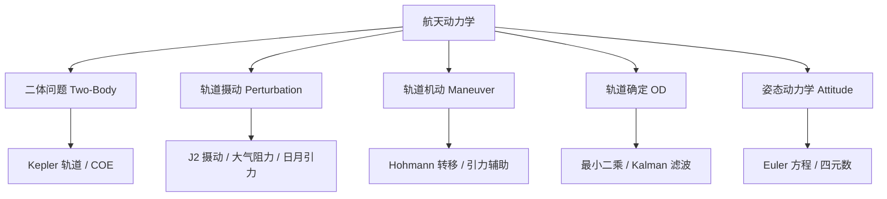

---
aliases: [Astrodynamics]
tags: ['04_EngineeringAndTechnology', 'AerospaceAndMilitaryEngineering', 'AerospaceEngineering']
---

# 航天动力学 (Astrodynamics)

## 一、概述

航天动力学 (Astrodynamics) 研究航天器在引力场中的运动规律和轨道操控技术。
它是航天工程的数学物理基础，应用包括卫星轨道设计、星际导航 (Interplanetary Navigation)、交会对接 (Rendezvous & Docking)、轨道机动 (Orbital Maneuver) 和深空探测 (Deep Space Exploration)。
核心理论基础为牛顿万有引力定律 (Newton's Law of Universal Gravitation) 和开普勒三大定律 (Kepler's Three Laws)。
航天动力学从二体问题 (Two-Body Problem) 出发，逐步引入摄动 (Perturbation)、多体效应 (N-Body Effect) 和轨道控制 (Orbital Control)，构成完整的轨道力学体系。
火箭方程 (Tsiolkovsky Rocket Equation) 和 Hohmann 转移轨道是航天动力学最基础的应用工具。

## 二、二体问题 (Two-Body Problem)

### 2.1 运动方程与守恒量

相对运动方程 (Relative Equation of Motion)：
$$\ddot{\mathbf{r}} + \frac{\mu}{r^3}\mathbf{r} = 0$$

引力参数 (Gravitational Parameter)：$\mu = G(M+m)$。
地球 $\mu_E = 398600.44$ km³/s²，太阳 $\mu_S = 1.327124\times10^{11}$ km³/s²。

**比机械能 (Specific Mechanical Energy)**：
$$\varepsilon = \frac{v^2}{2} - \frac{\mu}{r} = -\frac{\mu}{2a}$$

能量决定半长轴 $a$：$\varepsilon < 0$ (椭圆/圆轨道) = 0 (抛物线) > 0 (双曲线)。

**比角动量 (Specific Angular Momentum)**：
$$\mathbf{h} = \mathbf{r} \times \mathbf{v} = const$$

**Runge-Lenz 矢量 (拉普拉斯-龙格-楞次矢量)**：
$$\mathbf{e} = \frac{\mathbf{v}\times\mathbf{h}}{\mu} - \frac{\mathbf{r}}{r}$$

该矢量指向近地点 (Perigee) 方向，大小等于偏心率 $e$。

### 2.2 开普勒三大定律 (Kepler's Three Laws)

1. **椭圆轨道定律 (Law of Ellipses)**：$r = \frac{a(1-e^2)}{1+e\cos\nu}$
2. **面积定律 (Law of Equal Areas)**：$\dot{A} = h/2 = const$
3. **调和定律 (Harmonic Law)**：$\frac{T^2}{a^3} = \frac{4\pi^2}{\mu}$

### 2.3 轨道要素 (COE, Classical Orbital Elements)

| 要素 | 符号 | 范围 | 描述 |
|------|------|------|------|
| 半长轴 (Semi-Major Axis) | $a$ | $>0$ | 轨道大小 (决定轨道能量) |
| 偏心率 (Eccentricity) | $e$ | [0,∞) | 轨道形状 (0:圆, <1:椭圆, 1:抛物线, >1:双曲线) |
| 倾角 (Inclination) | $i$ | [0°,180°] | 轨道面与赤道面夹角 |
| 升交点赤经 (RAAN) | $\Omega$ | [0°,360°) | 升交点 (Ascending Node) 空间方位 |
| 近地点幅角 (Argument of Perigee) | $\omega$ | [0°,360°) | 近地点在轨道面内位置 |
| 真近点角 (True Anomaly) | $\nu$ | [0°,360°) | 航天器瞬时位置 |

**开普勒方程 (Kepler's Equation)**：
$$M = E - e\sin E$$

$M = n(t-t_0)$ 为平近点角 (Mean Anomaly)，$n = \sqrt{\mu/a^3}$ 为平均运动角速度 (Mean Motion)。

**偏近点角与真近点角关系**：
$$\tan\frac{\nu}{2} = \sqrt{\frac{1+e}{1-e}} \tan\frac{E}{2}$$

### 2.4 轨道速度 (Orbital Velocity)

圆轨道速度 (Circular Velocity, 第一宇宙速度)：$v_c = \sqrt{\mu/r} \approx 7.9$ km/s (LEO)

逃逸速度 (Escape Velocity, 第二宇宙速度)：$v_{esc} = \sqrt{2\mu/r} = \sqrt{2} v_c \approx 11.2$ km/s

抛物线轨道速度 (第三宇宙速度 ≈ 16.7 km/s，从地球逃逸太阳系，需借助地球公转速度)。

## 三、轨道摄动 (Orbital Perturbation)

### 3.1 $J_2$ 摄动 (地球扁率, Earth Oblateness)

地球非球形引力位展开的 $J_2$ 项 ($J_2 \approx 1.0826\times10^{-3}$) 是最大摄动源，比 $J_3$ 等高出三个数量级。

升交点赤经进动率 (RAAN Precession Rate)：
$$\dot{\Omega} = -\frac{3}{2}J_2\frac{R_E^2}{a^2(1-e^2)^2}n\cos i$$

近地点幅角进动率 (Argument of Perigee Precession)：
$$\dot{\omega} = \frac{3}{4}J_2\frac{R_E^2}{a^2(1-e^2)^2}n(5\cos^2 i - 1)$$

**太阳同步轨道 (Sun-Synchronous Orbit, SSO)**：选择倾角和高度使 $\dot{\Omega} = 0.9856^\circ$/day，使轨道面与太阳方向保持近似固定夹角。典型 SSO 倾角约 97°-98°。

### 3.2 其他摄动源

| 摄动 | 量级 (LEO) | 影响 |
|------|-----------|------|
| $J_2$ 扁率项 | 1-10°/day | $\Omega$, $\omega$ 长期漂移 (Secular Drift) |
| 大气阻力 (Atmospheric Drag) | 0.1-1 km/day | $a$ 衰减 (Decay)，限制轨道寿命 |
| 日月引力 (Lunar-Solar) | m/day 级 | 长期和周期项 |
| 太阳辐射压 (Solar Radiation) | m/day | 偏心率 $e$ 漂移 |
| 固体潮 (Solid Earth Tide) | cm/day | 小周期项 |

## 四、轨道类型

| 轨道 | 高度 (km) | 周期 | 用途 |
|------|-----------|------|------|
| LEO (Low Earth Orbit, 低地球轨道) | 200-2000 | 88-127 min | 遥感、ISS (国际空间站)、Starlink |
| MEO (Medium Earth Orbit, 中地球轨道) | ~20200 | 12h | GPS/Galileo 导航卫星 |
| GEO (Geostationary Orbit, 地球静止轨道) | 35786 | 24h | 通信卫星、气象卫星 |
| SSO (Sun-Synchronous, 太阳同步) | 500-900 | 95-103 min | 对地遥感 |
| Molniya (莫尔尼亚轨道, 大椭圆) | 500/40000 | 12h | 高纬度通信 |

**冻结轨道 (Frozen Orbit)**：$\dot{\omega}=0$，临界倾角 $63.4^\circ$ 或 $116.6^\circ$，用于地球遥感轨道。
**拉格朗日点 (Lagrange Points)**：日-地 L1 (SOHO, DSCOVR 太阳观测)、地-月 L1/L2 (门户站 Gateway)。

## 五、轨道机动 (Orbital Maneuver)

### 5.1 霍曼转移 (Hohmann Transfer)

两脉冲椭圆转移 (Two-Impulse Elliptical Transfer)，最经济的平面轨道转移方式 (最小 $\Delta v$)。

$$\Delta v_1 = \sqrt{\frac{\mu}{r_1}}\left(\sqrt{\frac{2r_2}{r_1+r_2}}-1\right)$$

$$\Delta v_2 = \sqrt{\frac{\mu}{r_2}}\left(1-\sqrt{\frac{2r_1}{r_1+r_2}}\right)$$

转移时间：$T = \pi \sqrt{\frac{(r_1+r_2)^3}{8\mu}}$

### 5.2 交会对接 (Rendezvous & Docking) — CW 方程

Clohessy-Wiltshire (CW) 方程描述追踪星 (Chaser) 相对目标星 (Target) 的线性化相对运动 (LVLH 坐标系)：

$$\ddot{x} - 3n^2 x - 2n\dot{y} = 0, \quad \ddot{y} + 2n\dot{x} = 0, \quad \ddot{z} + n^2 z = 0$$

$n$ 为目标星轨道角速度，$x$ 径向 (Radial, 地心方向)，$y$ 飞行方向 (Along-Track, 速度方向)，$z$ 法向 (Cross-Track, 轨道面法向)。

### 5.3 行星际飞行 (Interplanetary Flight)

**引力辅助 (Gravity Assist / Swing-by)**：
$$\Delta v = 2v_\infty \sin(\delta/2)$$

飞越行星 (Flyby) 通过行星引力场改变探测器速度和方向，无需消耗推进剂。水手 10 号 (Mariner 10)、旅行者号 (Voyager)、卡西尼号 (Cassini) 均使用此技术。

**发射窗口 (Launch Window)**：地球→火星约 26 个月一次。**Lambert 问题**：给定两点位置和转移时间，求解转移轨道。

## 六、轨道确定 (Orbit Determination, OD)

**最小二乘批处理 (Batch Least Squares)**：
$$\hat{\mathbf{x}} = (\mathbf{H}^T\mathbf{R}^{-1}\mathbf{H})^{-1}\mathbf{H}^T\mathbf{R}^{-1}\mathbf{y}$$

**卡尔曼滤波 (Kalman Filter)**：预测 (Predict)-更新 (Update) 递归 (Recursive)，序贯实时状态估计。
**EKF (Extended Kalman Filter, 扩展卡尔曼滤波)**：处理非线性动力学和观测方程。
**UKF (Unscented Kalman Filter, 无迹卡尔曼滤波)**：通过 sigma 点传播，避免雅可比矩阵计算，精度优于 EKF。

## 七、姿态动力学与控制 (Attitude Dynamics & Control)

**Euler 旋转方程 (Euler's Rotation Equation)**：
$$I\dot{\boldsymbol{\omega}} + \boldsymbol{\omega} \times (I\boldsymbol{\omega}) = \mathbf{T}$$

**姿态表示 (Attitude Representation)**：欧拉角 (Euler Angles,  Gimbal Lock 问题)、四元数 (Quaternion) $\mathbf{q}=[\cos(\theta/2),\mathbf{e}\sin(\theta/2)]^T$ (无奇异，连续姿态插值)。

**执行器 (Actuators)**：反作用飞轮 (Reaction Wheel, RW)、控制力矩陀螺 (Control Moment Gyro, CMG)、磁力矩器 (Magnetorquer)、推力器 (Thruster)。

## 八、星座设计 (Constellation Design)

**Walker 星座参数**：$i:T/P/F$ (倾角:卫星总数/轨道面数/相位因子)。Iridium (86.4°:66/6/1)、GPS (55°:31/6/1)、Starlink (53°:~4400/72/...)。

**轨道寿命 (Orbital Lifetime)**：大气阻力衰减，弹道系数 (Ballistic Coefficient) $\beta = m/(C_D A)$ 决定衰减率。
**碰撞规避 (Collision Avoidance)**：Space-Track 编目 (Catalog)，碰撞概率 $>10^{-4}$ 时执行规避机动。

## 相关条目

- [[AircraftDesign]]
- [[PropulsionSystems]]
- [[04_EngineeringAndTechnology/AerospaceAndMilitaryEngineering/AerospaceEngineering/INDEX]]

## 九、深空探测轨道设计 (Deep Space Trajectory Design)

### 9.1 行星际转移 (Interplanetary Transfer)

**Lambert 问题 (Lambert's Problem)**：给定两个位置矢量 $\mathbf{r}_1$、$\mathbf{r}_2$ 和转移时间 $\Delta t$，求解连接轨道。
 \Delta t = \sqrt{\frac{a^3}{\mu}} \left[ (E_2 - E_1) - e(\sin E_2 - \sin E_1) \right] 

**圆锥曲线拼接法 (Patched Conic Approximation)**：将行星际轨道分为三段——地球出发段 (Departure Hyperbola)、日心转移段 (Heliocentric Transfer)、目标星球捕获段 (Arrival Hyperbola)。
各段入口速度 (Excess Velocity) 为：
 v_{\infty} = \sqrt{v_{sc}^2 + v_{pl}^2 - 2 v_{sc} v_{pl} \cos \phi} 

### 9.2 引力辅助 (Gravity Assist)

**Oberth 效应 (Oberth Effect)**：在深引力势阱深处执行机动，可获得更大 $\Delta v$ 收益。
 \Delta E = \frac{1}{2}m\left[(v + \Delta v)^2 - v^2\right] = m v \Delta v + \frac{1}{2}m(\Delta v)^2 

木星引力辅助常用于外行星探测 (Cassini、New Horizons)。
**V_infinity Leveraging (VILT)**：通过多次引力辅助逐步提高日心轨道能量。

### 9.3 小推力轨道 (Low-Thrust Trajectory)

电推进连续推力轨道优化采用**间接法 (Indirect Method, 庞特里亚金极小值原理)** 或**直接法 (Direct Method, 配点法)**。
 \min J = \int_{t_0}^{t_f} \frac{T}{I_{sp} g_0} dt \quad \text{s.t.} \quad \dot{\mathbf{r}} = \mathbf{v}, \quad \dot{\mathbf{v}} = -\frac{\mu}{r^3}\mathbf{r} + \frac{\mathbf{T}}{m}, \quad \dot{m} = -\frac{T}{I_{sp} g_0} 

**推力矢量方向 (Thrust Steering Angle)** 为优化变量。

### 9.4 多目标优化 (Multi-Objective Trajectory)

**Pareto 前沿 (Pareto Front)**：$\Delta v$ vs 转移时间的权衡。Pareto 最优解集中无法同时改进两个指标。
常用算法：NSGA-II (Non-dominated Sorting Genetic Algorithm II)、MOPSO (Multi-Objective Particle Swarm Optimization)。

## 十、编队飞行 (Formation Flying)

### 10.1 相对运动控制

**Hill-Clohessy-Wiltshire 方程**用于编队重构 (Reconfiguration) 和队形保持 (Formation Keeping)。
 \Delta \mathbf{v} = \mathbf{K} (\mathbf{x}_{des} - \mathbf{x}_{act}) 

**J_2 不变轨道 (J_2-Invariant Orbits)**：利用 J_2 摄动使编队自然保持稳定，减少燃料消耗。
条件：$\Delta a = 0$，$\Delta e$ 和 $\Delta i$ 满足特定关系。

### 10.2 自主交会 (Autonomous Rendezvous)

**相对导航 (Relative Navigation)**：载波相位差分 GPS (CDGPS, Carrier-phase Differential GPS)、激光雷达 (LIDAR)、视觉相机。
**接近策略 (Approach Strategy)**：V-bar (速度方向) 或 R-bar (径向) 接近。
**碰撞避免 (Collision Avoidance)**：被动安全轨迹 (Passively Safe Trajectory) 设计，发动机失效时自动远离目标。

## 十一、轨道碎片与减缓 (Orbital Debris & Mitigation)

### 11.1 碎片环境现状

**Kessler 综合征 (Kessler Syndrome)**：碎片链式碰撞效应，可能导致轨道不可用 (Accessibility Problem)。
**尺寸分布 (Size Distribution)**：>10 cm 可编目 ~4 万，1-10 cm ~100 万，<1 cm ~1.3 亿。

| 碎片源 | 占比 | 典型事件 |
|--------|------|---------|
| 火箭上面级 (Rocket Body) | ~30% | 爆炸解体 (Explosion Fragmentation) |
| 任务碎片 (Mission Debris) | ~25% | 螺栓、相机盖等丢弃物 |
| 碰撞碎片 (Collision) | ~20% | Iridium-Cosmos 2009 碰撞 |
| 失效卫星 (Derelict Satellite) | ~15% | 电池爆炸、推进剂泄漏 |
| 固体火箭熔渣 (Alumina Slag) | ~5% | SRM 燃烧产物 |

### 11.2 减缓措施 (Mitigation Measures)

**25 年退役规则 (25-Year Rule)**：LEO 卫星任务结束后应在 25 年内再入 (Reentry)。
**钝化操作 (Passivation)**：排放剩余推进剂 (Propellant Dumping)、泄放电池、释放压力容器。
**受控再入 (Controlled Reentry)**：推进器推动卫星进入南太平洋无人区 (航天器坟场, Point Nemo)。
**主动碎片清除 (ADR, Active Debris Removal)**：机械臂抓捕、鱼叉 (Harpoon)、激光烧蚀、电动力缆绳 (EDT, Electrodynamic Tether)。

### 11.3 碰撞预警与规避

联合太空作战中心 (JSpOC, Joint Space Operations Center) 发布合点预警 (Conjunction Warning)。
**碰撞概率 (Collision Probability, PC)** 计算：当  > 10^{-4}$ 执行规避机动。
避碰策略：沿速度方向 (+V) 推高轨道，增加交会高度差。

## 十二、轨道自主导航 (Autonomous Navigation)

### 12.1 天文导航 (Celestial Navigation)

**UV 敏感器 (Ultraviolet Sensor)**：恒星位置测量，确定姿态。
**X 射线脉冲星导航 (XNAV, X-ray Pulsar Navigation)**：利用脉冲星 (Pulsar) 精确计时信号进行自主定位。
 \delta t_{obs} = \frac{\mathbf{n} \cdot \mathbf{r}}{c} + \text{relativistic corrections} 

### 12.2 自主轨道确定 (Autonomous OD)

**GPS 接收机**：LEO 卫星利用 GPS 星座实现实时自主定轨 (精度 10 m 级)。
**星载滤波器 (Onboard Filter)**：UKF (Unscented Kalman Filter) 和 SR-UKF (Square Root UKF) 提供数值稳定性。

## 十三、天体力学基础 (Celestial Mechanics)

### 13.1 N体问题 (N-Body Problem)

N体问题无通用解析解。 \geq 3$ 时只能数值积分 (Numerical Integration)。
常用积分器：Runge-Kutta 4/5 (RKF45)、Adams-Bashforth-Moulton (多步法)、Symplectic Integrator (辛积分, 保能量)。

**圆型限制性三体问题 (CRTBP, Circular Restricted Three-Body Problem)**：
 \ddot{x} - 2\dot{y} = \frac{\partial U}{\partial x}, \quad \ddot{y} + 2\dot{x} = \frac{\partial U}{\partial y}, \quad \ddot{z} = \frac{\partial U}{\partial z} 

 = \frac{1}{2}(x^2 + y^2) + \frac{1-\mu}{r_1} + \frac{\mu}{r_2}$ 为有效势 (Pseudo-Potential)。
**Jacobi 常数 (Jacobi Constant)**  = 2U - (\dot{x}^2 + \dot{y}^2 + \dot{z}^2)$ 为运动不变量。

### 13.2 拉格朗日点 (Lagrange Points)

**共线点 (Collinear Points)** L1、L2、L3 不稳定，位于两大天体连线上。
**三角点 (Triangular Points)** L4、L5 稳定 (当质量比 $\mu < 0.0385$)，与两大天体构成等边三角形。

**晕轨道 (Halo Orbit)**：绕 L1/L2 点的周期三维轨道。日地 L1 用于太阳观测 (SOHO)，地月 L2 用于深空通信中继 (Queqiao 鹊桥)。
**Lissajous 轨道 (Lissajous Orbit)**：振幅不等的拟周期轨道 (Quasi-Periodic Orbit)。

### 13.3 逃逸与捕获 (Escape & Capture)

**弹弓效应原理**：航天器在行星引力场内能量的增减由飞越几何决定。
**永久捕获 (Permanent Capture)**：需要通过大气制动 (Aerobraking)、引力辅助减速或推进制动实现。
**大气捕获 (Aerocapture)**：一次性穿越行星大气层将双曲线轨道降为椭圆轨道，大幅减少推进剂消耗。

## 十四、定轨与编目 (Orbit Determination & Cataloging)

### 14.1 观测手段

| 手段 | 精度 | 覆盖范围 | 典型系统 |
|------|------|---------|---------|
| 单站测距 (Ranging) | 1-10 m | 单点 | 激光测距 SLR (Satellite Laser Ranging) |
| 距离变化率 (Range Rate) | 0.1 mm/s | 单点 | DORIS (Doppler Orbitography) |
| 多站干涉 (VLBI) | 1-10 nrad | 深空 | NASA DSN, ESA ESTRACK |
| 光学跟踪 (Optical) | 角秒级 | 天区扫描 | GEODSS (地基深空光电系统) |
| 雷达 (Radar) | 10-100 m | LEO | FPS-85 (Eglin), Haystack |

### 14.2 轨道编目 (Space Catalog)

**TLE (Two-Line Element, 双行根数)** 格式：北美防空司令部 (NORAD) 标准格式。
**SGP4/SDP4 传播器 (Propagator)**：基于 TLE 简化的轨道预报算法，精度 ~1-10 km/day。
空间交通安全：Space-Track.org 公开发布合点预警。

## 十五、航天任务设计案例

### 15.1 地球同步轨道卫星入轨

GTO (Geostationary Transfer Orbit, 地球同步转移轨道) → GEO (地球静止轨道)。
典型流程：
1. 上面级 (Upper Stage) 将卫星送入 GTO (近地点 200 km, 远地点 35786 km)
2. 卫星自身液体远地点发动机 (LAE, Liquid Apogee Engine) 多次点火圆化轨道
3. 最终定点到目标经度位置 (Station Acquisition)

### 15.2 火星探测任务

| 任务 | 发射窗口 | 转移时间 | 入轨方式 | 科学目标 |
|------|---------|---------|---------|---------|
| Tianwen-1 (天问一号) | 2020.07 | 7 个月 | 捕获制动+气动减速 | 环火遥感+巡视 |
| Perseverance (毅力号) | 2020.07 | 7 个月 | 气动减速+天空起重机 | 样品缓存+微生物探测 |
| Mars Sample Return | 2028+ | 1-2 年 | 多任务联合 | 样品返回地球 |

## 十六、轨道力学数值方法

### 16.1 数值积分器选择

| 积分器 | 阶数 | 特点 | 适用场景 |
|--------|------|------|---------|
| Runge-Kutta 4/5 (RKF45) | 4/5 | 自适应步长，简单可靠 | 一般轨道传播 |
| Runge-Kutta-Nystrom (RKN) | 4/6 | 直接积分二阶ODE | 无摄动轨道 |
| Adams-Bashforth-Moulton (ABM) | 12阶 | 多步法，效率高 | 长期轨道预报 |
| Gauss-Jackson (GJ) | 8-14阶 | 辛/保能量 | 高精度轨道 |
| Dormand-Prince (DP8(7)) | 8/7 | 高精度，8阶嵌入7阶 | 深空轨道 |

**变步长策略 (Variable Step Size)**：控制每步局部截断误差 (Local Truncation Error, LTE)。
 h_{new} = h_{old} \cdot \min\left(5, \max\left(0.1, 0.9\left(\frac{\varepsilon}{|LTE|}\right)^{1/(p+1)}\right)\right) 

### 16.2 摄动加速度模型

除了 J2 之外，高阶摄动项包括 J3 (梨形项)、J4、J22 (椭球项) 等。
**大气阻力模型**：NRLMSISE-00、JB2008 (密度随太阳活动 F10.7 和地磁指数 Ap 变化)。
**第三体摄动**：日月位置由 JPL DE 历表 (Ephemeris) 提供，精度亚角秒级。
**太阳辐射压 (SRP) 模型**：$ \mathbf{a}_{SRP} = -\frac{C_R P_{\odot} A}{m} \frac{\mathbf{r}_{sun}}{|\mathbf{r}_{sun}|^3} \cdot AU^2 $

### 16.3 轨道预报误差分析

初始状态误差 $\delta \mathbf{x}_0$ 通过状态转移矩阵 (STM, State Transition Matrix) 传播：
 \delta \mathbf{x}(t) = \Phi(t, t_0) \delta \mathbf{x}_0 

协方差传播 (Covariance Propagation)：
 \mathbf{P}(t) = \Phi(t, t_0) \mathbf{P}_0 \Phi(t, t_0)^T + \mathbf{Q}(t) 

$\mathbf{Q}$ 为过程噪声协方差矩阵，反映未建模摄动的影响。
