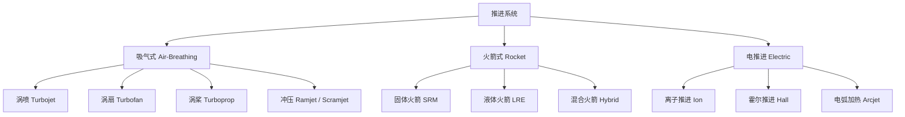

---
aliases: [PropulsionSystems]
tags: ['04_EngineeringAndTechnology', 'AerospaceAndMilitaryEngineering', 'AerospaceEngineering']
---

# 推进系统 (Propulsion Systems)

## 一、概述

推进系统 (Propulsion Systems) 通过将工质 (Propellant / Working Fluid) 加速向后排出，利用牛顿第三定律 (Newton's Third Law) 产生向前推力 (Thrust)。
按工作环境和工质类型可分为航空发动机（吸气式, Air-Breathing，使用大气中的氧气）和火箭发动机（自备氧化剂, Self-Contained Oxidizer），以及电推进 (Electric Propulsion) 等新型推进方式。
推进系统是航空航天器的核心，决定了飞行器的速度、航程 (Range) 和有效载荷能力 (Payload Capacity)。
推进技术的发展推动了超声速飞行 (Supersonic Flight)、太空探索 (Space Exploration) 和深空探测 (Deep Space Exploration) 的进步。
推力量级覆盖从微牛级 (µN, 电推进姿控) 到兆牛级 (MN, 重型运载火箭)。

## 二、推进系统分类

## 三、核心性能参数

### 3.1 推力 (Thrust)

通用推力方程 (General Thrust Equation)：
$$F = \dot{m} v_e + (p_e - p_0) A_e$$

完全膨胀 (Perfect Expansion, $p_e = p_0$) 时简化为：$F = \dot{m} v_e$。

$\dot{m}$ 为质量流率 (Mass Flow Rate, kg/s)，$v_e$ 为排气速度 (Exhaust Velocity, m/s)，$p_e$ 为出口压力 (Exit Pressure)，$p_0$ 为环境压力 (Ambient Pressure)，$A_e$ 为出口面积 (Exit Area)。

### 3.2 比冲 (Specific Impulse, $I_{sp}$)

$$I_{sp} = \frac{F}{\dot{m} g_0} = \frac{v_e}{g_0} \ (\text{s})$$

$g_0 = 9.80665$ m/s²。比冲越高，推进剂利用效率越高。比冲只取决于排气速度，与推力大小无关。

| 发动机类型 | $I_{sp}$ (s) | 推重比 (T/W) | 典型应用 |
|-----------|-------------|--------|---------|
| 固体火箭 SRM | 250-300 | 50-100:1 | 助推器 (Booster)、导弹 |
| 液体火箭 (泵压) | 300-450 | 40-100:1 | 运载火箭 (Launch Vehicle) |
| 液体火箭 (挤压) | 280-320 | 5-15:1 | 姿控推进器 |
| 涡喷 Turbojet | 3000-5000 (等效) | 5-10:1 | 战斗机 |
| 涡扇 Turbofan | 5000-12000 (等效) | 3-8:1 | 民航客机 |
| 涡桨 Turboprop | 2500-4000 (等效) | 2-5:1 | 支线飞机 |
| 冲压 Ramjet | 800-1500 | 2-5:1 | 超声速导弹 |
| 霍尔推进 Hall | 1500-3000 | 0.001-0.01:1 | 卫星姿控/轨道保持 |
| 离子推进 Ion | 3000-5000 | 0.0001-0.001:1 | 深空探测 |

### 3.3 火箭方程 (Tsiolkovsky Rocket Equation, 齐奥尔科夫斯基公式)

$$\Delta v = v_e \ln\left(\frac{m_0}{m_f}\right) = I_{sp} g_0 \ln\left(\frac{m_0}{m_f}\right)$$

质量比 (Mass Ratio)：$\frac{m_f}{m_0} = e^{-\Delta v / (I_{sp} g_0)}$

**分级火箭 (Multistage Rocket)**：每级分离丢弃死重 (Dead Weight)，提高有效载荷比 (Payload Fraction)。
双级入轨 (Two-Stage to Orbit, TSTO) 有效载荷比约为单级 (SSTO) 的 2-3 倍。
以 Saturn V 为例，三级 ~3000 吨起飞重量将 50 吨有效载荷送往月球。

### 3.4 比推力与推重比

比推力 (Specific Thrust) $F/\dot{m}$ 反映推进剂利用效率 (与 $I_{sp}$ 等价)。
推重比 $F/W_{engine}$ 反映发动机结构紧凑性。
两者通常不可兼得——高比冲电推进推重比极低 (0.0001-0.01:1)。

## 四、燃气涡轮发动机 (Gas Turbine Engine)

### 4.1 Brayton 循环 (布雷顿循环)

理想 Brayton 循环四个过程：
1→2 等熵压缩 (Isentropic Compression)
2→3 等压燃烧 (Isobaric Combustion)
3→4 等熵膨胀 (Isentropic Expansion)
4→1 等压排气 (Isobaric Exhaust)

热效率：$\eta_B = 1 - \frac{1}{r_p^{(\gamma-1)/\gamma}}$

$r_p$ 为增压比 (Pressure Ratio)。现代高涵道比涡扇 $r_p \approx 40-60$，$\eta_B \approx 55\%-65\%$。
增加涡轮前温度 (Turbine Inlet Temperature, TIT) 可进一步提高循环效率 (现代发动机 TIT ≈ 1700-2000K)。

### 4.2 涡扇发动机 (Turbofan)

**涵道比 (Bypass Ratio, BPR)**：$BPR = \dot{m}_{fan} / \dot{m}_{core}$
- 高 BPR (5-12)：推进效率高、噪声低，用于民航客机 (GE90 BPR≈9, 最大推力 115,000 lbf)
- 低 BPR (0.3-1.0)：适合超声速巡航，用于战斗机 (F-119 BPR≈0.3, F-135 BPR≈0.57)

推进效率 (Propulsive Efficiency)：$\eta_p = \frac{2}{1 + v_e/v_0}$
总效率 (Overall Efficiency)：$\eta_0 = \eta_{thermal} \cdot \eta_{propulsive}$

### 4.3 主要部件

| 部件 | 功能 | 性能参数 |
|------|------|---------|
| 风扇 (Fan) | 产生主要推力 (涡扇) | 增压比 1.4-1.8 |
| 压气机 (Compressor) | 多级压缩空气 | 总增压比 25-60:1 |
| 燃烧室 (Combustor) | 燃油燃烧加热空气 | 出口温度 1400-2000K |
| 涡轮 (Turbine) | 膨胀做功驱动压气机+风扇 | 入口温度 1200-1700K |
| 尾喷管 (Nozzle) | 加速排气产生推力 | 收敛型/收敛扩散型 (CD Nozzle) |

**涡轮叶片冷却 (Turbine Blade Cooling)**：内部气膜冷却 (Internal Film Cooling) + 热障涂层 (TBC, Thermal Barrier Coating, YSZ 氧化钇稳定氧化锆)，材料为单晶镍基高温合金 (Single Crystal Ni-based Superalloy)。

### 4.4 航空燃料

Jet A/A-1 (航空煤油)：热值 43 MJ/kg，冰点 -47°C (Jet A-1)，闪点 > 38°C。

**SAF (Sustainable Aviation Fuel, 可持续航空燃料)**：HEFA (Hydroprocessed Esters and Fatty Acids, 加氢处理酯和脂肪酸)、ATJ (Alcohol-to-Jet, 醇制航油)、FT (Fischer-Tropsch, 费托合成)。碳减排 60%-80%，可在现有发动机中与 Jet A 混用 (目前限 50%)。

## 五、火箭发动机 (Rocket Engine)

### 5.1 液体火箭 (Liquid Rocket Engine, LRE)

| 推进剂组合 | 真空 $I_{sp}$ (s) | 密度比冲 | 典型发动机 |
|-----------|------------------|---------|-----------|
| LOX/RP-1 (煤油) | 338 | 高 (密度高) | RD-180 (Atlas V), Merlin (Falcon 9) |
| LOX/LH₂ (液氢/液氧) | 455 | 低 (密度极低) | RS-25 (SSME), RL-10 (Centaur) |
| NTO/UDMH (肼类/四氧化二氮) | 325 | 中 | YF-20 (长征系列) |
| LOX/CH₄ (液氧/甲烷) | 370 | 中 | Raptor (Starship), BE-4 (New Glenn) |

**推力室设计**：喷注器 (Injector, 同轴涡流/平板) → 燃烧室 ($L^*$ 特征长度 0.5-1.5m) → 喷管 (钟形/塞式/拉伸)。
**涡轮泵 (Turbopump)**：泵压式供压，预压泵 (Inducer) + 主泵 (Main Pump) + 涡轮 (Turbine)。轴功率 $P = \frac{\Delta p \cdot Q}{\eta}$。

### 5.2 固体火箭 (Solid Rocket Motor, SRM)

配方：AP (Ammonium Perchlorate, 高氯酸铵) 为氧化剂 (~70%)、HTPB (Hydroxyl-Terminated Polybutadiene, 端羟基聚丁二烯) 为燃料+粘合剂 (~12%)、Al 粉提高比冲 (~18%)。
燃速 (Vieille's Law, 维耶尔定律)：$r = a \cdot p_c^n$，$n$ 为燃速压力指数 (0.3-0.6)。
药柱设计 (Grain Design, 星形/轮形/管形) 决定推力-时间曲线。

### 5.3 电推进 (Electric Propulsion)

| 类型 | 原理 | $I_{sp}$ (s) | 推力 | 效率 |
|------|------|-------------|------|------|
| 离子推进 (Ion Thruster) | 静电加速 (Electrostatic) | 3000-5000 | 0.1-500mN | 60-80% |
| 霍尔推进 (Hall Thruster) | E×B 加速 | 1500-3000 | 1-1000mN | 40-60% |
| 电弧加热 (Arcjet) | 电弧加热工质 | 500-1000 | 100-500mN | 30-50% |
| PPT (脉冲等离子体) | 电磁加速 | 500-1500 | 0.1-10mN | 5-15% |

## 六、先进推进概念

| 概念 | 原理 | 理论 $I_{sp}$ | 现状 |
|------|------|-------------|------|
| 核热推进 NTP | 核反应堆加热 H₂ 推进剂 | 800-1000s | 地面试验 (NERVA 1960s) |
| 核电推进 NEP | 核反应堆发电 + 电推进 | 3000-5000s | 概念研究 |
| 太阳帆 (Solar Sail) | 太阳光压 (Radiation Pressure) | 无限 (无需推进剂) | IKAROS (JAXA), LightSail |
| VASIMR (可变比冲磁等离子体) | 射频加热 + 磁喷嘴加速 | 3000-30000s | 地面试验 |
| 聚变推进 (Fusion Propulsion) | 核聚变产能 | 10万-100万s | 理论阶段 |

## 七、喷管设计与冷却

最优膨胀比 (Optimum Expansion Ratio) $\varepsilon = A_e/A_t$ 使 $p_e = p_a$ (环境压力)。

$$\frac{A}{A_t} = \frac{1}{M}\left[\frac{2}{\gamma+1}\left(1+\frac{\gamma-1}{2}M^2\right)\right]^{\frac{\gamma+1}{2(\gamma-1)}}$$

**冷却方式**：再生冷却 (Regenerative Cooling, 推进剂流经燃烧室壁冷却通道)、膜冷却 (Film Cooling, 冷却剂形成壁面保护膜)、辐射冷却 (Radiation Cooling, 耐高温材料辐射散热)、烧蚀冷却 (Ablative Cooling, 材料烧蚀吸热)。

## 八、推进系统试验

**地面试验 (Ground Test)**：高空模拟台 (Altitude Simulator, 真空舱 + 排气引射器)。参数测量：推力 (测力台架, Thrust Stand)、推进剂流量 (Mass Flow Rate)、压力、温度、振动。
**涡轮泵试验**：介质试验 (水/液氮模拟) → 推进剂热试车 (Hot Fire Test)。
**飞行试验 (Flight Test)**：上面级 (Upper Stage) 滑行段零重力点火验证。
**试车安全**：推进剂泄漏检测 (Leak Detection, 氢火焰探测器/声发射)、防爆设计、远程控制、紧急关机 (Emergency Shutdown) 系统。

## 相关条目

- [[AircraftDesign]]
- [[04_EngineeringAndTechnology/AerospaceAndMilitaryEngineering/AerospaceEngineering/INDEX]]

## 九、推进系统设计流程

### 9.1 设计参数选择

**推力-重量比 (T/W) 选取**：战斗机 /W \approx 1.0-1.2$，客机 /W \approx 0.25-0.35$。
**涵道比 (BPR) 选取**：远程宽体机 BPR 9-12，中短程窄体机 BPR 5-6，超音速战斗机 BPR 0.3-0.6。

由任务剖面 (Mission Profile) 确定推力需求：
 F_{req} = \frac{W}{L/D} + W\sin\theta + m\frac{dV}{dt} 

$\theta$ 为航迹角 (Flight Path Angle)。起飞推力需满足第 2 段爬升梯度 (Second Segment Climb Gradient, FAR Part 25：$\geq 2.4\%$ 双发，$\geq 2.7\%$ 四发)。

### 9.2 循环参数优化 (Cycle Optimization)

**涡轮进口温度 (TIT)** 提高可增加推力和效率，但受叶片材料限制 (单晶镍基高温合金 TIT 上限 ~2000K)。
**增压比 (OPR, Overall Pressure Ratio)** 提高使循环效率增加，但增加压气机级数和重量。
**冷却空气流量**：从压气机级间引出冷却空气 (~15-25%)，降低涡轮叶片温度。

**参数循环分析 (Parametric Cycle Analysis, PCA)**：$\left.\begin{matrix} F \\ \dot{m}_0 \\ I_{sp} \\ SFC \end{matrix}\right\} = f(\pi_c, TIT, BPR, M_0, h)$

**性能循环分析 (Performance Cycle Analysis)**：在给定部件特性图上求解共同工作线 (Running Line)。

## 十、推进系统测试与验证

### 10.1 部件级试验

| 部件 | 试验类型 | 考核指标 |
|------|---------|---------|
| 压气机 | 气动性能试验 (Rig Test) | 流量-压比特性、喘振边界 (Surge Margin $\geq 15\%$) |
| 燃烧室 | 燃烧效率试验 | $\eta_b \geq 99\%$、出口温度分布因子 (OTDF, $\leq 0.15$) |
| 涡轮 | 冷却效果试验 | 冷却效率 $\eta_c = (T_g - T_b)/(T_g - T_c)$ |
| 喷管 | 流量系数标定 |  \geq 0.97$ |

**结构完整性试验**：轮盘超转 (Overspeed, 120% N_max)、叶片疲劳 (High Cycle/Low Cycle Fatigue)、机匣包容性 (Containment, 叶片断裂不穿透)。

### 10.2 整机试验

**海平面台架试车 (Sea Level Test Bed)**：标准大气条件，测量推力、耗油率、排气温度 (EGT)。
**高空模拟试车台 (Altitude Test Facility, ATF)**：抽真空至 0.2-0.5 atm，模拟 10-20 km 高度。
**结冰试验 (Icing Test)**：进气口喷射过冷水滴，验证防冰系统有效性。
**畸变试验 (Distortion Test)**：进气畸变网格 (Inlet Flow Distortion Grid) 模拟飞机机动和大攻角进气畸变。

**持久试验 (Endurance Test)**：150 h 等效循环 (Equivalent Cyclic Life)，含起飞、巡航、着陆各工况。
**加速任务试验 (AMT, Accelerated Mission Test)**：压缩飞行任务循环，加速部件磨损考核。

## 十一、推进系统健康管理 (PHM, Prognostics & Health Management)

### 11.1 发动机监测参数

| 参数 | 传感器 | 监测目的 |
|------|--------|---------|
| 排气温度 EGT | 热电偶 (Thermocouple) | 涡轮状态、EGT 裕度 (EGT Margin) |
| 转子转速 N1/N2 | 磁电转速传感器 | 超转保护、性能衰减 |
| 振动水平 | 加速度计 (Accelerometer) | 转子不平衡、轴承磨损 |
| 滑油压力/温度 | 压力/温度传感器 | 润滑系统健康 |
| 燃油流量 Wf | 流量计 | 耗油率趋势 |

### 11.2 故障诊断与预测

**气路分析 (Gas Path Analysis, GPA)**：基于部件特性偏差 (偏差系数 $\Delta \eta$、$\Delta \Gamma$) 诊断部件性能衰退。
**剩余寿命预测 (RUL, Remaining Useful Life)**：基于贝叶斯 (Bayesian) 或机器学习 (LSTM, 长短时记忆网络) 方法。
 RUL = f(\mathbf{x}_{hist}, \mathbf{x}_{current}) 

**EOHM (Engine Online Health Monitoring)**：实时数据传输至地面监控站 (如 GE 的航空大数据平台 Predix)。

## 十二、环境影响与可持续性

### 12.1 排放物 (Emissions)

| 污染物 | 来源 | 环境影响 | 国际标准 |
|--------|------|---------|---------|
| CO₂ (二氧化碳) | 完全燃烧 | 温室效应 (Global Warming) | ICAO CORSIA (碳中和目标 2050) |
| NOx (氮氧化物) | 高温燃烧 | 光化学烟雾 (Smog) | CAEP/8 标准 (较 CAEP/6 降 80%) |
| 未燃烃 UHC | 不完全燃烧 | 毒性 | CAEP 标准 |
| 碳烟 (Soot/nvPM) | 局部富油区 | 大气颗粒物 (PM2.5) | CAEP/11 新增标准 |

**富油-淬熄-贫油 (RQL, Rich-Quench-Lean)** 燃烧室设计可减少 NOx 排放 50-60%。

### 12.2 噪声 (Noise)

**飞机噪声三源**：风扇/压气机噪声 (Fan Noise, 高频)、燃烧噪声 (Combustion Noise)、喷流噪声 (Jet Noise, 低频)。
**噪声适航**：FAR Part 36 / ICAO Annex 16 Chapter 14 (Stage 5)。
**降噪措施**：声衬 (Acoustic Liner, Helmholtz 共振腔)、锯齿喷管 (Chevron Nozzle)、可变面积喷管 (VAN)、主动噪声控制 (Active Noise Control)。

## 十三、先进推进概念详述

**变循环发动机 (Variable Cycle Engine, VCE)**：GE Adaptive Cycle Engine (AETD/AETE 项目)，三涵道设计调节不同飞行条件。
 \text{Mode: } \begin{cases} \text{高推力模式 (High Thrust)} & \text{高燃油流量、大内涵道} \\ \text{高效率模式 (High Efficiency)} & \text{低燃油流量、高涵道比} \end{cases} 

**旋转爆震发动机 (RDE, Rotating Detonation Engine)**：利用爆震波 (Detonation Wave, 5-10 kHz) 环形燃烧，热效率较等压燃烧高 15-25%。
**斜爆震发动机 (ODE, Oblique Detonation Engine)**：适用于 Ma 5+ 高速飞行。
**磁流体动力推进 (MHD Propulsion)**：电离工质在电磁场中加速，无运动部件。
**束能推进 (Beamed Energy Propulsion)**：地面激光 (Laser) 或微波 (Microwave) 加热推进剂，降低飞行器携带能量。

## 十四、火箭发动机循环 (Rocket Engine Cycles)

### 14.1 循环分类

| 循环类型 | 工作原理 | 室压范围 | 典型发动机 |
|---------|---------|---------|-----------|
| 燃气发生器循环 (Gas Generator) | 少量推进剂预燃驱动涡轮后排掉 | 40-100 bar | Merlin 1D, F-1, RD-180 |
| 分级燃烧循环 (Staged Combustion) | 涡轮排气进入主燃烧室完全燃烧 | 100-350 bar | RS-25 (SSME), RD-170, YF-77 |
| 膨胀循环 (Expander Cycle) | 燃料冷却推力室壁→蒸发膨胀驱动涡轮 | 30-70 bar | RL-10, Vinci (HM-7B 改进) |
| 电动泵循环 (Electric Pump) | 电池驱动电机泵，简化管路 | 10-30 bar | Rutherford (Electron 火箭) |
| 挤压循环 (Pressure-Fed) | 高压储箱气体挤压推进剂 | 10-30 bar | SuperDraco (Dragon 逃逸) |

### 14.2 涡轮泵 (Turbopump) 详细设计

比转速 (Specific Speed)： = \frac{N\sqrt{Q}}{H^{3/4}}$，决定泵类型 (离心/混流/轴流)。
**空化余量 (NPSH, Net Positive Suction Head)** ：
 NPSH_A = \frac{p_{in} - p_v}{\rho g} + \frac{v^2}{2g} \geq NPSH_R 

诱导轮 (Inducer) 设计用于前置增压，减少空化 (Cavitation)风险。典型转速 10-50 krpm。

### 14.3 燃烧不稳定性 (Combustion Instability)

**声学模式 (Acoustic Modes)**：纵向 (1L/2L)、切向 (1T/2T)、径向 (1R)。
**抑制措施**：隔板 (Baffle)、声腔 (Acoustic Cavity/Hedgehog)、喷注器面偏置、多孔喷注面。

## 十五、推进系统材料 (Propulsion Materials)

### 15.1 燃烧室材料

| 材料 | 最高使用温度 | 特点 | 应用 |
|------|-------------|------|------|
| 镍基超合金 (Inconel 718) | 980°C | 高温强度好，焊接性能优异 | 燃烧室壳体、喷嘴 |
| 铬镍铁合金 (Hastelloy X) | 1100°C | 抗氧化和热腐蚀 | 火焰筒 (Liner) |
| C/C-SiC (碳/碳化硅复合材料) | 1650°C | 耐超高温、轻质 | 喷管延伸段 |
| 陶瓷基复合材料 CMC | 1400°C | 密度仅为镍合金 1/3 | 涡轮叶片、喷管 |
| 难熔金属 (Nb, W, Mo) | 1800°C+ | 极高熔点，需抗氧化涂层 | 姿控推力室 |
| TBC (热障涂层, YSZ/La₂Zr₂O₇) | 1200°C+ | 降低金属基体温度 100-300°C | 燃烧室内壁、涡轮叶片 |

### 15.2 增材制造在推进中的应用

**再生冷却通道 (Regenerative Cooling Channel)**：SLM 成型复杂三维蛇形通道，传统加工无法实现。
**喷注器面板 (Injector Faceplate)**：同轴涡流喷注器 (Coaxial Swirl Injector) 一体化打印，减少焊接量 80%。
**整体式涡轮叶盘 (Blisk, Bladed Disk)**：五轴 CNC + 焊接或激光粉末床熔融 (LPBF) 成型。

## 十六、推进系统未来发展路线图

**阶段 I (2025-2030)**：SAF 混用 50%、混合电推进 (Hybrid Electric) 支线飞机、可复用火箭 (Starship 完全复用)。
**阶段 II (2030-2040)**：氢燃料飞机 (A380 氢改装、A321 氢燃烧)、核热推进火星任务。
**阶段 III (2040+)**：全电推进大型客机 (超导电机 Superconducting Motor + H₂燃料电池)、聚变推进星际航行。

**分布式电推进 (DEP, Distributed Electric Propulsion)** 利用机翼上多台电推进器加速翼面气流，提高升力系数 {L,max}$ 可达 3-5 (传统高升力配置 ~2.5)。
**边界层吸入 (BLI, Boundary Layer Ingestion)**：推进器吸入机身/机翼表面低能边界层，降低耗油率 3-10%。

## 十七、推进系统经济性分析

### 17.1 发动机成本构成

**研发成本 (R&D Cost)**：设计、分析、部件试验、整机试车台建设。涡扇发动机研发成本约 10-30 亿美元。
**制造成本 (Manufacturing Cost)**：材料、加工、装配、检验。一台大涵道比涡扇制造成本约 1000-3000 万美元。
**运营成本 (Operating Cost)**：燃油、维护、大修 (Overhaul)。燃油成本占航空运营总成本 20-35%。

### 17.2 全生命周期成本 (LCC, Life Cycle Cost)

 LCC = C_{R\&D} + C_{Acquisition} + C_{Operation} + C_{Support} + C_{Disposal} 

**每飞行小时成本 (Cost per Flight Hour, CFH)** 是评价推进系统经济性的关键指标。
**备件率 (Spare Parts Ratio)** 和 **平均维修间隔时间 (MTBR, Mean Time Between Removals)**。

### 17.3 可复用火箭经济性

猎鹰 9 号第一级复用降低成本约 30-50%。
**翻修成本 (Refurbishment Cost)** 占新造价格的 10-30%。
**可复用次数**：Merlin 发动机设计寿命 10 次飞行，需翻修后继续使用。
