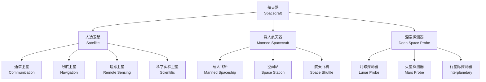

# 航天器设计

## 概述

航天器设计（Spacecraft Design）
是研究人造卫星（Satellite）。
宇宙飞船（Spacecraft）。
空间站（Space Station）。
深空探测器（Deep Space Probe）
等航天器的总体方案设计
（Conceptual Design）。
分系统设计（Subsystem Design）。
试验验证（Testing and Verification）
的综合工程学科。

航天器设计涉及轨道力学（Orbital Mechanics）。
结构力学（Structural Mechanics）。
热控制（Thermal Control）。
电源系统（Power System）。
姿态控制（Attitude Control）。
通信系统（Communication）等多个学科的深度交叉。

设计过程须权衡性能、可靠性、成本。
质量和寿命等多维约束。
遵循"质量最轻、可靠性最高、成本可控"的基本原则。

## 航天器分类系统

## 轨道力学基础

### 开普勒轨道

航天器轨道遵循开普勒定律（Kepler's Laws）。

椭圆轨道方程：

$$r = \frac{a(1 - e^2)}{1 + e \cos \theta}$$

其中 $a$ 为半长轴（Semi-Major Axis）。
$e$ 为偏心率（Eccentricity）。
$\theta$ 为真近点角（True Anomaly）。

圆形轨道速度（Circular Orbit Velocity）：

$$v = \sqrt{\frac{GM}{r}}$$

其中 $G$ 为引力常数。
$M$ 为地球质量。
$r$ 为轨道半径。

逃逸速度（Escape Velocity）：

$$v_{esc} = \sqrt{\frac{2GM}{r}}$$

### 火箭方程

齐奥尔科夫斯基火箭方程
（Tsiolkovsky Rocket Equation）：

$$\Delta v = v_e \ln\left(\frac{m_0}{m_f}\right)$$

其中 $v_e$ 为排气速度。
$m_0$ 为初始质量。
$m_f$ 为最终质量。

$\Delta v$ 是衡量航天器机动能力的关键参数。
提高 $\Delta v$ 的途径：
提高排气速度 $v_e$（采用高比冲推进剂）。
降低结构质量比（轻量化设计）。

### 轨道要素

开普勒轨道要素（Orbital Elements）
完整描述航天器在空间中的轨道位置与姿态：

- 半长轴 $a$：轨道大小
- 偏心率 $e$：轨道形状
- 轨道倾角 $i$（Inclination）：轨道面与赤道面夹角
- 升交点赤经 $\Omega$（RAAN）
- 近地点幅角 $\omega$（Argument of Perigee）
- 真近点角 $\nu$（True Anomaly）：当前轨道位置

轨道六要素中，前五个在无摄动下是常数。
第六个随时间均匀变化。
实际轨道受地球非球形引力、日月引力、太阳光压等摄动。

## 典型轨道与参数

| 轨道类型 | 英文 | 高度范围 | 周期 | 倾角 | 典型应用 |
|---------|------|---------|------|------|---------|
| 近地轨道 | LEO | 200-2000 km | 90-120 min | 各种 | 遥感、空间站 |
| 中地球轨道 | MEO | 2000-35786 km | 2-24 h | ~55° | 导航卫星 |
| 地球静止轨道 | GEO | 35786 km | 24 h | 0° | 通信、气象 |
| 太阳同步轨道 | SSO | 500-1000 km | ~100 min | 97-99° | 对地观测 |
| 地球同步转移轨道 | GTO | 近地点~200 km | ~10.5 h | 可变 | 入轨过渡 |
| 大椭圆轨道 | HEO | 远地点>35786 km | 12-24 h | ~63.4° | 高纬度通信 |

地球静止轨道（GEO）的关键条件：
高度精确为35786km。
倾角0°。
偏心率0。
卫星相对地球表面静止不动。

太阳同步轨道（SSO）的轨道面
以与太阳相同角速度进动。
确保每次过顶时太阳光照条件一致。
进动率由地球 J2项摄动引起。

极轨道（Polar Orbit）倾角90°。
覆盖全球所有纬度。
低纬地区观测频次低。
适用于全球观测卫星。

### 轨道机动

霍曼转移（Hohmann Transfer）
是两圆轨道间最省燃料的转移方式。
由两次切向脉冲组成。

第一次脉冲（近地点加速）：

$$\Delta v_1 = \sqrt{\frac{GM}{r_1}}\left(\sqrt{\frac{2r_2}{r_1 + r_2}} - 1\right)$$

第二次脉冲（远地点加速）：

$$\Delta v_2 = \sqrt{\frac{GM}{r_2}}\left(1 - \sqrt{\frac{2r_1}{r_1 + r_2}}\right)$$

其中 $r_1$ 为初始轨道半径。
$r_2$ 为目标轨道半径。
总 $\Delta v = \Delta v_1 + \Delta v_2$。

双脉冲转移在霍曼转移不优时使用。
包括双椭圆转移、双抛物线转移等。
需更多推进剂但时间更灵活。

## 航天器分系统

### 结构与机构系统

结构系统（Structure Subsystem）是航天器的骨架。
需承受发射段的高过载（一般3~5g）和振动冲击。
主承力结构多采用铝合金蜂窝板
（Aluminum Honeycomb Panel）。
碳纤维复合材料（Carbon Fiber Composite）。

可展开机构（Deployment Mechanism）包括：
太阳能电池板展开机构。
天线展开机构。
机械臂。
对接机构。
火工品分离装置。

### 电源系统

航天器电源系统（Power Subsystem）的核心：
太阳能电池阵（Solar Array）。
蓄电池（Battery）。
电源管理模块。

太阳电池片采用三结砷化镓（GaInP/GaAs/Ge）。
光电转换效率超过30%。
电源总线电压一般为28V 或42V。
大功率航天器采用100V 总线。

蓄电池类型：
镍氢电池（NiH2）长寿命但比能量低。
锂离子电池（Li-ion）比能量高、自放电小。
锂聚合物电池（LiPo）应用渐广。
深空探测器使用放射性同位素热电发生器（RTG）。
如卡西尼号、旅行者号等使用的钚-238热源。

### 热控制系统

热控制（Thermal Control）
确保各部件在允许温度范围内工作。

**被动热控**：
多层隔热材料（Multi-Layer Insulation, MLI）。
热控涂层（Thermal Control Coating）。
散热面（Radiator）。
相变材料（Phase Change Material）。

**主动热控**：
热管（Heat Pipe）。
电加热器。
流体回路（Fluid Loop）。
热电制冷器（TEC）。

### 姿态与轨道控制系统

姿态控制（Attitude Control）
使航天器在太空中保持或改变指向。

**姿态敏感器（Attitude Sensor）**：
星敏感器（Star Tracker, 精度角秒级）。
太阳敏感器（Sun Sensor）。
陀螺仪（Gyroscope）。
磁强计（Magnetometer）。
地球敏感器（Earth Sensor）。

**姿态执行机构（Actuator）**：
反作用轮（Reaction Wheel）。
动量轮（Momentum Wheel）。
推力器（Thruster）。
磁力矩器（Magnetic Torquer）。

姿态动力学方程（刚体模型）：

$$I \dot{\boldsymbol{\omega}} + \boldsymbol{\omega} \times (I \boldsymbol{\omega}) = \boldsymbol{\tau}_{ext} + \boldsymbol{\tau}_{act}$$

其中 $I$ 为惯量张量。
$\boldsymbol{\omega}$ 为角速度向量。
$\boldsymbol{\tau}$ 为力矩。

## 空间环境效应

航天器在轨面临的空间环境（Space Environment）：

- **真空**（Vacuum, 10⁻⁶~10⁻¹² Pa）：材料放气和冷焊
- **辐射**（Radiation）：范艾伦带的高能质子和电子
- **太阳宇宙线**：太阳质子事件影响电子器件
- **微重力**（Microgravity, 10⁻³~10⁻⁶g）：影响流体行为
- **热环境**：±100°C 之间交变，引起热循环疲劳
- **原子氧**（LEO 轨道）：对有机材料有剥蚀作用
- **空间碎片**：毫米级碎片造成严重威胁

## 经典教材

- 王希季《航天器设计》
- 杨大中《航天器轨道力学》
- Wertz《Space Mission Engineering: The New SMAD》
- Sarafin《Spacecraft Structures and Mechanisms》
- Fortescue《Spacecraft Systems Engineering》
- Larson《Space Mission Analysis and Design》

## 主要应用领域

- 通信卫星系统
- 导航卫星系统（北斗）
- 遥感卫星系统
- 空间站建设
- 深空探测
- 商业航天
- 空间科学实验

## 相关条目

- [[Aerodynamics]]
- [[FlightMechanics]]
- [[Propulsion]]
- [[SatelliteTechnology]]
- [[SpaceEnvironment]]
- [[OrbitalMechanics]]
