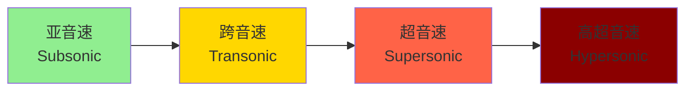
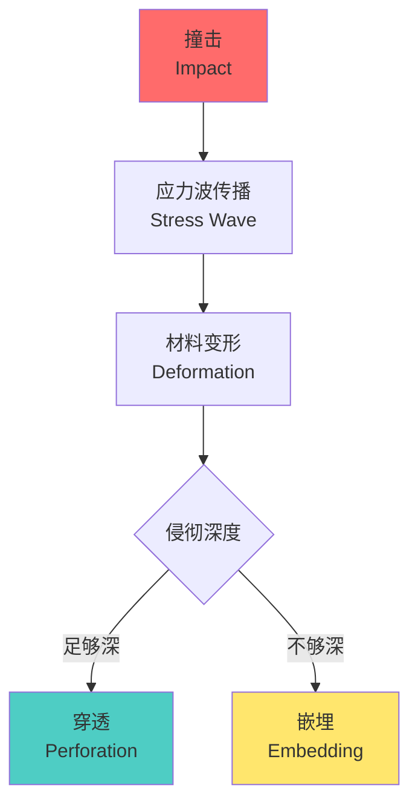

---
aliases:
  - Ballistics
  - Internal Ballistics
  - External Ballistics
  - Terminal Ballistics
tags:
created: 2026-05-17
updated: 2026-05-13
  - engineering
  - aerospace
  - military
  - physics
  - mechanics
  - aerodynamics
  - trajectory
---

# 弹道学 (Ballistics)

## 概述 (Overview)

弹道学是研究抛射体（projectile）运动规律的学科，广泛应用于军事、航天、运动器械等领域。弹道学分为三个主要分支：内弹道学（internal ballistics）、外弹道学（external ballistics）和终点弹道学（terminal ballistics）。

## 内弹道学 (Internal Ballistics)

### 发射过程 (Launch Process)

内弹道学研究弹丸在枪炮身管内的运动规律。主要关注以下几个关键参数：

| 参数 | 符号 | 单位 | 说明 |
|------|------|------|------|
| 膛压 | $P$ | MPa | 火药燃气压力 |
| 初速 | $v_0$ | m/s | 弹丸离开炮口时的速度 |
| 膛线缠距 | $n$ | mm/转 | 膛线旋转一周前进的距离 |
| 装药量 | $\omega$ | kg | 发射药的质量 |

### 火药燃气压力 (Propellant Gas Pressure)

火药燃烧产生的高温高压气体推动弹丸加速。压力变化遵循：

$$P(t) = P_{max} \cdot e^{-\frac{t}{\tau}}$$

其中 $P_{max}$ 为最大膛压，$\tau$ 为压力衰减时间常数。

弹丸在膛内的运动方程为：

$$m \frac{d^2x}{dt^2} = P \cdot A - F_f$$

$m$ 为弹丸质量，$A$ 为炮膛截面积，$F_f$ 为摩擦阻力。

### 膛线作用 (Rifling Effect)

膛线赋予弹丸旋转稳定性。旋转角速度：

$$\omega = \frac{2\pi v}{n}$$

陀螺稳定性条件要求：

$$\frac{\omega^2}{v^2} \cdot \frac{I_x}{I_y} > \frac{2\rho S l}{m}$$

其中 $I_x$ 和 $I_y$ 分别为轴向和横向转动惯量。

## 外弹道学 (External Ballistics)

### 理想弹道 (Ideal Trajectory)

在真空中，弹丸的运动轨迹为抛物线。水平发射时的运动方程：

$$x = v_0 \cos\theta \cdot t$$
$$y = v_0 \sin\theta \cdot t - \frac{1}{2}gt^2$$

最大射程对应的抛射角 $\theta = 45°$。

### 空气阻力 (Air Resistance)

实际大气中，弹丸受到空气阻力作用。阻力公式：

$$F_D = \frac{1}{2} \rho v^2 C_D A$$

其中 $\rho$ 为空气密度，$C_D$ 为阻力系数，$A$ 为弹丸参考面积。

阻力系数与马赫数（Mach number）密切相关：

$$Ma = \frac{v}{a} = \frac{v}{\sqrt{\gamma RT}}$$

### 弹道修正 (Trajectory Correction)

实际射击中需要考虑多种修正因素：

| 修正因素 | 影响 | 修正方法 |
|----------|------|----------|
| 科里奥利力 | 地球自转引起的偏转 | 方向和时间修正 |
| 风速 | 横向漂移 | 风偏修正角 |
| 温度 | 空气密度变化 | 射程修正 |
| 海拔高度 | 气压变化 | 弹道系数修正 |
| 地球曲率 | 远距离目标 | 仰角修正 |

### 弹丸稳定性 (Projectile Stability)

弹丸在空中飞行需要保持稳定姿态。稳定性类型包括：

- **旋转稳定（Spin Stabilization）**：通过膛线赋予弹丸高速旋转
- **尾翼稳定（Fin Stabilization）**：利用尾翼产生稳定力矩
- **箭形稳定（Arrow Stabilization）**：重心靠前，压心靠后

章动角（nutation angle）的变化规律：

$$\theta(t) = \theta_0 e^{-\lambda t} \cos(\Omega t + \phi)$$

其中 $\lambda$ 为阻尼系数，$\Omega$ 为进动频率。

## 终点弹道学 (Terminal Ballistics)

### 侵彻机理 (Penetration Mechanism)

弹丸击中目标后的侵彻过程涉及复杂的材料变形和破坏。

侵彻深度估算公式（德马尔公式）：

$$h = \frac{m v^2}{2 \pi r^2 \sigma_y}$$

其中 $h$ 为侵彻深度，$\sigma_y$ 为目标材料屈服强度。

### 能量传递 (Energy Transfer)

弹丸传递给目标的动能：

$$E_k = \frac{1}{2} m (v_1^2 - v_2^2)$$

$v_1$ 为撞击前速度，$v_2$ 为穿透后剩余速度。

剩余速度公式：

$$v_2 = \sqrt{v_1^2 - v_{50}^2}$$

$v_{50}$ 为弹道极限速度。

### 毁伤评估 (Damage Assessment)

毁伤效果与多种因素相关：

| 目标类型 | 关键参数 | 毁伤判据 |
|----------|----------|----------|
| 装甲目标 | 侵彻深度 | 穿透/未穿透 |
| 人员目标 | 能量传递 | 空腔效应 |
| 建筑目标 | 冲击波 | 结构破坏 |
| 电子设备 | 冲击振动 | 功能失效 |

## 弹道测量技术 (Ballistic Measurement)

### 测速方法 (Velocimetry)

- **测时仪（Chronograph）**：测量弹丸通过两个探靶的时间
- **多普勒雷达（Doppler Radar）**：利用多普勒频移测速
- **高速摄影（High-speed Photography）**：直接记录弹丸运动

### 压力测量 (Pressure Measurement)

膛压测量使用压电传感器或应变片：

$$P = \frac{E \cdot \varepsilon}{1 - \mu^2}$$

其中 $E$ 为弹性模量，$\varepsilon$ 为应变，$\mu$ 为泊松比。

## 现代弹道学发展 (Modern Ballistics Development)

### 精确制导 (Precision Guidance)

现代弹道学结合制导技术：

| 制导方式 | 原理 | 精度提升 |
|----------|------|----------|
| GPS 制导 | 卫星定位 | CEP < 10m |
| 激光制导 | 半主动寻的 | CEP < 5m |
| 红外制导 | 热成像追踪 | 末端精度高 |
| 复合制导 | 多模式融合 | 全天候作战 |

### 计算弹道学 (Computational Ballistics)

CFD（计算流体力学）在弹道学中的应用：

$$\frac{\partial \rho}{\partial t} + \nabla \cdot (\rho \mathbf{u}) = 0$$
$$\frac{\partial (\rho \mathbf{u})}{\partial t} + \nabla \cdot (\rho \mathbf{u} \otimes \mathbf{u}) = -\nabla p + \nabla \cdot \tau + \rho \mathbf{g}$$

通过数值模拟可以精确预测复杂条件下的弹道轨迹。

## 应用领域 (Applications)

### 军事应用 (Military Applications)

- 火炮系统设计
- 弹药效能评估
- 装甲防护设计
- 反导系统开发

### 民用应用 (Civil Applications)

- 航天器返回弹道
- 运动器材设计（高尔夫、棒球）
- 气象火箭探测
- 消防灭火弹

## 参考文献 (References)

1. Carlucci, D. E., & Jacobson, S. S. (2018). *Ballistics: Theory and Design of Guns and Ammunition*. CRC Press.
2. McCoy, R. L. (1999). *Modern Exterior Ballistics*. Schiffer Publishing.
3. 国防科技大学. (2015). 《弹道学基础》. 国防工业出版社.
4. NATO STANAG 4425 - Ballistic Measurement Methods.

---

**相关概念**: [[Aerodynamics|空气动力学]] | [[Fluid Dynamics|流体力学]] | [[Fracture Mechanics|断裂力学]] | [[Terminal Ballistics|终点弹道学]]
