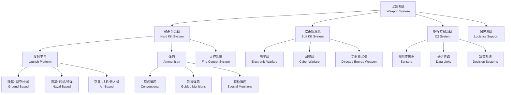

# 武器系统（Weapon Systems）

## 概述

武器系统（Weapon System）是由若干相互关联的武器装备和技术手段组成的、能够完成特定作战任务的有机整体。现代武器系统不仅包括发射平台和弹药等硬杀伤（Hard Kill）组件，还涵盖侦察探测、指挥控制、火控解算、后勤保障等全链条能力要素。从简单的单兵枪械到复杂的天基导弹预警系统，武器系统的设计、评估和集成涉及力学、电子学、控制论、运筹学和信息科学等多学科交叉。本章系统介绍武器系统的组成、效能评估方法、精确制导技术、弹药工程及系统集成等核心内容。

## 武器系统的构成与分类

## 武器系统效能评估

### 效能评估指标体系

武器系统效能（Weapon System Effectiveness）是衡量系统完成规定作战任务程度的综合度量。常用的评估模型包括 ADC 模型：

$$ E = A \times D \times C $$

其中 $A$（Availability，可用度）表示系统在任意时刻处于可工作状态的概率，$D$（Dependability，可靠性）表示任务期间持续正常工作的概率，$C$（Capability，能力）表示系统在正常工作时完成任务目标的程度。

可用度的计算公式为：
$$ A = \frac{\text{MTBF}}{\text{MTBF} + \text{MTTR}} $$

其中 MTBF（Mean Time Between Failures，平均故障间隔时间）和 MTTR（Mean Time To Repair，平均修复时间）是衡量系统可靠性和维修性的关键参数。

任务可靠度函数通常服从指数分布：
$$ R(t) = e^{-\lambda t} $$

其中 $\lambda = 1/\text{MTBF}$ 为失效率，$t$ 为任务持续时间。

### 命中概率与毁伤概率

命中概率（Hit Probability）是武器系统效能的核心指标之一。对于面目标，命中概率与弹着点散布和目标尺寸有关：

$$ P_H = \iint_{\text{目标区域}} f(x,y) \, dx \, dy $$

其中 $f(x,y)$ 为弹着点的二维概率密度函数。对于圆形散布，通常用圆概率误差（Circular Error Probable, CEP）来描述精度：CEP 表示以瞄准点为中心、包含 50% 弹着点的圆的半径。

多发命中后毁伤概率（Kill Probability）为：
$$ P_K = 1 - (1 - P_H)^n $$

其中 $n$ 为发射弹药数量。对于不同类型弹药叠加的情况：
$$ P_{K,n} = 1 - \prod_{i=1}^n (1 - P_{K,i}) $$

## 精确制导武器

### 制导方式分类

精确制导武器（Precision Guided Munitions, PGM）依靠高精度制导系统实现对目标的精确打击。主要制导方式对比如下：

| 制导方式 | 原理 | 精度 | 抗干扰 | 典型应用 |
|:---|:---|:---:|:---:|:---|
| 惯性制导（INS） | 加速度积分推算位置 | 中（CEP 随距离增大） | 强 | 弹道导弹 |
| 红外制导（IR） | 目标热辐射追踪 | 高 | 中 | 空空导弹、便携式防空 |
| 激光制导（Laser） | 激光反射寻的 | 很高 | 弱 | 精确制导炸弹 |
| 卫星制导（GPS/北斗） | 卫星定位导航 | 高 | 中 | 巡航导弹、制导炮弹 |
| 雷达制导（Radar） | 主动/半主动雷达导引 | 高 | 较强 | 中远程防空导弹 |
| 复合制导（Multi-mode） | 多传感器融合 | 很高 | 强 | 远程防空、反舰 |

### 制导控制原理

制导系统的基本控制回路包含目标探测、制导律计算和飞行控制三个环节。比例导引法（Proportional Navigation）是最常用的制导律之一：

$$ \dot{\gamma} = N \cdot \dot{\sigma} $$

其中 $\dot{\gamma}$ 为导弹航向角变化率，$N$ 为导航常数，$\dot{\sigma}$ 为视线角变化率。当目标机动时，需引入增广比例导引：
$$ \dot{\gamma} = N \cdot \dot{\sigma} + \frac{N}{2} \cdot a_T $$

其中 $a_T$ 为目标加速度的法向分量。

## 雷达探测系统

### 雷达方程

雷达的最大探测距离由雷达方程（Radar Equation）描述：
$$ R_{\text{max}} = \left[ \frac{P_t G^2 \lambda^2 \sigma}{(4\pi)^3 S_{\text{min}}} \right]^{1/4} $$

其中 $P_t$ 为发射功率（W），$G$ 为天线增益，$\lambda$ 为雷达工作波长（m），$\sigma$ 为目标的雷达散射截面（Radar Cross Section, RCS，单位 m²），$S_{\text{min}}$ 为雷达接收机的最小可检测信号功率（W）。

为探测隐身目标（$\sigma$ 小），需提高发射功率或降低 $S_{\text{min}}$。现代雷达采用相控阵技术，通过电子扫描替代机械旋转，大幅提高了多目标跟踪能力和反应速度。

## 弹药工程

### 弹药类型

| 弹药类型 | 作用原理 | 主要用途 | 典型口径/当量 |
|----------|----------|----------|-------------|
| 杀伤弹（HE-Frag） | 爆炸破片杀伤 | 人员、轻装甲目标 | 155mm: ~6kg TNT |
| 穿甲弹（APFSDS） | 高密度长杆动能侵彻 | 重型装甲目标 | 120mm: 钨/贫铀弹芯 |
| 破甲弹（HEAT） | 聚能射流效应 | 装甲车辆、碉堡 | 弹径 84–152mm |
| 制导炮弹（PGM） | GPS/激光制导 | 点目标精确打击 | 155mm: Excalibur |
| 子母弹（Cargo/DPICM） | 母弹抛撒子弹药 | 面目标覆盖 | 155mm: 72枚子弹药 |

### 引信技术

引信（Fuze）是控制弹药起爆时机和条件的核心组件。主要类型包括：触发引信（Impact Fuze）在击中目标瞬间起爆；近炸引信（Proximity Fuze）通过雷达/激光测距在目标附近引爆，空炸效果最佳；定时引信（Time Fuze）预设延时起爆；多选择引信（Multi-Option Fuze）可依据目标类型切换工作模式。现代引信普遍采用微机电系统（MEMS）安全保险机构，大幅提高了储存和作战使用的安全性。

### 终点弹道学

终点弹道学（Terminal Ballistics）研究弹丸或战斗部与目标的相互作用。穿甲过程涉及高速冲击下的材料流动和破坏。对于长杆穿甲弹，其穿深可用以下经验关系估算：

$$ P = L \cdot \rho_{\text{rod}}^{1/2} \cdot v_0^{3/2} $$

其中 $P$ 为穿深，$L$ 为弹芯长度，$\rho_{\text{rod}}$ 为弹芯密度，$v_0$ 为着速。

破甲弹的聚能射流（Shaped Charge Jet）速度可达 8–10 km/s，压力达百万大气压级别，其穿深与药型罩锥角和材料相关：
$$ P \propto D \cdot \frac{\rho_{\text{liner}}}{\rho_{\text{target}}} \cdot \cot(\alpha/2) $$

其中 $D$ 为药型罩直径，$\alpha$ 为锥角。

## 武器系统集成与试验

### 系统集成设计

武器系统集成需解决以下关键技术问题：接口设计（Interface Design）确保各分系统之间的电气、机械和信息联通；电磁兼容（Electromagnetic Compatibility, EMC）防止各电子设备之间的电磁干扰；环境适应性（Environmental Adaptability）保证从极寒到高温、从干燥到盐雾等极端环境下的可靠性；人机工程（Human Factors Engineering）优化操作员的工作负荷和决策效率。

### 试验与鉴定

武器系统全寿命周期需经历多阶段试验验证：仿真试验（Simulation Testing）通过数学模型和实时仿真系统验证系统逻辑；靶场试验（Range Testing）在真实或近似真实的条件下测试武器性能；作战试验（Operational Testing）由实际使用方在作战模拟条件下完成，评估系统在实际作战环境中的效能和适用性；效费分析（Cost-Effectiveness Analysis）综合评估系统的全寿命周期成本与作战效能比值。

## 新概念武器技术

定向能武器（Directed Energy Weapon, DEW）包括高能激光（HEL）和高功率微波（HPM），以光速攻击目标，弹药近乎无限。电磁轨道炮（Railgun）利用洛伦兹力将弹丸加速至高超音速（Ma>6）：
$$ F = qvB = ILB $$

其中 $I$ 为导轨电流，$L$ 为导轨间距，$B$ 为磁场强度。无人机蜂群（Drone Swarm）通过分布式智能协同实现饱和攻击，给传统防空系统带来严峻挑战。

## 经典教材

- 张锡恩《武器系统设计》
- 高树滋《武器系统分析》
- Ballistic Research Laboratory Reports
- 《武器系统效能评估》
- Lloyd《Conventional Warhead Systems Physics and Engineering Design》

## 武器系统发展趋势

未来武器系统呈现信息化、智能化和无人化三大趋势。信息化
（Informationization）通过数据链和网络中心战（Network-
Centric Warfare）实现全域态势感知和协同作战。智能化
（Intelligentization）借助人工智能实现自主目标识别和辅助
决策。无人化（Unmanned Systems）以无人机、无人地面车辆
和无人舰艇为核心，将人员从高危环境中解放。高超音速武器
（Hypersonic Weapons）以超过马赫数 5 的速度飞行，极短
的反应时间和极高的动能使其成为改变游戏规则的颠覆性技术。

## 武器系统全寿命周期管理

武器系统的全寿命周期管理（Lifecycle Management）涵盖从
概念探索—方案设计—工程研制—生产部署—使用保障—退役处理
的全过程。费用分析表明全寿命周期成本中约 70% 在使用保障
阶段产生，因此系统设计阶段就要考虑可靠性、维修性和保障性
（Rams, Reliability, Availability, Maintainability and
Supportability）。保障性分析（LSA, Logistic Support
Analysis）确定了备件数量、维修设备和人员培训等保障要素。
系统工程方法论在武器系统开发中指导需求分析、功能分配和
接口管理。现代武器系统的开发越来越多地采用基于模型的
系统工程（MBSE, Model-Based Systems Engineering）方法。
通过 SysML 语言建立系统的需求模型、功能模型和架构模型。

## 主要参考文献

1. 张锡恩. 武器系统设计. 国防工业出版社, 2008.
2. 高树滋. 武器系统分析. 兵器工业出版社, 1996.
3. Ballistic Research Laboratory. BRL Reports.
4. Lloyd, R. M. Conventional Warhead Systems Physics and
    Engineering Design. AIAA, 1998.
5. 吴晓平. 武器系统效能评估. 科学出版社, 2007.

## 相关条目

- [[Ballistics]]
- [[弹道测量与仿真]]
- [[FlightMechanics]]
- [[RobotDynamics]]
- [[ControlSystems]]
