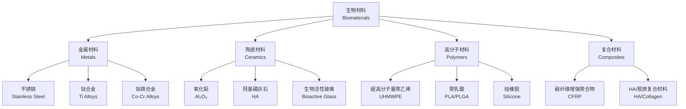

---
aliases: [Biomaterials, 生物材料]
tags: ['Biotechnologies', 'BiomedicalEngineering', 'Biomaterials', 'MaterialsScience']
created: 2026-05-17
updated: 2026-05-17
---

# 生物材料 (Biomaterials)

## 概述 (Overview)

生物材料 (Biomaterials) 是用于与生物系统相互作用，以诊断、治疗、修复或替换人体组织、器官或功能的一类材料。生物材料是生物医学工程 (Biomedical Engineering) 的核心组成部分，涉及材料科学 (Materials Science)、生物学 (Biology)、医学 (Medicine) 和工程学 (Engineering) 的交叉融合。其核心要求包括生物相容性 (Biocompatibility)、功能性 (Functionality) 和耐久性 (Durability)。

## 生物材料分类 (Classification)

## 材料性能对比 (Property Comparison)

| 材料类别 | 典型材料 | 弹性模量 (GPa) | 抗拉强度 (MPa) | 断裂伸长率 (%) | 生物活性 |
|:---|:---|:---:|:---:|:---:|:---:|
| 金属 | 钛合金 Ti-6Al-4V | 110–120 | 860–950 | 10–15 | 惰性 |
| 金属 | 不锈钢 316L | 190–200 | 480–620 | 40–60 | 惰性 |
| 金属 | 钴铬合金 | 210–253 | 655–1300 | 8–20 | 惰性 |
| 陶瓷 | 氧化铝 Al₂O₃ | 350–400 | 300–500 | <1 | 惰性 |
| 陶瓷 | 羟基磷灰石 HA | 80–120 | 40–100 | <1 | 高活性 |
| 高分子 | UHMWPE | 0.5–1.5 | 20–45 | 200–500 | 惰性 |
| 高分子 | PLGA 50:50 | 1–3 | 40–60 | 3–10 | 可降解 |
| 复合 | HA/胶原 | 0.5–2 | 5–20 | 5–15 | 高活性 |
| 参考 | 皮质骨 | 15–30 | 100–150 | 1–3 | — |

## 生物相容性 (Biocompatibility)

### 血液相容性 (Hemocompatibility)
- 抗凝血性能 (Anticoagulation)：材料表面抑制血小板黏附和凝血级联反应
- 溶血反应 (Hemolysis)：红细胞破坏释放游离血红蛋白，应低于 5%
- 补体激活 (Complement Activation)：材料表面引发的免疫蛋白级联反应，C3a 和 C5a 指标

### 组织相容性 (Histocompatibility)
- 炎症反应 (Inflammation)：急性炎症通常在植入后 1–2 周消退，慢性炎症预示材料排异
- 纤维包裹 (Fibrous Encapsulation)：异物反应导致胶原纤维包裹，厚度超过 100 μm 影响功能
- 组织整合 (Tissue Integration)：材料与周围组织的直接结合程度，骨整合 (Osseointegration) 尤为关键

### 生物安全性 (Biosafety)
- 细胞毒性 (Cytotoxicity)：按照 ISO 10993-5 标准，MTT 法评价细胞相对存活率
- 致敏性 (Sensitization)：采用豚鼠最大化试验 (GPMT) 评价皮肤致敏风险
- 遗传毒性 (Genotoxicity)：Ames 试验和微核试验检测 DNA 损伤
- 全身毒性 (Systemic Toxicity)：急性、亚慢性和慢性毒性系统性评价

## 表面改性 (Surface Modification)

### 物理改性方法
- 等离子体处理 (Plasma Treatment)：改变表面化学组成和润湿性，引入含氧官能团
- 离子注入 (Ion Implantation)：注入 N⁺、C⁺ 等提高耐磨性和耐腐蚀性
- 微纳结构化 (Micro/Nano Structuring)：飞秒激光刻蚀、喷砂构建表面拓扑引导细胞取向
- 磁控溅射 (Magnetron Sputtering)：在基体表面沉积生物活性陶瓷薄膜

### 化学改性方法
- 涂层技术 (Coating)：等离子喷涂 HA、电泳沉积聚合物涂层
- 表面接枝 (Surface Grafting)：ATRP、RAFT 等方法将功能性聚合物链共价连接
- 自组装单层膜 (Self-Assembled Monolayers)：硫醇在金表面形成有序分子层调控蛋白质吸附
- 硅烷化 (Silane Treatment)：在金属氧化物表面引入可反应官能团

### 生物功能化
- 细胞黏附肽固定：RGD (Arg-Gly-Asp) 序列是整合素 (Integrin) 识别的经典配体
- 生长因子缓释：BMP-2 (骨形态发生蛋白) 诱导间充质干细胞成骨分化
- 抗菌修饰：银纳米粒子、季铵盐共价接枝赋予材料抗菌活性

**表面能 (Surface Energy) 与润湿性**：

$$
\gamma_{SV} = \gamma_{SL} + \gamma_{LV}\cos\theta
$$

其中 $\theta$ 为接触角 (Contact Angle)。$\theta < 90^\circ$ 为亲水表面，$\theta > 90^\circ$ 为疏水表面，超疏水表面 $\theta > 150^\circ$。

## 降解动力学 (Degradation Kinetics)

### 水解降解 (Hydrolytic Degradation)

$$
M_t = M_0 e^{-kt}
$$

其中 $M_t$ 为时间 $t$ 时的分子量，$M_0$ 为初始分子量，$k$ 为降解速率常数。半衰期 $t_{1/2} = \ln 2 / k$。

### 酶促降解 (Enzymatic Degradation)

$$
\frac{dM}{dt} = -k_{cat}[E]M
$$

其中 $[E]$ 为酶浓度 (Enzyme Concentration)，$k_{cat}$ 为催化速率常数。降解速率受 pH 值、温度和酶特异性影响。

## 组织工程 (Tissue Engineering)

### 三要素

| 要素 | 功能 | 关键设计参数 |
|:---|:---|:---|
| 支架 (Scaffold) | 提供三维空间模板引导组织再生 | 孔隙率 > 80%，孔径 100–500 μm，连通性 > 90% |
| 种子细胞 (Cells) | 合成细胞外基质构建功能组织 | 细胞活力 > 90%，接种密度 ≥ 10⁶ cells/cm³ |
| 生长因子 (Growth Factors) | 调控细胞增殖、分化和迁移 | 浓度梯度控制，缓释周期 2–8 周 |

### 支架设计参数
- **孔隙率 (Porosity)**：$P = \frac{V_{pores}}{V_{total}} \times 100\%$，影响细胞迁移和营养传输
- **孔径 (Pore Size)**：100–200 μm 适合成纤维细胞，200–350 μm 适合成骨细胞
- **降解速率**：需与组织再生速率匹配，一般设计为 4–24 周完全降解

**力学匹配原则**：植入体与周围组织的模量差异应尽量小，否则产生应力遮挡 (Stress Shielding)：

$$
\sigma_{implant} = E_{implant} \cdot \varepsilon \gg \sigma_{tissue} = E_{tissue} \cdot \varepsilon
$$

## 表征技术 (Characterization Techniques)

| 技术 | 缩写 | 获取信息 | 典型应用 |
|:---|:---:|:---|:---|
| 扫描电子显微镜 | SEM | 表面形貌、孔隙结构 | 支架微观形貌评价 |
| 透射电子显微镜 | TEM | 内部结构、纳米颗粒尺寸 | 纳米复合材料分析 |
| X 射线衍射 | XRD | 晶体结构、物相组成 | HA 结晶度检测 |
| X 射线光电子能谱 | XPS | 表面元素组成、化学态 | 表面改性效果验证 |
| 傅里叶变换红外光谱 | FTIR | 化学键、官能团信息 | 聚合物降解过程监测 |
| 接触角测量 | CA | 表面润湿性 | 亲疏水性定量评价 |

## 抗菌生物材料 (Antimicrobial Biomaterials)

植入物相关感染 (Implant-Associated Infection) 是生物材料临床失败的主要原因之一。

| 抗菌策略 | 机制 | 优势 | 局限 |
|:---|:---|:---|:---|
| 抗生素释放 | 局部持续释放抗生素（庆大霉素、万古霉素） | 广谱抗菌 | 耐药性风险 |
| 银纳米粒子 | Ag⁺ 破坏细菌细胞膜和 DNA 复制 | 广谱、低耐药性 | 细胞毒性剂量依赖 |
| 阳离子聚合物 | 季铵盐/壳聚糖破坏带负电的细菌膜 | 接触杀灭，不释放 | 生物相容性有限 |
| 抗污表面 (Anti-fouling) | PEG、两性离子聚合物阻止蛋白质和细菌黏附 | 预防生物膜形成 | 无杀菌作用 |
| 仿生抗菌肽 | 模拟天然抗菌肽 (AMP) 破坏细菌膜 | 高选择性 | 生产成本高 |

生物膜 (Biofilm) 形成的细菌密度感应 (Quorum Sensing) 抑制剂也是新型抗菌策略的重要方向。

## 生物材料法规与审批 (Regulatory Pathway)

各国对生物材料及医疗器械的审批有严格的监管体系：

| 机构 | 地区 | 法规框架 | 分类体系 | 审批周期 |
|:---|:---:|:---|:---|:---:|
| NMPA | 中国 | 《医疗器械监督管理条例》 | I / II / III 类 | 6–36 月 |
| FDA | 美国 | 21 CFR Part 800–1299 | I / II / III 类 | 510(k) 3–12 月，PMA 12–36 月 |
| CE (MDR) | 欧洲 | EU 2017/745 MDR | I / IIa / IIb / III 类 | 12–36 月 |

生物材料申报资料核心要求：
- 材料化学成分与纯度 (Chemical Composition & Purity)
- 物理/化学/力学性能表征 (Physical/Chemical/Mechanical Characterization)
- 生物相容性评价 (Biocompatibility Evaluation per ISO 10993)
- 灭菌验证 (Sterilization Validation)：环氧乙烷 (EO)、γ 辐照、高压蒸汽
- 临床前动物实验 (Preclinical Animal Study)
- 临床试验 (Clinical Trial) 或同品种比对 (Substantial Equivalence)

## 先进表征技术 (Advanced Characterization)

| 技术 | 缩写 | 分辨率/灵敏度 | 获取信息 |
|:---|:---:|:---:|:---|
| 原子力显微镜 | AFM | nm 级 | 表面形貌、力学模量、黏附力 |
| 飞行时间二次离子质谱 | ToF-SIMS | ppm | 表面分子分布、化学成像 |
| 热重分析 | TGA | 0.1 μg | 热稳定性、组成比例 |
| 差示扫描量热法 | DSC | 0.1 °C | 玻璃化转变温度 $T_g$、熔点 $T_m$ |
| 动态力学分析 | DMA | 0.1 MPa | 储能模量 $E'$、损耗模量 $E''$、tan δ |

**力学模量温度依赖性**：

$$
E'(T) = E'_g + \frac{E'_r - E'_g}{1 + e^{(T - T_g)/\beta}}
$$

## 经典教材与参考 (References)

- 崔福斋《生物材料学》(Biomaterials Science)
- Ratner B.D. 《Biomaterials Science: An Introduction to Materials in Medicine》
- Park J.B. 《Biomaterials: An Introduction》
- 《生物医用材料》(Biomedical Materials)
- ASTM F2068 《外科植入用钛合金规范》

## 相关条目 (Related Entries)

- [[MedicalDevices]]
- [[09_MedicineAndHealth/Pharmacy/DrugDesign|DrugDesign]]
- [[04_EngineeringAndTechnology/ChemicalAndPharmaceuticalEngineering/PharmaceuticalEngineering/Formulation|Formulation]]
- [[04_EngineeringAndTechnology/Biotechnologies/GeneticEngineering/GeneCloning|GeneCloning]]
- [[04_EngineeringAndTechnology/Biotechnologies/EnzymeEngineering/EnzymeEngineering|EnzymeEngineering]]
- [[09_MedicineAndHealth/RegenerativeMedicine/TissueEngineering|TissueEngineering]]

