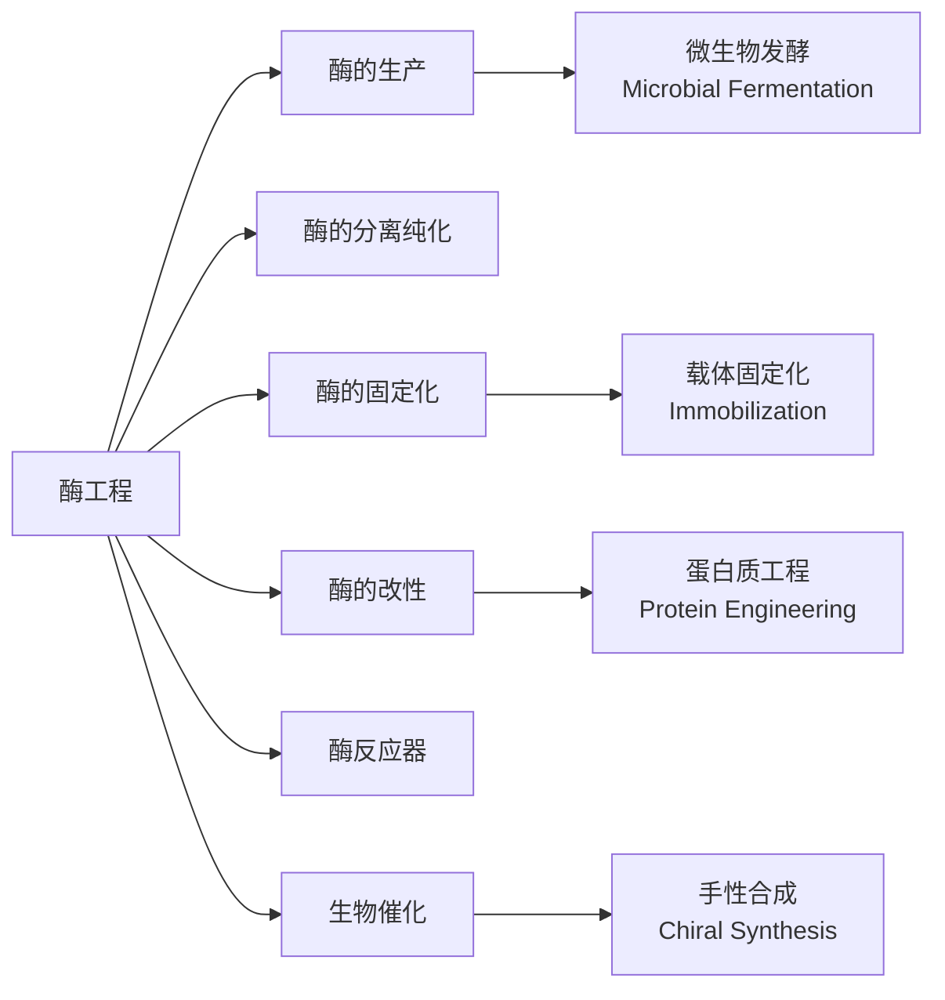
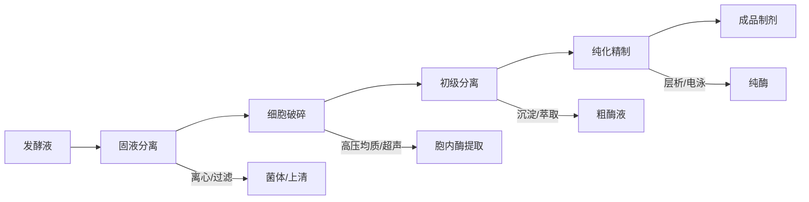

# 酶工程 (Enzyme Engineering)

## 概述

酶工程（Enzyme Engineering）是研究酶的生产、改性、固定化及反应器设计的综合性工程技术学科。酶作为生物催化剂（biocatalyst），具有高效性、专一性和温和反应条件等独特优势。酶工程的核心目标是通过工程技术手段实现酶的大规模生产、性能优化和工业化应用。

现代酶工程涵盖从野生菌株筛选、基因工程改造、发酵生产、分离纯化到固定化应用的全产业链，广泛应用于食品、医药、洗涤剂、纺织、造纸、能源和精细化工等领域。

## 酶的分类与命名

根据国际生物化学与分子生物学联盟（IUBMB）的标准，酶分为六大类：

| EC 编号 | 酶类 | 催化反应类型 | 典型酶 |
|---------|------|-------------|--------|
| EC 1 | 氧化还原酶（Oxidoreductases） | 电子转移 | 脱氢酶、氧化酶、过氧化物酶 |
| EC 2 | 转移酶（Transferases） | 功能基团转移 | 转氨酶、激酶、甲基转移酶 |
| EC 3 | 水解酶（Hydrolases） | 水解反应 | 蛋白酶、脂肪酶、淀粉酶、纤维素酶 |
| EC 4 | 裂解酶（Lyases） | 非水解性断裂 | 脱羧酶、醛缩酶、水合酶 |
| EC 5 | 异构酶（Isomerases） | 分子内重排 | 葡萄糖异构酶、消旋酶 |
| EC 6 | 连接酶（Ligases） | ATP 依赖的连接 | DNA 连接酶、合成酶 |

## 酶催化动力学

### Michaelis-Menten 动力学

酶催化反应的基本动力学方程：

$$v = \frac{V_{max}[S]}{K_m + [S]}$$

其中：

- $v$：反应速率
- $V_{max}$：最大反应速率
- $[S]$：底物浓度
- $K_m$：米氏常数（Michaelis constant），反应速率达到 $V_{max}$ 一半时的底物浓度

**催化效率**：

$$k_{cat}/K_m$$

$k_{cat}$ 为催化常数（turnover number），表示每个酶分子单位时间内转化底物的分子数。$k_{cat}/K_m$ 反映了酶的催化完美程度，上限约为 $10^8$-$10^9$ M⁻¹s⁻¹（扩散控制极限）。

**抑制类型**：

| 抑制类型 | 作用位点 | $K_m$ 变化 | $V_{max}$ 变化 |
|----------|----------|-----------|---------------|
| 竞争性抑制（Competitive） | 活性位点 | 增大 | 不变 |
| 非竞争性抑制（Non-competitive） | 别构位点 | 不变 | 降低 |
| 反竞争性抑制（Uncompetitive） | 仅结合 ES | 降低 | 降低 |
| 混合性抑制（Mixed） | 别构位点 | 变化 | 降低 |

## 酶的生产与发酵

### 产酶微生物

工业用酶主要来源于微生物发酵，常用菌株包括：

- **细菌**：枯草芽孢杆菌（蛋白酶、淀粉酶）、大肠杆菌（重组酶）
- **真菌**：黑曲霉（糖化酶、果胶酶）、里氏木霉（纤维素酶）
- **酵母**：酿酒酵母、毕赤酵母（脂肪酶、酯酶）

### 发酵工艺优化

**培养基组成**：

- 碳源：葡萄糖、淀粉、纤维素、乳糖（诱导作用）
- 氮源：蛋白胨、酵母提取物、硫酸铵
- 无机盐：磷酸盐、镁盐、微量元素
- 诱导物：IPTG、乳糖（对于诱导型表达系统）

**发酵条件控制**：

| 参数 | 控制范围 | 影响 |
|------|----------|------|
| 温度 | 28-37°C | 影响生长速率和酶产量 |
| pH | 4.5-7.5 | 影响酶稳定性和分泌 |
| 溶氧（DO） | >20% 饱和度 | 影响好氧代谢 |
| 搅拌速度 | 100-800 rpm | 影响传质和剪切力 |

**提高酶产量的策略**：

- 诱变育种：物理诱变（UV、γ射线）、化学诱变（EMS）
- 基因工程：高拷贝质粒、强启动子、信号肽优化、密码子优化
- 发酵工程：补料分批发酵（fed-batch）、两阶段发酵控制

### 酶的分离纯化

**下游加工流程**：

**主要分离技术**：

- **沉淀法**：硫酸铵盐析、有机溶剂沉淀、等电点沉淀
- **膜分离**：超滤（截留分子量）、微滤、纳滤
- **层析法**：
  - 离子交换层析（IEC）：基于电荷差异
  - 疏水层析（HIC）：基于疏水性差异
  - 凝胶过滤层析（GFC）：基于分子大小
  - 亲和层析（AC）：基于特异性结合（如 His-tag、GST-tag）

**纯度评估**：

- SDS-PAGE：检测纯度（单一条带为电泳纯）
- 比活力（Specific Activity）：单位/mg 蛋白
- 纯化倍数和回收率

## 酶的固定化 (Enzyme Immobilization)

酶固定化是将游离酶限制在一定空间范围内，使其保持催化活性并可重复使用的技术。

### 固定化方法

| 方法 | 原理 | 优点 | 缺点 |
|------|------|------|------|
| **吸附法** | 物理吸附或离子键合于载体表面 | 操作简单、条件温和、酶活性损失小 | 结合力弱、易脱落 |
| **包埋法** | 包埋在凝胶或微囊中 | 通用性强、保护性好 | 传质阻力大 |
| **共价结合法** | 酶与载体形成共价键 | 结合牢固、不易脱落 | 可能破坏活性位点 |
| **交联法** | 双功能试剂连接酶分子 | 无载体、酶浓度高 | 机械强度差 |

**常用载体材料**：

- 无机载体：硅藻土、多孔玻璃、硅胶、磁性纳米颗粒
- 有机载体：琼脂糖、纤维素、壳聚糖、聚丙烯酰胺
- 合成高分子：环氧树脂、聚氨酯

### 固定化酶的性质变化

- **稳定性提高**：对温度、pH、有机溶剂的耐受性增强
- **最适 pH 偏移**：通常向酸性或碱性方向偏移 0.5-1.5 个单位
- **表观 $K_m$ 增大**：底物扩散限制导致
- **操作半衰期**：工业级固定化酶通常要求半衰期 >1 个月

## 酶的改性 (Enzyme Modification)

### 化学修饰

- **PEG 修饰（PEGylation）**：聚乙二醇与酶共价结合，提高稳定性、延长体内半衰期
- **糖基化修饰**：改善热稳定性和抗蛋白酶能力
- **交联酶聚集体（CLEAs）**：通过交联剂形成不溶性聚集体

### 蛋白质工程 (Protein Engineering)

**定向进化（Directed Evolution）**：

模拟自然进化过程，通过随机突变和筛选获得性能改进的酶变体。

$$\text{随机突变} \rightarrow \text{文库构建} \rightarrow \text{高通量筛选} \rightarrow \text{优势突变体}$$

常用技术：易错 PCR（error-prone PCR）、DNA shuffling、饱和突变。

**理性设计（Rational Design）**：

基于酶的三维结构和催化机制，通过计算机模拟预测并设计特定位点突变。

- 改变底物特异性
- 提高热稳定性
- 增强有机溶剂耐受性
- 改变立体选择性

## 酶反应器 (Enzyme Reactors)

### 反应器类型

| 类型 | 操作方式 | 特点 | 应用 |
|------|----------|------|------|
| **搅拌罐式反应器（STR）** | 批次/连续 | 混合均匀、温控好 | 实验室、中小规模 |
| **填充床反应器（PBR）** | 连续 | 催化剂利用率高 | 固定化酶大规模生产 |
| **流化床反应器（FBR）** | 连续 | 传质好、压降低 | 颗粒状固定化酶 |
| **膜反应器（MR）** | 连续 | 产物即时分离 | 抑制性产物体系 |
| **喷射式反应器** | 批次 | 快速混合 | 高粘度底物 |

### 反应器设计参数

- **停留时间**（Space Time）：$\tau = V/Q$
- **转化率**（Conversion）：$X = \frac{S_0 - S}{S_0}$
- **产率**（Productivity）：单位时间单位体积的产物生成量

## 生物催化与工业应用

### 手性合成 (Chiral Synthesis)

酶催化在手性药物合成中具有独特优势：

- **脂肪酶**：拆分醇、酯、胺的光学异构体
- **转氨酶**：合成手性胺类中间体
- **腈水解酶**：制备手性羧酸和酰胺
- **酮还原酶**：不对称还原酮为手性醇

### 主要工业应用领域

| 应用领域 | 典型酶 | 应用实例 |
|----------|--------|----------|
| 洗涤剂 | 蛋白酶、脂肪酶、淀粉酶、纤维素酶 | 去除蛋白、油脂污渍 |
| 食品加工 | 淀粉酶、糖化酶、果胶酶、凝乳酶 | 淀粉糖化、果汁澄清、奶酪制造 |
| 纺织 | 淀粉酶、纤维素酶、过氧化氢酶 | 退浆、生物抛光、漂白脱氧 |
| 造纸 | 木聚糖酶、脂肪酶、漆酶 | 漂白助剂、树脂控制 |
| 生物燃料 | 纤维素酶、半纤维素酶 | 纤维素乙醇生产 |
| 医药 | 青霉素酰化酶、脂肪酶、蛋白酶 | 抗生素合成、手性中间体 |

## 经典教材与资源

- 郭勇《酶工程》（第 3 版）
- Bommarius & Riebel《Biocatalysis: Fundamentals and Applications》
- Faber《Biotransformations in Organic Chemistry》
- 《固定化酶与细胞技术》
- 《酶学》（Enzymology）

## 相关条目

- [[FermentationProcess|发酵工程]]
- [[GeneCloning|基因克隆]]
- [[Biomaterials|生物材料]]
- [[DrugDesign|药物设计]]
- [[ProteinEngineering|蛋白质工程]]
- [[Biocatalysis|生物催化]]
