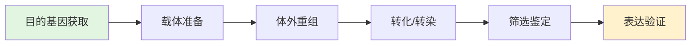

# 基因克隆 (Gene Cloning)

## 概述

基因克隆（Gene Cloning），又称 DNA 克隆或分子克隆，是将目的基因（target gene）从供体生物中分离出来，插入合适的载体（vector）分子中，再导入宿主细胞（host cell）进行复制和扩增，进而实现基因表达或功能研究的核心生物技术。该技术是现代分子生物学、基因工程、合成生物学和生物医药产业的基石。

基因克隆的概念源于 20 世纪 70 年代限制性内切酶（restriction enzyme）和 DNA 连接酶（DNA ligase）的发现，Berg、Boyer 和 Cohen 的开创性工作奠定了重组 DNA 技术（recombinant DNA technology）的基础。

## 基因克隆的基本流程

### 1. 目的基因获取 (Target Gene Acquisition)

获取目的基因是基因克隆的第一步，常用方法包括：

**化学合成法**：

- 适用于已知序列且长度较短的基因（<5 kb）
- 采用寡核苷酸固相合成技术
- 可进行密码子优化（codon optimization）以适应宿主表达系统

**PCR 扩增法（Polymerase Chain Reaction）**：

以基因组 DNA 或 cDNA 为模板，利用特异性引物扩增目的片段。

$$DNA_{拷贝数} = N_0 \times 2^n$$

$N_0$ 为初始模板量，$n$ 为扩增循环数（通常 25-35 个循环）。

**PCR 基本步骤**：

| 步骤 | 温度 | 时间 | 功能 |
|------|------|------|------|
| 变性（Denaturation） | 94-98°C | 15-30 s | 双链 DNA 解链 |
| 退火（Annealing） | 50-65°C | 15-30 s | 引物与模板结合 |
| 延伸（Extension） | 72°C | 1 min/kb | Taq 酶合成新链 |

**引物设计原则**：

- 长度：18-25 bp
- GC 含量：40%-60%
- 熔解温度（$T_m$）：55-65°C
- 避免引物二聚体（primer dimer）和发夹结构（hairpin）

**基因文库筛选**：

- **基因组文库（Genomic Library）**：包含生物体全部基因组 DNA 片段
- **cDNA 文库（cDNA Library）**：由 mRNA 反转录合成，仅含表达基因

### 2. 载体选择与构建 (Vector Selection)

载体是携带外源 DNA 进入宿主细胞并使其复制和表达的 DNA 分子。

**常用载体类型**：

| 载体类型 | 宿主 | 容量 | 主要用途 |
|----------|------|------|----------|
| 质粒（Plasmid） | 大肠杆菌 | <15 kb | 常规克隆、蛋白表达 |
| 噬菌体（Phage） | 大肠杆菌 | 9-23 kb | cDNA 文库构建 |
| 粘粒（Cosmid） | 大肠杆菌 | 35-45 kb | 大片段克隆 |
| BAC | 大肠杆菌 | 100-300 kb | 基因组文库 |
| YAC | 酵母 | 200-2000 kb | 染色体步行 |
| 病毒载体 | 哺乳动物/昆虫 | 可变 | 基因治疗、蛋白表达 |

**表达载体关键元件**：

- **启动子（Promoter）**：控制转录起始，如 lac、T7、tac
- **核糖体结合位点（RBS）**：原核表达中调控翻译起始
- **多克隆位点（MCS）**：含多种限制酶切位点，便于基因插入
- **筛选标记（Selection Marker）**：抗生素抗性基因，如 AmpR、KanR
- **标签序列（Tag）**：His-tag、GST-tag，便于蛋白纯化检测
- **终止子（Terminator）**：确保转录正常终止

### 3. 体外重组 (In Vitro Recombination)

**限制性内切酶（Restriction Enzyme）**：

限制性内切酶是一类能识别特定 DNA 序列并在该位点或附近切割双链 DNA 的核酸酶。

**分类**：

- Type I：识别和切割位点不同，应用较少
- Type II：识别位点即切割位点，最常用（如 EcoRI、HindIII、BamHI）
- Type III：识别非对称序列，应用较少

**识别序列特征**：

大多数 Type II 酶识别 4-8 bp 的回文序列（palindrome）：

$$5'-\text{GAATTC}-3'$$
$$3'-\text{CTTAAG}-5'$$

EcoRI 切割后产生粘性末端（sticky end / cohesive end）：

$$5'-G \quad\quad AATTC-3'$$
$$3'-CTTAA \quad\quad G-5'$$

**DNA 连接（Ligation）**：

DNA 连接酶催化 DNA 片段之间磷酸二酯键的形成：

$$DNA_{片段 A} + DNA_{片段 B} \xrightarrow{\text{DNA Ligase, ATP/NAD}^+} DNA_{重组分子}$$

**连接反应条件**：

- 温度：16°C（粘性末端）或 25°C（平末端）
- 时间：30 min - 过夜
- 插入片段与载体摩尔比：3:1 至 10:1

**现代克隆技术**：

- **Gateway 克隆**：基于 λ 噬菌体位点特异性重组，无需限制酶
- **Gibson 组装（Gibson Assembly）**：利用外切酶、聚合酶和连接酶在体外一步拼接多个片段
- **Golden Gate 克隆**：Type IIS 限制酶（如 BsaI）切割后产生任意 4 bp 粘性末端
- **无缝克隆（Seamless Cloning）**：利用同源重组原理

### 4. 转化与转染 (Transformation & Transfection)

将重组 DNA 分子导入宿主细胞的过程：

**化学转化法（感受态细胞法）**：

- CaCl₂ 法：低温 CaCl₂ 处理使细胞膜通透性增加
- 热激法：42°C 热激 90 s 促进 DNA 进入
- 效率：$10^6$-$10^8$ 转化子/μg DNA

**电穿孔（Electroporation）**：

- 高压电脉冲（1.5-2.5 kV，持续时间 ms 级）在细胞膜上形成临时孔洞
- 效率：$10^9$-$10^{10}$ 转化子/μg DNA
- 适用于大肠杆菌、酵母、哺乳动物细胞

**其他方法**：

- **脂质体转染（Lipofection）**：脂质体包裹 DNA 与细胞膜融合
- **显微注射（Microinjection）**：直接注射入细胞核，用于转基因动物
- **病毒转导（Transduction）**：利用病毒感染性将基因导入
- **原生质体融合**：去除细胞壁后融合

### 5. 筛选与鉴定 (Screening & Identification)

转化后需从大量细胞中筛选出含有重组质粒的阳性克隆。

**抗生素抗性筛选**：

载体携带抗生素抗性基因（如氨苄青霉素抗性 AmpR），只有成功转化的细胞才能在含抗生素的培养基上生长。

**蓝白斑筛选（Blue-White Screening）**：

基于 α-互补（alpha-complementation）原理：

- 载体携带 lacZα 片段，宿主携带 lacZω 片段
- 无插入片段时，lacZ 酶完整，X-gal 被分解产生蓝色菌落
- 有插入片段时，lacZα 被破坏，菌落呈白色

**PCR 鉴定**：

以菌落裂解液为模板，利用载体通用引物或基因特异性引物进行 PCR，通过电泳确认插入片段大小。

**酶切鉴定**：

提取质粒后，用限制酶切割，琼脂糖凝胶电泳分析片段大小是否与预期一致。

**测序验证（Sanger Sequencing）**：

金标准方法，确认插入片段序列完全正确，包括：

- 序列准确性（无突变、无移码）
- 插入方向和读码框（ORF）
- 启动子和标签序列完整性

### 6. 基因表达系统 (Expression Systems)

**原核表达系统（大肠杆菌 E. coli）**：

| 特点 | 说明 |
|------|------|
| 优点 | 培养成本低、生长快、表达量高 |
| 缺点 | 无糖基化、易形成包涵体、缺乏二硫键正确配对 |
| 常用启动子 | T7、lac、tac、trc |
| 诱导条件 | IPTG（异丙基-β-D-硫代半乳糖苷）0.1-1 mM |

**真核表达系统**：

| 系统 | 宿主 | 特点 |
|------|------|------|
| 酵母 | 毕赤酵母/酿酒酵母 | 有翻译后修饰、成本低、可分泌表达 |
| 昆虫细胞 | Sf9/High Five | 高表达、有糖基化、适合复杂蛋白 |
| 哺乳动物细胞 | CHO/HEK293 | 人源化修饰、适合治疗蛋白 |
| 转基因生物 | 动植物 | 大规模生产、生物反应器 |

## 基因克隆的应用

- **重组蛋白生产**：胰岛素、干扰素、生长激素、疫苗抗原
- **基因治疗载体构建**：AAV、慢病毒、腺病毒载体
- **转基因作物开发**：抗虫、抗除草剂、营养强化
- **基因诊断与检测**：PCR 试剂、基因芯片探针
- **合成生物学**：代谢通路重构、生物传感器
- **功能基因组学研究**：基因敲除/敲入、CRISPR 文库

## 经典教材与资源

- 吴乃虎《基因工程原理》（第 4 版）
- Sambrook & Russell《Molecular Cloning: A Laboratory Manual》（第 4 版）
- Green 等《Molecular Cloning: A Laboratory Manual》
- 孙乃恩《分子遗传学》
- NEB 和 Thermo Fisher 技术手册

## 相关条目

- [[CRISPRCas9|CRISPR-Cas9 基因编辑]]
- [[EnzymeEngineering|酶工程]]
- [[FermentationProcess|发酵工程]]
- [[DrugDesign|药物设计]]
- [[Biomaterials|生物材料]]
- [[SyntheticBiology|合成生物学]]
