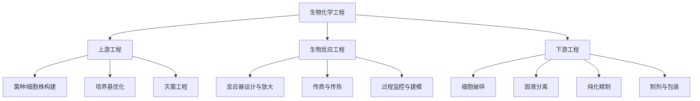
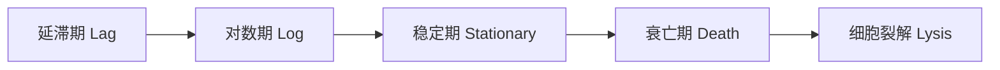
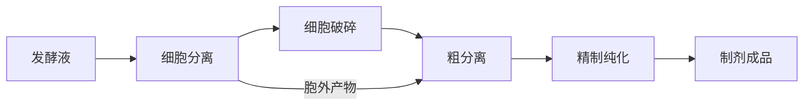

# 生物化学工程

## 一、概述

生物化学工程（Biochemical Engineering）是化学工程与生物技术（Biotechnology）交叉形成的学科分支，核心任务是将实验室规模的生物催化过程（Biocatalytic Process）工程化放大至工业生产规模。其研究对象涵盖微生物发酵（Fermentation）、酶催化（Enzyme Catalysis）、细胞培养（Cell Culture）以及下游生物分离纯化（Bioseparation）。

## 二、学科核心框架

## 三、发酵工程（Fermentation Engineering）

### 3.1 发酵类型

| 类型 | 操作模式 | 特点 | 应用实例 |
|------|---------|------|---------|
| 分批发酵（Batch） | 一次性投料 | 操作简单，生产率低 | 抗生素 |
| 补料分批（Fed-Batch） | 间歇补加底物 | 解除底物抑制，高密度培养 | 重组蛋白 |
| 连续发酵（Continuous） | 恒化器连续进出料 | 长期稳定，易染菌 | 乙醇 |
| 灌注培养（Perfusion） | 保留细胞连续换液 | 极高密度，适合悬浮/贴壁 | 单抗生产 |

### 3.2 发酵动力学

Monod 方程描述微生物比生长速率与限制性底物浓度的关系：

$$
\mu = \frac{\mu_{\max} S}{K_S + S}
$$

其中 $\mu$ 为比生长速率（$\text{h}^{-1}$），$\mu_{\max}$ 为最大比生长速率，$S$ 为底物浓度（$\text{g/L}$），$K_S$ 为半饱和常数（$\text{g/L}$）。

产物生成动力学（Luedeking-Piret 模型）：

$$
\frac{dP}{dt} = \alpha \frac{dX}{dt} + \beta X
$$

其中 $\alpha$ 为生长关联系数，$\beta$ 为非生长关联系数。

### 3.3 细胞生长曲线

## 四、生物反应器（Bioreactor）

### 4.1 主要类型与选型

| 反应器类型 | 传质特性 | 剪切力 | 适用场景 |
|-----------|---------|--------|---------|
| 搅拌釜反应器（STR） | $k_La$ 高 | 高 | 细菌、酵母发酵 |
| 气升式反应器（ALR） | 中等 | 低 | 动物细胞培养 |
| 膜反应器 | 受膜限制 | 极低 | 酶催化、组织工程 |
| 固定床反应器 | 填充床传质 | 低 | 固定化酶、废水处理 |
| 光生物反应器 | 光照限制 | 低 | 微藻培养 |

### 4.2 氧传质

体积氧传质系数 $k_La$ 是关键设计参数：

$$
OTR = k_L a (C^* - C_L)
$$

其中 $OTR$ 为氧传递速率（$\text{mmol O}_2/\text{L·h}$），$k_L$ 为液膜传质系数（$\text{m/h}$），$a$ 为比表面积（$\text{m}^2/\text{m}^3$），$C^*$ 为饱和溶氧浓度，$C_L$ 为实际溶氧浓度。

影响 $k_La$ 的因素：搅拌转速 $N$、通气量 $v_s$、培养基黏度 $\mu$、表面活性剂。经验关联式：

$$
k_L a \propto \left(\frac{P}{V}\right)^\alpha v_s^\beta
$$

## 五、生物催化与酶工程（Biocatalysis & Enzyme Engineering）

### 5.1 固定化酶（Immobilized Enzyme）

固定化方法：吸附法、包埋法、共价结合法、交联法。固定化后酶的稳定性显著提高，可回收重复使用。

米氏方程（Michaelis-Menten）：

$$
v = \frac{V_{\max} [S]}{K_m + [S]}
$$

其中 $v$ 为反应速率，$V_{\max}$ 为最大反应速率，$K_m$ 为米氏常数，$[S]$ 为底物浓度。

### 5.2 酶催化反应器

固定化酶反应器的设计需考虑：

- 内扩散效率因子 $\eta_i = \frac{\tanh \phi}{\phi}$，其中 Thiele 模数 $\phi = R\sqrt{k/E_D}$
- 外扩散效率因子 $\eta_e = \frac{1}{1 + Da}$，其中 Damköhler 数 $Da = k_L a / V_{\max}$

## 六、动物细胞培养（Animal Cell Culture）

### 6.1 培养方式

- **贴壁培养（Adherent）**：需微载体（Microcarrier）提供附着表面
- **悬浮培养（Suspension）**：适用于 CHO 等驯化细胞系
- **微囊化（Microencapsulation）**：海藻酸钙包裹保护

### 6.2 关键工艺参数

| 参数 | 典型范围 | 控制手段 |
|------|---------|---------|
| pH | 7.0-7.4 | CO$_2$ 通气 + 碱液 |
| 溶氧 DO | 30-60% 空气饱和度 | 搅拌 + 纯氧补充 |
| 温度 | 36-37°C | 夹套循环水 |
| 渗透压 | 260-320 mOsm/kg | 培养基配方 |
| 葡萄糖 | 2-6 g/L | 补料策略 |

## 七、下游分离纯化（Downstream Processing）

### 7.1 纯化策略

### 7.2 层析技术（Chromatography）

| 层析类型 | 分离原理 | 分辨率 | 载量 |
|---------|---------|-------|------|
| 离子交换（IEX） | 电荷差异 | 中 | 高 |
| 亲和层析（AC） | 生物特异性 | 高 | 中 |
| 疏水作用（HIC） | 疏水性差异 | 中 | 高 |
| 凝胶过滤（SEC） | 分子尺寸 | 中-低 | 低 |
| 反相（RPC） | 极性差异 | 高 | 低 |

### 7.3 膜分离

切向流过滤（Tangential Flow Filtration, TFF）用于浓缩和透析换液。通量 $J$ 与跨膜压差 $TMP$ 的关系：

$$
J = \frac{TMP}{\mu(R_m + R_c)}
$$

其中 $R_m$ 为膜阻力，$R_c$ 为浓差极化层阻力。

## 八、典型过程经济性

生物制药（单克隆抗体）的生产成本构成：

- 上游培养（25-35%）：培养基、种子培养、生物反应器折旧
- 下游纯化（50-65%）：Protein A 亲和层析、病毒灭活、超滤
- 制剂（5-10%）：配方、灌装、冻干
- QC/QA（5-10%）：质量分析与放行

## 九、生物过程建模与数字化

### 9.1 非结构动力学模型

非结构模型（Unstructured Model）将细胞视为均匀催化体，关注宏观变量：

$$
\frac{dX}{dt} = \mu X - k_d X
$$

$$
\frac{dS}{dt} = -\frac{\mu X}{Y_{X/S}} - m_S X
$$

$$
\frac{dP}{dt} = (\alpha \mu + \beta) X
$$

其中 $Y_{X/S}$ 为细胞得率系数，$m_S$ 为维持系数。

### 9.2 代谢通量分析

代谢通量分析（MFA, Metabolic Flux Analysis）基于细胞内代谢网络的化学计量矩阵 $\mathbf{S}$ 和通量向量 $\mathbf{v}$：

$$
\mathbf{S} \cdot \mathbf{v} = \mathbf{0}
$$

伪稳态假设下，通过测量少数通量可求解放射性标记和质谱数据进行代谢网络定量分析。

### 9.3 PAT 与数字孪生

过程分析技术（PAT, Process Analytical Technology）是实现实时质量控制的关键。常用在线传感器：

- 拉曼光谱（Raman）：底物、产物、代谢物浓度
- NIR 近红外光谱：水分、葡萄糖、乳酸
- 介电谱（Dielectric Spectroscopy）：活细胞生物量
- 在线 HPLC：多组分定量

数字孪生（Digital Twin）将过程模型与在线数据融合，用于实时状态估计和预测控制。

### 9.4 一次性生物反应器

一次性生物反应器（Single-Use Bioreactor, SUB）采用预灭菌塑料培养袋替代不锈钢罐体：

- 优势：免清洗灭菌、换产快速、降低交叉污染风险
- 规模：50-2000 L（波浪式、搅拌式）
- 挑战：浸出物和析出物（Leachables & Extractables）对细胞的影响

## 十、上游工艺开发

### 10.1 细胞系开发

细胞系开发（Cell Line Development）流程：基因转染 → 单细胞克隆 → 加压筛选 → 稳定性评估。CHO 细胞是最常用的哺乳动物表达系统。

表达载体设计：CMV 启动子 + 目标基因 + DHFR/GS 筛选标记。

### 10.2 培养基优化

培养基设计原则：
- 化学限定培养基（CDM）：无动物来源成分，批次一致性高
- 补料策略：指数补料、DO-stat、pH-stat 维持高密度培养

## 十一、生物制药法规

| 监管机构 | 区域 | 关键指南 |
|---------|------|---------|
| NMPA | 中国 | 《药品生产质量管理规范》 |
| FDA | 美国 | CFR 21 Part 210/211, ICH Q5 |
| EMA | 欧盟 | EudraLex Vol 4, Annex 2 |
| ICH | 国际 | Q5A (病毒安全), Q5B (rDNA), Q5D (细胞基质) |

## 十二、生物经济与绿色制造

生物技术正从医药向工业生物技术（Industrial Biotechnology）拓展：

- 生物燃料（Bioethanol, Biobutanol）
- 生物基化学品（1,3-PDO, 琥珀酸, 乳酸）
- 生物可降解塑料（PHA, PLA）
- 合成生物学驱动的细胞工厂构建

## 十三、生物过程验证与监管合规

验证是制药生物过程的强制性要求。验证生命周期：

1. **工艺设计（Process Design）**：通过 QbD 原则识别关键工艺参数（CPP）和关键质量属性（CQA）
2. **工艺确认（Process Qualification）**：至少三个连续成功批次
3. **持续过程验证（CPV, Continued Process Verification）**：运行中批次实时监控

分析方法验证：
- 专属性（Specificity）
- 线性（Linearity）：$R^2 > 0.99$
- 精密度（Precision）：RSD < 5%
- 准确度（Accuracy）：回收率 90-110%
- 检测限（LOD）和定量限（LOQ）
- 耐用性（Robustness）

## 九、前沿发展

- **连续制造（Continuous Manufacturing）**：灌流培养 + 连续层析，提高产率
- **过程分析技术（PAT）**：原位光谱（Raman、NIR）+ 多变量数据分析
- **单细胞组学（Single-Cell Omics）**：揭示细胞异质性，指导培养基优化
- **AI 辅助过程开发**：机器学习预测培养条件和产量优化

## 十四、生物技术应用扩展

### 14.1 细胞与基因治疗

细胞治疗（CAR-T、干细胞）和基因治疗（AAV 载体）代表了生物制药的前沿。

生产过程特点：
- 个性化：自体 CAR-T 每人每批
- 少量高价值：每批次 1-100 L
- 工艺复杂性：病毒载体生产、转导/转染效率控制
- 质量要求：无菌保障、插入位点安全性评估

### 14.2 合成生物学

合成生物学（Synthetic Biology）工程化改造生物系统：

- 最小基因组：J. Craig Venter 实验室合成 JCVI-syn3.0（473 基因）
- 生物砖（BioBricks）：标准化基因模块组装
- CRISPR 基因编辑：精确基因组工程
- 非天然氨基酸插入：扩展遗传密码

## 十五、生物过程经济学

生物技术产品的成本结构与化工产品不同：高 R&D 投入（占营收 15-25%）、长开发周期（10-15 年）、高附加值（单抗 $100-500/g）。

关键成本驱动因素：表达滴度（g/L）、纯化收率（%）、培养基成本（$/L）、生产规模（L）。

表达滴度从 1990 年代 < 0.1 g/L 提升至当前 > 5 g/L（CHO 细胞），单位成本降低 > 90%。

## 十六、总结

生物化学工程作为连接生物学与工程学的桥梁，在医药健康、绿色制造和可持续发展中发挥着核心作用。从基因到产品的全链条知识——细胞工程、反应器放大、下游纯化、过程验证——构成了这一学科的知识体系。

## 相关条目
- [[04_EngineeringAndTechnology/ChemicalAndPharmaceuticalEngineering/ChemicalEngineering/INDEX|当前目录索引]]
- [[SeparationProcesses]]
- [[TransportPhenomena]]
- [[ChemicalProcessDesign]]
