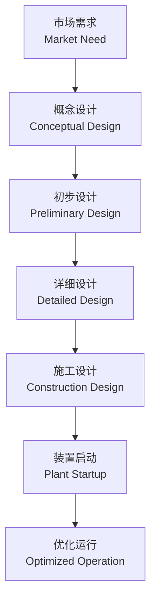
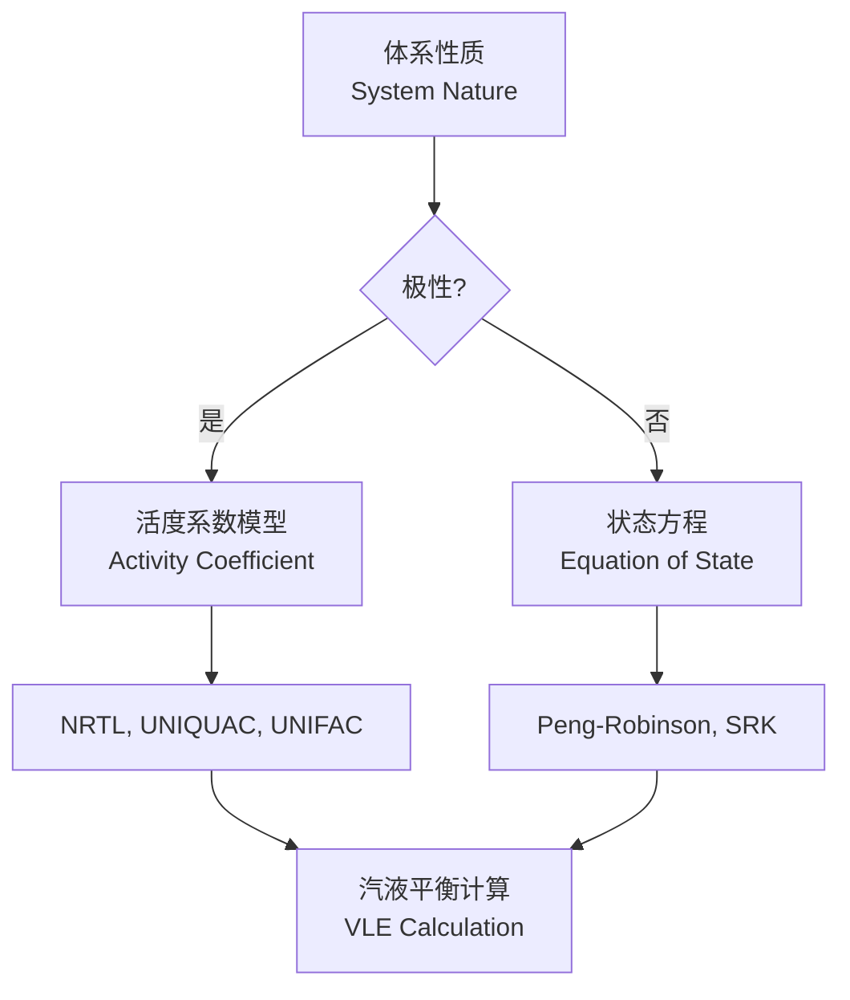

---
aliases:
  - Chemical Process Design
  - 化工设计
  - 过程设计
tags:
created: 2026-05-17
updated: 2026-05-17
  - chemical-engineering
  - process-design
  - unit-operations
  - simulation
---

# 化工过程设计 (Chemical Process Design)

化工过程设计是化学工程的核心领域，涉及将原材料通过一系列物理和化学转化转变为有价值产品的系统性设计方法。

## 设计基础 (Design Fundamentals)

化工过程设计遵循从概念到实施的完整生命周期。设计过程始于市场需求分析，终于装置启动与优化。

### 设计层次 (Design Hierarchy)

过程设计可分为多个层次：

- **概念设计 (Conceptual Design)**：确定技术路线和基本流程
- **初步设计 (Preliminary Design)**：物料衡算与能量衡算
- **详细设计 (Detailed Design)**：设备选型与管道布置
- **施工设计 (Construction Design)**：工程图纸与规范

### 过程合成 (Process Synthesis)

过程合成旨在寻找最优的过程拓扑结构，包括：

- 反应路径选择 (Reaction Pathway Selection)
- 分离序列合成 (Separation Sequence Synthesis)
- 热交换网络 (Heat Exchanger Network, HEN)
- 公用工程集成 (Utility Integration)

## 工艺流程图 (Process Flow Diagrams)

工艺流程图是化工设计的核心沟通工具，采用标准化符号表示设备、管道和仪表。

### PFD 与 P&ID

| 图表类型 | 英文名称 | 详细程度 | 用途 |
|----------|----------|----------|------|
| 工艺流程图 | PFD | 中等 | 物料衡算、能量衡算 |
| 管道仪表图 | P&ID | 极高 | 施工、操作、维护 |
| 方块流程图 | Block Flow Diagram | 低 | 概念阶段 |
| 公用工程流程图 | Utility Flow Diagram | 中等 | 公用系统设计 |

P&ID 包含完整的设备编号、管道规格、阀门类型、仪表回路和控制方案。每个设备都有唯一的标识符，遵循 ISA S5.1 标准。

### 物料衡算 (Material Balances)

物料衡算基于质量守恒定律：

$$
\sum \dot{m}_{in} = \sum \dot{m}_{out} + \frac{dm}{dt}
$$

对于稳态过程，累积项为零：

$$
\sum \dot{m}_{in} = \sum \dot{m}_{out}
$$

组分衡算需要考虑化学反应：

$$
F_{i,in} + \sum_{j} \nu_{ij} r_j V = F_{i,out}
$$

其中 $\nu_{ij}$ 为化学计量系数，$r_j$ 为反应速率，$V$ 为反应器体积。

## 单元操作 (Unit Operations)

单元操作是构成化工过程的基本模块，可分为以下几类：

### 流体流动与输送

- **泵 (Pumps)**：离心泵、容积泵、流体喷射泵
- **压缩机 (Compressors)**：往复式、离心式、轴流式
- **管道与管件 (Piping)**：管径计算、压降分析、水力计算

管径计算基于经济流速和压降限制：

$$
\Delta P = f \frac{L}{D} \frac{\rho v^2}{2}
$$

其中 $f$ 为摩擦系数，$L$ 为管长，$D$ 为管径，$\rho$ 为密度，$v$ 为流速。

### 传热设备 (Heat Transfer Equipment)

| 设备类型 | 适用场合 | 传热系数范围 $[W/(m^2 \cdot K)]$ |
|----------|----------|--------------------------------|
| 管壳式换热器 | 一般用途 | 300-1000 |
| 板式换热器 | 卫生要求、紧凑 | 1500-4000 |
| 空冷器 | 缺水地区 | 50-150 |
| 再沸器 | 蒸馏塔底 | 500-2000 |

### 反应器设计 (Reactor Design)

反应器类型包括：

- **间歇反应器 (Batch Reactor)**：适合小批量、多品种
- **连续搅拌釜反应器 (CSTR)**：适合液相反应
- **活塞流反应器 (PFR)**：适合气相反应
- **流化床反应器 (Fluidized Bed)**：适合催化反应

CSTR 设计方程：

$$
V = \frac{F_{A0} X}{-r_A}
$$

PFR 设计方程：

$$
V = F_{A0} \int_0^X \frac{dX}{-r_A}
$$

## 过程模拟 (Process Simulation)

现代化工设计广泛采用流程模拟软件进行严格计算。

### 模拟方法

| 方法 | 英文名称 | 特点 | 代表软件 |
|------|----------|------|----------|
| 序贯模块法 | Sequential Modular | 直观、稳定 | Aspen Plus, PRO/II |
| 联立方程法 | Equation-Oriented | 快速、灵活 | gPROMS, Aspen Custom Modeler |
| 联立线性法 | Simultaneous Linear | 大规模优化 | ROMeo |

### 物性方法选择

物性方法是模拟精度的关键：

## 安全与优化 (Safety and Optimization)

### 本质安全设计 (Inherently Safer Design)

本质安全设计遵循四个原则：

1. **最小化 (Minimize)**：减少危险物质存量
2. **替代 (Substitute)**：使用更安全的物料
3. **缓和 (Moderate)**：降低操作条件苛刻度
4. **简化 (Simplify)**：减少复杂性和误操作可能

### 过程优化 (Process Optimization)

优化问题的一般形式：

$$
\min_{x} f(x)
$$

约束条件：

$$
g(x) \leq 0, \quad h(x) = 0
$$

常用优化方法：

- 线性规划 (Linear Programming, LP)
- 非线性规划 (Nonlinear Programming, NLP)
- 混合整数规划 (Mixed Integer Programming, MINLP)

## 设计文档 (Design Documentation)

完整的设计文档包括：

- **设计基础 (Design Basis)**：产能、原料规格、产品规格
- **物料衡算书 (Material Balance)**：各物流的流量与组成
- **能量衡算书 (Energy Balance)**：供热、供冷、功耗
- **设备数据表 (Equipment Datasheets)**：设计参数与操作条件
- **安全分析报告 (Safety Analysis)**：HAZOP、LOPA 报告

## 参考资料 (References)

- Turton, R. et al. *Analysis, Synthesis and Design of Chemical Processes*
- Seider, W.D. et al. *Product and Process Design Principles*
- Douglas, J.M. *Conceptual Design of Chemical Processes*
