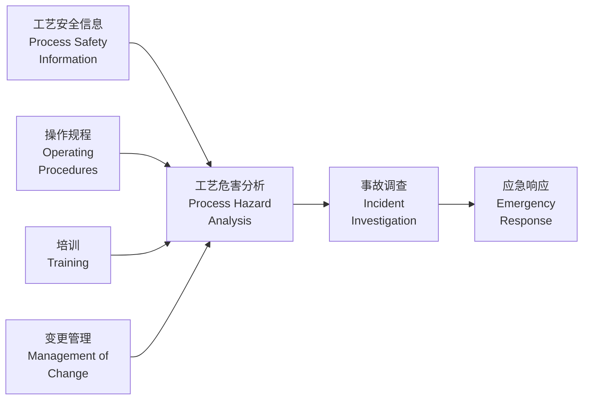
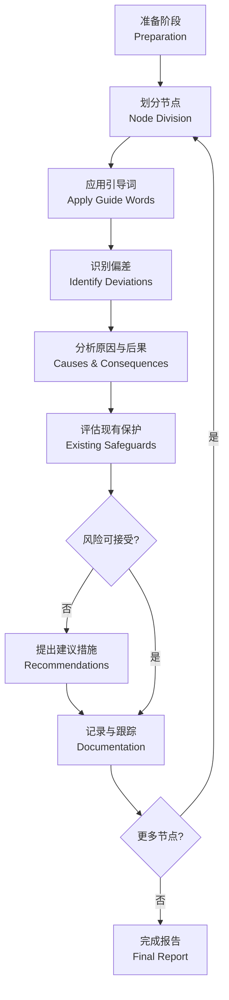
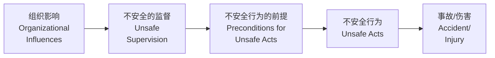

---
aliases:
  - Process Safety
  - 过程安全工程
  - 化工安全
tags:
  - safety
  - risk-assessment
  - hazop
  - lopa
  - chemical-engineering
---

# 过程安全 (Process Safety)

过程安全是化学工程与工艺管理的核心领域，专注于预防和控制可能导致重大事故的化学过程危害。与个人安全防护不同，过程安全关注系统层面的风险控制。

## 安全管理体系 (Safety Management Systems)

有效的过程安全管理需要系统化的组织架构、程序和文化。

### 过程安全管理要素

过程安全管理 (Process Safety Management, PSM) 包含以下核心要素：

### 安全文化 (Safety Culture)

安全文化分为四个层次：

| 层次 | 特征 | 描述 |
|------|------|------|
| pathological | 病态型 | 安全是别人的问题 |
| reactive | 反应型 | 事后处理 |
| calculative | 计算型 | 基于数据的管理 |
| proactive | 主动型 | 持续改进 |
| generative | 生成型 | 安全融入每个决策 |

## 危险与可操作性分析 (HAZOP)

HAZOP (Hazard and Operability Study) 是一种系统化的定性风险分析方法。

### HAZOP 方法论

HAZOP 通过引导词 (Guide Words) 与工艺参数的组合来识别偏差：

| 引导词 | 含义 | 示例 |
|--------|------|------|
| 无 (NO) | 完全没有 | 无流量 |
| 少 (LESS) | 数量减少 | 低流量 |
| 多 (MORE) | 数量增加 | 高流量 |
| 部分 (PART OF) | 组成变化 | 杂质存在 |
| 相反 (REVERSE) | 方向相反 | 逆流 |
| 异常 (OTHER THAN) | 其他情况 | 维护操作 |

### HAZOP 分析流程

## 保护层分析 (LOPA)

LOPA (Layer of Protection Analysis) 是半定量风险评估方法，用于评估是否需要额外的安全仪表功能 (Safety Instrumented Function, SIF)。

### 独立保护层 (IPL)

| 保护层类型 | 英文名称 | 典型 PFD |
|-----------|----------|----------|
| 基本过程控制系统 | BPCS | $10^{-1}$ 至 $10^{-2}$ |
| 报警与人员干预 | Alarm + Operator | $10^{-1}$ 至 $10^{-2}$ |
| 安全仪表系统 | SIS / SIF | $10^{-1}$ 至 $10^{-5}$ |
| 物理泄压装置 | Relief Device | $10^{-2}$ 至 $10^{-3}$ |
| 围堰/泄放系统 | Containment | $10^{-2}$ 至 $10^{-3}$ |

### LOPA 计算

场景频率计算公式：

$$
f_i^C = f_i^I \times \prod_{j=1}^{n} PFD_{ij}
$$

其中 $f_i^I$ 为初始事件频率，$PFD_{ij}$ 为第 $j$ 个独立保护层的失效概率。

风险降低需求：

$$
RRF = \frac{f_{before}}{f_{target}}
$$

安全完整性等级 (SIL) 对应关系：

| SIL 等级 | PFD 范围 | RRF 范围 |
|---------|----------|----------|
| SIL 1 | $10^{-1}$ 至 $10^{-2}$ | 10 至 100 |
| SIL 2 | $10^{-2}$ 至 $10^{-3}$ | 100 至 1,000 |
| SIL 3 | $10^{-3}$ 至 $10^{-4}$ | 1,000 至 10,000 |
| SIL 4 | $10^{-4}$ 至 $10^{-5}$ | 10,000 至 100,000 |

## 安全仪表系统 (Safety Instrumented Systems)

SIS 是实现过程安全的关键自动化系统。

### SIS 生命周期

根据 IEC 61511 标准，SIS 生命周期包括：

1. **危害与风险评估 (Hazard and Risk Assessment)**
2. **安全要求规格 (Safety Requirements Specification)**
3. **设计与工程 (Design and Engineering)**
4. **安装与调试 (Installation and Commissioning)**
5. **运行与维护 (Operation and Maintenance)**
6. **变更管理 (Management of Change)**
7. **退役 (Decommissioning)**

### 安全仪表功能设计

SIF 的回路由三部分组成：

- **传感器 (Sensor)**：检测过程变量
- **逻辑求解器 (Logic Solver)**：判断并输出
- **最终元件 (Final Element)**：执行安全动作

## 事故调查 (Incident Investigation)

系统化的事故调查是预防重复发生的关键。

### 调查方法

| 方法 | 英文名称 | 适用场景 |
|------|----------|----------|
| 故障树分析 | Fault Tree Analysis | 复杂系统逻辑分析 |
| 事件树分析 | Event Tree Analysis | 后果序列分析 |
| 根源分析 | Root Cause Analysis | 管理因素识别 |
| 瑞士奶酪模型 | Swiss Cheese Model | 组织因素分析 |

### 瑞士奶酪模型

每一片奶酪代表一个防御层，孔洞代表缺陷。事故仅在所有防御层同时失效时发生。

## 定量风险分析 (Quantitative Risk Analysis)

### 后果分析 (Consequence Analysis)

泄漏后果模型包括：

- **源项模型 (Source Term)**：泄漏速率计算
- **扩散模型 (Dispersion)**：蒸气云扩散
- **效应模型 (Effect)**：热辐射、超压、毒性

泄漏速率（液体）：

$$
Q_L = C_d A \sqrt{2 \rho \Delta P}
$$

蒸气云爆炸超压估计（TNT 当量法）：

$$
W_{TNT} = \frac{\beta \cdot m \cdot \Delta H_c}{E_{TNT}}
$$

### 风险度量

| 指标 | 定义 | 单位 |
|------|------|------|
| 个人风险 | Individual Risk | 年死亡概率 |
| 社会风险 | Societal Risk | F-N 曲线 |
| 潜在生命损失 | PLL | 人/年 |

## 应急响应 (Emergency Response)

应急响应计划包括：

- **泄漏控制 (Leak Containment)**：围堰、收集系统
- **火灾响应 (Fire Response)**：消防水、泡沫系统
- **人员疏散 (Evacuation)**：警报、集合点
- **医疗救助 (Medical Aid)**：急救、洗消

## 参考资料 (References)

- CCPS. *Guidelines for Hazard Evaluation Procedures*
- IEC 61511. *Functional Safety - Safety Instrumented Systems for Process Industry*
- Kletz, T. *What Went Wrong? Case Histories of Process Plant Disasters*
