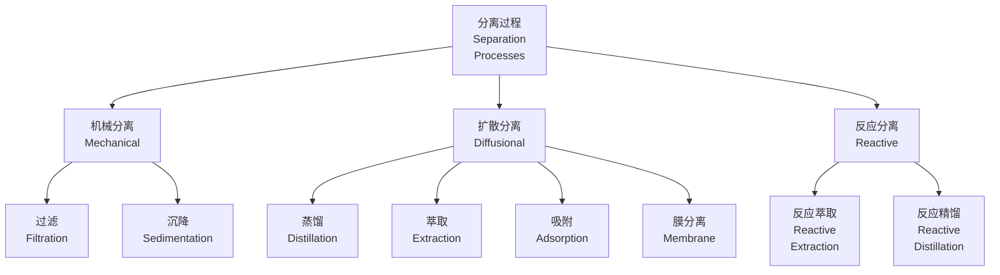
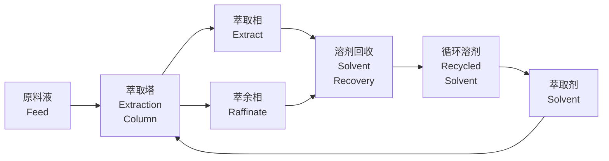
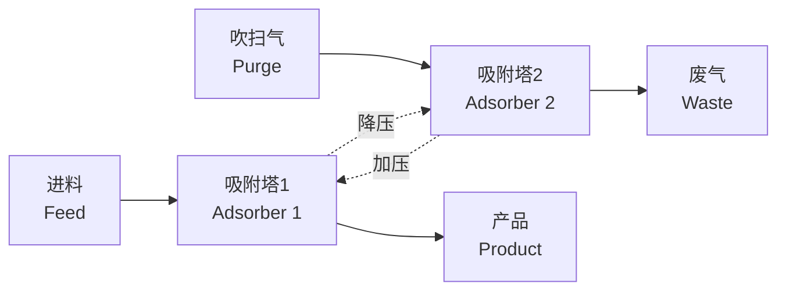

---
aliases:
  - Separation Processes
  - 分离工程
  - 分离技术
tags:
created: 2026-05-17
updated: 2026-05-17
  - separation
  - distillation
  - extraction
  - adsorption
  - membrane
---

# 分离过程 (Separation Processes)

分离过程是化学工程的核心单元操作，用于将混合物分离为具有不同组成的物流。分离技术的选择直接影响过程的经济性和环境影响。

## 分离基础 (Fundamentals of Separation)

分离基于混合物中各组分在物理或化学性质上的差异。

### 分离因子 (Separation Factor)

分离因子定义为两组分分配系数的比值：

$$
\alpha_{ij} = \frac{K_i}{K_j}
$$

其中 $K_i = y_i / x_i$ 为相平衡分配系数。当 $\alpha_{ij} > 1$ 时，分离在热力学上是可行的。

### 分离方法分类

## 蒸馏 (Distillation)

蒸馏是最广泛使用的分离技术，基于组分挥发度的差异。

### 汽液平衡 (VLE)

对于二元系统，相对挥发度定义为：

$$
\alpha = \frac{y_A / x_A}{y_B / x_B} = \frac{P_A^s}{P_B^s}
$$

理想溶液的汽液平衡：

$$
y_i = \frac{\alpha x_i}{1 + (\alpha - 1) x_i}
$$

### 蒸馏塔设计

| 参数 | 符号 | 计算方法 |
|------|------|----------|
| 最小理论板数 | $N_{min}$ | Fenske 方程 |
| 最小回流比 | $R_{min}$ | Underwood 方程 |
| 实际回流比 | $R$ | $1.2 \sim 1.5$ 倍 $R_{min}$ |
| 塔板效率 | $E_o$ | O'Connell 关联式 |

Fenske 方程（全回流时）：

$$
N_{min} = \frac{\ln\left[\left(\frac{x_D}{1-x_D}\right)\left(\frac{1-x_B}{x_B}\right)\right]}{\ln \alpha}
$$

### 特殊蒸馏

- **萃取蒸馏 (Extractive Distillation)**：加入溶剂改变相对挥发度
- **共沸蒸馏 (Azeotropic Distillation)**：加入夹带剂形成新共沸物
- **反应精馏 (Reactive Distillation)**：反应与分离同时进行
- **分子蒸馏 (Molecular Distillation)**：高真空下的短程蒸馏

## 液液萃取 (Liquid-Liquid Extraction)

萃取适用于沸点接近或热敏性物质的分离。

### 萃取基础

分配系数：

$$
K_D = \frac{y}{x}
$$

其中 $y$ 为萃取相浓度，$x$ 为萃余相浓度。

### 萃取设备

| 设备类型 | 英文名称 | 特点 |
|----------|----------|------|
| 混合澄清槽 | Mixer-Settler | 级效率高，占地大 |
| 填料萃取塔 | Packed Column | 结构简单，处理能力低 |
| 转盘萃取塔 | RDC | 机械搅拌，效率高 |
| 离心萃取器 | Centrifugal | 停留时间短，适合不稳定体系 |

### 萃取流程

## 吸收 (Absorption)

吸收是用液体吸收剂处理气体混合物的过程。

### 气液平衡

亨利定律（稀溶液）：

$$
p_A = H_A x_A
$$

或

$$
y_A = m x_A
$$

其中 $H_A$ 为亨利常数，$m$ 为相平衡常数。

### 吸收塔设计

传质单元数法：

$$
N_{OG} = \int_{y_2}^{y_1} \frac{dy}{y - y^*}
$$

传质单元高度：

$$
H_{OG} = \frac{G}{K_y a}
$$

塔高：

$$
Z = N_{OG} \times H_{OG}
$$

## 吸附 (Adsorption)

吸附利用固体表面对流体中组分的选择性吸附实现分离。

### 吸附等温线

| 等温线模型 | 表达式 | 适用条件 |
|-----------|--------|----------|
| Langmuir | $q = \frac{q_m K p}{1 + K p}$ | 单分子层吸附 |
| Freundlich | $q = K p^{1/n}$ | 非均匀表面 |
| BET | 多层吸附公式 | 比表面积测定 |

Langmuir 等温线基于以下假设：
- 表面均匀
- 单分子层吸附
- 吸附分子间无相互作用

### 变压吸附 (PSA)

变压吸附循环包括：

1. **加压吸附 (Adsorption at High Pressure)**
2. **降压解吸 (Depressurization)**
3. **吹扫再生 (Purge)**
4. **加压准备 (Repressurization)**

## 膜分离 (Membrane Separation)

膜分离基于膜对混合物中各组分选择透过性的差异。

### 膜分离类型

| 过程 | 英文名称 | 驱动力 | 应用 |
|------|----------|--------|------|
| 反渗透 | Reverse Osmosis | 压力 | 海水淡化 |
| 超滤 | Ultrafiltration | 压力 | 蛋白质分离 |
| 纳滤 | Nanofiltration | 压力 | 水软化 |
| 气体分离 | Gas Separation | 压力 | 氢气回收 |
| 渗透汽化 | Pervaporation | 分压差 | 脱水 |
| 电渗析 | Electrodialysis | 电场 | 脱盐 |

### 渗透通量

根据溶解-扩散模型：

$$
J_i = \frac{P_i}{l}(p_{f} - p_{p})
$$

其中 $P_i$ 为渗透系数，$l$ 为膜厚，$p_f$ 和 $p_p$ 分别为进料侧和渗透侧分压。

分离因子：

$$
\alpha_{A/B} = \frac{P_A}{P_B}
$$

## 分离过程选择 (Separation Process Selection)

| 分离任务 | 推荐方法 | 替代方法 |
|----------|----------|----------|
| 易挥发液体混合物 | 蒸馏 | 萃取、吸附 |
| 沸点相近/共沸物 | 萃取蒸馏 | 共沸蒸馏、膜分离 |
| 热敏性物质 | 萃取、膜分离 | 分子蒸馏 |
| 气体混合物 | 吸收、吸附 | 膜分离、深冷 |
| 大分子/胶体 | 超滤 | 离心、过滤 |
| 离子/小分子 | 电渗析、反渗透 | 离子交换、吸附 |

## 参考资料 (References)

- Seader, J.D. et al. *Separation Process Principles*
- Wankat, P.C. *Separation Process Engineering*
- Mulder, M. *Basic Principles of Membrane Technology*
