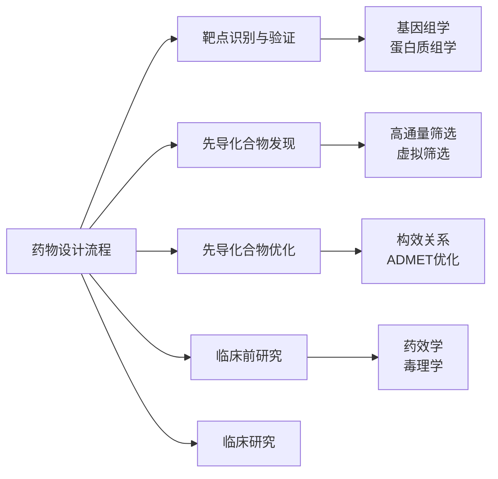

# 药物设计 (Drug Design)

## 概述

药物设计（Drug Design），又称药物分子设计或合理药物设计（Rational Drug Design），是根据疾病发生机制和药物作用靶点（drug target），运用化学、生物学、药理学和计算机科学等多学科知识，设计和优化具有治疗活性的新分子实体的科学。现代药物设计已从传统的随机筛选发展为基于靶点结构、机制和生物信息学的理性设计方法。

药物研发是一个漫长且高风险的过程，平均耗时 10-15 年，成本超过 20 亿美元。药物设计阶段的成功与否直接决定了后续临床前和临床开发的效率和成功率。

## 药物作用靶点

### 靶点类型

药物通过与体内特定生物大分子相互作用产生药理效应，这些大分子称为药物靶点。

| 靶点类型 | 占比 | 典型例子 | 药物示例 |
|----------|------|----------|----------|
| 受体（Receptors） | ~50% | GPCR、核受体、离子通道 | 普萘洛尔、他莫昔芬 |
| 酶（Enzymes） | ~30% | 激酶、蛋白酶、聚合酶 | 阿司匹林、伊马替尼 |
| 离子通道（Ion Channels） | ~5% | 电压门控、配体门控 | 氨氯地平、利多卡因 |
| 转运体（Transporters） | ~5% | 神经递质转运体 | 氟西汀、地高辛 |
| 核酸（Nucleic Acids） | ~2% | DNA、RNA | 环磷酰胺、阿霉素 |
| 其他 | ~8% | 蛋白-蛋白相互作用 | 来那度胺 |

### 靶点识别与验证

**靶点识别**：

- **基因组学（Genomics）**：全基因组关联分析（GWAS）发现疾病相关基因
- **蛋白质组学（Proteteomics）**：差异蛋白质表达分析
- **生物信息学**：疾病通路分析、靶点可成药性（druggability）评估

**靶点验证**：

- 基因敲除/敲入动物模型
- RNA 干扰（RNAi）和 CRISPR 技术
- 化学探针（chemical probes）验证
- 临床样本表达验证

## 先导化合物发现

### 高通量筛选（High-Throughput Screening, HTS）

通过自动化设备对大型化合物库（数万至数百万个化合物）进行快速活性筛选。

**筛选流程**：

**化合物库来源**：

- 合成化合物库：组合化学、多样性导向合成
- 天然产物库：植物、微生物、海洋生物提取物
- 已上市药物库：老药新用（drug repurposing）
- 片段库（Fragment Library）：分子量 <300 Da 的小分子片段

### 基于结构的药物设计（Structure-Based Drug Design, SBDD）

利用靶蛋白的三维结构信息进行药物设计。

**分子对接（Molecular Docking）**：

将候选小分子对接到靶蛋白的活性位点（active site），预测其结合模式和亲和力。

$$\Delta G_{bind} = \Delta G_{vdW} + \Delta G_{elec} + \Delta G_{H-bond} + \Delta G_{desolv} + \Delta G_{tors}$$

常用软件：AutoDock、Glide、GOLD、MOE。

**虚拟筛选（Virtual Screening）**：

- 基于结构的虚拟筛选（SBVS）：对接打分筛选化合物库
- 基于配体的虚拟筛选（LBVS）：利用已知活性分子的相似性搜索

### 基于配体的药物设计（Ligand-Based Drug Design, LBDD）

当靶蛋白结构未知时，基于已知活性分子的化学特征进行设计。

**药效团模型（Pharmacophore）**：

药效团是药物分子中与靶点相互作用并产生生物活性所必需的几何排列的功能基团集合。

$$药效团特征 = \{氢键供体, 氢键受体, 疏水中心, 电荷中心, 芳香环\}$$

**定量构效关系（Quantitative Structure-Activity Relationship, QSAR）**：

建立分子描述符（descriptor）与生物活性之间的数学模型：

$$\log(1/IC_{50}) = a \cdot \log P + b \cdot MR + c \cdot \sigma + d$$

常用方法：Hansch 分析、CoMFA、机器学习模型。

## 先导化合物优化

### 构效关系（Structure-Activity Relationship, SAR）

通过系统性的结构修饰，研究分子结构变化对生物活性的影响规律。

**优化策略**：

- 生物电子等排体替换（bioisosteric replacement）
- 骨架跃迁（scaffold hopping）
- 前药设计（prodrug design）
- 软药设计（soft drug design）

### ADMET 性质优化

先导化合物需具备良好的吸收、分布、代谢、排泄和毒性（ADMET）性质才能成为候选药物。

**吸收（Absorption）**：

- 口服生物利用度（F）
- 肠渗透性（Caco-2 细胞模型）
- 溶解度（BCS 分类）

**Lipinski 五规则（Rule of Five）**：

| 参数 | 阈值 | 说明 |
|------|------|------|
| 分子量（MW） | <500 Da | 过大影响吸收 |
| 脂水分配系数（logP） | <5 | 过脂影响溶解 |
| 氢键供体（HBD） | <5 | 过多影响渗透 |
| 氢键受体（HBA） | <10 | 过多影响渗透 |

违反两条以上规则，口服吸收可能较差。

**分布（Distribution）**：

- 血浆蛋白结合率（PPB）
- 血脑屏障透过性（BBB）
- 组织分布容积（$V_d$）

**代谢（Metabolism）**：

- 细胞色素 P450 酶（CYP1A2、CYP2C9、CYP2D6、CYP3A4）代谢稳定性
- 药物-药物相互作用潜力
- 代谢产物鉴定

**排泄（Excretion）**：

- 肾脏清除率
- 胆汁排泄
- 半衰期（$t_{1/2}$）

**毒性（Toxicity）**：

- 急性毒性（LD₅₀）
- 遗传毒性（Ames 试验）
- 心脏毒性（hERG 钾通道抑制）
- 肝脏毒性
- 致癌性

## 计算机辅助药物设计工具

### 分子模拟方法

| 方法 | 原理 | 应用 | 时间尺度 |
|------|------|------|----------|
| **分子对接** | 刚性/柔性对接算法 | 结合模式预测 | 毫秒级 |
| **分子动力学（MD）** | Newton 运动方程 | 构象变化、结合自由能 | 纳秒-微秒 |
| **自由能微扰（FEP）** | 热力学循环 | 精确计算结合亲和力 | 依赖体系 |
| **QM/MM** | 量子/分子力学联用 | 反应机制研究 | 皮秒级 |

### 人工智能在药物设计中的应用

- **深度学习**：分子性质预测、靶点预测
- **生成模型**：de novo 分子设计
- **强化学习**：多参数优化
- **自然语言处理**：文献挖掘、专利分析

## 药物合成与工艺

### 逆合成分析（Retrosynthetic Analysis）

Corey 提出的逆合成方法是从目标分子出发，逆向推导出可行的合成路线。

$$\text{目标分子} \xrightarrow{\text{逆向切割}} \text{前体} \xrightarrow{\text{继续分析}} \text{起始原料}$$

### 绿色化学原则

- 原子经济性（Atom Economy）：最大化利用原料原子
- 减少副产物和废物
- 使用可再生原料和环境友好溶剂
- 设计可降解产品

## 药物设计的成功案例

| 药物 | 靶点 | 设计方法 | 疾病 |
|------|------|----------|------|
| 伊马替尼（格列卫） | BCR-ABL 激酶 | 基于结构的合理设计 | 慢性髓性白血病 |
| 奥司他韦（达菲） | 神经氨酸酶 | 基于结构的虚拟筛选 | 流感 |
| 沙奎那韦 | HIV 蛋白酶 | 基于结构的药物设计 | 艾滋病 |
| 阿利吉仑 | 肾素 | 基于结构的优化 | 高血压 |
| 索拉非尼 | 多靶点激酶 | 组合化学优化 | 肾癌、肝癌 |

## 经典教材与资源

- 尤启冬《药物化学》（第 8 版）
- 仇文升《药物化学》
- Wermuth《The Practice of Medicinal Chemistry》（第 4 版）
- Patrick《An Introduction to Medicinal Chemistry》（第 6 版）
- Leach《Molecular Modelling: Principles and Applications》

## 主要应用领域

- 创新药物研发（First-in-Class, Best-in-Class）
- 仿制药开发与工艺改进
- 药物改良型新药（505(b)(2)）
- 抗肿瘤靶向药物
- 抗感染药物（抗生素、抗病毒、抗真菌）
- 神经系统药物（CNS drugs）
- 自身免疫疾病药物

## 相关条目

- [[Formulation|药物制剂]]
- [[FineChemicals|精细化学品]]
- [[GeneCloning|基因克隆]]
- [[Biomaterials|生物材料]]
- [[Pharmacokinetics|药代动力学]]
- [[Toxicology|毒理学]]
