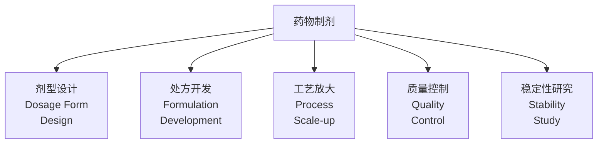
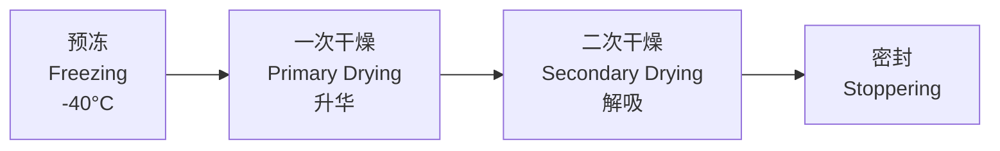

# 药物制剂（Pharmaceutical Formulation）

## 概述

药物制剂（Pharmaceutical Formulation）是研究将原料药（Active Pharmaceutical Ingredient, API）制成适合临床使用剂型的理论、工艺和技术的学科。制剂设计需要综合考虑药物的理化性质（Physicochemical Properties）、生物药剂学特性（Biopharmaceutical Properties）、患者的依从性（Patient Compliance）和工业化生产的可行性。

药物制剂是连接药物发现（Drug Discovery）与临床应用的关键桥梁。一种新化合物即使具有优异的体外活性，如果无法制成安全、有效、稳定的制剂，也无法成为上市药品。现代药物制剂已从传统的经验性制备发展为基于质量源于设计（Quality by Design, QbD）理念的理性设计科学。

## 剂型分类

### 按给药途径分类

| 给药途径 | 剂型示例 | 吸收特点 | 临床应用 |
|----------|----------|----------|----------|
| 口服（Oral） | 片剂、胶囊、颗粒、口服液 | 胃肠道吸收、首过效应 | 最常用、患者依从性好 |
| 注射（Parenteral） | 注射液、冻干粉针、输液 | 直接进入体循环 | 急救、不能口服者 |
| 皮肤给药（Dermal） | 软膏、贴剂、凝胶 | 经皮吸收缓慢 | 局部或全身缓释 |
| 眼部给药（Ocular） | 滴眼液、眼膏、植入剂 | 角膜吸收 | 青光眼、感染 |
| 鼻腔给药（Nasal） | 鼻喷剂 | 鼻黏膜吸收、 bypass BBB | 疫苗、多肽 |
| 肺部给药（Pulmonary） | 气雾剂、干粉吸入剂 | 肺泡表面积大 | 哮喘、COPD |
| 直肠给药（Rectal） | 栓剂、灌肠剂 | 直肠下静脉 bypass 肝脏 | 儿童、呕吐患者 |
| 阴道给药（Vaginal） | 栓剂、凝胶、环 | 黏膜吸收 | 局部抗菌、避孕 |

### 固体剂型

#### 片剂（Tablets）

| 片剂类型 | 特点 | 释放机制 | 示例 |
|----------|------|----------|------|
| 普通片 | 快速崩解释放 | 崩解→溶出→吸收 | 阿司匹林片 |
| 包衣片（Coated） | 掩味、保护、美观 | 衣层溶解后药物释放 | 肠溶片 |
| 缓释片（SR） | 延长释放时间 | 扩散、溶蚀、渗透 | 硝苯地平缓释片 |
| 控释片（CR） | 恒定速率释放 | 零级释放动力学 | 渗透泵片 |
| 泡腾片 | 快速溶解、口感好 | 酸碱反应产生 CO₂ | 维 C 泡腾片 |
| 分散片 | 水中快速分散 | 超崩解剂作用 | 阿奇霉素分散片 |
| 咀嚼片 | 咀嚼后服用 | 机械破碎 + 唾液溶解 | 铝碳酸镁咀嚼片 |
| 口崩片（ODT） | 口腔内快速崩解 | 超崩解剂 + 快速溶解 | 奥氮平口崩片 |

#### 胶囊剂（Capsules）

| 类型 | 囊壳材料 | 填充物 | 特点 |
|------|----------|--------|------|
| 硬胶囊（Hard Capsule） | 明胶或 HPMC | 粉末、颗粒、微丸 | 可填装不同释放速率微丸 |
| 软胶囊（Soft Capsule） | 明胶 + 增塑剂 | 油状或混悬液 | 密封性好、可填装液体 |
| 肠溶胶囊 | 肠溶材料 | 对胃刺激药物 | 肠道定位释放 |

### 液体制剂

| 剂型 | 分散相大小 | 稳定性特点 | 典型应用 |
|------|-----------|-----------|----------|
| 溶液剂（Solution） | 分子分散 | 热力学稳定 | 口服液、注射液 |
| 混悬剂（Suspension） | 0.5–10 μm | 动力学不稳定，需助悬剂 | 布洛芬混悬液 |
| 乳剂（Emulsion） | 0.1–100 μm | 热力学不稳定，需乳化剂 | 静脉脂肪乳 |
| 胶体溶液（Colloid） | 1–100 nm | 动力学稳定 | 银胶体 |

### 半固体剂型

| 剂型 | 基质类型 | 特点 | 应用 |
|------|----------|------|------|
| 软膏（Ointment） | 油脂性、乳剂型、水溶性 | 皮肤附着性好 | 皮肤病、局部镇痛 |
| 乳膏（Cream） | O/W 或 W/O 乳剂 | 易涂布、美观 | 护肤、抗炎 |
| 凝胶（Gel） | 高分子凝胶基质 | 透明、清爽 | 痤疮、眼部给药 |
| 栓剂（Suppository） | 可可脂、半合成脂肪酸酯 | 体温下融化或溶解 | 直肠、阴道给药 |

## 辅料（Excipients）

辅料是制剂中除 API 外的所有成分，虽无药理活性，但对制剂性能至关重要。

### 固体制剂常用辅料

| 功能分类 | 辅料名称 | 作用机制 | 常用比例 |
|----------|----------|----------|----------|
| 填充剂（Diluent） | 乳糖、微晶纤维素（MCC）、淀粉 | 增加片重、改善可压性 | 10–90% |
| 粘合剂（Binder） | PVP、HPMC、淀粉浆 | 促进颗粒聚结 | 2–10% |
| 崩解剂（Disintegrant） | 交联羧甲基纤维素钠（CCNa）、PVPP、L-HPC | 吸水膨胀破坏结构 | 2–10% |
| 润滑剂（Lubricant） | 硬脂酸镁、滑石粉、聚乙二醇 | 减少摩擦、防止粘冲 | 0.25–2% |
| 助流剂（Glidant） | 胶态二氧化硅 | 改善粉末流动性 | 0.1–1% |
| 包衣材料（Coating） | HPMC、Eudragit、PEG | 掩味、控释、保护 | 2–5% 增重 |

### 液体制剂常用辅料

| 功能分类 | 辅料示例 | 作用 |
|----------|----------|------|
| 增溶剂（Solubilizer） | 聚山梨酯 80、SLS | 增加难溶药物溶解度 |
| 助悬剂（Suspending Agent） | CMC-Na、黄原胶、西黄蓍胶 | 维持混悬剂均匀分散 |
| 乳化剂（Emulsifier） | 卵磷脂、Tween、Span | 降低界面张力、稳定乳剂 |
| 防腐剂（Preservative） | 苯甲酸钠、山梨酸钾、尼泊金酯 | 抑制微生物生长 |
| 抗氧剂（Antioxidant） | BHT、BHA、VC、亚硫酸钠 | 防止药物氧化降解 |
| pH 调节剂 | 柠檬酸、磷酸盐、NaOH | 维持适宜 pH |
| 等渗调节剂 | NaCl、葡萄糖、甘露醇 | 调节渗透压 |

## 制剂工艺

### 固体制剂工艺

#### 制粒（Granulation）

制粒是将细粉聚结成较大颗粒的过程，改善流动性和可压性：

| 制粒方法 | 原理 | 设备 | 适用药物 |
|----------|------|------|----------|
| 湿法制粒（Wet Granulation） | 粘合剂溶液润湿后干燥 | 高速搅拌制粒机、流化床 | 大多数药物 |
| 干法制粒（Dry Granulation） | 机械压力压片后粉碎 | 辊压机 | 热敏性、湿敏性药物 |
| 流化床制粒（Fluid Bed） | 喷雾粘合剂同时干燥 | 流化床制粒机 | 一步完成制粒干燥 |
| 热熔制粒（Melt Granulation） | 熔融粘合剂 | 高剪切混合机 | 水敏感药物 |

#### 压片（Tableting）

压片过程的三阶段模型：

$$P = k \cdot \rho^n$$

其中 $P$ 为压力，$\rho$ 为密度，$k$ 和 $n$ 为材料常数（Heckel 方程）。

压片关键参数：

| 参数 | 范围 | 影响 |
|------|------|------|
| 压片力 | 5–30 kN | 片剂硬度、溶出 |
| 压片速度 | 20–100 片/分钟 | 生产效率和片重差异 |
| 冲模直径 | 5–25 mm | 片剂大小 |
| 片剂厚度 | 2–8 mm | 崩解和溶出 |

### 注射剂工艺

#### 灭菌方法

| 方法 | 原理 | 适用产品 | 验证参数 |
|------|------|----------|----------|
| 湿热灭菌（Autoclave） | 121°C, 15 min | 耐热水溶液 | F₀ ≥ 8 min |
| 干热灭菌 | 160–170°C, 2h | 不耐湿物品 | FH ≥ 1000 min |
| 过滤除菌 | 0.22 μm 滤膜 | 热敏性溶液 | 完整性测试 |
| 辐射灭菌 | γ 射线或电子束 | 一次性器具 | 剂量验证 |
| 无菌操作 | A 级环境 | 无法最终灭菌 | 环境监控 |

#### 冻干工艺（Lyophilization）

冻干是去除水分同时保持药物活性的关键工艺：

冻干保护剂：

| 保护剂类型 | 示例 | 保护机制 |
|-----------|------|----------|
| 糖/多元醇 | 海藻糖、甘露醇、蔗糖 | 玻璃化、水替代 |
| 氨基酸 | 甘氨酸、精氨酸 | 缓冲、稳定蛋白结构 |
| 表面活性剂 | 聚山梨酯 80 | 防止界面变性 |
| 聚合物 | PVP、PEG | 无定形基质 |

## 缓控释技术

### 缓释机制

| 机制 | 原理 | 代表技术 | 释放动力学 |
|------|------|----------|-----------|
| 扩散控制（Diffusion） | 药物通过聚合物基质扩散 | 贮库型、骨架型 | 近似零级 |
| 溶蚀控制（Erosion） | 聚合物逐渐降解溶蚀 | 生物可降解微球 | 一级或混合 |
| 渗透控制（Osmosis） | 渗透压驱动药物释放 | 渗透泵片 | 零级释放 |
| 离子交换（Ion Exchange） | 药物与树脂离子交换 | 离子交换树脂 | pH 依赖 |

### 渗透泵片（Osmotic Pump）

渗透泵片利用渗透压差实现恒定速率释放：

$$\frac{dM}{dt} = \frac{A \cdot L_p \cdot \sigma \cdot \Delta \pi \cdot C_s}{h}$$

其中 $A$ 为释药孔面积，$L_p$ 为膜渗透系数，$\sigma$ 为反射系数，$\Delta \pi$ 为渗透压差，$C_s$ 为药物饱和浓度，$h$ 为膜厚度。

### 靶向制剂（Targeted Drug Delivery）

| 靶向类型 | 粒径范围 | 靶向机制 | 示例 |
|----------|----------|----------|------|
| 被动靶向 | 10–200 nm | EPR 效应（肿瘤） | 长循环脂质体 |
| 主动靶向 | 10–200 nm | 配体-受体结合 | 抗体偶联药物（ADC） |
| 物理化学靶向 | 可变 | pH、温度、磁场响应 | 热敏脂质体 |

载体系统：

| 载体 | 粒径 | 载药方式 | 特点 |
|------|------|----------|------|
| 脂质体（Liposome） | 50–200 nm | 水相或脂相包裹 | 生物相容性好 |
| 纳米粒（Nanoparticle） | 10–1000 nm | 包裹或吸附 | 可功能化修饰 |
| 微球（Microsphere） | 1–250 μm | 分散或包埋 | 缓释、可注射 |
| 胶束（Micelle） | 10–100 nm | 内核包裹疏水药物 | 增溶、靶向 |

## 质量源于设计（QbD）

QbD 是一种系统化的药物开发方法，强调从设计阶段就考虑质量。

### QbD 核心要素

| 要素 | 定义 | 示例 |
|------|------|------|
| 目标产品质量概况（QTPP） | 期望的产品质量特征 | 溶出度、含量均匀度、稳定性 |
| 关键质量属性（CQA） | 影响产品安全性和有效性的属性 | 粒径分布、有关物质 |
| 关键工艺参数（CPP） | 影响 CQA 的工艺变量 | 制粒时间、干燥温度 |
| 设计空间（Design Space） | 保证质量的多维参数范围 | 温度-湿度-时间的可操作范围 |

### 处方前研究

| 研究内容 | 方法 | 目的 |
|----------|------|------|
| 溶解度（Solubility） | 摇瓶法、pH-溶解度曲线 | 判断 BCS 分类 |
| 稳定性（Stability） | 强制降解试验 | 确定降解途径 |
| 晶型（Polymorphism） | XRD、DSC | 选择稳定晶型 |
| 粉体学性质 | 流动性、可压性、粒度 | 指导制剂工艺 |
| 生物药剂学分类（BCS） | 溶解性 + 渗透性 | 预测体内行为 |

BCS 分类：

| 类别 | 溶解性 | 渗透性 | 代表药物 | 生物豁免可能性 |
|------|--------|--------|----------|---------------|
| I | 高 | 高 | 美托洛尔 | 可以 |
| II | 低 | 高 | 硝苯地平 | 有限 |
| III | 高 | 低 | 西咪替丁 | 有限 |
| IV | 低 | 低 | 呋塞米 | 不可以 |

## 稳定性研究

### 影响因素试验

| 条件 | 目的 | 考察指标 |
|------|------|----------|
| 高温（60°C） | 热稳定性 | 含量、有关物质 |
| 高湿（RH 90%） | 引湿性 | 吸湿增重、晶型 |
| 强光（4500 lx） | 光稳定性 | 颜色、降解产物 |

### 加速与长期试验

| 研究类型 | 条件 | 时长 | 目的 |
|----------|------|------|------|
| 加速试验 | 40°C ± 2°C / RH 75% ± 5% | 6 个月 | 预测有效期 |
| 长期试验 | 25°C ± 2°C / RH 60% ± 5% | 有效期 + 1 年 | 确定有效期 |
| 中间条件 | 30°C ± 2°C / RH 65% ± 5% | 12 个月 | 加速失败时的补充 |

## 经典教材

| 教材名称 | 作者 | 特点 |
|----------|------|------|
| 《药剂学》 | 平其能 | 中国药剂学权威教材 |
| 《药物制剂工程》 | 陆彬 | 制剂工艺与工程结合 |
| *Aulton’s Pharmaceutics* | Aulton & Taylor | 国际经典药剂学教材 |
| *The Science and Practice of Pharmacy* | Remington | 药学百科全书 |
| *Pharmaceutical Dosage Forms and Drug Delivery* | Ansel | 剂型与递送系统 |

## 主要应用领域

- 口服固体制剂开发
- 注射剂与无菌制剂生产
- 缓控释制剂设计
- 靶向药物递送系统
- 中药现代化制剂
- 生物制剂（单抗、疫苗）
- 吸入制剂
- 经皮给药系统

## 相关条目

- [[DrugDesign|药物设计]]
- [[FineChemicals|精细化工]]
- [[ProcessDesign|工艺设计]]
- [[Biomaterials|生物材料]]
- [[MedicalDevices|医疗器械]]
- [[Pharmacokinetics|药物动力学]]
- [[INDEX|PharmaceuticalEngineering 索引]]
