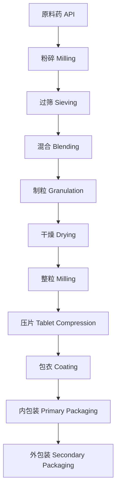
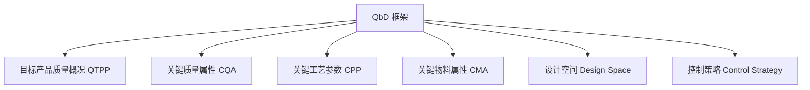
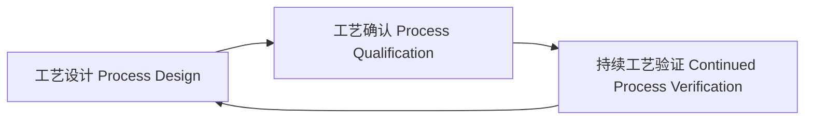

# 制药工程 (Pharmaceutical Engineering)

## 一、概述 (Overview)

制药工程是化学工程、药学、生物工程和管理科学交叉融合的工程学科，涉及药物制造工艺设计、生产设备选型、质量控制体系、GMP 合规管理和药品供应链保障。制药工程的最终目标是安全、高效、经济地生产符合质量标准的药品。

## 二、药品生产流程 (Drug Manufacturing Process)

### 2.1 典型流程图 (Typical Flow Diagram)



### 2.2 剂型分类 (Dosage Form Classification)

| 剂型 | 分类 | 示例 |
|------|------|------|
| 固体制剂 Solid | 片剂、胶囊剂、散剂、颗粒剂 | 阿莫西林胶囊 |
| 半固体制剂 Semi-Solid | 软膏剂、乳膏剂、凝胶剂 | 红霉素软膏 |
| 液体制剂 Liquid | 溶液剂、混悬剂、乳剂 | 布洛芬混悬液 |
| 注射剂 Injection | 溶液型、冻干粉针 | 头孢曲松钠 |
| 气雾剂 Aerosol | 吸入喷雾剂、鼻喷雾剂 | 沙丁胺醇气雾剂 |

## 三、原料药生产 (API Manufacturing)

### 3.1 合成路线 (Synthetic Routes)

原料药 (Active Pharmaceutical Ingredient, API) 生产涉及：

- 化学合成 (Chemical Synthesis)：有机反应、催化加氢、手性合成
- 生物发酵 (Fermentation)：抗生素、维生素、氨基酸
- 提取纯化 (Extraction & Purification)：结晶、蒸馏、色谱分离

### 3.2 反应器类型 (Reactor Types)

| 类型 | 适用 | 特点 |
|------|------|------|
| 搅拌釜反应器 Stirred Tank | 液相/气液反应 | 灵活，操作简单 |
| 固定床反应器 Fixed Bed | 气固催化反应 | 连续操作 |
| 流化床反应器 Fluidized Bed | 固相催化 | 传热传质好 |
| 管式反应器 Tubular | 快速放热反应 | 高产量 |

## 四、固体制剂工艺 (Solid Dosage Form Processing)

### 4.1 制粒技术 (Granulation Techniques)

| 方法 | 原理 | 优势 | 劣势 |
|------|------|------|------|
| 湿法制粒 Wet Granulation | 粘合剂溶液制粒 | 颗粒强度好 | 不耐湿药 |
| 干法制粒 Dry Granulation | 粉末压片后破碎 | 无水热影响 | 粉尘问题 |
| 流化床制粒 Fluid Bed | 喷液流化聚结 | 一步完成 | 设备投资高 |
| 喷雾干燥制粒 Spray Drying | 溶液雾化干燥 | 粒径可控 | 成本较高 |

### 4.2 压片工艺 (Tablet Compression)

压片力与片剂硬度的关系：

$$
H = k \cdot F + H_0
$$

其中 $H$ 为片剂硬度，$F$ 为压片力，$k$ 为粉体压缩系数。

关键工艺参数：

- 主压力 (Main Compression Force)：10~30 kN
- 预压力 (Pre-Compression Force)：2~5 kN
- 填充深度 (Fill Depth)
- 压片速度 (Tablet Speed)：5,000~400,000 片/小时

### 4.3 包衣技术 (Coating Technology)

| 包衣类型 | 材料 | 用途 |
|----------|------|------|
| 糖包衣 Sugar Coating | 蔗糖、滑石粉 | 美观、掩味 |
| 薄膜包衣 Film Coating | HPMC, EC, Eudragit | 防潮、肠溶、缓释 |
| 压制包衣 Compression Coating | 干法粉末压制 | 双层片、包芯片 |

## 五、质量源于设计 (Quality by Design, QbD)

### 5.1 QbD 要素 (QbD Elements)



### 5.2 设计空间 (Design Space)

设计空间是多变量组合的实验范围，在该范围内工艺保证产品质量：

$$
Y = f(X_1, X_2, ..., X_n) + \varepsilon
$$

设计空间建立方法：**实验设计 (DoE) + 响应面法 (RSM)**

## 六、良好生产规范 (GMP)

### 6.1 GMP 核心原则 (GMP Core Principles)

- 人员需经过培训和资质确认
- 厂房设施和设备的合理设计与维护
- 所有操作有书面规程 (SOP)
- 生产过程有批记录 (Batch Record)
- 物料有追溯体系 (Track & Trace)
- 偏差需调查并采取纠正预防措施 (CAPA)
- 变更需经审批和验证 (Change Control)

### 6.2 洁净室等级 (Cleanroom Classification)

根据 ISO 14644 和中国 GMP：

| GMP 等级 | ISO 等级 | 悬浮粒子 (≥0.5 μm) | 适用工艺 |
|----------|----------|-------------------|----------|
| A 级 | ISO 4.8 | ≤ 3,520 / m³ | 无菌灌装 |
| B 级 | ISO 5 | ≤ 3,520 / m³ | A 级背景区 |
| C 级 | ISO 7 | ≤ 352,000 / m³ | 无菌配制 |
| D 级 | ISO 8 | ≤ 3,520,000 / m³ | 非无菌制剂 |

### 6.3 GMP 文件体系 (GMP Documentation)

```
GMP 文件金字塔
├── Level 1: 质量手册 Quality Manual
├── Level 2: 标准操作规程 SOP
├── Level 3: 技术标准 Technical Standard
│   ├── 物料标准 Material Spec
│   ├── 产品标准 Product Spec
│   └── 检验方法 Test Method
└── Level 4: 记录与报告 Records
    ├── 批生产记录 BPR
    ├── 检验记录 Test Record
    └── 验证报告 Validation Report
```

## 七、工艺验证 (Process Validation)

### 7.1 验证生命周期 (Validation Lifecycle)



### 7.2 验证类型 (Validation Types)

| 类型 | 时机 | 目的 |
|------|------|------|
| 前验证 Prospective | 商业化生产前 | 新工艺/新产品 |
| 同步验证 Concurrent | 商业化生产中 | 罕见工艺 |
| 回顾验证 Retrospective | 已有数据积累 | 老产品定期再评价 |
| 再验证 Re-Validation | 变更后 | 变更影响评估 |

### 7.3 验证参数 (Validation Parameters)

固体制剂验证常见接受标准：

| 项目 | 接受标准 |
|------|----------|
| 含量均匀度 | AV ≤ 15.0 |
| 溶出度 | Q ≥ 80% (45 min) |
| 片重差异 | ±5% (≥80 mg) |
| 硬度 | 80~120 N |

## 八、制药用水系统 (Pharmaceutical Water Systems)

### 8.1 水质等级 (Water Quality Grades)

| 类型 | 电导率 (μS/cm) | TOC (ppb) | 用途 |
|------|----------------|-----------|------|
| 饮用水 Potable Water | ≤ 5.0 | — | 设备清洗 |
| 纯化水 Purified Water (PW) | ≤ 1.3 | ≤ 500 | 非无菌制剂 |
| 注射用水 Water for Injection (WFI) | ≤ 1.1 | ≤ 500 | 注射剂配制 |
| 纯蒸汽 Pure Steam | — | — | 灭菌 |

### 8.2 水系统验证 (Water System Validation)

水系统验证三个阶段：

- Phase 1：2~4 周密集取样，证明系统稳定
- Phase 2：4 周~1 年持续监测
- Phase 3：年度回顾

## 九、制药设备 (Pharmaceutical Equipment)

| 设备 | 用途 | 关键参数 |
|------|------|----------|
| 高效湿法制粒机 High Shear Granulator | 制粒 | 搅拌桨转速、切碎刀转速 |
| 流化床干燥机 Fluid Bed Dryer | 干燥 | 进风温度、风量、露点 |
| 旋转压片机 Rotary Tablet Press | 压片 | 压力、转速、填充深度 |
| 高效包衣机 Coating Pan | 包衣 | 喷液速率、进风温度、锅转速 |
| 冻干机 Lyophilizer | 冷冻干燥 | 降温速率、真空度、升温速率 |
| 灭菌柜 Autoclave | 灭菌 | 温度 121°C、时间 15 min |

## 十、最新趋势 (Latest Trends)

- **连续制造 (Continuous Manufacturing)**：从批处理转向连续流工艺
- **过程分析技术 (PAT)**：近红外 (NIR)、拉曼光谱在线监测
- **智能工厂 (Smart Factory)**：工业 4.0 在制药中的应用
- **个性化制药 (Personalized Medicine)**：3D 打印药片、小批量灵活生产
- **数字化验证 (Digital Validation)**：基于风险管理的验证策略
