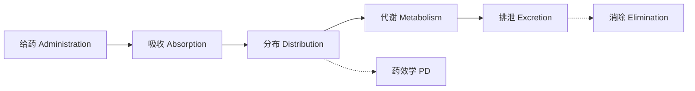
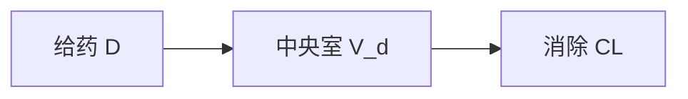
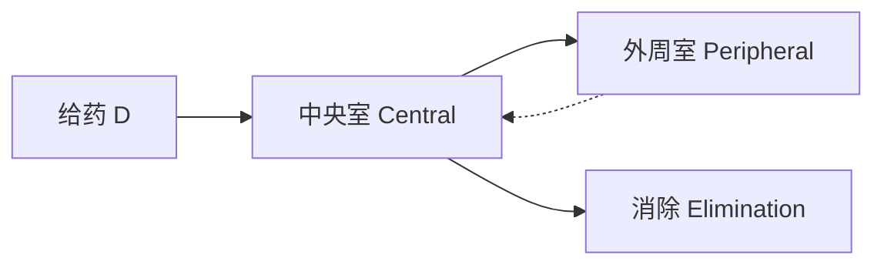

# 药物动力学 (Pharmacokinetics)

## 一、概述 (Overview)

药物动力学 (Pharmacokinetics, PK) 是研究药物在生物体内吸收 (Absorption)、分布 (Distribution)、代谢 (Metabolism) 和排泄 (Excretion) 过程的科学，简称 ADME。PK 研究揭示药物浓度随时间的变化规律，为临床合理用药和新药开发提供定量依据。

## 二、ADME 过程 (ADME Processes)

### 2.1 吸收 (Absorption)

药物从给药部位进入体循环的过程：

| 给药途径 | 吸收速度 | 生物利用度 | 首过效应 |
|----------|----------|-----------|----------|
| 静脉注射 IV | 立即 | 100% | 无 |
| 口服 PO | 中等 | 可变 (5~90%) | 有 |
| 肌肉注射 IM | 中快 | 75~100% | 无 |
| 皮下注射 SC | 慢 | 75~100% | 无 |
| 经皮 Transdermal | 缓慢 | 50~80% | 部分 |
| 吸入 Inhalation | 快速 | 50~100% | 部分 |

### 2.2 分布 (Distribution)

药物从血液循环进入组织和器官的过程：

分布容积 (Volume of Distribution)：

$$
V_d = \frac{D_0}{C_0}
$$

其中 $D_0$ 为给药剂量，$C_0$ 为初始血药浓度。

| $V_d$ 范围 | 含义 | 示例 |
|-----------|------|------|
| 3~5 L | 主要分布在血浆 | 华法林 (Warfarin) |
| 15~20 L | 分布在细胞外液 | 庆大霉素 (Gentamicin) |
| 25~30 L | 分布在全身体液 | 乙醇 (Ethanol) |
| > 100 L | 广泛组织结合 | 地高辛 (Digoxin) |

### 2.3 代谢 (Metabolism)

肝脏是主要代谢器官。代谢反应分两相 (Phase I & Phase II)：

| 相 | 反应类型 | 酶系 | 作用 |
|----|----------|------|------|
| Phase I | 氧化、还原、水解 | CYP450 酶系 | 引入或暴露极性基团 |
| Phase II | 结合反应 | 转移酶 | 结合极性基团增强水溶性 |

CYP450 重要亚型：

- CYP3A4：代谢约 50% 的药物
- CYP2D6：代谢约 25% 的药物，遗传多态性显著
- CYP2C9：代谢华法林等
- CYP2C19：代谢质子泵抑制剂等

### 2.4 排泄 (Excretion)

主要途径为肾脏排泄 (Renal Excretion)，包括肾小球滤过、肾小管分泌和肾小管重吸收：

$$
CL_R = CL_{\text{滤过}} + CL_{\text{分泌}} - CL_{\text{重吸收}}
$$

其他排泄途径：胆汁 (Biliary)、乳汁 (Milk)、汗液 (Sweat)、呼吸 (Exhalation)。

## 三、药动学参数 (PK Parameters)

### 3.1 主要参数 (Key Parameters)

| 参数 | 符号 | 单位 | 定义 |
|------|------|------|------|
| 消除半衰期 | $t_{1/2}$ | h | 血药浓度下降一半的时间 |
| 清除率 | $CL$ | L/h | 单位时间清除药物的血浆体积 |
| 分布容积 | $V_d$ | L | 药物分布的表观容积 |
| 药时曲线下面积 | $AUC$ | mg·h/L | 药物总暴露量 |
| 生物利用度 | $F$ | % | 进入体循环的给药比例 |
| 峰浓度 | $C_{max}$ | mg/L | 给药后最高浓度 |
| 达峰时间 | $T_{max}$ | h | 达到峰浓度的时间 |

### 3.2 半衰期与清除率关系 (Half-Life & Clearance)

$$
t_{1/2} = \frac{0.693 \cdot V_d}{CL}
$$

### 3.3 药时曲线下面积 (AUC)

$$
AUC_{0 \to \infty} = AUC_{0 \to t} + \frac{C_t}{\lambda_z}
$$

其中 $\lambda_z$ 为末端消除速率常数，$C_t$ 为最后测量点的浓度。

## 四、房室模型 (Compartment Models)

### 4.1 一室模型 (One-Compartment Model)

静脉注射后血药浓度：

$$
C(t) = C_0 \cdot e^{-k_e t}
$$

其中 $k_e = CL / V_d$ 为消除速率常数。

口服给药后血药浓度：

$$
C(t) = \frac{F \cdot D \cdot k_a}{V_d (k_a - k_e)} (e^{-k_e t} - e^{-k_a t})
$$

### 4.2 二室模型 (Two-Compartment Model)

二室模型血药浓度：

$$
C(t) = A \cdot e^{-\alpha t} + B \cdot e^{-\beta t}
$$

其中 $\alpha$ 为分布相速率常数，$\beta$ 为消除相速率常数。

### 4.3 多室模型 (Multi-Compartment Models)

| 模型 | 适用药物 | 特点 |
|------|----------|------|
| 一室模型 | 分布极快的药物 | 简单，单指数消除 |
| 二室模型 | 大多数药物 | 双指数，分布 + 消除 |
| 三室模型 | 深部组织结合 | 三指数，含深外周室 |

## 五、生物利用度 (Bioavailability)

### 5.1 绝对生物利用度 (Absolute Bioavailability)

$$
F_{\text{abs}} = \frac{AUC_{PO} / D_{PO}}{AUC_{IV} / D_{IV}} \times 100\%
$$

### 5.2 相对生物利用度 (Relative Bioavailability)

$$
F_{\text{rel}} = \frac{AUC_{\text{测试}} / D_{\text{测试}}}{AUC_{\text{参比}} / D_{\text{参比}}} \times 100\%
$$

### 5.3 影响生物利用度的因素

- 首过效应 (First-Pass Effect)
- 药物溶解度 (Solubility)
- 胃肠道 pH 值
- 食物影响 (Food Effect)
- 转运体作用 (Transporter Effect)

## 六、给药方案设计 (Dosing Regimen Design)

### 6.1 负荷剂量 (Loading Dose)

$$
D_L = \frac{C_{\text{target}} \cdot V_d}{F}
$$

### 6.2 维持剂量 (Maintenance Dose)

$$
D_M = \frac{C_{\text{target}} \cdot CL \cdot \tau}{F}
$$

其中 $\tau$ 为给药间隔。

### 6.3 稳态浓度 (Steady-State Concentration)

$$
C_{ss} = \frac{F \cdot D}{CL \cdot \tau}
$$

反复给药后达到稳态的平均浓度为：

$$
C_{ss,avg} = \frac{AUC_{0 \to \tau}}{\tau}
$$

## 七、非线性药物动力学 (Nonlinear Pharmacokinetics)

### 7.1 米氏动力学 (Michaelis-Menten Kinetics)

当药物浓度接近代谢酶饱和浓度时，消除变为非线性：

$$
\frac{dC}{dt} = -\frac{V_{\text{max}} \cdot C}{K_m + C}
$$

### 7.2 线性与非线性对比 (Linear vs Nonlinear)

| 特性 | 线性 PK | 非线性 PK |
|------|---------|-----------|
| AUC 与剂量关系 | 正比 | 不成正比 |
| $t_{1/2}$ | 恒定 | 随剂量增加 |
| $C_{ss}$ 与剂量 | 线性增加 | 超比例增加 |
| 示例药物 | 多数药物 | 苯妥英 (Phenytoin) |

## 八、群体药动学 (Population PK)

- **固定效应 (Fixed Effects)**：年龄、体重、肾功能、肝功能
- **随机效应 (Random Effects)**：个体间变异、残差变异
- **NONMEM / Monolix / Phoenix NLME**：常用分析软件

## 九、药动学-药效学结合 (PK-PD Modeling)

PK-PD 模型将药物浓度与药效联系起来：

$$
E = E_0 + \frac{E_{\text{max}} \cdot C^{\gamma}}{EC_{50}^{\gamma} + C^{\gamma}}
$$

其中 $E_{\text{max}}$ 为最大效应，$EC_{50}$ 为半最大效应浓度，$\gamma$ 为 Hill 系数。

## 十、最新进展 (Recent Advances)

- **生理药动学模型 (PBPK)**：基于器官血流和组织的机理性建模
- **群体药动学指导个体化用药**：贝叶斯反馈优化给药
- **微采样技术 (Microsampling)**：毛细管微量采血，减少动物用量
- **人工智能优化给药**：基于机器学习的剂量预测
