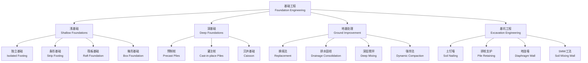

# 基础工程（Foundation Engineering）

## 概述

基础工程（Foundation Engineering）是土木工程的重要分支，研究建筑物、桥梁、道路等构筑物基础的设计与施工方法。基础是将上部结构荷载传递到地基的结构构件，其设计合理与否直接关系结构的安全性、经济性和耐久性。基础工程涉及岩土力学（Soil Mechanics and Rock Mechanics）、结构力学（Structural Mechanics）和施工技术（Construction Technology）的交叉应用。合理的基础设计需要综合考虑上部结构特征、地基条件、地下水状况、施工可行性和环境影响等多重因素。本章系统地介绍浅基础、深基础、地基处理和基坑支护等核心内容。

## 基础工程知识体系

## 浅基础（Shallow Foundations）

### 独立基础

独立基础（Isolated Footing）是最简单的基础形式，主要用于柱下基础，传递竖向荷载。常见形式包括阶梯形、锥形和杯口形（为预制柱预留杯口）。基础底面积由地基承载力控制：

$$ A = \frac{F}{f_a - \gamma_G d} $$

其中 $F$ 为上部结构传至基础顶面的竖向力设计值，$f_a$ 为修正后的地基承载力特征值，$\gamma_G$ 为基础与回填土的平均重度，$d$ 为基础埋深。

基础底板厚度由冲切承载力控制：
$$ F_l \leq 0.7 \beta_{hp} f_t a_m h_0 $$

其中 $F_l$ 为冲切力设计值，$f_t$ 为混凝土抗拉强度，$h_0$ 为有效高度。

### 条形基础

条形基础（Strip Footing）用于墙下基础或相邻柱距较近的情况。梁高通常满足 $H \geq L/6$ 的悬臂梁构造要求。当上部荷载不均匀或地基压缩性差异较大时，需设置地基梁或采用弹性地基梁法分析，最常用的是文克尔地基模型（Winkler Model）：

$$ p(x) = k \cdot s(x) $$

其中 $p(x)$ 为地基反力，$k$ 为基床系数，$s(x)$ 为沉降量。

### 筏板基础

筏板基础（Raft Foundation）将上部结构的全部荷载通过整块钢筋混凝土底板传递至地基，整体刚度大，适合软弱地基或柱距不均的情况。筏板分为梁板式（有梁肋）和平板式（无梁肋）两种。筏板的厚度由抗冲切和抗弯条件控制，常见厚度为 0.5–2.5 m。

### 地基承载力验算

地基承载力特征值 $f_a$ 需根据地质勘察报告确定，并考虑深度和宽度修正：

深度修正公式（当 $d > 0.5$ m 时）：
$$ f_a = f_{ak} + \eta_d \gamma_m (d - 0.5) $$

宽度修正公式（当 $b > 3$ m 时）：
$$ f_a = f_{ak} + \eta_b \gamma (b - 3) $$

其中 $f_{ak}$ 为承载力特征值，$\eta_d$ 和 $\eta_b$ 分别为深度和宽度修正系数，$\gamma_m$ 为基底以上土的加权平均重度，$\gamma$ 为基底以下土的重度。

荷载效应的标准组合需满足：
$$ p_k \leq f_a $$

且当偏心荷载作用时，最大边缘压力需满足 $p_{k,\text{max}} \leq 1.2 f_a$。

## 深基础（Deep Foundations）

### 桩基础分类

桩基础（Pile Foundation）通过将荷载传递到深层持力层来满足承载力和变形要求。主要类型包括预制桩（Precast Piles）和灌注桩（Cast-in-place Piles）：

| 桩型 | 施工方法 | 桩径 | 适用条件 | 优点 | 缺点 |
|------|----------|------|----------|------|------|
| 预应力管桩（PHC） | 锤击/静压 | 300–600 mm | 各种土层 | 质量可靠、工期短 | 噪音大、挤土效应 |
| 预制方桩 | 锤击 | 250–500 mm | 软土–硬塑 | 承载力高 | 运输吊装限制 |
| 钻孔灌注桩 | 钻孔+水下浇筑 | 600–2000 mm | 各种地层 | 适应性强、无挤土 | 泥浆污染、质量控制难 |
| 人工挖孔桩 | 人工开挖 | 800–2000 mm | 无水稳定土层 | 成本低、便于检查 | 安全风险高 |
| 沉管灌注桩 | 振动沉管 | 300–500 mm | 软土、粉土 | 速度快、成本低 | 桩径受限、易缩颈 |

### 单桩承载力计算

单桩竖向承载力特征值由桩侧摩阻力（Skin Friction）和桩端阻力（End Bearing）共同提供：
$$ Q_{uk} = Q_{sk} + Q_{pk} = u \sum q_{sik} l_i + q_{pk} A_p $$

其中 $u$ 为桩身周长，$q_{sik}$ 为第 $i$ 层土的桩侧摩阻力特征值，$l_i$ 为第 $i$ 层土的厚度，$q_{pk}$ 为桩端阻力特征值，$A_p$ 为桩端横截面积。

### 桩基沉降计算

桩基沉降采用等效作用方法（Equivalent Method），将桩基视为一假想的实体基础，按分层总和法计算：
$$ S = \psi_p \sum_{i=1}^n \frac{p_0}{E_{si}} (z_i \alpha_i - z_{i-1} \alpha_{i-1}) $$

其中 $\psi_p$ 为桩基沉降计算经验系数，$p_0$ 为基底附加压力，$E_{si}$ 为第 $i$ 层土的压缩模量。

### 负摩阻力

当桩周土沉降大于桩身沉降时，桩侧产生向下的负摩阻力（Negative Skin Friction），增加桩的荷载。可能原因包括：桩周填土固结、地下水位下降、大面积堆载等。负摩阻力沿桩身分布可用以下公式估算：
$$ q_s^{(-)} = K \tan \varphi' \cdot \sigma'_v $$

其中 $K$ 为侧压力系数，$\varphi'$ 为有效内摩擦角，$\sigma'_v$ 为有效竖向应力。

## 地基处理（Ground Improvement）

| 处理方法 | 加固机理 | 适用土质 | 有效深度 | 典型参数 |
|----------|----------|----------|----------|----------|
| 换填法（Replacement） | 挖除软土、回填优质材料 | 浅层软弱土 | ≤5 m | 压实度 ≥ 0.95 |
| 强夯法（Dynamic Compaction） | 重锤冲击加密 | 碎石土、砂土 | 5–10 m | 夯击能 1000–8000 kN·m |
| 排水固结（Preloading） | 堆载预压加速排水 | 软粘土 | 10–20 m | 固结度 ≥ 80% |
| 真空预压（Vacuum Preloading） | 真空度产生负压排水 | 软粘土 | 5–15 m | 真空度 ≥ 80 kPa |
| 水泥土搅拌（Deep Mixing） | 水泥与土原位搅拌 | 软土、淤泥 | ≤20 m | 掺入比 12–20% |
| 高压喷射注浆（Jet Grouting） | 高压流体切割搅拌 | 各种土质 | ≤30 m | 桩径 0.6–2.0 m |

## 基坑支护工程（Excavation Engineering）

### 支护形式

| 支护类型 | 工作原理 | 适用深度 | 优点 | 限制条件 |
|----------|----------|----------|------|----------|
| 土钉墙（Soil Nailing） | 土钉加固+喷射混凝土面层 | ≤12 m | 经济、施工快 | 不适用于软土 |
| 排桩+内支撑（Pile + Bracing） | 钻孔灌注桩 + 钢/混凝土支撑 | ≤20 m | 刚度大、变形小 | 内支撑影响土方开挖 |
| 排桩+锚杆（Pile + Anchor） | 桩 + 预应力锚杆 | ≤15 m | 基坑内无支撑 | 锚杆需超出红线 |
| 地下连续墙（Diaphragm Wall） | 槽段内浇筑混凝土 | ≤40 m | 刚度大、止水好 | 造价高、工期长 |
| SMW 工法 | 型钢插入水泥土墙 | ≤12 m | 止水兼支护、型钢可回收 | 刚度有限 |

### 支护设计稳定性分析

基坑支护设计需满足多项稳定性要求：整体稳定性（Global Stability）验算土体的整体滑动破坏，安全系数要求 $F_s \geq 1.25$；抗倾覆稳定性（Overturning Stability）验算支护结构绕前端转动的平衡；抗隆起稳定性（Heave Stability）验算基坑底部土体的隆起破坏；抗渗流稳定性（Seepage Stability）防止管涌和流砂。

土压力计算采用朗肯土压力理论（Rankine's Earth Pressure Theory）或库仑土压力理论（Coulomb's Earth Pressure Theory）：
$$ p_a = K_a \sigma'_v - 2c\sqrt{K_a} $$
$$ p_p = K_p \sigma'_v + 2c\sqrt{K_p} $$

其中 $K_a = \tan^2(45^\circ - \varphi/2)$ 为主动土压力系数，$K_p = \tan^2(45^\circ + \varphi/2)$ 为被动土压力系数，$\varphi$ 为内摩擦角，$c$ 为粘聚力。

变形控制是软土地区基坑设计的核心挑战，需采用有限元分析预测周边地表沉降和邻近建筑物的变形响应。

## 经典教材

- 龚晓南《基础工程》
- 刘松玉《基础工程》
- Das《Principles of Foundation Engineering》
- Tomlinson《Foundation Design and Construction》
- 《建筑地基基础设计规范》（GB 50007）
- 《建筑桩基技术规范》（JGJ 94）

## 基础工程前沿技术

随着城市地下空间开发的深入，基础工程技术也在不断创新。
逆作法（Top-Down Construction）利用结构楼板作为基坑支撑，
大幅减少临时支护量。桩基后注浆技术（Post-Grouting）通过在
桩端和桩侧注入水泥浆提高承载力 30–60%。能源桩（Energy
Pile）将地源热泵管道嵌入桩基中，使基础同时承担结构支撑和
热能交换的双重功能。BIM 技术（Building Information Modeling）
在基础工程中的应用实现了三维地质建模和施工全过程模拟。
光纤传感监测技术可在桩基和基坑施工中实现分布式应变和温度
测量，为信息化施工提供实时数据支持。

## 基础工程典型失效案例

基础工程事故的代价往往极为沉重。加拿大特朗斯康谷仓
（Transcona Grain Elevator, 1913）因软粘土层承载力不足
而发生整体倾斜，是基础工程史上的标志性案例。意大利比萨
斜塔的倾斜源于软土层的不均匀压缩，地基处理采用压重法和
掏土法进行纠偏。中国苏州某深基坑因承压水突涌导致坑底隆起，
说明了地下水控制的重要性。纽约世贸中心双子塔的基础采用了
深达 21 米的"泥浆墙"（Slurry Wall）围护系统，在 9/11
事件后的清理工作中发挥了关键作用。这些案例反复证实了
地质勘察质量、地下水处理和施工监测在基础工程中的核心地位。

## 主要参考文献

1. 龚晓南. 基础工程. 中国建筑工业出版社, 2008.
2. 刘松玉. 基础工程. 东南大学出版社, 2009.
3. Das, B. M. Principles of Foundation Engineering. Cengage,
    2018.
4. Tomlinson, M. J. Foundation Design and Construction.
    Pearson, 2001.
5. GB 50007 建筑地基基础设计规范.
6. JGJ 94 建筑桩基技术规范.

## 相关条目

- [[SoilMechanics]]
- [[ConcreteStructures]]
- [[StructuralAnalysis]]
- [[SteelStructures]]
- [[Hydrogeology]]
