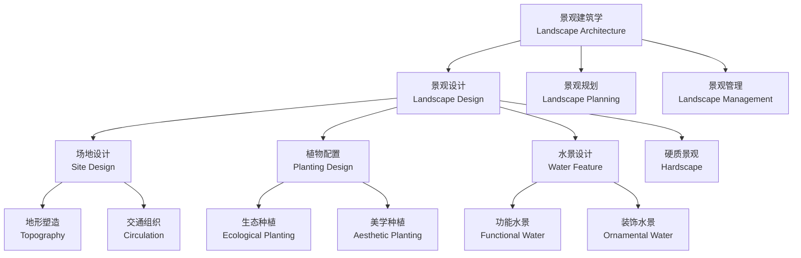

---
aliases:
  - Landscape Design
  - 景观设计
  - 景观建筑学
tags:
created: 2026-05-17
updated: 2026-05-13
  - CivilEngineering
  - LandscapeArchitecture
  - LandscapeDesign
  - EnvironmentalDesign
---

# 景观设计（Landscape Design）

景观设计（Landscape Design）是对户外空间环境进行规划、设计和管理的综合性学科，融合了艺术美学、生态科学和工程技术三大领域。它不仅关乎视觉美感——使场所具有吸引力——更关乎生态功能和社会价值：调节微气候、管理雨水、提供生物栖息地、促进公共健康和社会交往。作为景观建筑学（Landscape Architecture）的核心组成部分，景观设计在城市化进程加速的当代社会承载着越来越重要的角色。从私家花园到城市公园，从大学校园到滨水长廊，景观设计塑造了人们日常生活的户外框架。

## 景观设计学科体系

## 景观设计要素（Elements of Landscape Design）

### 地形（Topography）

地形是景观设计的第一要素——它是所有其他要素的基底。地形决定了空间的围合感、排水方向、微气候条件和人的使用方式。

| 地形类型 | 空间效果 | 设计策略 | 适用场地 |
|---------|---------|---------|---------|
| 凸地形（Convex） | 开敞视野、视觉焦点 | 设置地标建筑、观景台 | 公园制高点、纪念性场所 |
| 凹地形（Concave） | 围合感、庇护感 | 布置活动场地、雨水花园 | 下沉广场、庭院 |
| 平坦地形（Flat） | 开放自由、灵活性高 | 草坪活动区、多用途广场 | 运动场、市民广场 |
| 台地（Terrace） | 层次变化、空间分区 | 结合挡土墙、台阶、坡道 | 坡地住宅、山地公园 |

地形设计的关键技术指标包括坡度分级：

| 坡度范围 | 适宜用途 | 限制条件 |
|---------|---------|---------|
| $< 3\%$ | 建筑开发、活动场地 | 排水缓慢、需做微地形 |
| $3–10\%$ | 步行道、草坪、缓坡花园 | 需设踏步行道防滑 |
| $10–25\%$ | 景观梯田、护坡绿化 | 需挡土墙、水土保持 |
| $> 25\%$ | 自然山体、生态保留区 | 不可建设、需植被固坡 |

土方平衡是控制造价的核心，其目标函数的简化表达式为：

$$\min \sum_{i=1}^{n} |V_{\text{挖}, i} - V_{\text{填}, i}|$$

$$\text{即：} V_{\text{总挖}} \approx V_{\text{总填}}$$

挖填方的合理平衡不仅节省运输成本，还减少了施工碳排放。在大型公园项目中，土方量可达到数十万立方米，因此土方规划是初步设计阶段的重点。

### 水体（Water Features）

| 类型 | 视觉特征 | 声音效果 | 生态功能 | 维护要求 |
| :--- | :--- | :--- | :--- | :--- |
| 喷泉（Fountain） | 动态上升、水花四溅 | 持续的水声 | 水体曝气增氧 | 循环泵系统、水质处理 |
| 瀑布（Waterfall） | 垂落气势、水幕效果 | 冲击白噪音 | 水体循环、景观焦点 | 高位水池、水循环过滤 |
| 溪流（Stream） | 蜿蜒自然、亲水体验 | 潺潺流水 | 线性生态廊道 | 坡度控制（0.5–3%）、防渗 |
| 池塘（Pond） | 平静开阔、倒影效果 | 寂静或轻波 | 水生生物栖息、雨水调蓄 | 生态平衡维持、藻类管理 |
| 镜面水（Reflecting Pool） | 极浅水面、镜面倒影 | 绝对寂静 | 微气候调节 | 水平精度极高、化学维护 |

海绵城市（Sponge City）理念下的水景设计更强调生态功能而非单纯景观：

$$\text{年径流总量控制率} = \frac{\text{控制的降雨量（mm）}}{\text{总降雨量（mm）}} \times 100\%$$

中国住建部对海绵城市的径流控制率目标通常设定在 70–85%（根据气候区不同），这一指标直接决定了雨水设施的设计规模。

### 植物（Plants）

植物在景观设计中同时具有空间围合、生态调节和美学表达三种功能：

- **乔木（Trees）**：提供遮荫、构成景观骨架。落叶乔木夏季遮荫冬季透光——这是温度调节的被动策略。行道树的株距通常为 6–8 米（按冠幅确定）。
- **灌木（Shrubs）**：空间分隔、色彩点缀、阻挡非理想视线。高度分为三个层级——低矮（0.3–0.6 m）、中型（0.6–1.2 m）、高大型（1.2–2.0 m）。
- **地被植物（Ground Cover）**：覆盖裸露土壤、保持水土、抑制杂草生长。高度一般低于 0.3 米。
- **草坪（Lawn）**：提供活动空间和视觉开阔感。暖季型草（如百慕大草 Bermudagrass）适合南方气候，冷季型草（如早熟禾 Kentucky Bluegrass）适合北方地区。

季相变化（Seasonal Variation）是植物景观设计的核心——利用不同植物的花期、叶色和果期变化创造随时间推移的空间体验。植物群落的季相表达函数为：

$$S(t) = \sum_{i=1}^{n} f_i(t) \cdot w_i$$

其中 $f_i(t)$ 为第 $i$ 种植物的观赏价值随时间的变化曲线（花期产生峰值，秋叶产生次峰值），$w_i$ 为权重系数。优秀的设计要求 $S(t)$ 在全年各季节均有峰值分布——避免"三季无景"的单一观赏期。

### 硬质景观（Hardscape）

硬质景观包括铺装、台阶、挡土墙、座椅、灯具、标识、廊架、桥梁等非植物元素。其设计原则是"功能优先、美学并重"——铺装材料的选择要同时考虑承载力（人行/车行）、透水性（海绵城市要求）、防滑性和视觉质感。石材厚度按荷载等级选择：人行铺装 30–50 mm，车行铺装 50–80 mm。

## 景观空间营造（Spatial Composition）

### 空间类型与围合度

| 空间类型 | 垂直围合度 | 水平覆盖度 | 空间感 | 典型实例 |
|---------|-----------|-----------|-------|---------|
| 开敞空间（Open Space） | 低（$<30\%$） | 低（$<20\%$） | 自由开阔 | 大草坪、市民广场 |
| 半开敞空间（Semi-Open） | 中（30–60\%） | 中（20–50\%） | 适度限定 | 疏林草地、林缘区 |
| 封闭空间（Enclosed） | 高（$>60\%$） | 高（$>50\%$） | 秘密安详 | 密林区、竹林 |
| 覆盖空间（Canopy Space） | 中 | 高 | 庇护感 | 林荫道、花架廊 |

### 空间序列（Spatial Sequence）

景观空间序列的组织遵循"起承转合"的叙事节奏：

$$P_{\text{入口}} \rightarrow P_{\text{引导}} \rightarrow P_{\text{高潮}} \rightarrow P_{\text{收尾}}$$

入口（起始）——通过标识、对景植物或铺装变化标识空间的开始；引导（渐进）——利用路径、对景和视线引导创造期待感；高潮（焦点）——核心视觉焦点或主要活动节点；收尾（结束）——渐出或转折完成空间叙事。D/L 比（Distance to Height Ratio）是量化空间围合感的指标：

$$D/L \text{ 比值} \begin{cases}
<1: \text{强烈围合感——空间紧凑私密}\\
1–2: \text{舒适围合——空间比例宜人}\\
>2: \text{开敞感——空间宽阔舒朗}
\end{cases}$$

## 生态景观设计（Ecological Landscape Design）

**海绵城市（Sponge City）六字方针**——渗、滞、蓄、净、用、排——渗透到景观设计的各个层面：透水铺装与渗透沟实现"渗"；下沉绿地和植草沟实现"滞"；雨水花园和蓄水池实现"蓄"；生物滞留设施和人工湿地实现"净"；雨水回用系统实现"用"；溢流设施和超标雨水通道实现"排"。

**生态修复**：退化土地遵循"先锋物种→中期物种→顶级群落"的演替引导路径恢复植被。水体修复包括底泥疏浚、挺水-浮叶-沉水三层水生植物配置和微生物强化。修复度指标为：

$$\text{恢复度} = \frac{\text{当前生态功能值}}{\text{参照生态系统功能值}} \times 100\%$$

## 景观施工图阶段

| 图纸类型 | 主要内容 | 比例尺 | 信息深度 |
|---------|---------|-------|---------|
| 总平面图（Master Plan） | 整体布局、功能分区、竖向标高 | 1:200–1:500 | 概念性定位 |
| 竖向设计图（Grading Plan） | 等高线、标高控制点、排水方向 | 1:100–1:300 | ±50 mm 精度 |
| 种植设计图（Planting Plan） | 品种、规格尺寸、种植间距 | 1:100–1:200 | 植物名录含拉丁学名 |
| 铺装设计图（Paving Plan） | 材料、图案拼贴、留缝标准 | 1:50–1:100 | 铺装排砖大样 |
| 小品详图（Detail Drawing） | 结构连接、材料收口、基础 | 1:5–1:20 | 螺栓、焊点均标注 |

景观设计从概念构思到施工落地的全过程需要设计师对场地、气候、材料、植物和人的行为模式有深入理解。好的景观设计应当是"看不见的设计"——使用者感受到舒适和美，却意识不到设计的存在。

## 景观设计的常见风格

| 风格 | 地域/时期 | 特征 | 代表案例 |
|:--- |:--- |:--- |:--- |
| 英式自然风景园（English Landscape Garden） | 18 世纪英国 | 自然曲线、蛇形湖、开阔草坪、古典庙宇 | 斯托海德园（Stourhead） |
| 法式古典园林（French Formal Garden） | 17 世纪法国 | 对称轴线、花坛图案、修剪造型、喷泉水池 | 凡尔赛宫苑（André Le Nôtre） |
| 中式古典园林（Chinese Classical Garden） | 宋–清中国 | 咫尺山林、借景对景、曲径通幽、诗画意境 | 拙政园、留园、网师园 |
| 日式枯山水（Japanese Dry Garden） | 14–16 世纪日本 | 耙纹砂石、置石象征、极简抽象、禅意冥想 | 龙安寺石庭 |
| 现代主义景观（Modernist Landscape） | 20 世纪 | 几何抽象、流动空间、新材料、功能至上 | 唐纳花园（Thomas Church） |
| 生态景观（Ecological Landscape） | 1990s–至今 | 本土植物、雨水管理、修复自然、低维护 | 高线公园（James Corner） |

中式古典园林的设计原则高度凝练在计成《园冶》（1631）中：造园"虽由人作，宛自天开"——人工与自然的辩证统一。"借景"是中国园林最独特的手法——将园外之景（远山、塔影）有机纳入园内的视觉构图，使有限的空间获得无限的外延。

## 人的行为与景观使用

环境心理学（Environmental Psychology）的研究揭示了景观设计应当考虑的人的行为规律：

- **边缘效应（Edge Effect）**：人们更倾向于在空间的边缘停留而非中央——因此广场边界应设置座椅和停留空间
- **瞭望-庇护理论（Prospect-Refuge Theory）**：人们偏爱"可瞭望亦可隐藏"的位置——有背靠、有视野——这在座位朝向和凉亭选址上有直接设计意义
- **步行距离阈值**：大多数人愿意日常步行的舒适距离为 400–800 米——这是社区公园服务半径的依据
- **环境中恢复注意力**：自然环境场景能够在 3–5 分钟内降低压力指标（皮质醇、心率）——这是"康复花园"（Healing Garden）和医院景观设计的基础

## 景观设计全流程

景观设计的完整流程包括以下阶段：场地调研（Site Analysis）→ 概念设计（Concept Design）→ 方案设计（Schematic Design）→ 扩初设计（Design Development）→ 施工图设计（Construction Documentation）→ 施工配合（Construction Administration）→ 后期评估（Post-Occupancy Evaluation）。每个阶段都需要设计师在美学、生态、工程和预算之间做出权衡——成功的景观永远是多条约束条件下的最优解而非最大值。

## 景观设计中的无障碍设计（Universal Design）

景观设计的伦理基础之一是确保所有使用者——包括老年人、儿童、行动不便者和视障者——都能平等地使用户外空间。无障碍景观设计的核心原则：

- **连续无障碍路径**：主要通路坡度不超过 1:20，宽度不小于 1.5 米，表面防滑——使轮椅使用者和推婴儿车者可以独立通行
- **触觉铺装**：在路径转折点、台阶前和交叉口设置提示砖（盲道）——为视障者提供空间信息
- **座椅间距**：沿主要步行路径每 30–50 米设置休息座椅——考虑老年人的体力限制
- **植物安全**：避免使用有毒、有刺或易引起过敏的植物——特别是在儿童活动区和养老社区

无障碍设计的深度决定了景观空间真正的社会包容性——一个只有健康成年人能够舒适使用的公园不是好设计。

## 景观设计的经典案例解析

### 纽约高线公园（The High Line, 2009–2014）

由 James Corner Field Operations 设计的将废弃高架铁路改造为线性公园的标杆项目。设计保留原有铁轨和野生植被，以"植栽-铺装"的渐变融合创造独特的"荒野在城市上空"体验。高线公园的成功不仅在于其设计品质——更在于其作为城市更新催化剂的经济效应：周边房地产价值在其开放后十年内增长了约 200%。

### 苏州拙政园（明, 1509）

中式古典园林的巅峰之作。全园以水为中心，亭台楼阁依水而建——"借景"手法将远处的北寺塔纳入园中画面，使有限的空间（约 4.1 公顷）获得无限的延伸感。拙政园的空间序列遵循"欲扬先抑"的造园法则——入口处封闭狭窄的小径引导至中部水池的豁然开朗，形成了中国园林最经典的"收放对比"的空间节奏。

## 相关条目

- [[UrbanDesign|城市设计]]
- [[RegionalPlanning|区域规划]]
- [[BuildingPhysics|建筑物理]]
- [[EcologicalEngineering|生态工程]]
- [[EnvironmentalPsychology|环境心理学]]
- [[PlantMaterials|园林植物材料]]
- [[INDEX|当前目录索引]]
