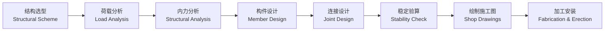

# 钢结构 (Steel Structures)

## 概述

钢结构（Steel Structures）是以钢材为主要材料制作的结构体系，广泛应用于建筑（Buildings）、桥梁（Bridges）和工业设施（Industrial Facilities）。钢结构具有强度高（High Strength）、自重轻（Light Weight）、塑性韧性好（Good Ductility & Toughness）、工业化程度高（High Industrialization）和施工周期短（Fast Construction）等显著优势。

## 钢结构设计流程

## 核心概念表

| 概念 | 英文 | 定义 | 表达式 |
|------|------|------|------|
| 屈服强度 | Yield Strength | 材料发生塑性变形的应力 | $f_y$ |
| 抗拉强度 | Tensile Strength | 材料能承受的最大应力 | $f_u$ |
| 长细比 | Slenderness Ratio | 构件长度与回转半径之比 | $\lambda = l_0/i$ |
| 稳定系数 | Stability Factor | 考虑失稳的折减系数 | $\varphi$ |
| 宽厚比 | Width-to-Thickness Ratio | 板件宽度与厚度之比 | $b/t$ |
| 焊缝强度 | Weld Strength | 焊缝的设计承载力 | $f_f^w$ |

## 钢材性能

### 常用钢材牌号

中国国家标准（GB 50017）规定的常用钢号：

- **Q235**：碳素结构钢（Carbon Structural Steel），屈服强度 $f_y = 235\text{MPa}$，用于一般结构
- **Q355**：低合金高强度钢（Low-Alloy High-Strength Steel），$f_y = 355\text{MPa}$，替代原Q345
- **Q390、Q420、Q460**：更高强度等级，用于大跨度及高层结构

### 力学性能指标

**本构关系（Constitutive Relation）**：钢材的应力-应变曲线（Stress-Strain Curve）可分为弹性阶段、屈服阶段、强化阶段和颈缩阶段：

$$ \sigma = \begin{cases} E\varepsilon & \varepsilon \leq \varepsilon_y \\ f_y & \varepsilon_y < \varepsilon \leq \varepsilon_{sh} \\ f_y + E_{sh}(\varepsilon - \varepsilon_{sh}) & \varepsilon_{sh} < \varepsilon \leq \varepsilon_u \end{cases} $$

- 弹性模量（Modulus of Elasticity）：$E = 206,000 \text{ MPa}$
- 剪切模量（Shear Modulus）：$G = 79,000 \text{ MPa}$
- 泊松比（Poisson's Ratio）：$\nu = 0.3$

### 钢材牌号命名规则

Q235B的含义：Q表示屈服点（Yield Point），235为屈服强度值（MPa），B为质量等级（A/B/C/D，冲击韧性依次提高）。

### 钢材选用原则

| 受力类型 | 控制因素 | 优先选用 | 说明 |
|---------|---------|---------|------|
| 受拉构件 | 强度 | Q355以上 | 充分利用高强材料 |
| 受压构件 | 稳定性 | Q235或Q355 | 稳定与模量有关，与强度关系小 |
| 疲劳构件 | 疲劳强度 | Q235C/D | 改善抗疲劳性能 |
| 低温环境 | 冲击韧性 | Q235D/Q355D | 防止低温脆断 |
| 焊接结构 | 可焊性 | Q235B/Q355B | 碳当量控制 |

## 连接设计

### 焊接连接

**对接焊缝（Butt Weld）**：按等强度原则设计。

**角焊缝（Fillet Weld）**强度验算：

$$ \tau_f = \frac{N}{h_e l_w} \leq f_f^w $$

其中 $h_e$ 为角焊缝有效厚度（Effective Throat Thickness），$h_e = 0.7h_f$，$h_f$ 为焊脚尺寸，$l_w$ 为焊缝计算长度，$f_f^w$ 为角焊缝强度设计值。

**焊接缺陷（Weld Defects）**：气孔（Blowhole）、夹渣（Slag Inclusion）、未熔合（Lack of Fusion）、裂纹（Crack）。

### 螺栓连接

**普通螺栓（Ordinary Bolt）**：
- C级螺栓（粗制）：孔径比螺栓直径大1~1.5mm，用于次要连接
- A/B级螺栓（精制）：配合精度高，用于主要受力连接

**高强度螺栓（High-Strength Bolt）**：
- 摩擦型（Friction-Type）：以板间摩擦力传递力，$N_v^b = 0.9n_f \mu P$
- 承压型（Bearing-Type）：允许滑移，靠螺栓承压和连接板承压传力

其中 $n_f$ 为摩擦面数，$\mu$ 为摩擦系数，$P$ 为预拉力。

### 螺栓群受力分析

$$ N = \sum N_i = \sum \frac{N_{总}}{n} + \frac{M y_i}{\sum y_i^2} $$

## 受弯构件

### 强度计算

正应力验算：

$$ \sigma = \frac{M}{W_n} \leq f $$

剪应力验算：

$$ \tau = \frac{VS}{It_w} \leq f_v $$

其中 $W_n$ 为净截面模量（Net Section Modulus），$V$ 为剪力，$S$ 为面积矩（Static Moment），$I$ 为惯性矩，$t_w$ 为腹板厚度。

### 整体稳定

梁的整体失稳表现为侧向弯扭屈曲（Lateral-Torsional Buckling, LTB）：

$$ \sigma = \frac{M}{\varphi_b W_x} \leq f $$

$\varphi_b$ 为梁整体稳定系数，取决于侧向支撑间距、截面形式和荷载类型。

### 局部稳定

板件在压应力作用下可能发生局部屈曲（Local Buckling）：

- **受压翼缘**：$b/t \leq 13\sqrt{235/f_y}$（工字形截面）
- **腹板**：$h_0/t_w \leq 80\sqrt{235/f_y}$（无加劲肋时）

当高厚比超过限值时，需设置横向和纵向加劲肋（Stiffeners）。

## 轴心受力构件

### 强度与稳定

轴心受拉构件强度验算：

$$ \sigma = \frac{N}{A_n} \leq f $$

轴心受压构件整体稳定验算：

$$ \frac{N}{\varphi A} \leq f $$

### 稳定系数

稳定系数 $\varphi$ 由长细比 $\lambda$ 和截面分类决定：

$$ \lambda = \frac{l_0}{i} $$

其中 $l_0$ 为计算长度（Effective Length），$i = \sqrt{I/A}$ 为回转半径（Radius of Gyration）。

欧拉临界力（Euler Critical Load）：

$$ N_{cr} = \frac{\pi^2 EI}{l_0^2} $$

### 截面分类

按残余应力和初始几何缺陷的影响，截面分为a、b、c、d四类，a类稳定性能最好，d类最差。

## 压弯构件

### 平面内稳定

弯矩作用平面内的整体稳定：

$$ \frac{N}{\varphi_x A} + \frac{\beta_{mx}M_x}{\gamma_x W_{1x}(1-0.8N/N'_{Ex})} \leq f $$

$$ N'_{Ex} = \pi^2 EA/(1.1\lambda_x^2) $$

### 平面外稳定

弯矩作用平面外的整体稳定：

$$ \frac{N}{\varphi_y A} + \frac{\eta\beta_{tx}M_x}{\varphi_b W_{1x}} \leq f $$

其中 $\varphi_y$ 为平面外轴压稳定系数，$\varphi_b$ 为受弯整体稳定系数，$\beta_{tx}$ 为等效弯矩系数。

## 钢结构防护

### 防火设计

钢材在550°C时屈服强度降至常温的约60%，因此需要防火保护（Fire Protection）：

- 防火涂料（Fire-Resistant Coating）：厚涂型（非膨胀型）和薄涂型（膨胀型）
- 防火保护层厚度根据耐火极限（Fire Resistance Rating）和截面系数确定

### 防腐设计

防腐措施（Corrosion Protection）包括：
- 涂层保护：底漆 + 中间漆 + 面漆
- 热浸镀锌（Hot-Dip Galvanizing）
- 耐候钢（Weathering Steel）：表面形成致密氧化层阻止进一步腐蚀

## 钢结构抗震设计

### 抗震设计原则

钢结构在地震作用（Seismic Action）下的设计遵循"强柱弱梁"（Strong Column-Weak Beam）、"强节点弱构件"（Strong Joint-Weak Member）的基本理念：

钢结构延性（Ductility）通过塑性铰（Plastic Hinge）的转动实现能量耗散：

$$ \mu = \frac{\Delta_u}{\Delta_y} $$

其中 $\mu$ 为位移延性系数，$\Delta_u$ 为极限位移，$\Delta_y$ 为屈服位移。钢结构的延性系数一般要求 $\mu \geq 4$。

### 抗震构造措施

- **支撑形式**：中心支撑（Concentric Brace）、偏心支撑（Eccentric Brace）、屈曲约束支撑（Buckling-Restrained Brace, BRB）
- **梁柱连接**：焊接连接（Weld Connection）、栓焊连接（Bolted-Welded Connection）
- **加劲肋设置**：防止梁腹板和翼缘局部屈曲
- **防倒塌设计**：设置多道抗震防线，避免连续倒塌（Progressive Collapse）

### 耗能装置

金属屈服型阻尼器（Metallic Yielding Damper）和摩擦型阻尼器（Friction Damper）通过滞回耗能（Hysteretic Energy Dissipation）减小结构地震响应：

$$ E_{\text{阻尼器}} = \oint F \cdot du = \text{滞回环面积} $$

## 钢结构施工技术

钢构件制作（Steel Fabrication）流程：放样 → 下料 → 矫正 → 组装 → 焊接 → 除锈 → 涂装。安装方法包括分件吊装法、节间吊装法、滑移法施工和整体提升法。

## 主要应用领域

- **高层建筑**：钢结构框架（Steel Frame）、钢-混凝土混合结构
- **大跨度空间结构**：体育场馆、会展中心（网架 Space Frame、网壳 Latticed Shell）
- **桥梁工程**：钢箱梁（Steel Box Girder）、钢桁架（Steel Truss）
- **工业厂房**：门式刚架（Portal Frame）、吊车梁（Crane Girder）
- **塔桅结构**：输电塔、通信塔、电视塔
- **海洋平台**：导管架平台（Jacket Platform）

## 经典教材

1. 陈绍蕃. *钢结构*. 中国建筑工业出版社.
2. 戴国欣. *钢结构*. 武汉理工大学出版社.
3. Segui, W. T. *Steel Design*. Cengage Learning.
4. McCormac, J. C. *Structural Steel Design*. Pearson.

## 相关条目

- [[04_EngineeringAndTechnology/MechanicsAndMaterials/INDEX|MechanicsAndMaterials]]
- [[04_EngineeringAndTechnology/CivilEngineering/GeotechnicalEngineering/INDEX|GeotechnicalEngineering]]
- [[EarthquakeEngineering]]
- [[ConcreteStructures]]
