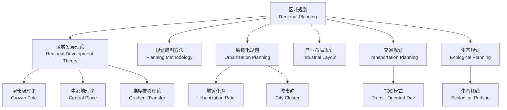

# 区域规划 (Regional Planning)

## 概述 (Overview)

区域规划 (Regional Planning) 是对一定地域范围内的经济社会发展 (Socioeconomic Development) 和空间布局 (Spatial Layout) 进行综合部署的学科。它是国土空间规划 (Territorial Spatial Planning) 体系的重要组成部分，协调区域间的资源配置、产业发展、基础设施建设和生态保护，促进区域协调与可持续发展。

## 区域规划体系框架

## 区域发展理论 (Regional Development Theories)

### 增长极理论 (Growth Pole Theory)
- 由法国经济学家佩鲁 (Perroux) 提出
- 区域经济增长首先出现在少数增长极 (Growth Pole)，如中心城市或产业集群
- 通过极化效应 (Polarization Effect) 吸引要素集聚，再通过扩散效应 (Trickle-down Effect) 辐射周边
- 增长极的辐射半径通常为 100–200 km，与交通条件密切相关

### 中心地理论 (Central Place Theory)
- 由德国地理学家克里斯塔勒 (Christaller) 提出
- 六边形市场区模型：每个中心地服务一个正六边形市场区域
- 中心地等级体系 (Hierarchy)：高级中心地提供高等级服务，服务半径更大但数量更少

| 中心等级 | 服务人口 | 服务半径 (km) | 典型职能 |
|:---|:---:|:---:|:---|
| 低级中心 | 2,000–5,000 | 5–10 | 便利店、小学、诊所 |
| 中级中心 | 20,000–50,000 | 15–30 | 超市、中学、医院 |
| 高级中心 | 200,000–500,000 | 50–100 | 百货商场、大学、专科医院 |

### 梯度推移理论 (Gradient Transfer Theory)
- 技术和产业从高梯度地区向低梯度地区逐步转移
- 沿交通走廊 (Transport Corridor) 呈梯度扩散
- 产业梯度系数：$G_{ij} = \frac{TC_{ij} \times LC_{ij}}{\sum_i TC_{ij} \cdot LC_{ij}}$，其中 $TC$ 为技术系数，$LC$ 为劳动力系数

### 核心-边缘理论 (Core-Periphery Theory)
- 弗里德曼 (Friedmann) 提出区域空间结构由核心区和边缘区组成
- 核心区主导资本、技术和决策，边缘区提供资源和劳动力
- 发展目标是实现从极化到扩散的转变，最终达到空间均衡

## 规划编制方法 (Planning Methodology)

### 规划程序

| 阶段 | 主要内容 | 常用方法 |
|:---|:---|:---|
| 现状调查与分析 | 自然条件、经济社会、土地利用现状 | 遥感 (RS)、地理信息系统 (GIS)、实地调研 |
| 发展条件评价 | 资源承载力、环境容量、区位优势 | SWOT 分析、多准则评价 |
| 发展目标确定 | 人口规模、经济增长、城镇化率目标 | 趋势外推、情景分析 |
| 功能分区与空间布局 | 三生空间（生态、生产、生活）划定 | 土地利用适宜性评价 |
| 基础设施规划 | 交通、能源、水资源、信息网络 | 网络分析、供需平衡模型 |
| 生态环境保护 | 生态功能区划、环境质量目标 | 生态足迹、环境容量核算 |

### 定量评价方法
- **区位商 (Location Quotient)**：$LQ_{ij} = \frac{E_{ij}/E_j}{E_i/E}$，判断某产业在区域中的专业化程度
- **投入产出分析 (Input-Output Analysis)**：里昂惕夫矩阵 $X = (I - A)^{-1}Y$ 计算产业关联效应
- **空间自相关 (Spatial Autocorrelation)**：Moran's I 指数衡量区域经济集聚程度

## 城镇化与城乡统筹 (Urbanization)

### 城镇化率 (Urbanization Rate)

$$
P = \frac{城市人口}{总人口} \times 100\%
$$

### 城镇化阶段
- **初期阶段**：城镇化率 < 30%，农业经济主导，城市发展缓慢
- **加速阶段**：30%–70%，工业化推动人口大量向城市集中
- **成熟阶段**：> 70%，城乡差距缩小，逆城市化现象出现

### 中国新型城镇化特点
- 以人为本 (People-oriented)：户籍制度改革推进农业转移人口市民化
- 四化同步：工业化、信息化、城镇化、农业现代化协调推进
- 优化布局：城市群 (City Cluster) 为主体形态，大中小城市协调发展
- 绿色低碳：生态文明理念贯穿城镇化全过程

### 城乡融合 (Urban-Rural Integration)
- 要素双向流动：资本、人才、技术向农村延伸
- 公共服务均等化：教育、医疗、养老资源均衡配置
- 乡村振兴战略：产业兴旺、生态宜居、乡风文明、治理有效、生活富裕

## 产业布局规划 (Industrial Layout)

### 产业选择标准
- **比较优势**：基于资源禀赋和要素成本的比较优势识别主导产业
- **产业关联度**：前后向关联效应强的产业可带动区域整体发展
- **就业弹性**：$e = \frac{\Delta L/L}{\Delta Y/Y}$，衡量产值增长对就业的拉动作用

### 空间集中形式
| 形式 | 特征 | 典型案例 |
|:---|:---|:---|
| 产业园区 | 政府划定的专业功能区 | 苏州工业园、硅谷 |
| 产业集群 | 同类企业及相关机构的集聚 | 义乌小商品集群、好莱坞 |
| 产业带 | 沿交通线形成的带状产业走廊 | 沪宁产业带、莱茵产业带 |

## 区域交通规划 (Transportation Planning)

### TOD 模式 (Transit-Oriented Development)
- 以公共交通枢纽为核心，半径 400–800 m 范围内高密度混合开发
- 土地利用密度梯度：$D(r) = D_0 \cdot e^{-\alpha r}$，距站点越近开发强度越高
- 减少小汽车依赖，提高公共交通分担率

### 综合交通枢纽 (Integrated Transport Hub)
- 多种交通方式（高铁、地铁、公交、出租车）零距离换乘
- 枢纽周边用地强度：容积率 3.0–8.0，混合功能比例商业:办公:居住 = 3:4:3

## 区域生态规划 (Ecological Planning)

### 生态功能区划
- **优化开发区**：开发强度高需优化产业结构
- **重点开发区**：资源环境承载力强，可承接产业转移
- **限制开发区**：生态脆弱，以生态修复和特色产业为主
- **禁止开发区**：自然保护区、水源涵养区，禁止工业开发

### 生态安全格局 (Ecological Security Pattern)
- 生态源地 (Ecological Source)：生物多样性丰富的核心保护区
- 生态廊道 (Ecological Corridor)：连接生态源地的线性景观要素
- 生态节点 (Ecological Node)：廊道交汇处的关键生态斑块

**生态承载力 (Ecological Carrying Capacity)**：

$$
C = E \cdot P \cdot (1 - L)
$$

其中 $C$ 为可承载人口，$E$ 为资源总量，$P$ 为资源利用效率，$L$ 为损失率。

## 区域规划案例 (Case Studies)

### 长三角城市群规划
长三角城市群涵盖上海、江苏、浙江、安徽三省一市，GDP 约占全国 1/4。规划重点包括：
- **空间格局**："一核五圈四带"——上海核心 + 南京/杭州/合肥/苏锡常/宁波五大都市圈
- **交通一体化**：高铁 1 小时通勤圈覆盖主要城市，城际铁路密度 3 km/100 km²
- **产业协同**：上海高端服务业 + 苏浙先进制造 + 安徽产业承接的梯度分工格局
- **生态共保**：长江生态廊道、太湖流域水环境综合治理

### 京津冀协同发展
- **功能疏解**：北京非首都功能向雄安新区和天津转移
- **交通先行**：京张高铁、京雄城际、京津冀交通一卡通
- **生态联防**：大气污染联防联控、永定河综合治理
- **产业转移**：中关村科技园在天津宝坻、河北保定建立分园

### 德国区域均衡发展经验
- **空间规划体系**：联邦—州—区域—地方四级空间规划体系
- **财政平衡机制**：财力纵向转移支付 + 横向州际平衡基金（Länderfinanzausgleich）
- **增长极培育**：慕尼黑高科技、斯图加特汽车、汉堡物流等专业化城市分工
- **城乡等值化**：基础设施和公共服务标准城乡统一，消除区域发展差距

## 区域经济模型 (Regional Economic Models)

### 引力模型 (Gravity Model)
预测区域间经济交互强度：

$$
T_{ij} = G \cdot \frac{M_i \cdot M_j}{D_{ij}^\beta}
$$

其中 $T_{ij}$ 为区域 i 与 j 之间的交互流量，$M_i, M_j$ 为经济规模，$D_{ij}$ 为距离，$\beta$ 为距离衰减参数。

### shift-share 分析
将区域经济增长分解为三个分量：

$$
\Delta E_{ij} = NS_{ij} + IM_{ij} + CS_{ij}
$$

- $NS_{ij} = E_{ij} \cdot r_n$（全国增长分量，National Share）
- $IM_{ij} = E_{ij} \cdot (r_{i} - r_n)$（产业结构分量，Industry Mix）
- $CS_{ij} = E_{ij} \cdot (r_{ij} - r_i)$（竞争分量，Competitive Share）

### 区位商与产业集聚
**区位商 (Location Quotient)**：

$$
LQ_{ij} = \frac{E_{ij} / E_j}{E_i / E}
$$

$LQ > 1$ 表示该产业在区域具有专业化优势，$LQ > 1.25$ 为显著专业化。

## 地理信息系统在区域规划中的应用 (GIS Applications)

| 应用方向 | 数据需求 | GIS 技术 | 规划决策支持 |
|:---|:---|:---|:---|
| 土地利用适宜性评价 | DEM、土壤、植被、水文 | 叠加分析、多准则评价 | 三生空间划定 |
| 交通可达性分析 | 路网、POI、人口分布 | 网络分析、缓冲区分析 | 交通枢纽选址 |
| 生态敏感性评价 | 植被覆盖、水系、保护区 | 空间统计、距离分析 | 生态红线划定 |
| 城市扩张模拟 | 历史土地利用、规划数据 | CA-Markov 模型 | 城市增长边界 (UGB) |
| 设施空间配置 | 人口、设施分布 | 位置分配模型 (Location-Allocation) | 公共服务设施选址 |

## 区域治理与政策工具 (Regional Governance)

- **行政区划调整**：撤县设区、城市合并、功能区设立
- **财政转移支付**：一般性转移支付 + 专项转移支付缩小区域财力差距
- **区域合作机制**：市长联席会议、跨区域协调委员会、流域治理委员会
- **政策试验区**：国家级新区（浦东、雄安、粤港澳大湾区）、自贸试验区
- **生态补偿机制**：流域上下游横向生态补偿、碳汇交易

## 经典教材与参考 (References)

- 陈栋生《区域经济学》(Regional Economics)
- 吴志强《城市规划原理》(Urban Planning Principles)
- 《全国主体功能区规划》(National Main Functional Area Plan)
- 《国土空间规划技术标准体系》(Technical Standards for Territorial Planning)
- Friedmann J. 《Regional Development Policy》

## 主要应用领域 (Applications)

- 国土空间规划 (Territorial Spatial Planning)
- 城市群与都市圈规划 (City Cluster Planning)
- 产业开发区规划 (Industrial Development Zone Planning)
- 生态功能区划 (Ecological Function Zoning)
- 乡村振兴规划 (Rural Revitalization Planning)

## 相关条目 (Related Entries)

- [[UrbanDesign]]
- [[LandscapeDesign]]
- [[BuildingPhysics]]
- [[TransportationEngineering]]
- [[EcologicalPlanning]]
