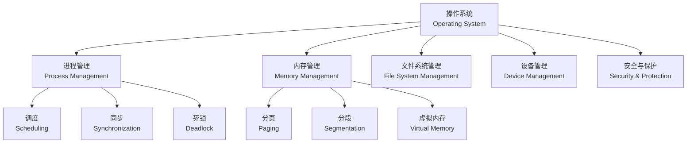

---
aliases:
  - Operating Systems
  - OS
tags:
  - operating-systems
  - processes
  - memory-management
  - file-systems
  - scheduling
  - concurrency
  - security
created: 2025-05-17
---

# 操作系统 (Operating Systems)

操作系统是管理计算机硬件与软件资源的系统软件。

## 核心功能总览 (Core Functions Overview)

## 进程管理 (Process Management)

进程是程序的执行实例。每个进程有一个**进程控制块**（Process Control Block, PCB）。

### 进程状态 (Process States)

$$
\text{New} \to \text{Ready} \rightleftharpoons \text{Running} \to \text{Terminated}
$$

| 状态 | 描述 |
| :--- | :--- |
| New (新建) | 进程被创建 |
| Ready (就绪) | 等待 CPU 分配 |
| Running (运行) | 正在执行指令 |
| Waiting (等待) | 等待 I/O 或事件 |
| Terminated (终止) | 执行完毕 |

### CPU 调度算法 (CPU Scheduling Algorithms)

| 算法 | 特点 | 缺点 |
| :--- | :--- | :--- |
| FCFS (先来先服务) | 公平简单 | 平均等待时间长 |
| SJF (短作业优先) | 最小平均等待时间 | 难以预测执行时间 |
| Round Robin (时间片轮转) | 响应时间均匀 | 时间片选择敏感 |
| Priority (优先级调度) | 支持优先级 | 可能导致饥饿 |

## 内存管理 (Memory Management)

### 分页系统 (Paging System)

逻辑地址到物理地址的映射：

$$
\text{物理地址} = \text{页框号} \times \text{页大小} + \text{页内偏移}
$$

### 虚拟内存 (Virtual Memory)

通过**按需分页**（Demand Paging）和**页面置换算法**实现：

- FIFO (先进先出)
- LRU (最近最少使用)
- Clock (时钟算法)

## 并发与同步 (Concurrency and Synchronization)

经典问题：
- **生产者-消费者问题** (Producer-Consumer)
- **读者-写者问题** (Readers-Writers)
- **哲学家就餐问题** (Dining Philosophers)

同步机制：

| 机制 | 语义 |
| :--- | :--- |
| 信号量 (Semaphore) | P/V 操作 |
| 管程 (Monitor) | 条件变量 |
| 互斥锁 (Mutex) | 仅限一个线程 |
| 读写锁 (RW Lock) | 并发读、互斥写 |

死锁必要条件：**互斥、持有并等待、非剥夺、循环等待**。

## 文件系统 (File Systems)

### 文件存储结构

| 类型 | 描述 | 示例 |
| :--- | :--- | :--- |
| 连续分配 | 连续磁盘块 | —— |
| 链式分配 | 每个块指向下一块 | FAT |
| 索引分配 | 索引节点 (inode) | ext4, NTFS |

### 目录结构

- 单级目录
- 二级目录
- 树形目录
- 无环图目录

## 安全与保护 (Security and Protection)

安全目标 (CIA Triad)：

$$
\begin{aligned}
&\text{机密性 (Confidentiality)} \\
&\text{完整性 (Integrity)} \\
&\text{可用性 (Availability)}
\end{aligned}
$$

访问控制模型：
- **自主访问控制 (DAC)** — 文件所有者决定权限
- **强制访问控制 (MAC)** — 系统策略决定权限
- **基于角色的访问控制 (RBAC)** — 角色赋予权限

## 常见操作系统对比 (Common OS Comparison)

| 属性 | Windows | Linux | macOS |
| :--- | :--- | :--- | :--- |
| 内核类型 | 混合内核 | 宏内核 | 混合内核 (XNU) |
| 文件系统 | NTFS | ext4 / Btrfs | APFS |
| 调度策略 | 优先级 | CFS | Multi-level feedback |
| 开源 | 否 | 是 | 部分开源 |
