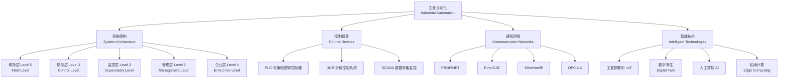
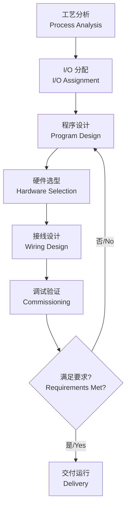

# 工业自动化 (Industrial Automation)

## 定义与概述

工业自动化（Industrial Automation）是利用控制理论（Control Theory）、
仪器仪表（Instrumentation）、计算机技术（Computer Technology）
和信息技术（Information Technology），
对工业生产过程实现检测（Measurement）、控制（Control）、
优化（Optimization）、调度（Scheduling）、
管理（Management）和决策（Decision-making）的综合技术体系。

工业自动化是制造业转型升级的核心驱动力。
从早期的机械自动化、电气自动化发展到当今的数字化和智能化阶段。
其目标是提升生产效率、保证产品质量、降低能耗和人力成本，
并最终实现智能制造（Smart Manufacturing）。

---

## 自动化系统架构 (Automation System Architecture)

### 典型控制回路 (Typical Control Loop)

工业自动化的基本控制回路由三个核心环节组成：
传感器（Sensor）→ 控制器（Controller）→ 执行器（Actuator）。
传感器检测过程变量（温度、压力、流量、液位），控制器根据设定值与反馈信号计算控制量，执行器执行控制指令。

### 自动化金字塔 (Automation Pyramid)

工业自动化系统采用五层金字塔架构，每层在功能、实时性要求和通信方式上各有特征：

| 层级 | 名称 | 功能 | 典型设备 | 实时性要求 |
|------|------|------|----------|-----------|
| Level 0 | 现场层（Field Level） | 物理过程检测与执行 | 传感器、变送器、执行器、变频器 | 毫秒级 |
| Level 1 | 控制层（Control Level） | 逻辑控制与闭环调节 | PLC、DCS 控制器、运动控制器 | 毫秒级 |
| Level 2 | 监控层（Supervisory Level） | 过程监控与操作界面 | SCADA 服务器、HMI、操作员站 | 秒级 |
| Level 3 | 管理层（Management Level） | 生产调度与执行管理 | MES（制造执行系统）、历史数据库 | 分钟级 |
| Level 4 | 企业层（Enterprise Level） | 企业经营与资源规划 | ERP（企业资源计划）、PLM | 天级 |

---

## PLC 控制系统设计 (PLC Control System Design)

PLC（Programmable Logic Controller，可编程逻辑控制器）是工业自动化中最广泛使用的控制设备，
以其高可靠性、强抗干扰能力和灵活的编程方式著称。

### 设计流程 (Design Flow)

1. **工艺分析（Process Analysis）** — 与被控工艺工程师充分沟通，明确控制需求、I/O 点数、控制逻辑和安全要求。
2. **I/O 分配（I/O Assignment）** — 确定 DI、DO、AI、AO 的数量和地址分配。
3. **程序设计（Program Design）** — 采用梯形图（LD）、功能块图（FBD）、结构化文本（ST）等 IEC 61131-3 标准语言编写控制程序。
4. **硬件选型（Hardware Selection）** — 选择 PLC 品牌（西门子、三菱、罗克韦尔、施耐德等）、CPU 型号和通信模块。
5. **接线设计（Wiring Design）** — 绘制电气接线图（Electrical Wiring Diagram）和机柜布局图。
6. **调试验证（Commissioning）** — 现场接线检查、程序模拟测试、空载测试和带载调试，验证控制逻辑的正确性和安全性。

### 设计原则 (Design Principles)

- **可靠性（Reliability）** — 关键环节采用冗余设计（Redundancy），
  如双 CPU 冗余、双电源冗余；内置故障诊断（Fault Diagnosis）和自检测功能。
- **可维护性（Maintainability）** — 采用模块化（Modularity）和标准化（Standardization）设计，便于现场维护。
- **可扩展性（Scalability）** — 预留 I/O 扩展槽位和通信接口，适应未来产线升级需求。

---

## SCADA 系统 (Supervisory Control and Data Acquisition)

SCADA（数据采集与监视控制）系统用于对地理上分散的工业过程进行集中监控，
广泛应用于电力、供水、油气管道、交通等领域。

### 核心功能 (Core Functions)

- **数据采集（Data Acquisition）** — 通过 RTU（Remote Terminal Unit, 远程终端单元）或 PLC 从现场采集实时数据。
- **监控与控制（Monitoring and Control）** — 在 HMI（Human-Machine Interface）上实时显示过程参数，允许操作员远程发送控制指令。
- **报警管理（Alarm Management）** — 设定阈值触发报警，按优先级分级报警，记录报警确认和处理历史。
- **历史数据记录（Historical Data Logging）** — 将过程数据存储到历史数据库，支持趋势分析和报表生成。
- **趋势显示（Trend Display）** — 以曲线图显示过程变量随时间的变化趋势，辅助故障诊断。
- **报表生成（Report Generation）** — 自动生成班报、日报、月报等周期性生产报表。

### 系统组成 (System Components)

| 组件 | 功能 | 部署位置 |
|------|------|----------|
| RTU（远程终端单元） | 采集现场信号并执行远程控制指令 | 现场站点 |
| MTU（主站终端单元） | 集中处理所有 RTU 数据，运行 SCADA 软件 | 控制中心 |
| 通信网络 | 连接 RTU 与 MTU，支持有线和无线方式 | 广域网/局域网 |
| HMI（人机界面） | 图形化显示工艺状态并提供操作界面 | 操作员站 |

---

## DCS 系统 (Distributed Control System)

DCS（分散控制系统）专为大型连续过程工业设计，采用分散控制、集中管理的架构理念。

**特点**：分散控制（Distributed Control）降低单点故障风险；集中管理（Centralized Management）统一监视所有控制器；
冗余设计使系统可用性（Availability）可达 99.999%；对 PID 调节、串级控制、前馈控制等提供原生支持。

**典型应用**：石化炼油（Petrochemical Refining）、火力发电（Thermal Power Generation）、
冶金（Metallurgy）、化工（Chemical Processing）、制药（Pharmaceutical Manufacturing）等。

---

## 工业以太网 (Industrial Ethernet)

工业以太网是传统以太网在工业环境中的增强版本，在实时性、可靠性和抗干扰性方面针对工业控制进行了专门优化。

| 协议 | 主导厂商 | 实时性 | 特点 |
|------|----------|--------|------|
| PROFINET | 西门子（Siemens） | RT: 1ms, IRT: 0.25ms | 支持等时实时，适合运动控制 |
| EtherCAT | 倍福（Beckhoff） | < 100μs | 飞速数据传递技术，延迟极低 |
| EtherNet/IP | 罗克韦尔（Rockwell） | 标准: 10–100ms | 基于标准 TCP/IP，兼容性好 |
| POWERLINK | 贝加莱（B&R） | < 200μs | 开源实时以太网协议 |
| CC-Link IE | 三菱（Mitsubishi） | 1ms 以内 | 日系厂商主导的开放式现场网络 |
| OPC UA | OPC Foundation | 软实时 | 平台无关，支持语义建模和安全通信 |

---

## 工业 4.0 与智能制造 (Industry 4.0 and Smart Manufacturing)

工业 4.0（Industry 4.0）是德国政府提出的以信息物理系统（Cyber-Physical Systems, CPS）为核心的
第四次工业革命战略，通过数字化和智能化技术实现制造业的彻底变革。

### 核心概念 (Core Concepts)

- **信息物理系统（CPS）** — 计算、网络与物理过程的深度融合，实现虚实映射与协同。
- **工业物联网（IIoT, Industrial Internet of Things）** — 通过传感器和网络将工业设备互联，实现数据驱动的智能决策。
- **数字孪生（Digital Twin）** — 物理设备的虚拟镜像，在产品全生命周期内实现仿真、监控和优化。
- **智能工厂（Smart Factory）** — 具备自感知、自适应、自优化能力的柔性制造系统。

### 关键技术 (Key Technologies)

- **大数据分析（Big Data Analytics）** — 从海量生产数据中提取模式、预测故障、优化工艺参数。
- **云计算与边缘计算（Cloud & Edge Computing）** — 在云平台进行全局优化，在边缘节点处理实时控制任务。
- **人工智能与机器学习（AI & Machine Learning）** — 用于质量检测（缺陷识别）、预测性维护（Predictive Maintenance）和工艺优化。
- **增强现实（Augmented Reality, AR）** — 辅助设备维护、远程专家指导和操作员培训。
- **5G 工业网络（5G Industrial Networks）** — 提供低延迟（<1ms）、高带宽和大规模设备连接能力。

---

## 经典教材 (Classic Textbooks)

- 廖常初《PLC 编程及应用》（国内 PLC 入门经典）
- 侯世英《过程控制》（过程控制理论的中文教材）
- William Bolton《Industrial Control Electronics》
- John R. Hackworth《Programmable Logic Controllers: Programming Methods and Applications》
- 孙志毅《工业以太网与现场总线》

## 主要应用领域 (Major Applications)

- **汽车制造（Automotive Manufacturing）** — 焊接、涂装、总装线的自动化控制
- **石油化工（Petrochemical Industry）** — 精馏塔、反应釜的温度压力控制
- **电力生产（Power Generation）** — 锅炉、汽轮机、发电机组的协调控制
- **食品饮料（Food & Beverage）** — 配料、灌装、包装自动化生产线
- **物流仓储（Logistics & Warehousing）** — 自动分拣系统（Sortation System）、AGV、立体仓库
- **半导体制造（Semiconductor Manufacturing）** — 洁净室环境控制、晶圆传输自动化

---

## 相关条目 (Related Notes)

- [[PLCProgramming]] — PLC 编程语言和方法论
- [[ControlSystems]] — 控制系统理论基础
- [[SmartManufacturing]] — 智能制造技术体系
- [[SensorTechnology]] — 传感器原理与选型
- [[RoboticsBasics]] — 机器人学基础
- [[IndustrialNetworking]] — 工业网络与通信协议
- [[ProcessControl]] — 过程控制
- [[SCADA]] — SCADA 系统详解
