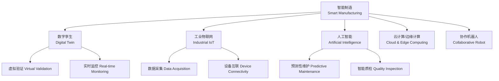

---
aliases: [SmartManufacturing, 智能制造, 工业4.0]
tags: ['ControlAndSystemsEngineering', 'Automation', 'SmartManufacturing', 'Industry4.0']
created: 2026-05-17
updated: 2026-05-17
---

# 智能制造 (Smart Manufacturing)

## 概述

智能制造（Smart Manufacturing / Intelligent Manufacturing）是基于新一代信息技术（Information Technology）与先进制造技术（Advanced Manufacturing Technology）深度融合的新型生产方式。它贯穿设计（Design）、生产（Production）、管理（Management）和服务（Service）等制造全生命周期，是"工业4.0"（Industry 4.0）和"中国制造2025"（Made in China 2025）的核心内容。

## 智能制造架构

## 核心概念表

| 概念 | 英文 | 定义 | 关键技术 |
|------|------|------|---------|
| 数字孪生 | Digital Twin | 物理实体的虚拟映射，实时交互 | 建模、仿真、数据融合 |
| 工业物联网 | IIoT | 工业设备的网络互联和数据采集 | 传感器、5G、边缘计算 |
| 预测性维护 | Predictive Maintenance | 基于状态监测的维修决策 | 信号处理、机器学习 |
| MES | Manufacturing Execution System | 生产过程执行管理系统 | 排程、追踪、质量管理 |
| 机器视觉 | Machine Vision | 用计算机代替人眼检测 | 图像处理、深度学习 |
| 数字主线 | Digital Thread | 产品全生命周期的数据流 | PLM、BOM、追溯 |

## 数字孪生技术

### 五维模型

数字孪生（Digital Twin）是在虚拟空间中创建物理实体的数字映射（Digital Mapping），实现物理世界与数字世界的实时交互和闭环优化：

$$ \text{Digital Twin} = \text{Physical Entity} + \text{Virtual Model} + \text{Connection} + \text{Data} + \text{Service} $$

### 主要应用场景

**产品设计**：在产品开发阶段进行虚拟原型（Virtual Prototype）验证，减少物理样机迭代次数。

**生产过程**：对生产线进行实时监控和参数优化，通过仿真预测瓶颈（Bottleneck）和优化调度方案。

**设备运维**：建立设备健康管理（Prognostics and Health Management, PHM）系统，实现故障预测和剩余寿命（Remaining Useful Life, RUL）估计。

## 工业物联网

### 四层架构

工业物联网（Industrial Internet of Things, IIoT）采用分层架构：

| 层级 | 功能 | 技术/设备 | 数据 |
|------|------|----------|------|
| 感知层 | 数据采集 | 传感器、RFID、摄像头 | 原始信号 |
| 网络层 | 数据传输 | 工业以太网、5G、WiFi 6、LoRa | 结构化数据 |
| 平台层 | 数据存储和处理 | 工业互联网平台、数据中台 | 聚合数据 |
| 应用层 | 业务应用 | 工业 APP、可视化看板 | 决策信息 |

### 关键技术

**边缘计算（Edge Computing）**：在靠近数据源的边缘节点进行实时数据处理，降低延迟和带宽需求：

$$ \text{Response Time} = T_{\text{sense}} + T_{\text{edge}} + T_{\text{act}} $$

典型的边缘计算网关延迟低于10ms，而云端处理通常需要50~200ms。

**5G 专网**：为工厂提供超低延迟（Ultra-Reliable Low-Latency Communication, URLLC）、大带宽（eMBB）和海量连接（mMTC），支持 AGV 调度、远程控制和 AR 辅助装配。

## 智能工厂架构

### 自动化金字塔

智能工厂（Smart Factory）参照 ISA-95标准的五层架构：

从底层到顶层：现场设备层（Field Devices）→ 控制层（Control）→ 执行层（Operations）→ 管理层（Plant Management）→ 企业层（Enterprise）。

### 核心系统

- **MES**（Manufacturing Execution System，制造执行系统）：负责生产排程、工单管理、物料追踪和质量追溯
- **WMS**（Warehouse Management System，仓库管理系统）：管理原材料和成品库存，与 AGV 集成实现自动出入库
- **QMS**（Quality Management System，质量管理系统）：SPC 分析、质量门管理、不合格品处理
- **PLM**（Product Lifecycle Management，产品生命周期管理）：从概念到报废的全生命周期数据管理

### MES 功能模块

| 模块 | 功能描述 | 输入 | 输出 |
|------|---------|------|------|
| 生产调度 | 工单排程和资源分配 | 订单、BOM | 生产计划 |
| 物料追踪 | 批次追溯和防错 | 条码/RFID | 追溯链 |
| 质量管理 | SPC 和检验管理 | 检测数据 | 质量报告 |
| 设备管理 | OEE 和设备维护 | 设备状态 | 维护工单 |
| 绩效分析 | KPI 和 OEE 分析 | 生产数据 | 管理看板 |

## 预测性维护

### 技术路线

1. **数据采集**：通过传感器采集设备运行数据（振动 Vibration、温度 Temperature、电流 Current、声发射 Acoustic Emission）
2. **特征提取**：在时域（RMS、峰值因子）、频域（FFT 频谱）和时频域（小波变换 Wavelet Transform）提取特征
3. **故障诊断**：基于机器学习的模式识别：

$$ y = f(x) \quad \text{where} \quad x \in \mathbb{R}^n \text{ (特征向量)}, \quad y \in \{正常, 故障_A, 故障_B, \ldots\} $$

4. **寿命预测**：利用退化模型（Degradation Model）预测 RUL：

$$ \text{RUL} = \inf\{t: D(t) \geq D_{\text{threshold}}\} $$

### 常用算法

- 支持向量机（Support Vector Machine, SVM）：小样本分类
- 随机森林（Random Forest）：多特征分类
- 长短期记忆网络（LSTM）：时序数据预测
- 卷积神经网络（CNN）：振动频谱图像识别
- 自编码器（Autoencoder）：异常检测

## 质量检测自动化

### 机器视觉检测

视觉检测系统（Vision Inspection System）包括：工业相机（Industrial Camera）、光学系统（Lens & Lighting）、图像处理单元和通信接口。

深度学习在缺陷检测中的应用：

$$ \text{Defect Map} = \text{CNN}(\text{Image}) \quad \text{with} \quad \text{IoU} \geq 0.5 $$

### 在线检测设备

- 激光测量（Laser Measurement）：非接触式尺寸检测
- 三坐标测量机（Coordinate Measuring Machine, CMM）：高精度几何检测
- 统计过程控制（Statistical Process Control, SPC）：通过控制图（Control Chart）监控过程稳定性

## 协作机器人应用

协作机器人（Collaborative Robot / Cobot）可在无安全围栏的情况下与人协作：

| 应用场景 | 任务描述 | 关键技术要求 |
|---------|---------|-------------|
| 人机协作装配 | 人与机器人协同完成装配 | 力控、安全停机 |
| 质量检测 | 机器人抓持工件到检测位 | 视觉引导 |
| 物料搬运 | 物料取放和码垛 | 路径规划 |
| 实验室自动化 | 移液、分装 | 高精度 |

## 工业机器人集成

### 机器人编程方式

在智能制造场景中，工业机器人（Industrial Robot）的编程方式不断发展：

- **示教编程**（Teach Pendant Programming）：传统方式，操作者通过示教器逐点记录路径
- **离线编程**（Offline Programming）：在虚拟环境中生成运动轨迹，减少停机时间
- **拖动示教**（Drag Teaching）：直接拖动机械臂记录路径，适用于协作机器人
- **视觉引导编程**（Vision-Guided Programming）：通过视觉系统自动识别工件位置和姿态

### 机器人与 AGV 协同

移动操作臂（Mobile Manipulator）将机械臂与 AGV（Automated Guided Vehicle，自动导引车）结合，实现：

- 跨工位物料搬运
- 柔性工位间的自适应装配
- 仓储与产线之间的物料衔接

AGV 导航技术包括磁条导航（Magnetic Tape）、激光 SLAM（Laser SLAM）和二维码导航（QR Code Navigation）。

## 数字孪生与仿真

### 虚拟调试技术

虚拟调试（Virtual Commissioning）在数字孪生环境中验证 PLC 程序和机器人路径，减少现场调试风险：

$$ \text{调试时间节省} = \frac{T_{\text{传统}} - T_{\text{虚拟}}}{T_{\text{传统}}} \times 100\% $$

### 产线仿真优化

通过离散事件仿真（Discrete Event Simulation, DES）对生产系统建模，分析产能（Throughput）、在制品（WIP, Work In Process）和资源利用率（Utilization Rate）：

$$ \text{OEE} = \text{Availability} \times \text{Performance} \times \text{Quality} $$

设备综合效率（Overall Equipment Effectiveness, OEE）是衡量制造系统效率的核心指标。

## 汽车智能制造案例

## 工业数据采集与边缘计算

### 数据采集架构

工业数据采集（Industrial Data Acquisition）通过多种协议和接口采集设备数据：

| 协议/接口 | 传输速率 | 典型应用 | 特点 |
|----------|---------|---------|------|
| OPC UA | 平台无关 | 设备间通信 | 安全、跨平台 |
| Modbus TCP | 10/100Mbps | PLC 通信 | 简单、广泛使用 |
| PROFINET | 100Mbps | 西门子设备 | 实时性高 |
| EtherCAT | 100Mbps | 运动控制 | 超低延迟(<100μs) |
| MQTT | 取决于网络 | IoT 设备 | 轻量级发布/订阅 |

### 边缘计算的应用模式

边缘计算（Edge Computing）在智能制造中承担实时数据处理和本地决策功能：

$$ \text{延迟} = T_{\text{采集}} + T_{\text{处理}} + T_{\text{执行}} $$

对于需要毫秒级响应的应用场景（如机器人碰撞检测），边缘计算是唯一可行的方案。典型的边缘 - 云协同架构中，边缘节点负责实时控制，云端负责历史数据分析和模型训练。

## 工业网络安全

### OT 与 IT 融合安全

智能制造中运营技术（Operational Technology, OT）与信息技术（Information Technology, IT）的融合带来了新的安全挑战（Cybersecurity Challenges）。工业控制系统（ICS）安全防护包括：

- **网络分段**：将 OT 网络与 IT 网络逻辑隔离
- **纵深防御**（Defense-in-Depth）：多层安全防护，边界防火墙 + 主机防护 + 应用白名单
- **异常检测**：基于机器学习的工业网络流量异常分析
- **安全更新管理**：在计划停机窗口内完成安全补丁更新

### 工业安全标准

- IEC 62443：工业通信网络安全国际标准
- GB/T 22239：中国网络安全等级保护基本要求

## 经典教材

1. 周济. *智能制造*. 清华大学出版社.
2. 王志良. *工业4.0与智能制造*. 机械工业出版社.
3. Lee, J. *Industrial AI*. Springer, 2020.
4. Zhong, R. Y. *Intelligent Manufacturing*. CRC Press.

## 相关条目

- [[IndustrialAutomation]]
- [[04_EngineeringAndTechnology/MechanicalAndElectricalEngineering/Mechatronics/RoboticsBasics|RoboticsBasics]]
- [[04_EngineeringAndTechnology/MechanicalAndElectricalEngineering/Mechatronics/PLCProgramming|PLCProgramming]]
- [[04_EngineeringAndTechnology/MechanicalAndElectricalEngineering/MechanicalEngineering/CADCAM|CADCAM]]
- [[07_InterdisciplinarySciences/NetworkedInformationSystems/InternetOfThings|InternetOfThings]]

