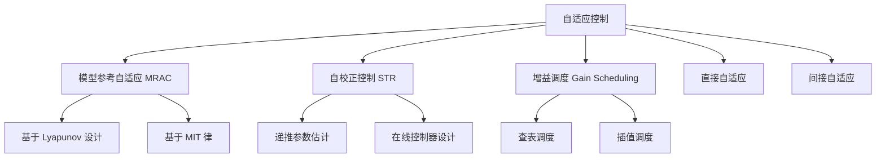
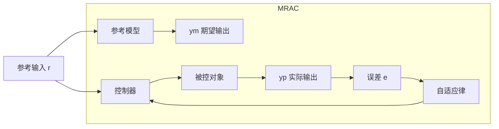
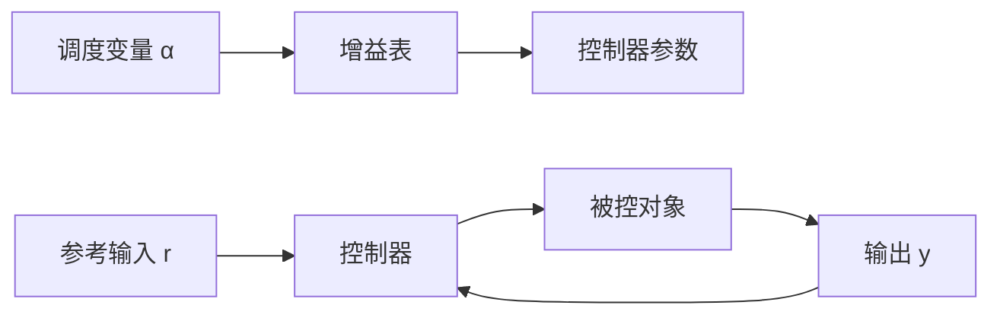

# 自适应控制

## 一、概述

自适应控制（Adaptive Control）是一类能够在线调整控制器参数以适应被控对象特性变化（参数时变、不确定性、环境变化）的控制方法。其核心思想是"辨识 + 控制"的闭环互动——"边学习、边控制"。

## 二、自适应控制分类

## 三、模型参考自适应控制（MRAC）

### 3.1 基本原理

MRAC（Model Reference Adaptive Control）包含三个核心部分：

- **参考模型（Reference Model）**：定义期望的闭环响应特性
- **控制器（Controller）**：参数可调
- **自适应律（Adaptation Law）**：根据跟踪误差 $\mathbf{e} = \mathbf{y}_p - \mathbf{y}_m$ 调整控制器参数

### 3.2 MIT 律（MIT Rule）

由 MIT 实验室提出，通过梯度下降法最小化误差函数 $J(\theta) = \frac{1}{2} e^2$：

$$
\frac{d\theta}{dt} = -\gamma \frac{\partial J}{\partial \theta} = -\gamma e \frac{\partial e}{\partial \theta}
$$

其中 $\gamma > 0$ 为自适应增益（Adaptation Gain），$\frac{\partial e}{\partial \theta}$ 为灵敏度导数（Sensitivity Derivative）。

对于一阶系统 $\dot{y}_p = -a_p y_p + b_p u$，参考模型 $\dot{y}_m = -a_m y_m + b_m r$，控制器 $u = \theta_1 r - \theta_2 y_p$，MIT 自适应律为：

$$
\frac{d\theta_1}{dt} = -\gamma' e \frac{a_m}{s + a_m} r
$$

$$
\frac{d\theta_2}{dt} = \gamma' e \frac{a_m}{s + a_m} y_p
$$

### 3.3 Lyapunov 设计法

MIT 律无法保证稳定性。Lyapunov 方法基于正定函数 $V(\mathbf{x}, \tilde{\theta})$ 设计自适应律：

选取 Lyapunov 候选函数：

$$
V = \frac{1}{2} \left( e^2 + \frac{1}{\gamma} \tilde{\theta}^T \tilde{\theta} \right)
$$

要求 $\dot{V} \leq 0$ 来推导自适应律，确保闭环系统全局渐近稳定。

Barbalat 引理用于证明误差收敛性：若 $\dot{V}$ 一致连续且 $V$ 有下界，则 $\dot{V} \to 0$，从而 $e \to 0$。

## 四、自校正调节器（STR）

### 4.1 自校正原理

STR（Self-Tuning Regulator）包含在线参数估计和控制器设计两个阶段：

1. **参数估计（Parameter Estimation）**：递推最小二乘（RLS, Recursive Least Squares）在线更新模型参数
2. **控制器设计（Controller Design）**：基于当前估计参数，重新计算控制器参数

### 4.2 递推最小二乘（RLS）

系统模型（ARX 形式）：

$$
y(k) = \varphi^T(k) \theta + e(k)
$$

其中 $\varphi(k) = [-y(k-1), \ldots, -y(k-n_a), u(k-d-1), \ldots, u(k-d-n_b)]^T$。

RLS 递推公式：

$$
\hat{\theta}(k) = \hat{\theta}(k-1) + K(k)[y(k) - \varphi^T(k) \hat{\theta}(k-1)]
$$

$$
K(k) = \frac{P(k-1) \varphi(k)}{\lambda + \varphi^T(k) P(k-1) \varphi(k)}
$$

$$
P(k) = \frac{1}{\lambda} \left[ I - K(k) \varphi^T(k) \right] P(k-1)
$$

其中 $\lambda$ 为遗忘因子（Forgetting Factor），$0 < \lambda \leq 1$。$\lambda$ 越小，对最新数据的权重越大。

### 4.3 极点配置设计（Pole Placement）

期望闭环特征多项式 $A_m(z)$，设计控制器 $R(z)u(k) = T(z)r(k) - S(z)y(k)$ 满足：

$$
A(z) R(z) + B(z) S(z) = A_m(z)
$$

Diophantine 方程（丢番图方程）求解 $R(z)$ 和 $S(z)$。

## 五、增益调度控制（Gain Scheduling）

### 5.1 原理

基于可测辅助变量（Scheduling Variable，如速度、高度、温度）在多个工作点上预先设计线性控制器，运行时查表或插值切换控制器参数。

### 5.2 优缺点

| 优点 | 缺点 |
|------|------|
| 计算量小，适合快速系统 | 设计工作量大（需多个工作点） |
| 物理意义明确 | 调度变量难以选择 |
| 工程实践成熟（航空航天） | 切换瞬态稳定性无保证 |
| 与 gain 表外推可扩展 | 无法处理未知工况 |

## 六、稳定性与鲁棒性

### 6.1 鲁棒自适应控制

标准自适应控制在面对未建模动态（Unmodeled Dynamics）和有界扰动时可能失稳（Rohrs 反例）。改进方法：

- $\sigma$-修正（$\sigma$-Modification）：在自适应律中加入阻尼项：

$$
\frac{d\theta}{dt} = -\gamma e \phi - \sigma \theta
$$

- $e$-修正（$e$-Modification）：将误差引入阻尼项：

$$
\frac{d\theta}{dt} = -\gamma e \phi - \gamma |e| \theta
$$

- 死区修正（Dead-Zone Modification）：误差小于阈值时停止自适应：

$$
\frac{d\theta}{dt} = \begin{cases}
-\gamma e \phi, & |e| > \Delta \\
0, & |e| \leq \Delta
\end{cases}
$$

### 6.2 持续激励条件（PE, Persistently Exciting）

参数收敛要求输入信号具有充分的频谱内容。信号 $\varphi(t)$ 满足 PE 条件：

$$
\int_t^{t+T} \varphi(\tau) \varphi^T(\tau) d\tau \geq \alpha I > 0, \quad \forall t \geq 0
$$

若 PE 条件不满足，参数估计值可能不收敛到真实值。

## 十、自适应控制实验验证

### 10.1 仿真流程

自适应控制算法开发的标准仿真验证步骤：

1. 建立被控对象标称模型 $G_0(s)$ 和不确定性模型 $\Delta(s)$
2. 设计标称控制器和自适应律
3. 在标称条件下测试自适应收敛性
4. 引入参数突变（如 $a_p$ 从 1 突变为 3）测试自适应跟踪速度
5. 引入未建模动态（如高频柔性模态）测试鲁棒性
6. 注入量测噪声测试抗干扰性
7. 评估指标：跟踪误差 $e_{\text{RMS}}$、参数收敛时间 $t_{\text{conv}}$、控制能量 $\int u^2 dt$

### 10.2 半实物仿真（HIL, Hardware-in-the-Loop）

HIL 仿真将真实的控制器硬件与实际仿真环境连接，在接近真实的条件下验证自适应控制算法。

## 八、多模型自适应控制（MMAC）

MMAC 维护一组候选模型 $M_1, M_2, \ldots, M_N$，每个模型对应一个预设控制器。运行时基于贝叶斯后验概率：

$$
P(M_i | y^k) = \frac{p(y(k) | M_i, y^{k-1}) P(M_i | y^{k-1})}{\sum_j p(y(k) | M_j, y^{k-1}) P(M_j | y^{k-1})}
$$

选择概率最大的模型/控制器。适用于参数跳变系统（如故障重构）。

## 九、应用领域

| 领域 | 典型应用 | 自适应类型 |
|------|---------|-----------|
| 航空航天 | 飞行器姿态控制 | MRAC + 增益调度 |
| 机器人 | 机械臂轨迹跟踪 | MRAC |
| 过程控制 | pH 中和、反应器温度 | STR |
| 电力系统 | 发电机励磁控制 | STR |
| 汽车 | 发动机怠速控制 | 增益调度 |
| 船舶 | 航向保持 | 自校正 |

## 八、发展前沿

- **多模型自适应控制（MMAC）**：多个候选模型并行估计，切换至最优模型
- **自适应模型预测控制（Adaptive MPC）**：在线更新预测模型
- **强化学习驱动自适应**：Q-learning、策略梯度实现无模型自适应
- **数据驱动自适应控制**：基于子空间辨识和 Youla 参数化

## 十一、自适应控制工程实施

### 11.1 控制器设计注意事项

| 注意事项 | 说明 |
|---------|------|
| 参数初始化 | 使用离线辨识获得初始估计值 |
| 自适应速率 | $\gamma$ 值选取（过小-收敛慢；过大-可能失稳） |
| 抗积分饱和 | 自适应律在控制量饱和时暂停 |
| 参数投影 | 确保参数估计值在物理合理范围内 |
| 软启动 | 初始阶段使用保守参数逐渐过渡 |
| 模式切换 | 人工/自动切换时的无扰过渡 |

### 11.2 工业应用中的诊断与监控

- 参数变化趋势监控：参数缓慢漂移指示设备老化
- 持久激励检测：输入信号能量不足时冻结自适应
- 故障检测：残差信号超过阈值时发出警报
- 性能退化：跟踪误差增大指示需要维护

## 十二、自适应控制发展趋势

- **数据驱动自适应**：利用子空间辨识和 Youla 参数化实现无模型自适应
- **强化学习自适应**：Q-learning、策略梯度在自适应律中的应用
- **安全自适应**：通过屏障函数（Barrier Function）保证探索过程中的安全性
- **分布式自适应**：多智能体系统的协同自适应控制
- **自适应与机器学习的融合**：深度神经网络近似未知系统动力学

## 十三、总结

自适应控制在模型不确定和参数时变系统中具有独特优势。MRAC 和 STR 是最核心的两类方法，Lyapunov 稳定性理论为其提供了理论基础。持续激励、鲁棒自适应和改进自适应律是工程应用中的关键考虑因素。未来的自适应控制将与机器学习和数据驱动方法深度融合。自适应控制正在从航空航天向过程控制、机器人和生物医学等更广泛的工程领域渗透。

## 相关条目
- [[04_EngineeringAndTechnology/ControlAndSystemsEngineering/ControlTheory/INDEX|当前目录索引]]
- [[RobustControl]]
- [[NonlinearControl]]
- [[SystemIdentification]]
