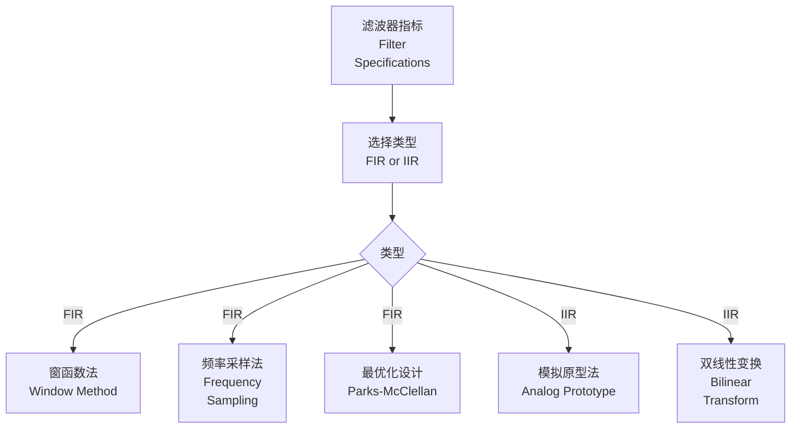

---
aliases:
  - Digital Control
  - 数字控制理论
  - 离散时间控制
tags:
  - digital-control
  - z-transform
  - discrete-time
  - sampling
  - digital-filters
---

# 数字控制 (Digital Control)

数字控制研究使用数字计算机实现控制系统的设计与分析。与连续时间控制相比，数字控制具有灵活性高、抗干扰能力强、易于实现复杂算法等优势。

## 采样与保持 (Sampling and Holding)

数字控制系统首先需要将连续时间信号转换为离散时间信号。

### 采样定理 (Sampling Theorem)

香农采样定理指出：

> 为了从采样信号中无失真地恢复原始连续信号，采样频率必须大于信号最高频率的两倍：
>
> $$f_s > 2 f_{max}$$

其中 $f_s$ 为采样频率，$f_{max}$ 为信号最高频率分量。

### 采样过程

理想采样可建模为冲激序列调制：

$$
x^*(t) = x(t) \sum_{n=-\infty}^{\infty} \delta(t - nT) = \sum_{n=-\infty}^{\infty} x(nT) \delta(t - nT)
$$

其中 $T$ 为采样周期。

### 零阶保持器 (Zero-Order Hold)

ZOH 将离散信号转换为阶梯状连续信号：

$$
G_{ZOH}(s) = \frac{1 - e^{-Ts}}{s}
$$

```mermaid
graph LR
    A[连续信号<br/>x(t)] --> B[采样器<br/>Sampler]
    B --> C[离散信号<br/>x(kT)]
    C --> D[零阶保持器<br/>ZOH]
    D --> E[阶梯信号<br/>x_h(t)]
    E --> F[被控对象<br/>Plant]
```

## Z 变换 (Z-Transform)

Z 变换是分析离散时间系统的数学工具，类似于连续系统的拉普拉斯变换。

### 定义

双边 Z 变换：

$$
X(z) = \sum_{n=-\infty}^{\infty} x[n] z^{-n}
$$

单边 Z 变换（因果信号）：

$$
X(z) = \sum_{n=0}^{\infty} x[n] z^{-n}
$$

### 常用 Z 变换对

| 时域信号 $x[n]$ | Z 变换 $X(z)$ | 收敛域 |
|----------------|--------------|--------|
| $\delta[n]$ | 1 | 全平面 |
| $u[n]$ | $\frac{1}{1 - z^{-1}}$ | $|z| > 1$ |
| $a^n u[n]$ | $\frac{1}{1 - a z^{-1}}$ | $|z| > |a|$ |
| $n u[n]$ | $\frac{z^{-1}}{(1 - z^{-1})^2}$ | $|z| > 1$ |
| $\sin(\omega n) u[n]$ | $\frac{z^{-1} \sin \omega}{1 - 2z^{-1}\cos\omega + z^{-2}}$ | $|z| > 1$ |

### Z 变换性质

| 性质 | 时域 | Z 域 |
|------|------|------|
| 线性 | $a x_1[n] + b x_2[n]$ | $a X_1(z) + b X_2(z)$ |
| 时移 | $x[n-k]$ | $z^{-k} X(z)$ |
| 卷积 | $x_1[n] * x_2[n]$ | $X_1(z) X_2(z)$ |
| 初值定理 | $x[0]$ | $\lim_{z \to \infty} X(z)$ |
| 终值定理 | $\lim_{n \to \infty} x[n]$ | $\lim_{z \to 1} (1-z^{-1})X(z)$ |

## 离散时间系统分析 (Discrete-Time System Analysis)

### 差分方程 (Difference Equations)

离散时间系统用差分方程描述：

$$
y[n] + a_1 y[n-1] + \cdots + a_N y[n-N] = b_0 x[n] + b_1 x[n-1] + \cdots + b_M x[n-M]
$$

### 脉冲传递函数 (Pulse Transfer Function)

对差分方程取 Z 变换：

$$
G(z) = \frac{Y(z)}{X(z)} = \frac{b_0 + b_1 z^{-1} + \cdots + b_M z^{-M}}{1 + a_1 z^{-1} + \cdots + a_N z^{-N}}
$$

### 连续到离散的转换

| 方法 | 映射关系 | 特点 |
|------|----------|------|
| 前向差分 | $s \approx \frac{z-1}{T}$ | 简单，可能不稳定 |
| 后向差分 | $s \approx \frac{z-1}{zT}$ | 稳定区域映射到圆内 |
| 双线性变换 | $s = \frac{2}{T}\frac{z-1}{z+1}$ | 频率畸变，需预畸变 |
| 脉冲响应不变 | $h[n] = h_c(nT)$ | 保持脉冲响应 |
| 阶跃响应不变 | 匹配 Z 变换 | 保持阶跃响应 |

双线性变换（Tustin 方法）：

$$
s = \frac{2}{T} \cdot \frac{z - 1}{z + 1}
$$

频率预畸变：

$$\omega_{analog} = \frac{2}{T} \tan\left(\frac{\omega_{digital} T}{2}\right)
$$

## 数字控制器设计 (Digital Controller Design)

### 离散 PID 控制器

位置式 PID：

$$
u[n] = K_p e[n] + K_i T \sum_{j=0}^{n} e[j] + \frac{K_d}{T}(e[n] - e[n-1])
$$

增量式 PID：

$$
\Delta u[n] = K_p (e[n] - e[n-1]) + K_i T e[n] + \frac{K_d}{T}(e[n] - 2e[n-1] + e[n-2])
$$

### 直接数字设计

基于离散模型直接设计控制器：

$$D(z) = \frac{1}{G(z)} \cdot \frac{T(z)}{1 - T(z)}$$

其中 $T(z)$ 为期望的闭环传递函数。

### 最少拍控制 (Deadbeat Control)

在有限个采样周期内使系统输出跟踪参考输入：

$$T(z) = z^{-N}$$

特点：
- 响应速度最快
- 对模型误差敏感
- 控制量可能过大

## 数字滤波器 (Digital Filters)

数字滤波器是数字信号处理的核心组件。

### FIR 滤波器

有限脉冲响应滤波器：

$$
y[n] = \sum_{k=0}^{N-1} h[k] x[n-k]
$$

特点：
- 总是稳定
- 可实现线性相位
- 需要较高阶数

### IIR 滤波器

无限脉冲响应滤波器：

$$
y[n] = \sum_{k=0}^{M} b_k x[n-k] - \sum_{k=1}^{N} a_k y[n-k]
$$

特点：
- 可用较低阶数实现陡峭截止
- 可能不稳定
- 相位非线性

### 滤波器设计方法



## 稳定性分析 (Stability Analysis)

### 稳定性判据

离散系统稳定的充要条件：所有极点位于单位圆内。

$$|p_i| < 1, \quad \forall i$$

### 朱利判据 (Jury Stability Criterion)

对于特征方程 $A(z) = 0$，构造朱利阵列判断根是否在单位圆内。

### 稳定性区域映射

| 连续域 | 离散域 |
|--------|--------|
| 虚轴 $s = j\omega$ | 单位圆 $z = e^{j\omega T}$ |
| 左半平面 | 单位圆内部 |
| 右半平面 | 单位圆外部 |

```mermaid
graph LR
    subgraph 连续域
        A1[稳定区域<br/>左半平面]
    end
    subgraph 离散域
        B1[稳定区域<br/>单位圆内]
    end
    A1 -.->|z=e^{sT}| B1
```

## 参考资料 (References)

- Franklin, G.F. et al. *Digital Control of Dynamic Systems*
- Ogata, K. *Discrete-Time Control Systems*
- Astrom, K.J. & Wittenmark, B. *Computer-Controlled Systems*
