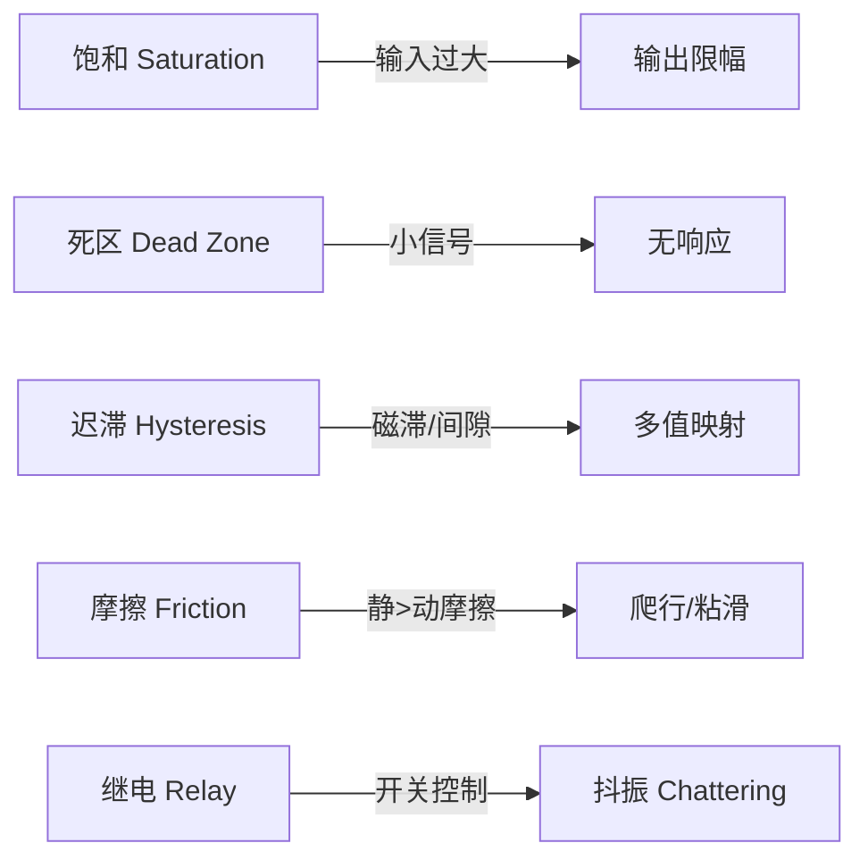

# 非线性控制

## 一、概述

非线性控制（Nonlinear Control）研究非线性动力学系统的分析与综合方法。由于实际系统中普遍存在非线性（饱和、摩擦、迟滞、死区等），线性控制方法在大范围工况下往往失效，必须采用专用非线性控制理论。

## 二、非线性系统特性

### 2.1 与线性系统的本质区别

| 特性 | 线性系统 | 非线性系统 |
|------|---------|-----------|
| 叠加原理 | 成立 | 不成立 |
| 平衡点 | 唯一（原点） | 可能有多个 |
| 响应特性 | 与初始条件无关 | 依赖初始条件 |
| 稳定性 | 全局一致 | 局部 + 全局 |
| 极限环 | 不存在 | 可存在 |
| 频率响应 | 无谐波生成 | 产生高次谐波 |
| 分岔与混沌 | 不存在 | 可存在 |

### 2.2 非线性现象

- **有限逃逸时间（Finite Escape Time）**：$\dot{x} = x^2$，$x(0)=1$ → $x(t) \to \infty$ 在有限时间 $t=1$
- **多平衡点（Multiple Equilibria）**：$\dot{x} = -x + x^3$ 有三个平衡点 $x=0, \pm 1$
- **极限环（Limit Cycle）**：Van der Pol 振荡器 $\ddot{x} + \mu(x^2-1)\dot{x} + x = 0$
- **分岔（Bifurcation）**：参数变化引起系统定性行为突变
- **混沌（Chaos）**：Lorenz 系统 $\dot{x} = \sigma(y-x), \dot{y} = x(\rho-z)-y, \dot{z} = xy-\beta z$

## 三、常见非线性环节

### 3.1 典型环节特性

### 3.2 数学模型

| 环节 | 描述函数 $N(A)$ | 特性 |
|------|----------------|------|
| 饱和 | $\frac{2k}{\pi}\left[\arcsin\frac{a}{A} + \frac{a}{A}\sqrt{1-(\frac{a}{A})^2}\right]$ | $A > a$ 时等效增益下降 |
| 死区 | $k - \frac{2k}{\pi}\left[\arcsin\frac{\Delta}{A} + \frac{\Delta}{A}\sqrt{1-(\frac{\Delta}{A})^2}\right]$ | $A < \Delta$ 时无输出 |
| 继电 | $\frac{4D}{\pi A}$ | 等效增益与 $1/A$ 成比例 |
| 间隙 | $\frac{k}{\pi}\left[\frac{\pi}{2} - \arcsin(1-\frac{2b}{A}) - 2(1-\frac{2b}{A})\sqrt{\frac{b}{A}(1-\frac{b}{A})}\right] - j\frac{4kb}{\pi A}(1-\frac{b}{A})$ | 引起相位滞后 |

## 四、稳定性分析

### 4.1 李雅普诺夫方法（Lyapunov's Method）

**第一法（间接法）**：在平衡点附近线性化，若线性化系统所有特征根都具有负实部，则原非线性系统在该平衡点局部渐近稳定。

**第二法（直接法）**：构造能量函数 $V(x)$：

- $V(0) = 0$
- $V(x) > 0, \forall x \neq 0$（正定）
- $\dot{V}(x) = \frac{\partial V}{\partial x} f(x) < 0, \forall x \neq 0$（负定）
- 则平衡点全局渐近稳定

对于自治系统 $\dot{x} = f(x)$，常用候选 Lyapunov 函数：

$$
V(x) = x^T P x, \quad P > 0
$$

Lyapunov 方程：

$$
A^T P + P A = -Q, \quad Q > 0
$$

### 4.2 LaSalle 不变集原理

当 $\dot{V}(x) \leq 0$（半负定）时，仍可证明收敛性：系统轨迹最终进入 $\{x: \dot{V}(x) = 0\}$ 的最大不变集。

### 4.3 绝对稳定性

圆判据（Circle Criterion）和 Popov 判据用于分析反馈系统中非线性环节的稳定性。

Popov 判据：对于非线性 $\phi(y)$ 满足扇区条件 $0 \leq \phi(y)/y \leq k$，若存在 $\eta > 0$ 使得：

$$
\text{Re}[(1 + j\omega\eta)G(j\omega)] + \frac{1}{k} > 0, \quad \forall \omega \geq 0
$$

则系统绝对稳定。

## 五、分析方法

### 5.1 相平面法（Phase Plane Analysis）

适用于二阶系统的图形化分析方法：

$$
\ddot{x} = f(x, \dot{x})
$$

在相平面 $(x, \dot{x})$ 上绘制轨迹，识别平衡点类型（节点、焦点、鞍点、中心点）和极限环。

等倾线法（Isocline Method）：相轨迹斜率为 $\alpha$ 的曲线：

$$
\frac{d\dot{x}}{dx} = \frac{f(x, \dot{x})}{\dot{x}} = \alpha
$$

### 5.2 描述函数法（Describing Function）

用等效增益 $N(A)$ 近似非线性环节对基波分量的响应，精度取决于滤波器假设（低通特性良好）。

极限环存在条件：

$$
N(A) G(j\omega) = -1
$$

即 $G(j\omega)$ 与 $-1/N(A)$ 的交点。

### 5.3 反馈线性化（Feedback Linearization）

通过坐标变换和状态反馈消去非线性：

考虑系统 $\dot{x} = f(x) + g(x)u$，选择反馈律：

$$
u = \frac{1}{L_g L_f^{r-1} h(x)} \left( -L_f^r h(x) + v \right)
$$

其中 $L_f h = \frac{\partial h}{\partial x} f(x)$ 为 Lie 导数，$r$ 为相对度（Relative Degree）。结果得到线性化系统 $\xi^{(r)} = v$。

## 六、控制策略

### 6.1 滑模控制（Sliding Mode Control）

设计滑模面 $s(x) = 0$，控制律使系统到达并保持在滑模面上：

$$
u = u_{\text{eq}} - \eta \text{sgn}(s)
$$

等效控制 $u_{\text{eq}}$ 满足 $\dot{s} = 0$，切换项 $\eta \text{sgn}(s)$ 保证鲁棒性。

滑模运动方程降阶且不受匹配不确定性影响，但存在抖振（Chattering）问题。缓解方法：

- 饱和函数 $\text{sat}(s/\Phi)$ 替代 $\text{sgn}(s)$
- 高阶滑模（Super-Twisting 算法）
- 自适应边界层

### 6.2 反步法（Backstepping）

适用于严格反馈系统（Strict-Feedback Form）：

$$
\begin{aligned}
\dot{x}_1 &= f_1(x_1) + g_1(x_1) x_2 \\
\dot{x}_2 &= f_2(x_1, x_2) + g_2(x_1, x_2) x_3 \\
&\vdots \\
\dot{x}_n &= f_n(x_1, \ldots, x_n) + g_n(x_1, \ldots, x_n) u
\end{aligned}
$$

递归地构造 Lyapunov 函数并设计虚拟控制量，最后获得全局稳定控制器。

### 6.3 非线性阻尼（Nonlinear Damping）

根据互易性（Passivity）理论，使用耗散性设计，引入非线性阻尼项 $\beta(x)$ 使系统耗散。

## 十一、非线性控制设计案例

### 11.1 倒立摆控制

倒立摆（Inverted Pendulum）是非线性控制的标准基准问题：

$$
(M+m)\ddot{x} + ml\ddot{\theta}\cos\theta - ml\dot{\theta}^2\sin\theta = F
$$

$$
ml\ddot{x}\cos\theta + ml^2\ddot{\theta} - mgl\sin\theta = 0
$$

通过反馈线性化将非线性消去，设计线性控制器稳定摆杆。

### 11.2 机械臂轨迹跟踪

n 关节机械臂动力学：

$$
M(q)\ddot{q} + C(q,\dot{q})\dot{q} + G(q) + F(\dot{q}) = \tau
$$

计算力矩法（Computed Torque Control）：

$$
\tau = M(q)(\ddot{q}_d + K_v \dot{e} + K_p e) + C(q,\dot{q})\dot{q} + G(q) + F(\dot{q})
$$

得到线性化误差动力学：$\ddot{e} + K_v \dot{e} + K_p e = 0$。

### 11.3 生物医学：人工胰腺

血糖-胰岛素系统的 Bergman 最小模型：

$$
\dot{G} = -p_1 G - X(G + G_b) + D(t)
$$

$$
\dot{X} = -p_2 X + p_3 I
$$

$$
\dot{I} = -n I + u(t)/V_i
$$

非线性 MPC 用于胰岛素泵闭环控制。

## 八、非线性观测器

### 8.1 高增益观测器

对于 Lipschitz 非线性系统，高增益观测器通过大反馈增益压制非线性项：

$$
\dot{\hat{x}} = A\hat{x} + \phi(\hat{x}, u) + L(y - C\hat{x})
$$

其中 $L$ 选择使 $A - LC$ 的特征值充分靠左。

### 8.2 滑模观测器

利用滑模原理设计观测器：

$$
\dot{\hat{x}} = f(\hat{x}, u) + H \text{sgn}(y - C\hat{x})
$$

- 对匹配的模型不确定性和量测噪声具有鲁棒性
- 等效输出注入（Equivalent Output Injection）可重构未知输入
- 抖振问题是主要挑战

### 8.3 扩展卡尔曼滤波（EKF）

通过在线线性化对非线性状态进行最优估计：

预测步骤：

$$
\hat{x}_{k|k-1} = f(\hat{x}_{k-1}, u_{k-1})
$$

$$
P_{k|k-1} = F_{k-1} P_{k-1} F_{k-1}^T + Q_{k-1}
$$

更新步骤：

$$
K_k = P_{k|k-1} H_k^T (H_k P_{k|k-1} H_k^T + R_k)^{-1}
$$

$$
\hat{x}_k = \hat{x}_{k|k-1} + K_k(y_k - h(\hat{x}_{k|k-1}))
$$

$$
P_k = (I - K_k H_k) P_{k|k-1}
$$

## 九、非线性稳定性概念

### 9.1 ISS（Input-to-State Stability）

一个系统是 ISS 的，如果存在 $\mathcal{KL}$ 函数 $\beta$ 和 $\mathcal{K}$ 函数 $\gamma$ 使得：

$$
\|x(t)\| \leq \beta(\|x_0\|, t) + \gamma(\|u\|_\infty)
$$

ISS 保证有界输入产生有界状态。

### 9.2 耗散性与无源性

系统 $\dot{x} = f(x, u)$，$y = h(x)$ 是无源的（Passive）如果存在能量函数 $V(x) \geq 0$ 使得：

$$
\dot{V} \leq u^T y
$$

无源性在互联系统中具有保持性：无源系统的负反馈连接仍为无源系统。

## 十、应用与工程

| 领域 | 系统 | 非线性特性 | 控制方法 |
|------|------|-----------|---------|
| 机器人 | 机械臂 | 重力、科氏力、摩擦 | 计算力矩法 + 滑模 |
| 航空航天 | 飞行器 | 气动非线性、大攻角 | 反步法、反馈线性化 |
| 电力电子 | DC-DC 变换器 | 开关切换非线性 | 滑模控制 |
| 过程控制 | pH 中和 | 强非线性滴定曲线 | 反馈线性化 |
| 生物医学 | 胰岛素泵 | 血糖代谢非线性 | 模型预测 + 自适应 |
| 汽车 | 主动悬架 | 阻尼非线性 | 滑模 + 自适应 |

## 八、前沿与趋势

- **基于学习的非线性控制**：神经网络逼近未建模非线性动力学
- **非线性 MPC**：在线求解非凸优化，处理约束和控制非线性
- **鲁棒非线性控制**：结合 $L_2$ 增益和 ISS（Input-to-State Stability）
- **切换与混杂系统**：混合逻辑动力学分析与控制
- **非线性观测器**：高增益观测器、滑模观测器

## 相关条目
- [[04_EngineeringAndTechnology/ControlAndSystemsEngineering/ControlTheory/INDEX|当前目录索引]]
- [[AdaptiveControl]]
- [[RobustControl]]
- [[SystemIdentification]]
