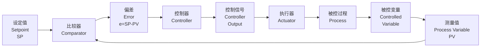
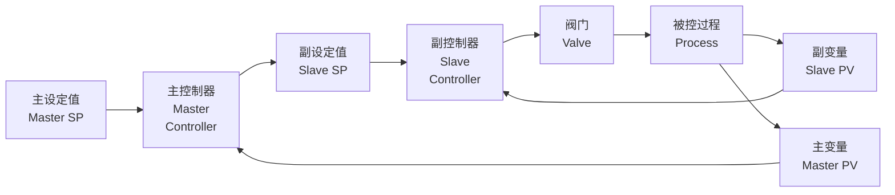
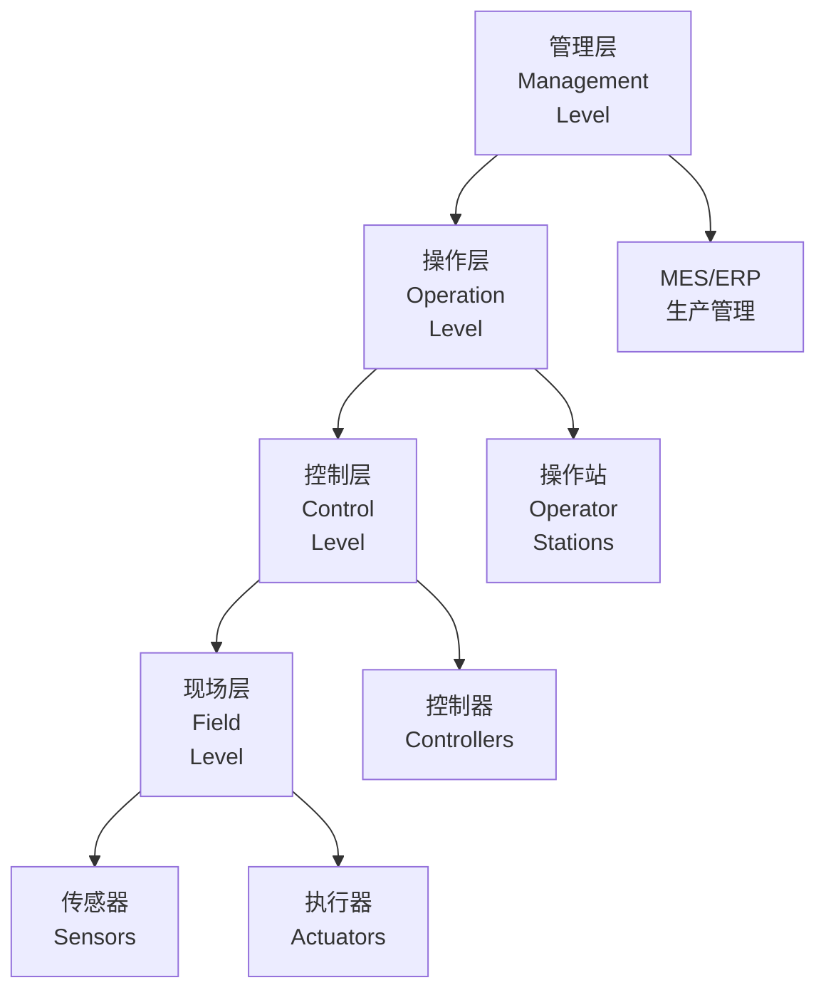

---
aliases:
  - Process Control
  - 过程控制工程
  - 工业控制
tags:
created: 2026-05-17
updated: 2026-05-17
  - process-control
  - pid
  - feedback
  - cascade
  - dcs
---

# 过程控制 (Process Control)

过程控制是自动化技术在化工、石油、电力等流程工业中的应用，旨在维持关键工艺变量在期望范围内，确保生产安全、高效和稳定。

## 控制基础 (Control Fundamentals)

过程控制系统通过测量被控变量、与设定值比较、计算偏差并执行校正动作来实现控制目标。

### 反馈控制回路

典型的反馈控制回路包括：

### 控制性能指标

| 指标 | 英文 | 定义 | 优化目标 |
|------|------|------|----------|
| 衰减比 | Decay Ratio | 相邻峰值比 | $\approx$ 0.25 |
| 超调量 | Overshoot | 最大偏差百分比 | 最小化 |
| 调节时间 | Settling Time | 进入 $\pm$5% 带的时间 | 最小化 |
| 稳态误差 | Steady-State Error | 最终偏差 | 零 |
| 积分绝对误差 | IAE | $\int |e| dt$ | 最小化 |

## PID 控制 (PID Control)

PID (比例-积分-微分) 控制器是工业应用最广泛的控制算法。

### PID 算法

时域表达式：

$$
u(t) = K_c \left[ e(t) + \frac{1}{\tau_I} \int_0^t e(\tau) d\tau + \tau_D \frac{de(t)}{dt} \right]
$$

传递函数形式：

$$
G_c(s) = K_c \left( 1 + \frac{1}{\tau_I s} + \tau_D s \right)
$$

### 控制作用分析

| 控制作用 | 效果 | 缺点 | 适用场景 |
|----------|------|------|----------|
| 比例 (P) | 快速响应 | 存在余差 | 允许余差的场合 |
| 积分 (I) | 消除余差 | 可能振荡 | 必须无余差 |
| 微分 (D) | 预测趋势 | 对噪声敏感 | 大滞后过程 |

### PID 参数整定

| 整定方法 | 英文名称 | 特点 | 适用 |
|---------|----------|------|------|
| Ziegler-Nichols | 临界比例度法 | 经验公式，简单 | 一般过程 |
| Cohen-Coon | 反应曲线法 | 基于一阶模型 | 自衡过程 |
| Lambda 整定 | Lambda Tuning | 闭环时间常数可控 | 需要特定响应 |
| IMC 整定 | IMC Tuning | 基于内模控制 | 明确模型 |

Ziegler-Nichols 临界振荡法：

1. 仅使用比例控制
2. 增大 $K_c$ 直至系统临界振荡
3. 记录临界增益 $K_u$ 和临界周期 $P_u$
4. 查表计算 PID 参数：

| 控制器类型 | $K_c$ | $\tau_I$ | $\tau_D$ |
|-----------|-------|----------|----------|
| P | $0.5 K_u$ | - | - |
| PI | $0.45 K_u$ | $P_u / 1.2$ | - |
| PID | $0.6 K_u$ | $P_u / 2$ | $P_u / 8$ |

## 先进控制策略 (Advanced Control Strategies)

### 串级控制 (Cascade Control)

串级控制使用两个嵌套的控制回路：

主回路控制产品质量变量，副回路快速抑制内环扰动。

### 前馈控制 (Feedforward Control)

前馈控制测量可测扰动并提前补偿：

$$
G_{ff}(s) = -\frac{G_d(s)}{G_p(s)}
$$

其中 $G_d(s)$ 为扰动通道传递函数，$G_p(s)$ 为过程传递函数。

### 比值控制 (Ratio Control)

维持两个流量之比恒定，常用于燃烧控制：

$$
F_2 = K \cdot F_1
$$

### 选择性控制 (Override Control)

使用高低选器实现约束控制，确保过程在安全约束内运行。

## 过程动态建模 (Process Dynamics Modeling)

### 典型过程模型

| 模型类型 | 传递函数 | 特征 |
|---------|----------|------|
| 一阶惯性 | $\frac{K}{\tau s + 1}$ | 单容过程 |
| 一阶加纯滞后 | $\frac{K e^{-\theta s}}{\tau s + 1}$ | FOPDT，最常见 |
| 二阶惯性 | $\frac{K}{(\tau_1 s + 1)(\tau_2 s + 1)}$ | 多容过程 |
| 积分加纯滞后 | $\frac{K e^{-\theta s}}{s}$ | 非自衡过程 |

### 阶跃响应分析

从阶跃响应曲线提取 FOPDT 模型参数：

- **稳态增益 $K$**：输出变化量 / 输入变化量
- **时间常数 $\tau$**：达到 63.2% 稳态值的时间
- **纯滞后 $\theta$**：响应开始的时间延迟

## 分布式控制系统 (DCS)

DCS (Distributed Control System) 是流程工业的标准控制平台。

### DCS 架构

### DCS 特点

| 特点 | 描述 |
|------|------|
| 分布式 | 控制功能分散到多个控制器 |
| 冗余性 | 关键部件双重化配置 |
| 开放性 | 支持标准通信协议 |
| 可扩展性 | 模块化结构，易于扩展 |
| 人机界面 | 图形化操作界面 |

## 控制系统实施 (Control System Implementation)

### 控制方案设计步骤

1. **确定控制目标 (Define Objectives)**
2. **选择被控变量 (Select CVs)**
3. **选择操纵变量 (Select MVs)**
4. **选择测量仪表 (Select Measurements)**
5. **选择控制结构 (Select Control Structure)**
6. **设计控制器 (Design Controllers)**
7. **仿真验证 (Simulate and Validate)**

### 控制系统的经济价值

良好的过程控制带来：

- 提高产品收率 (Yield Improvement)
- 降低能耗 (Energy Reduction)
- 减少废料 (Waste Minimization)
- 延长设备寿命 (Equipment Protection)
- 提高安全性 (Safety Enhancement)

## 参考资料 (References)

- Seborg, D.E. et al. *Process Dynamics and Control*
- Luyben, W.L. *Process Modeling, Simulation and Control for Chemical Engineers*
- Shinskey, F.G. *Process Control Systems*
