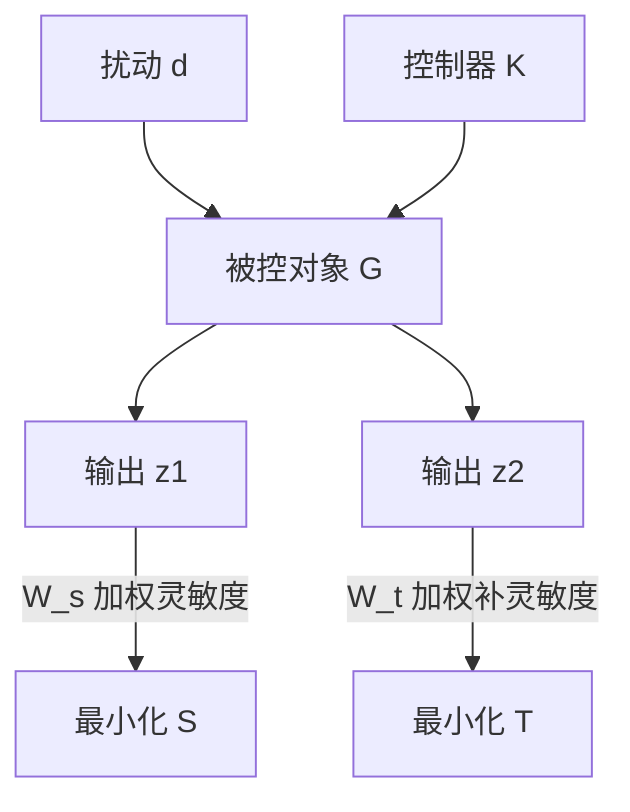

# 鲁棒控制

## 一、概述

鲁棒控制（Robust Control）研究被控对象存在模型不确定性（Model Uncertainty）和外部扰动（External Disturbance）时，控制系统维持稳定性和规定性能（Performance）的理论与方法。核心思想是：控制器应能容忍模型与实际对象之间的"偏差"。

## 二、模型不确定性

### 2.1 不确定性来源

| 来源 | 描述 | 典型表现 |
|------|------|---------|
| 参数不确定性 | 模型参数在某一范围内变化 | 质量、阻尼、刚度变化 |
| 未建模动态 | 高频模态被忽略 | 柔性模态、执行器动态 |
| 线性化误差 | 非线性在工作点处线性化 | 大范围工况偏移 |
| 时变特性 | 参数随时间缓慢漂移 | 老化、磨损 |
| 传感器/执行器误差 | 噪声、量化、死区 | 测量不精确 |

### 2.2 不确定性建模

**参数不确定性**：真实对象 $G_p(s)$ 与标称模型 $G(s)$ 的关系：

加法不确定性：

$$
G_p(s) = G(s) + \Delta_a(s), \quad \|\Delta_a(j\omega)\| < w_a(\omega)
$$

乘法不确定性：

$$
G_p(s) = G(s)[1 + \Delta_m(s)], \quad \|\Delta_m(j\omega)\| < w_m(\omega)
$$

反馈不确定性：

$$
G_p(s) = \frac{G(s)}{1 + \Delta_f(s) G(s)}
$$

其中 $\Delta(s)$ 为归一化的稳定不确定传递函数，满足 $\|\Delta\|_\infty \leq 1$，$w(\omega)$ 为权重函数描述不确定性的频率依赖特性。

### 2.3 小增益定理（Small Gain Theorem）

鲁棒控制的理论基石：对于由标称系统 $G(s)$ 和不确定性 $\Delta(s)$ 构成的互联系统，若：

$$
\|\Delta\|_\infty \cdot \|G\|_\infty < 1
$$

则闭环系统对所有满足 $\|\Delta\|_\infty \leq 1$ 的不确定性鲁棒稳定。

## 三、$H_\infty$ 控制

### 3.1 $H_\infty$ 范数

系统的 $H_\infty$ 范数是频率响应最大奇异值的峰值（Peak of Maximum Singular Value）：

$$
\|G(s)\|_\infty = \sup_{\omega} \bar{\sigma}[G(j\omega)]
$$

物理意义：系统在 worst-case 输入下的最大增益——即从能量角度衡量，系统放大扰动的最坏情况。

### 3.2 混合灵敏度问题（Mixed Sensitivity）

设计目标：找到控制器 $K$ 使闭环系统稳定且满足：

$$
\left\| \begin{bmatrix} W_s S \\ W_t T \end{bmatrix} \right\|_\infty < 1
$$

其中：

- **灵敏度函数（Sensitivity Function）**：

$$
S(s) = (I + G(s) K(s))^{-1}
$$

$S$ 反映了扰动抑制能力，要求在低频段小（$\bar{\sigma}(S(j\omega)) \ll 1$）。

- **补灵敏度函数（Complementary Sensitivity）**：

$$
T(s) = I - S(s) = G(s) K(s) (I + G(s) K(s))^{-1}
$$

$T$ 反映了对未建模动态的鲁棒性，要求在高频段小（$\bar{\sigma}(T(j\omega)) \ll 1$）。

- 约束关系：$S(s) + T(s) = I$ —— 扰动抑制和鲁棒稳定之间存在折中。

### 3.3 权重函数选择

| 权重 | 典型形式 | 设计意图 |
|------|---------|---------|
| $W_s(s)$ | $\frac{s/M + \omega_B}{s + \omega_B \varepsilon}$ | 低频扰动抑制：$\omega_B$ 为带宽，$M$ 为峰值约束，$\varepsilon$ 为稳态误差 |
| $W_t(s)$ | $\frac{s + \omega_{BT}/M_{BT}}{\varepsilon_{BT} s + \omega_{BT}}$ | 高频未建模动态约束 |
| $W_u(s)$ | 常数或高通 | 控制量约束（执行器饱和） |

### 3.4 标准 $H_\infty$ 问题

广义被控对象 $P(s)$：

$$
\begin{bmatrix} z \\ y \end{bmatrix} = P \begin{bmatrix} w \\ u \end{bmatrix}
$$

其中 $z$ 为性能输出，$w$ 为外部输入，$y$ 为测量输出，$u$ 为控制输入。

Riccati 方程解法（Doyle-Glover-Khargonekar-Francis, DGKF 论文）：

$$
A^T X + X A + X(\gamma^{-2} B_1 B_1^T - B_2 B_2^T) X + C_1^T C_1 = 0
$$

LMI（线性矩阵不等式）解法更加通用，能处理多目标和结构化约束。

### 3.5 $H_\infty$ 控制器求解

$H_\infty$ 次优控制问题：求 $K$ 使得 $\|T_{zw}(s)\|_\infty < \gamma$。

$\gamma$ 迭代（$\gamma$-Iteration）：从较大的 $\gamma$ 开始，逐步降低到接近最优值。

## 四、$\mu$ 综合（Structured Singular Value）

### 4.1 结构奇异值

标准 $H_\infty$ 将所有不确定性捆绑为单一范数约束，过于保守。$\mu$（结构化奇异值）针对块对角不确定性结构：

$$
\mu_{\Delta}(M) = \frac{1}{\min\{\bar{\sigma}(\Delta): \det(I - M\Delta) = 0\}}
$$

若 $\mu_{\Delta}(M) < 1$，则系统对所有结构化不确定性 $\|\Delta\|_\infty \leq 1$ 鲁棒稳定。

### 4.2 $\mu$ 综合的 D-K 迭代

D-K 迭代是最常用的 $\mu$ 综合求解方法：

1. 固定 $D$（尺度矩阵），求解 $H_\infty$ 优化得到 $K$
2. 固定 $K$，求解凸优化得到 $D$（近似 $\mu$）
3. 交替迭代至收敛

$$
\min_{K} \min_{D, D^{-1} \in H_\infty} \| D T_{zw} D^{-1} \|_\infty
$$

### 4.3 $\mu$ 分析与 $H_\infty$ 对比

| 特性 | $H_\infty$ | $\mu$ 综合 |
|------|-----------|-----------|
| 不确定性结构 | 非结构化 | 结构化块对角 |
| 保守性 | 较高 | 较低 |
| 计算复杂度 | 低（Riccati/LMI） | 高（D-K 迭代） |
| 工程应用 | 广泛（工业标准） | 复杂系统（航空航天） |

## 五、$H_2$ 控制

$H_2$ 范数（LQG 问题扩展）：

$$
\|G\|_2 = \sqrt{\frac{1}{2\pi} \int_{-\infty}^{\infty} \text{tr}[G(j\omega) G^T(-j\omega)] d\omega}
$$

$H_2$ 控制最小化白噪声输入下输出的方差（能量），对应于 LQG 控制。

## 六、环路成形（Loop Shaping）

### 6.1 McFarlane-Glover 方法

通过开环奇异值（Singular Values of Open-Loop）的形状设计控制器：

1. 使用前置/后置补偿器 $W_1$、$W_2$ 对齐期望的开环增益形状
2. 针对成形对象 $G_s = W_2 G W_1$ 设计鲁棒 $H_\infty$ 控制器 $K_\infty$
3. 最终控制器 $K = W_1 K_\infty W_2$

开环增益设计原则：

$$
\bar{\sigma}(GK) \gg 1 \text{（低频：跟踪和扰动抑制）}
$$

$$
\bar{\sigma}(GK) \ll 1 \text{（高频：噪声抑制和鲁棒性）}
$$

### 6.2 增益穿越频率

穿越频率 $\omega_c$ 处开环增益 $|L(j\omega_c)| = 1$。相位裕度（Phase Margin）和增益裕度（Gain Margin）与闭环性能直接相关。

经验设计：$\omega_c$ 处相位裕度 30-60°，增益裕度 6-12 dB。

## 八、鲁棒控制设计示例

### 8.1 二质量系统

电机-负载通过柔性轴连接的传动系统。标称模型 $G(s) = \frac{1}{s^2 (Js + b)}$，高频存在柔性模态。

设计要求：
- 伺服带宽 $\omega_B > 10$ rad/s
- 幅值裕度 > 6 dB，相位裕度 > 40°
- 对负载惯量变化 $\pm 50\%$ 鲁棒稳定

混合灵敏度设计：选择权重函数 $W_s$（低通）约束 $S$，$W_t$（高通）约束 $T$。

### 8.2 四旋翼飞行器

姿态控制的 $H_\infty$ 设计：

状态变量：$\phi, \theta, \psi$（滚转、俯仰、偏航角）
控制输入：$u_1, u_2, u_3, u_4$（四个旋翼转速）

不确定性来源：空气动力学系数变化、质心偏移、阵风扰动。

## 九、鲁棒控制与其他方法的融合

| 方法 | 融合方式 | 优势 |
|------|---------|------|
| $H_\infty$ + PID | $H_\infty$ 设计 PID 参数 | 兼顾 PID 简单性和系统化设计 |
| $H_\infty$ + MPC | 约束下优化 + 鲁棒性保证 | 处理约束不确定系统 |
| $H_\infty$ + 自适应 | 自适应律 + $H_\infty$ 范数指标 | 时变参数 + 鲁棒性 |
| $\mu$ + LPV | 线性变参数 + 结构化奇异值 | 调度 + 鲁棒性 |
| $H_\infty$ + 神经网络 | 神经网络近似 + $H_\infty$ 稳定 | 学习 + 理论保证 |

## 七、鲁棒控制设计工具

### 7.1 MATLAB Robust Control Toolbox

提供了以下核心功能：

- `hinfsyn`：$H_\infty\) 控制器综合
- `hinfnorm`：系统 $H_\infty$ 范数计算
- `dksyn` / `musyn`：$\mu$ 综合（D-K 迭代）
- `ncfsyn`：归一化互质分解环路成形
- `musv`：结构奇异值 $\mu$ 计算
- `ltru` / `loopsyn`：环路成形工具

### 7.2 线性矩阵不等式（LMI）

对于 $H_\infty$ 次优控制问题，存在控制器当且仅当存在对称矩阵 $X, Y$ 满足 LMI：

$$
\begin{bmatrix}
A^T X + X A & X B_1 & C_1^T \\
B_1^T X & -\gamma I & D_{11}^T \\
C_1 & D_{11} & -\gamma I
\end{bmatrix} < 0
$$

LMI 的优势：多目标优化（$H_2$ / $H_\infty$ 混合）、结构化控制器设计、高效凸优化求解。

## 八、应用与工程

### 7.1 典型鲁棒控制应用

| 领域 | 应用 | 不确定性来源 |
|------|------|-------------|
| 航空航天 | 飞行器/卫星姿态控制 | 气动参数变化、柔性模态 |
| 汽车 | 主动悬架、ESP | 轮胎-路面摩擦、载荷变化 |
| 过程控制 | 蒸馏塔、反应器 | 进料组分变化、传热系数漂移 |
| 电力 | 电力系统稳定器 | 运行工况变化 |
| 机器人 | 柔性关节控制 | 负载变化、摩擦模型 |
| 磁盘驱动器 | 读写头定位 | 机械共振、基础振动 |

### 7.2 工程折中

鲁棒控制设计的核心折中（Fundamental Trade-off）：

- 性能（Performance）vs. 鲁棒性（Robustness）
- 低频扰动抑制 vs. 高频噪声放大（水床效应 Waterbed Effect）

水床效应（Bode 积分定理）：

$$
\int_0^\infty \ln |S(j\omega)| d\omega = \pi \sum p_i
$$

其中 $p_i$ 为开环右半平面极点。该定理表明，低频扰动抑制的"收益"必然对应高频段灵敏度的"代价"。

## 九、鲁棒控制设计技术

### 9.1 鲁棒 $H_2$ 控制

$H_2$ 范数最小化（LQG 问题）在存在参数不确定性时的扩展：

$$
\min \sup_{\Delta} \|T_{zw}(s)\|_2
$$

### 9.2 线性矩阵不等式方法

LMI 可以同时处理 $H_2$、$H_\infty$ 和极点配置等多目标要求：

极点配置区域（如扇形区域 $S(\alpha, \beta)$）可用 LMI 区域描述。

### 9.3 Youla 参数化

所有镇定控制器的 Youla 参数化（Q-参数化）：

$$
K = (X + MQ)(Y - NQ)^{-1}
$$

其中 $G = NM^{-1}$ 为互质分解，$X$、$Y$ 满足 Bezout 恒等式 $XN + YM = I$，$Q$ 为任意稳定传递函数矩阵。

## 相关条目
- [[04_EngineeringAndTechnology/ControlAndSystemsEngineering/ControlTheory/INDEX|当前目录索引]]
- [[AdaptiveControl]]
- [[NonlinearControl]]
