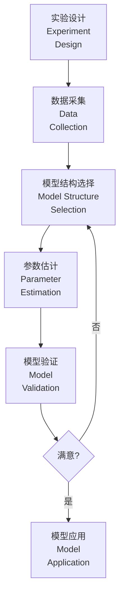
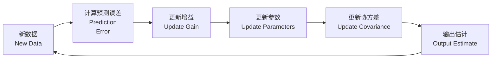

---
aliases:
  - System Identification
  - 系统辨识理论
  - 参数估计
tags:
  - system-identification
  - parameter-estimation
  - least-squares
  - recursive
  - model-validation
---

# 系统辨识 (System Identification)

系统辨识是从观测到的输入输出数据中建立动态系统数学模型的科学。它是数据驱动建模的核心方法，广泛应用于控制、预测和故障诊断。

## 辨识基础 (Identification Fundamentals)

系统辨识的三个基本要素：

- **数据 (Data)**：系统的输入输出观测记录
- **模型集 (Model Set)**：候选模型的集合
- **准则 (Criterion)**：评价模型优劣的标准

### 辨识流程



### 辨识问题的分类

| 分类维度 | 类型 | 描述 |
|---------|------|------|
| 模型结构 | 线性/非线性 | 系统动态特性 |
| 参数性质 | 时不变/时变 | 参数是否随时间变化 |
| 噪声模型 | 白噪声/有色噪声 | 干扰特性 |
| 数据使用 | 离线/在线 | 批处理或递推 |

## 线性动态模型 (Linear Dynamic Models)

### 模型表示形式

| 表示形式 | 公式 | 特点 |
|---------|------|------|
| 差分方程 | $A(q)y(t) = B(q)u(t) + e(t)$ | 直观 |
| 传递函数 | $G(q) = B(q)/A(q)$ | 便于分析 |
| 状态空间 | $x(t+1) = Ax(t) + Bu(t)$ | 多变量系统 |

其中 $q^{-1}$ 为后移算子：$q^{-1}y(t) = y(t-1)$。

### 常见模型结构

```mermaid
graph TD
    A[模型结构<br/>Model<br/>Structures] --> B[ARX]
    A --> C[ARMAX]
    A --> D[OE]
    A --> E[BJ]
    A --> F[状态空间<br/>State Space]
    
    B --> B1[$A(q)y = B(q)u + e$]
    C --> C1[$A(q)y = B(q)u + C(q)e$]
    D --> D1[$y = B(q)/F(q)u + e$]
    E --> E1[$y = B(q)/F(q)u + C(q)/D(q)e$]
```

| 结构 | 过程模型 | 噪声模型 | 参数数量 |
|------|---------|---------|---------|
| FIR | $B(q)$ | 无 | $n_b$ |
| ARX | $B(q)/A(q)$ | $1/A(q)$ | $n_a + n_b$ |
| ARMAX | $B(q)/A(q)$ | $C(q)/A(q)$ | $n_a + n_b + n_c$ |
| OE | $B(q)/F(q)$ | 1 | $n_b + n_f$ |
| BJ | $B(q)/F(q)$ | $C(q)/D(q)$ | 最多 |

## 最小二乘法 (Least Squares Estimation)

最小二乘法是最基本的参数估计方法。

### 线性回归模型

$$
y(t) = \varphi^T(t) \theta + e(t)
$$

其中：
- $\varphi(t)$ 为回归向量（已知数据构成）
- $\theta$ 为待估计参数向量
- $e(t)$ 为误差

### 最小二乘估计

对于 $N$ 组数据，最小化代价函数：

$$
J(\theta) = \sum_{t=1}^{N} e^2(t) = \sum_{t=1}^{N} (y(t) - \varphi^T(t)\theta)^2
$$

矩阵形式：

$$
J(\theta) = (Y - \Phi \theta)^T (Y - \Phi \theta)
$$

最小二乘解：

$$
\hat{\theta}_{LS} = (\Phi^T \Phi)^{-1} \Phi^T Y
$$

### 最小二乘性质

| 性质 | 条件 | 结论 |
|------|------|------|
| 无偏性 | $E[e(t)] = 0$ | $E[\hat{\theta}] = \theta$ |
| 有效性 | 高斯白噪声 | 达到 Cramer-Rao 下界 |
| 一致性 | 持续激励 | $\hat{\theta} \to \theta$ 当 $N \to \infty$ |

## 递推最小二乘法 (Recursive Least Squares)

递推方法用于在线实时参数估计。

### RLS 算法

数据更新公式：

$$
\hat{\theta}(t) = \hat{\theta}(t-1) + K(t) [y(t) - \varphi^T(t)\hat{\theta}(t-1)]
$$

增益矩阵：

$$
K(t) = P(t-1)\varphi(t) [\lambda + \varphi^T(t)P(t-1)\varphi(t)]^{-1}
$$

协方差矩阵更新：

$$
P(t) = \frac{1}{\lambda}[P(t-1) - K(t)\varphi^T(t)P(t-1)]
$$

其中 $\lambda$ 为遗忘因子 ($0 < \lambda \leq 1$)：

- $\lambda = 1$：标准 RLS，无限记忆
- $\lambda < 1$：带遗忘因子，适应时变系统

### 递推算法流程



## 极大似然估计 (Maximum Likelihood)

极大似然估计假设噪声服从已知分布，寻找使观测数据出现概率最大的参数。

### 似然函数

对于独立同分布的高斯白噪声：

$$
L(\theta) = \prod_{t=1}^{N} \frac{1}{\sqrt{2\pi\sigma^2}} \exp\left(-\frac{e^2(t)}{2\sigma^2}\right)
$$

对数似然函数：

$$
\ln L(\theta) = -\frac{N}{2}\ln(2\pi\sigma^2) - \frac{1}{2\sigma^2}\sum_{t=1}^{N} e^2(t)
$$

最大化对数似然等价于最小化预测误差平方和。

### 预测误差法 (Prediction Error Method)

更一般的框架，最小化预测误差准则：

$$
J(\theta) = \sum_{t=1}^{N} l(\varepsilon(t,\theta))
$$

其中 $l(\cdot)$ 为损失函数，$\varepsilon(t,\theta)$ 为预测误差。

| 损失函数 | 对应方法 | 特点 |
|---------|---------|------|
| $\varepsilon^2$ | 最小二乘 | 高斯最优 |
| $|\varepsilon|$ | 最小绝对值 | 鲁棒性强 |
| 混合 | Huber | 平衡鲁棒性与效率 |

## 模型验证 (Model Validation)

模型验证评估辨识模型的质量和适用性。

### 残差分析

好的模型应产生白噪声残差：

| 检验 | 方法 | 通过标准 |
|------|------|----------|
| 自相关检验 | $\hat{R}_\varepsilon(\tau)$ | 在置信区间内 |
| 互相关检验 | $\hat{R}_{\varepsilon u}(\tau)$ | 在置信区间内 |
| 正态性检验 | Q-Q 图 | 近似直线 |

残差自相关函数：

$$
\hat{R}_\varepsilon(\tau) = \frac{1}{N} \sum_{t=1}^{N-\tau} \varepsilon(t)\varepsilon(t+\tau)
$$

### 模型选择准则

| 准则 | 公式 | 特点 |
|------|------|------|
| AIC | $N\ln V + 2d$ | 渐进有效 |
| BIC | $N\ln V + d\ln N$ | 一致估计 |
| FPE | $V \frac{N+d}{N-d}$ | 预测误差 |

其中 $V$ 为损失函数值，$d$ 为参数个数，$N$ 为数据长度。

## 高级辨识方法

### 子空间辨识 (Subspace Identification)

直接由输入输出数据估计状态空间模型，无需迭代优化：

$$x(t+1) = A x(t) + B u(t) + K e(t)$$

$$y(t) = C x(t) + D u(t) + e(t)$$

算法步骤：

1. 构造 Hankel 矩阵
2. 执行 LQ 分解
3. 进行 SVD 分解确定阶次
4. 提取系统矩阵

### 神经网络辨识

使用神经网络近似非线性动态系统：

$$y(t) = f(y(t-1), \ldots, y(t-n_a), u(t-1), \ldots, u(t-n_b))$$

| 网络类型 | 特点 | 应用 |
|---------|------|------|
| NARX | 外部输入非线性自回归 | 动态系统 |
| 递归神经网络 | 内部状态反馈 | 长期依赖 |
| LSTM | 门控机制 | 复杂动态 |

## 实验设计 (Experiment Design)

### 输入信号选择

| 信号类型 | 特点 | 适用 |
|---------|------|------|
| 白噪声 | 频谱平坦 | 一般辨识 |
| 伪随机二进制序列 (PRBS) | 近似白噪声，易实现 | 工业应用 |
| 多正弦 | 特定频率 | 频率响应 |
| 啁啾信号 | 扫频 | 宽频带 |

### 持续激励条件

输入信号必须满足持续激励条件以保证参数可辨识：

输入信号的频谱在系统重要频段必须有足够能量。

## 参考资料 (References)

- Ljung, L. *System Identification: Theory for the User*
- Soderstrom, T. & Stoica, P. *System Identification*
- Nelles, O. *Nonlinear System Identification*
