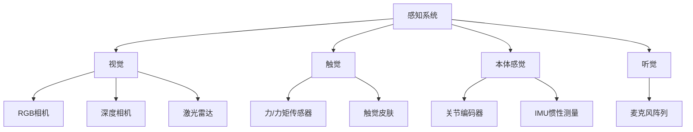

# 人形机器人与具身智能 (Humanoid Robotics & Embodied AI)

## 一、概述

人形机器人（Humanoid Robot）是模仿人类外形和行为的机器人系统。2024-2026年，随着AI大模型、强化学习和仿真技术的突破，人形机器人从实验室走向商业化应用，成为"具身智能"（Embodied AI）的核心载体。

## 二、2024-2026年主要人形机器人

### 2.1 商业化产品

| 机器人 | 公司 | 发布时间 | 核心特点 | 应用场景 |
|--------|------|---------|---------|---------|
| **Optimus Gen 2** | Tesla | 2024 | 自研执行器、视觉导航、22自由度手 | 工厂任务、家庭服务 |
| **Figure 02** | Figure AI | 2024 | 与OpenAI合作、自然语言交互 | 仓储物流、制造 |
| **Atlas (Electric)** | Boston Dynamics | 2024 | 全电动、360度关节 | 研究、演示 |
| **Phoenix** | Sanctuary AI | 2024 | 通用智能手、精细操作 | 服务行业 |
| **Digit** | Agility Robotics | 2024 | 双足行走、搬箱 | 仓储物流 |
| **GR-1** | 傅利叶智能 | 2024 | 中国首款量产人形机器人 | 康复、服务 |
| **Galbot** | 银河通用 | 2025 | 轮式人形、大模型驱动 | 零售、服务 |

### 2.2 技术参数对比

| 机器人 | 身高 | 体重 | 自由度 | 续航 | 负载 |
|--------|------|------|--------|------|------|
| Optimus Gen 2 | 1.73m | 57kg | 28+ | 5h | 20kg |
| Figure 02 | 1.67m | 60kg | 40+ | 5h | 25kg |
| Atlas (Electric) | 1.5m | 89kg | 28+ | 1h | - |
| Digit | 1.75m | 65kg | 28+ | 3h | 16kg |
| GR-1 | 1.65m | 55kg | 40+ | 2h | 50kg |

## 三、核心技术架构

### 3.1 感知系统

### 3.2 控制架构

| 层级 | 功能 | 技术 |
|------|------|------|
| **高层规划** | 任务理解与分解 | 大语言模型 (LLM) |
| **中层规划** | 运动规划 | RRT、PRM、强化学习 |
| **底层控制** | 关节力控 | PID、MPC、阻抗控制 |
| **仿真训练** | 策略学习 | Isaac Sim、MuJoCo |

### 3.3 AI模型栈

| 模型类型 | 功能 | 代表模型 |
|---------|------|---------|
| 视觉语言模型 (VLM) | 场景理解 | Gemini, GPT-4V |
| 视觉语言动作模型 (VLA) | 端到端控制 | RT-2, OpenVLA |
| 世界模型 | 环境预测 | NVIDIA Cosmos |
| 策略模型 | 动作生成 | π0, GR00T |

## 四、具身AI模型进展（2024-2026）

### 4.1 主要模型

| 模型 | 开发商 | 发布时间 | 核心能力 |
|------|--------|---------|---------|
| **NVIDIA Isaac GR00T N1.7** | NVIDIA | 2026 | 人形机器人通用基础模型 |
| **Gemini Robotics 1.5** | Google DeepMind | 2025 | ER↔VLA双模型架构 |
| **π0 / π0.5 / π0.7** | Physical Intelligence | 2025-2026 | 通用机器人基础模型 |
| **OpenVLA** | Stanford | 2024 | 开源视觉语言动作模型 |
| **Qwen-RobotSuite** | 阿里云 | 2026 | RobotManip/World/Nav三模型 |
| **LingBot-VLA** | 蚂蚁集团 | 2026 | 多机器人VLA基础模型 |
| **Gemini Robotics On-Device** | Google DeepMind | 2025 | 本地运行的机器人AI |

### 4.2 关键技术突破

| 技术 | 描述 | 影响 |
|------|------|------|
| **VLA (Vision-Language-Action)** | 端到端视觉-语言-动作模型 | 从感知到动作统一建模 |
| **Zero-Shot Control** | 无需微调的机器人控制 | 快速部署新任务 |
| **Diffusion Policy** | 扩散模型生成动作序列 | 提高动作多样性 |
| **Sim-to-Real** | 仿真到现实迁移 | 降低真实世界训练成本 |
| **Teleoperation Learning** | 遥操作数据收集 | 加速技能学习 |

## 五、NVIDIA机器人平台

### 5.1 硬件平台

| 平台 | 定位 | 核心芯片 | 发布时间 |
|------|------|---------|---------|
| **Jetson Thor** | 人形机器人主控 | Blackwell GPU | 2025.08 |
| **Jetson Orin** | 边缘机器人 | Ampere GPU | 2022 |
| **Jetson Nano** | 入门级 | Maxwell GPU | 2019 |

### 5.2 软件平台

| 平台 | 功能 | 应用 |
|------|------|------|
| **Isaac Sim** | 机器人仿真 | 策略训练、数字孪生 |
| **Isaac Lab** | 强化学习框架 | 机器人技能学习 |
| **Isaac ROS** | ROS2集成 | 真实机器人部署 |
| **Cosmos** | 世界基础模型 | 环境理解与预测 |

## 六、应用场景

### 6.1 工业制造

| 应用 | 描述 | 代表案例 |
|------|------|---------|
| 物料搬运 | 工厂内物流 | Digit在Amazon仓库 |
| 质量检测 | 产品外观检查 | 人形机器人+视觉AI |
| 装配作业 | 精密装配 | Optimus在Tesla工厂 |
| 危险作业 | 高温、有毒环境 | Atlas在研究场景 |

### 6.2 服务行业

| 应用 | 描述 | 代表案例 |
|------|------|---------|
| 零售服务 | 导购、理货 | Galbot在零售店 |
| 餐饮服务 | 送餐、清洁 | 人形机器人在餐厅 |
| 医疗护理 | 护理辅助 | GR-1在康复中心 |
| 家庭服务 | 做饭、打扫 | Optimus家庭版 |

## 七、挑战与展望

### 7.1 技术挑战

1. **灵巧操作**：精细手部操作仍需突破
2. **长时序任务**：复杂多步任务的规划与执行
3. **环境适应**：非结构化环境的鲁棒性
4. **能源效率**：续航能力限制
5. **成本控制**：降低制造成本以实现商业化

### 7.2 未来趋势

1. **大模型驱动**：LLM/VLM作为机器人大脑
2. **集群协作**：多机器人协同工作
3. **持续学习**：从交互中不断改进
4. **人机协作**：安全高效的人机合作
5. **标准化**：通用机器人操作系统

## 相关条目

- [[Robotics]]
- [[ControlAndSystemsEngineering]]
- [[ComputerVision]]
- [[ReinforcementLearning]]

## 参考资源

1. Tesla. "Optimus Gen 2 Technical Overview." 2024.
2. Figure AI. "Figure 02: The Robot That Learns." 2024.
3. NVIDIA. "Isaac GR00T: Foundation Model for Humanoid Robots." 2026.
4. Google DeepMind. "Gemini Robotics: Embodied AI." 2025.
5. Physical Intelligence. "π0: A Vision-Language-Action Flow Model." 2025.
