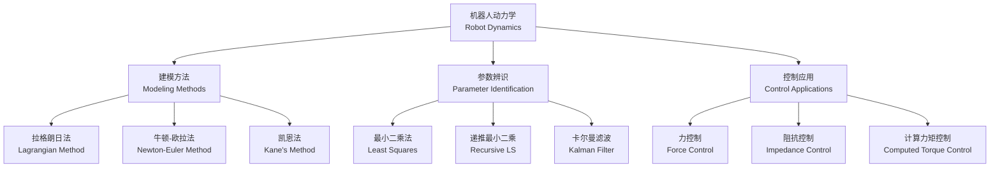

---
aliases: [RobotDynamics]
tags: ['Robotics', 'RobotDynamics', 'ControlSystems', 'Dynamics']
created: 2026-05-17
updated: 2026-05-17
---

# 机器人动力学 (Robot Dynamics)

## 定义与概述

机器人动力学（Robot Dynamics）是研究机器人各连杆（Link）受力与运动之间关系的学科。
是机器人控制（Robot Control）、动力学仿真（Dynamic Simulation）
和参数辨识（Parameter Identification）的理论基础。

机器人动力学涉及的核心问题包括两类：正动力学（Forward Dynamics）——已知关节力矩求运动轨迹，
以及逆动力学（Inverse Dynamics）——已知运动轨迹求所需关节力矩。

准确高效的动力学模型是实现高精度轨迹跟踪（Trajectory Tracking）、
力控制（Force Control）和柔顺控制（Compliant Control）的前提条件。

---

## 拉格朗日动力学方程 (Lagrangian Dynamics)

拉格朗日法（Lagrangian Method）从能量角度建立系统动力学方程，形式紧凑，适合推导完整动力学表达式。

定义拉格朗日函数（Lagrangian）为系统动能（Kinetic Energy）与势能（Potential Energy）之差：

$$
L = T - V
$$

其中 $T$ 为机器人系统的总动能，$V$ 为系统总势能。拉格朗日方程（Lagrange's Equation）表达为：

$$
\frac{d}{dt}\frac{\partial L}{\partial \dot{q}_i} - \frac{\partial L}{\partial q_i} = \tau_i
$$

其中 $q_i$ 为第 i 个关节的广义坐标（Generalized Coordinate），$\tau_i$ 为对应的广义力（关节驱动力矩）。

将拉格朗日方程应用于串联机器人系统，可得到统一的矩阵形式机器人动力学方程：

$$
M(q)\ddot{q} + C(q,\dot{q})\dot{q} + g(q) = \tau
$$

| 符号 | 名称 | 性质 |
|------|------|------|
| $M(q)$ | 惯性矩阵（Inertia Matrix） | 对称正定（Symmetric Positive Definite） |
| $C(q,\dot{q})$ | 科氏力和离心力矩阵 | 满足 $\dot{M} - 2C$ 的斜对称性 |
| $g(q)$ | 重力项（Gravity Vector） | 由势能 $V$ 对 $q$ 求偏导得到 |
| $\tau$ | 关节力矩（Joint Torque） | 包含驱动力矩和外力矩 |

拉格朗日法的主要优势在于其系统性和对约束处理的便捷性，但计算复杂度为 $O(n^4)$（$n$ 为自由度数量），不适合实时控制中对计算效率要求较高的场景。

---

## 牛顿-欧拉递推法 (Newton-Euler Recursive Method)

牛顿-欧拉法（Newton-Euler Method）基于力的平衡分析，通过交替进行向外递推（Outward Recursion）计算运动学量和向内递推（Inward Recursion）计算力学量来求解动力学问题，计算复杂度仅为 $O(n)$，非常适合实时控制。

### 向外递推：运动学传递 (Outward Recursion: Kinematics Propagation)

从基座到末端执行器依次递推各连杆的角速度、角加速度和线加速度：

$$
\omega_i = R_i^T\omega_{i-1} + \dot{q}_i z_{i-1}
$$

$$
\dot{\omega}_i = R_i^T\dot{\omega}_{i-1} + R_i^T\omega_{i-1} \times \dot{q}_i z_{i-1} + \ddot{q}_i z_{i-1}
$$

$$
\dot{v}_i = R_i^T(\dot{v}_{i-1} + \dot{\omega}_{i-1} \times r_{i-1} + \omega_{i-1} \times (\omega_{i-1} \times r_{i-1}))
$$

其中 $\omega_i$ 为连杆 i 的角速度，$R_i$ 为连杆 i-1 到 i 的旋转矩阵，$z_{i-1}$ 为关节轴方向向量。

### 向内递推：力学传递 (Inward Recursion: Force Propagation)

从末端执行器到基座依次计算各连杆所受力和力矩：

$$
f_i = m_i\dot{v}_i + m_i\omega_i \times v_i
$$

$$
n_i = I_i\dot{\omega}_i + \omega_i \times I_i\omega_i
$$

其中 $f_i$ 为作用于连杆 i 质心的合力，$n_i$ 为合力矩，$I_i$ 为连杆 i 的惯性张量。

### 关节力矩计算 (Joint Torque Calculation)

在每个关节处以投影方式获得驱动力矩：$\tau_i = f_i^T s_{i-1}$。其中 $s_{i-1}$ 为关节轴方向向量。
对于转动关节 $s_{i-1} = z_{i-1}$，对于移动关节 $s_{i-1} = z_{i-1}$ 但力投影方式不同。

---

## 动力学参数辨识 (Dynamic Parameter Identification)

机器人动力学参数（Dynamic Parameters）的精确值是实现高精度控制的前提。
动力学参数的辨识（Identification）是通过实验数据反向估计机器人各构件的惯性参数。

动力学方程可线性化为参数回归形式：$\tau = Y(q,\dot{q},\ddot{q})\pi$，其中 $Y$ 为回归矩阵（Regressor Matrix），$\pi$ 为待辨识的动力学参数向量（Parameter Vector）。

$\pi$ 包含每个连杆的下列参数：

| 参数类别 | 参数符号 | 物理含义 |
|----------|---------|----------|
| 质量（Mass） | $m_i$ | 连杆 i 的质量标量 |
| 一阶质量矩 | $m_i r_{i,x}, m_i r_{i,y}, m_i r_{i,z}$ | 质心位置（Center of Mass） |
| 转动惯量（Inertia） | $I_{xx}, I_{yy}, I_{zz}, I_{xy}, I_{xz}, I_{yz}$ | 连杆惯性张量的六个独立分量 |
| 摩擦系数（Friction） | $f_{v,i}, f_{c,i}$ | 黏性摩擦系数和库仑摩擦系数 |

**辨识方法**：最小二乘法 $\hat{\pi} = (Y^TY)^{-1}Y^T\tau$，需要充分激励轨迹以保障矩阵条件数较小。
递推最小二乘（Recursive Least Squares, RLS）在线实时更新参数估计值。
卡尔曼滤波（Kalman Filter）以状态空间模型为基础，可同时估计状态和参数。

---

## 力控制与力位混合控制 (Force Control and Hybrid Position/Force Control)

在机器人装配（Assembly）、打磨（Grinding）、抛光和协作（Collaboration）等任务中，
单纯的位置控制不足以满足要求，必须引入力控制（Force Control）。

力控制的简单形式是直接力反馈（Direct Force Feedback）：

$$
\tau = J^T F_d + K_f(F_d - F_e)
$$

其中 $F_d$ 为期望力（Desired Force），$F_e$ 为实际接触力（Actual Contact Force），$K_f$ 为力增益矩阵，$J$ 为雅可比矩阵（Jacobian Matrix）。

力位混合控制（Hybrid Position/Force Control）将任务空间分解为约束方向和自由方向，
通过选择矩阵（Selection Matrix）$S$ 控制自由度分配。

---

## 柔顺控制 (Compliant Control)

柔顺控制使机器人能够适应环境几何不确定性，在接触任务中保持稳定的力和位置关系。

**阻抗控制（Impedance Control）**：调节机器人的端部阻抗特性——等效质量、阻尼和刚度：

$$
F_e = M_d(\ddot{x}_d - \ddot{x}) + D_d(\dot{x}_d - \dot{x}) + K_d(x_d - x)
$$

**导纳控制（Admittance Control）**：阻抗控制的对偶形式，适用于高刚度机器人：

$$
\ddot{x} = M_d^{-1}(F_e - D_d\dot{x} - K_d x)
$$

| 参数 | 符号 | 物理含义 | 增大效果 |
|------|------|----------|---------|
| 等效质量（Mass） | $M_d$ | 惯性特性 | 响应变慢，接触力平滑 |
| 等效阻尼（Damping） | $D_d$ | 能量耗散 | 振荡减弱，稳定性提高 |
| 等效刚度（Stiffness） | $K_d$ | 位置恢复力 | 定位精度提高，接触力增大 |

---

## 经典教材 (Classic Textbooks)

- John J. Craig《Introduction to Robotics: Mechanics and Control》
- Mark W. Spong《Robot Dynamics and Control》
- Kevin M. Lynch & Frank C. Park《Modern Robotics》
- Bruno Siciliano《Robotics: Modelling, Planning and Control》

## 主要应用领域 (Major Applications)

- **机器人轨迹跟踪控制（Trajectory Tracking Control）** — 高精度运动规划与控制
- **力控制应用（Force Control Applications）** — 精密装配、去毛刺、打磨
- **协作机器人安全控制（Collaborative Robot Safety）** — 人机协作中的力限制和碰撞检测
- **动力学仿真（Dynamic Simulation）** — 离线编程和虚拟调试
- **机器人结构优化设计（Structural Optimization）** — 基于动力学性能的轻量化设计

---

## 相关条目 (Related Notes)

- [[RobotKinematics]] — 机器人运动学（不考虑力的几何分析）
- [[04_EngineeringAndTechnology/MechanicalAndElectricalEngineering/Mechatronics/RoboticsBasics|RoboticsBasics]] — 机器人学基础概念
- [[04_EngineeringAndTechnology/MechanicalAndElectricalEngineering/Mechatronics/ControlSystems|ControlSystems]] — 控制系统理论基础
- [[04_EngineeringAndTechnology/ControlAndSystemsEngineering/ControlTheory/ClassicalControl|ClassicalControl]] — 经典控制理论
- [[04_EngineeringAndTechnology/ControlAndSystemsEngineering/ControlTheory/ModernControl|ModernControl]] — 现代控制理论
- [[SensorFusion]] — 多传感器融合
- [[TrajectoryPlanning]] — 轨迹规划

