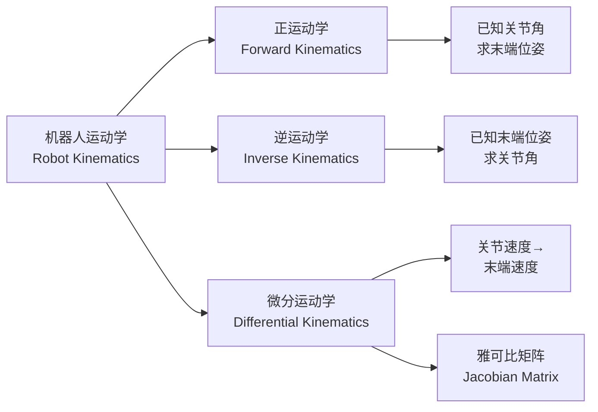
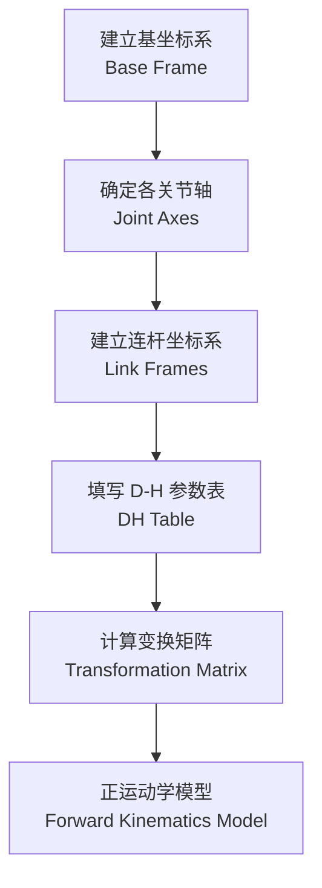

---
aliases: [RobotKinematics, 机器人运动学]
tags: ['ControlAndSystemsEngineering', 'Robotics', 'RobotKinematics', 'Manipulator']
created: 2026-05-17
updated: 2026-05-17
---

# 机器人运动学 (Robot Kinematics)

## 概述

机器人运动学（Robot Kinematics）研究机器人各连杆之间位置、速度和加速度的几何关系，不考虑产生运动的力和力矩。它是机器人轨迹规划（Trajectory Planning）和运动控制（Motion Control）的理论基础。

## 运动学分类

## 核心概念表

| 概念 | 英文 | 定义 | 数学表达 |
|------|------|------|------|
| 位姿 | Pose | 位置与姿态组合 | $T = [R \mid p]$ |
| 齐次变换矩阵 | Homogeneous Transformation Matrix | 4×4 坐标变换 | $T \in SE(3)$ |
| D-H 参数 | Denavit-Hartenberg Parameters | 四参数描述连杆 | $(\theta, d, a, \alpha)$ |
| 雅可比矩阵 | Jacobian Matrix | 速度映射 | $\dot{x} = J(q)\dot{q}$ |
| 奇异位形 | Singularity | 自由度降秩 | $\det(J) = 0$ |
| 工作空间 | Workspace | 末端可达集合 | $W \subset \mathbb{R}^3$ |

## 齐次变换矩阵

### 基本变换

刚体变换由旋转 $R$ 和平移 $p$ 组成：$T = [R \; p; 0 \; 1] \in SE(3)$。绕坐标轴的基本旋转矩阵：

$$R_x = \begin{bmatrix}1 & 0 & 0 \\ 0 & c\theta & -s\theta \\ 0 & s\theta & c\theta\end{bmatrix}, \quad R_y = \begin{bmatrix}c\theta & 0 & s\theta \\ 0 & 1 & 0 \\ -s\theta & 0 & c\theta\end{bmatrix}, \quad R_z = \begin{bmatrix}c\theta & -s\theta & 0 \\ s\theta & c\theta & 0 \\ 0 & 0 & 1\end{bmatrix}$$

### 复合变换

连续变换通过矩阵乘法实现：

$$T^0_3 = T^0_1 \cdot T^1_2 \cdot T^2_3$$

其中每个变换矩阵 $T^{i-1}_i$ 描述了从坐标系 $i-1$ 到 $i$ 的变换。

## D-H 参数法

Denavit-Hartenberg 参数法（D-H Convention）是建立机器人运动学模型的标准化方法。

### 四参数定义

D-H 参数法使用四个参数来描述相邻连杆之间的几何关系：

- $\theta_i$（关节角 Joint Angle）：绕 $z_{i-1}$ 轴从 $x_{i-1}$ 旋转到 $x_i$ 的角度
- $d_i$（连杆偏距 Link Offset）：沿 $z_{i-1}$ 轴从 $x_{i-1}$ 到 $x_i$ 的距离
- $a_i$（连杆长度 Link Length）：沿 $x_i$ 轴从 $z_{i-1}$ 到 $z_i$ 的距离
- $\alpha_i$（连杆扭角 Link Twist）：绕 $x_i$ 轴从 $z_{i-1}$ 旋转到 $z_i$ 的角度

### D-H 变换矩阵

$$A_i = \begin{bmatrix}\cos\theta_i & -\sin\theta_i\cos\alpha_i & \sin\theta_i\sin\alpha_i & a_i\cos\theta_i \\ \sin\theta_i & \cos\theta_i\cos\alpha_i & -\cos\theta_i\sin\alpha_i & a_i\sin\theta_i \\ 0 & \sin\alpha_i & \cos\alpha_i & d_i \\ 0 & 0 & 0 & 1\end{bmatrix}$$

$$A_i = Rot(z_{i-1}, \theta_i) \cdot Trans(0, 0, d_i) \cdot Trans(a_i, 0, 0) \cdot Rot(x_i, \alpha_i)$$

### 标准 D-H 建模步骤

1. 确定各关节轴线和坐标系方向
2. 确定每个连杆的 $z_i$ 轴沿关节 $i+1$ 的轴线方向
3. 确定 $x_i$ 轴沿 $z_{i-1}$ 和 $z_i$ 的公垂线方向
4. 确定 $y_i$ 轴由右手定则确定
5. 填写 D-H 参数表
6. 代入变换矩阵公式

## 正运动学

### 关节空间到笛卡尔空间的映射

正运动学（Forward Kinematics）给定关节角度向量 $q = (q_1, q_2, \ldots, q_n)$，计算机器人末端执行器（End Effector）在笛卡尔空间（Cartesian Space）中的位姿：

$$T^0_n(q) = A_1(q_1) \cdot A_2(q_2) \cdots A_n(q_n)$$

### 六自由度机器人示例

对于六自由度串联机器人（如 PUMA 560或 Stanford 手臂）：

$$T^0_6 = A_1 A_2 A_3 A_4 A_5 A_6 = \begin{bmatrix}n_x & s_x & a_x & p_x \\ n_y & s_y & a_y & p_y \\ n_z & s_z & a_z & p_z \\ 0 & 0 & 0 & 1\end{bmatrix}$$

其中 $n$（法向向量 Normal）、$s$（滑动向量 Sliding）、$a$（接近向量 Approach）构成末端姿态矩阵，$p$ 为末端位置向量。

### 开链与闭链

- 开链运动学（Open Chain）：串联机器人，每个关节独立运动
- 闭链运动学（Closed Chain）：并联机器人（如 Stewart 平台），存在运动约束

## 逆运动学

### 笛卡尔空间到关节空间的映射

逆运动学（Inverse Kinematics）给定末端位姿 $T^0_n$，求对应的关节角度 $q$：

$$q = IK(T^0_n)$$

逆运动学通常比正运动学复杂得多，主要挑战包括：
- 多解性（Multiple Solutions）：肘部上/下、腕部翻转等
- 解的存在性（Existence）：目标位姿必须在工作空间内
- 奇异性（Singularity）：在某些位形下解不存在

### 求解方法

**解析法（Analytical Method）**：

适用于满足 Pieper 准则（Pieper's Criterion）的机器人——三个相邻关节轴交于一点（球腕结构）：

- 通过矩阵方程逐项求解
- 封闭形式（Closed-form）解，计算速度快
- 典型应用：PUMA 560、ABB IRB 系列

**数值法（Numerical Method）**：

适用于复杂结构，通过迭代逼近：

- 牛顿-拉夫逊法（Newton-Raphson Method）
- 雅可比伪逆法（Jacobian Pseudoinverse）
- 循环坐标下降法（Cyclic Coordinate Descent, CCD）

数值法通用性强但计算量大，适用于离线编程（Offline Programming）。

### 多解选择策略

当存在多个逆解时，需要根据以下准则选择最优解：

- 能量最小化：选择关节运动量最小的解
- 避障需求：避开环境障碍物
- 关节极限：避开关节限位

## 雅可比矩阵

### 速度映射

微分运动学（Differential Kinematics）研究关节速度 $\dot{q}$ 与末端速度 $\dot{x}$ 的关系：

$$\dot{x} = J(q) \dot{q}$$

$$J = \begin{bmatrix}J_v \\ J_\omega\end{bmatrix}$$

其中 $J_v$ 为线速度（Linear Velocity）雅可比分量，$J_\omega$ 为角速度（Angular Velocity）雅可比分量。

### 雅可比矩阵的计算

对于旋转关节 $i$，其对末端速度的贡献为：

$$J_{vi} = z_{i-1} \times (p_n - p_{i-1})$$

$$J_{\omega i} = z_{i-1}$$

其中 $z_{i-1}$ 为关节 $i$ 的轴线方向，$p_{i-1}$ 和 $p_n$ 分别为坐标系原点和末端位置。

### 奇异性分析

当 $\det(J(q)) = 0$ 时，机器人处于奇异位形（Singular Configuration）：

- 末端在某些方向上失去运动能力
- 关节速度趋于无穷大
- 控制精度显著下降

**典型奇异位形**：
- 边界奇异：手臂完全展开
- 内部奇异：腕部中心与肩部中心重合
- 肘部奇异：肘关节伸直

### 力的对偶关系

雅可比矩阵的另一重要性质实现了力/力矩的映射：

$$\tau = J^T(q) F$$

其中 $\tau$ 为关节力矩向量，$F$ 为末端施加的力/力矩。这一关系是力控制（Force Control）的基础。

## 轨迹规划

### 关节空间轨迹规划

在关节空间（Joint Space）规划运动，避免笛卡尔空间中的奇异性：

**三次多项式插值（Cubic Polynomial）**：

$$q(t) = a_0 + a_1 t + a_2 t^2 + a_3 t^3$$

约束条件：$q(0)=q_0$, $q(t_f)=q_f$, $\dot{q}(0)=0$, $\dot{q}(t_f)=0$

**五次多项式插值（Quintic Polynomial）**：

$$q(t) = a_0 + a_1 t + a_2 t^2 + a_3 t^3 + a_4 t^4 + a_5 t^5$$

增加了加速度约束，保证加速度连续。

### 笛卡尔空间轨迹规划

在笛卡尔空间（Cartesian Space）规划末端路径：

**直线插补（Linear Interpolation）**：

$$p(t) = p_0 + \frac{t}{t_f}(p_f - p_0)$$

**圆弧插补（Circular Interpolation）**：通过三点确定圆弧，进行参数化插值。

### 时间最优轨迹

在满足速度、加速度和力矩约束的条件下，最小化运动时间：

$$\min_{q(t)} \int_0^{t_f} 1 \, dt$$

约束条件：$|\dot{q}_i(t)| \leq v_{\max}$, $|\ddot{q}_i(t)| \leq a_{\max}$, $|\tau_i(t)| \leq \tau_{\max}$

## 运动学在控制与仿真中的应用

机器人运动学为控制提供数学模型。奇异位形规避包括阻尼最小二乘法和可操作度指标 $w = \sqrt{\det(JJ^T)}$。常用仿真工具包括 MATLAB Robotics Toolbox、ROS MoveIt、RoboDK 和 CoppeliaSim。

## 主要应用领域

- 工业机器人（Industrial Robot）编程与控制
- 协作机器人（Collaborative Robot, Cobot）安全运动规划
- 移动操作臂（Mobile Manipulator）运动学
- 人形机器人（Humanoid Robot）步态规划
- 手术机器人（Surgical Robot）精度控制
- 仿真与离线编程（Simulation & Offline Programming）

## 经典教材

1. Craig, J. J. *Introduction to Robotics: Mechanics and Control*. Pearson, 4th ed.
2. Lynch, K. M. & Park, F. C. *Modern Robotics*. Cambridge, 2017.
3. Siciliano, B. et al. *Robotics: Modelling, Planning and Control*. Springer, 2010.
4. 蔡自兴. *机器人学*. 清华大学出版社, 3版.
5. 熊有伦. *机器人技术基础*. 华中科技大学出版社.

## 相关条目

- [[RobotDynamics]]
- [[04_EngineeringAndTechnology/MechanicalAndElectricalEngineering/Mechatronics/RoboticsBasics|RoboticsBasics]]
- [[04_EngineeringAndTechnology/MechanicalAndElectricalEngineering/Mechatronics/ControlSystems|ControlSystems]]
- [[04_EngineeringAndTechnology/MechanicsAndMaterials/Mechanics/SolidMechanics|SolidMechanics]]
- [[04_EngineeringAndTechnology/MechanicalAndElectricalEngineering/Mechatronics/PLCProgramming|PLCProgramming]]

