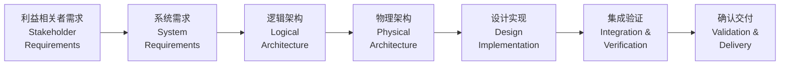
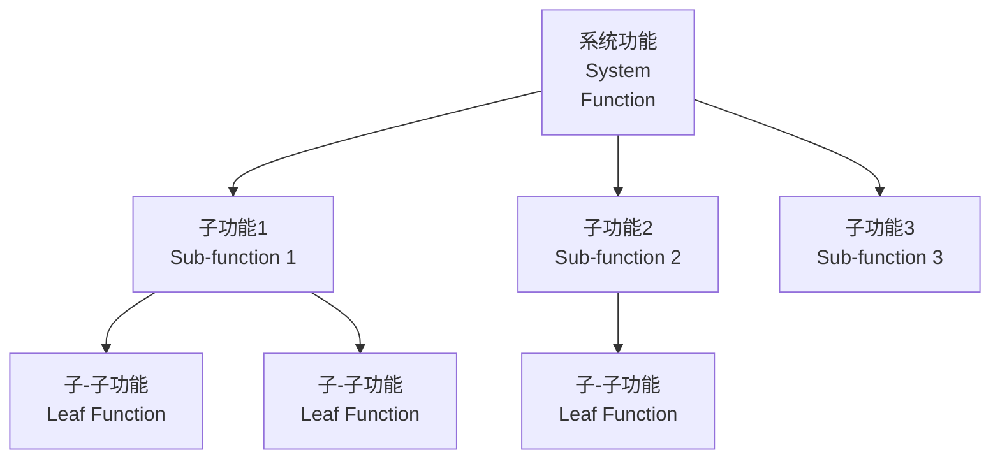
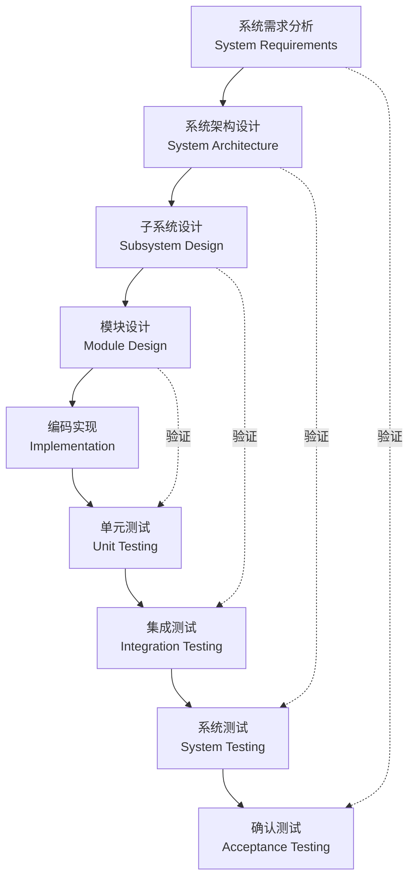
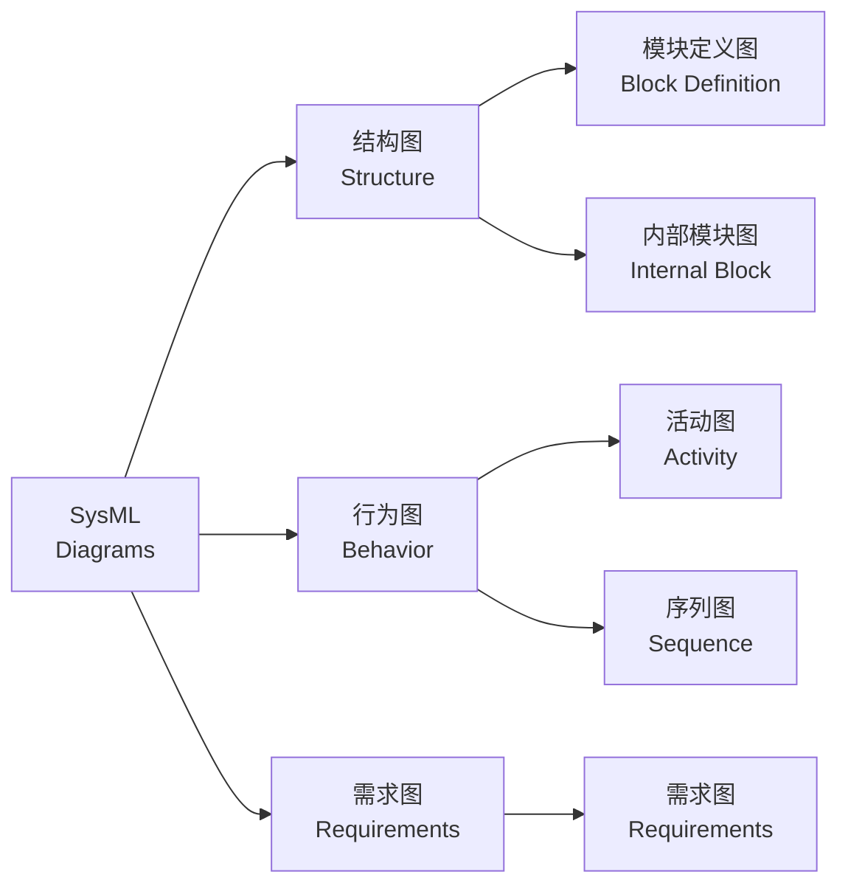

---
aliases:
  - Systems Engineering
  - 系统工程学
  - 系统方法论
tags:
  - systems-engineering
  - requirements
  - v-model
  - mbse
  - design
---

# 系统工程 (Systems Engineering)

系统工程是一门跨学科的方法论，专注于复杂系统的整体设计、集成和管理。它强调从全局视角出发，协调技术、管理和利益相关者需求。

## 系统工程基础 (SE Fundamentals)

系统工程的核心在于管理复杂性，通过结构化的方法确保系统满足所有需求。

### 定义与原则

国际系统工程协会 (INCOSE) 定义：

> 系统工程是一种使系统能成功实现的跨学科方法，它关注从概念到退役全生命周期中系统的需求、设计、验证与确认。

系统工程原则包括：

- **整体性 (Holism)**：系统大于各部分之和
- **涌现性 (Emergence)**：系统行为不能简单由各部分行为推导
- **利益相关者价值 (Stakeholder Value)**：以满足需求为中心
- **生命周期思维 (Lifecycle Thinking)**：考虑全寿命周期成本

### 系统工程流程

## 需求工程 (Requirements Engineering)

需求是系统工程的基石，需求工程确保正确理解并记录利益相关者的期望。

### 需求分类

| 需求类型 | 英文名称 | 描述 | 示例 |
|---------|----------|------|------|
| 功能需求 | Functional | 系统应做什么 | 系统应能处理 1000 TPS |
| 性能需求 | Performance | 系统做得多好 | 响应时间 < 2s |
| 接口需求 | Interface | 与其他系统交互 | 支持 REST API |
| 安全需求 | Safety | 避免危害 | 故障安全模式 |
| 可靠性需求 | Reliability | 持续运行能力 | MTBF > 10,000h |
| 可维护性 | Maintainability | 易于维护 | 平均修复时间 < 4h |

### 需求管理

需求管理包括以下活动：

- **需求获取 (Elicitation)**：与利益相关者沟通
- **需求分析 (Analysis)**：识别冲突与模糊性
- **需求规格 (Specification)**：编写需求文档
- **需求验证 (Validation)**：确认需求正确性
- **需求变更 (Change Management)**：控制变更流程

需求追踪矩阵 (Requirements Traceability Matrix, RTM) 确保每个需求都有设计、实现和测试的对应关系。

## 系统架构设计 (System Architecture Design)

架构设计将需求转化为可实现的技术方案。

### 逻辑架构与物理架构

| 架构层次 | 关注点 | 产物 |
|---------|--------|------|
| 概念架构 | 系统边界、外部接口 | 上下文图、用例图 |
| 逻辑架构 | 功能分解、信息流动 | 功能树、数据流图 |
| 物理架构 | 技术实现、部署方案 | 模块图、部署图 |

### 功能分解 (Functional Decomposition)

将系统功能逐层分解为可管理的模块：

## V 模型 (V-Model)

V 模型是系统工程的经典生命周期模型，强调验证与确认的对称性。

### V 模型结构

### 验证与确认

| 活动 | 英文 | 问题 | 方法 |
|------|------|------|------|
| 验证 | Verification | 我们是否正确地构建系统？ | 测试、评审、分析 |
| 确认 | Validation | 我们是否构建了正确的系统？ | 原型、仿真、用户测试 |

## 基于模型的系统工程 (MBSE)

MBSE 使用形式化模型作为系统工程的核心产物，替代传统以文档为中心的方法。

### 建模语言

| 语言/标准 | 适用范围 | 特点 |
|----------|----------|------|
| SysML | 通用系统工程 | UML 扩展，九种图 |
| AADL | 嵌入式实时系统 | 架构分析与设计语言 |
| Modelica | 物理系统仿真 | 基于方程 |
| MATLAB/Simulink | 控制与信号处理 | 数据流建模 |

### SysML 图类型

## 系统集成 (System Integration)

系统集成是将各组件组合为完整系统并确保其协同工作的过程。

### 集成策略

| 策略 | 英文名称 | 描述 | 适用场景 |
|------|----------|------|----------|
| 大爆炸集成 | Big Bang | 所有模块同时集成 | 小型系统 |
| 自顶向下 | Top-Down | 先集成上层模块 | 有清晰层次结构 |
| 自底向上 | Bottom-Up | 先集成底层模块 | 底层模块稳定 |
| 增量集成 | Incremental | 逐步增加模块 | 大型复杂系统 |

### 接口管理

接口控制文档 (Interface Control Document, ICD) 定义：

- 物理接口（连接器、机械尺寸）
- 电气接口（电压、电流、时序）
- 数据接口（协议、格式、速率）
- 软件接口（API、消息格式）

## 项目管理与系统工程

系统工程与项目管理紧密配合：

| 工程活动 | 管理活动 | 关联 |
|---------|----------|------|
| 需求开发 | 范围管理 | WBS 基于功能分解 |
| 技术评审 | 质量管理 | 里程碑评审 |
| 风险管理 | 风险管理 | 技术风险识别 |
| 配置管理 | 变更管理 | 基线控制 |

### 技术评审

| 评审类型 | 时机 | 目的 |
|---------|------|------|
| 系统需求评审 (SRR) | 需求完成后 | 确认需求完整性 |
| 初步设计评审 (PDR) | 架构设计后 | 评估技术方案 |
| 关键设计评审 (CDR) | 详细设计后 | 批准设计实现 |
| 测试准备评审 (TRR) | 测试前 | 确认测试就绪 |

## 参考资料 (References)

- INCOSE. *Systems Engineering Handbook*
- NASA. *Systems Engineering Handbook*
- Estefan, J.A. *Survey of Model-Based Systems Engineering Methodologies*
