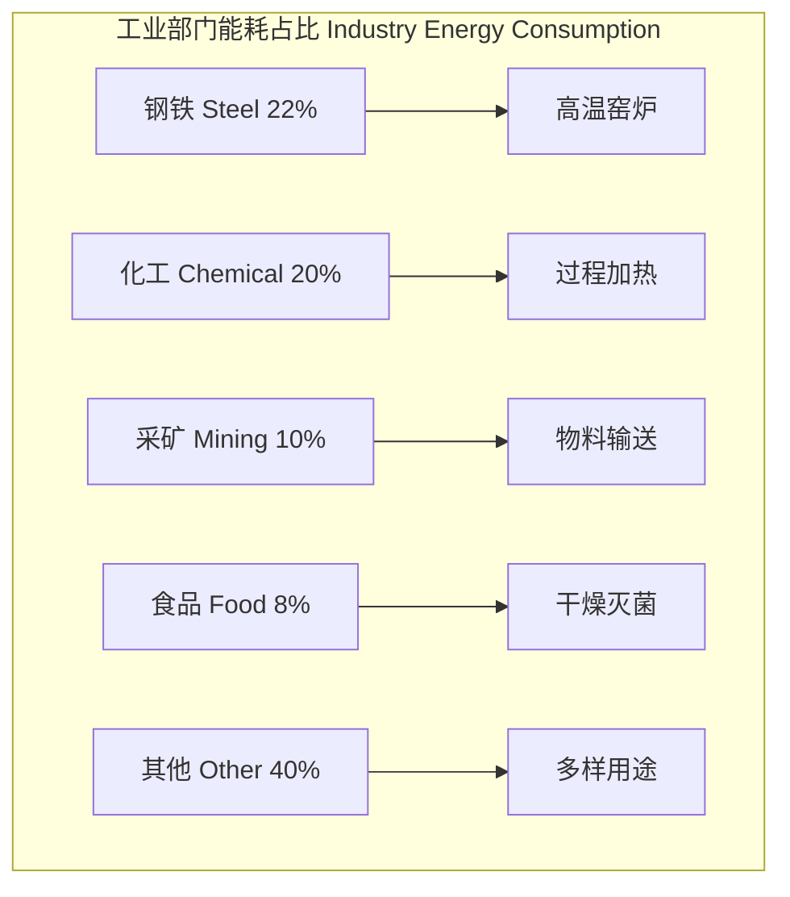
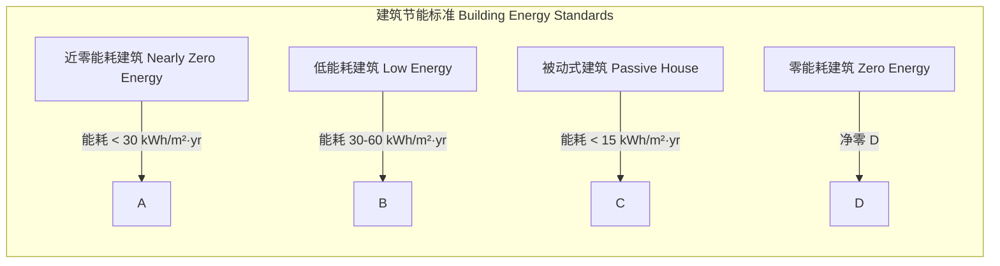

---
aliases: [EnergyEfficiency, 能源效率, Energy Conservation, Energy Saving, EE]
tags: ['EnergyAndNuclearEngineering', 'EnergyScience', 'EnergyEfficiency', 'EnergyConservation']
created: 2026-05-17
updated: 2026-05-17
---

# 能源效率

## 概述

能源效率（Energy Efficiency）是指在满足相同服务需求的前提下，减少能源消耗的能力。提高能源效率是实现碳中和目标最经济、最快速的途径之一。

## 基本概念

### 定义与指标

能效的定义式：

$$
\eta = \frac{E_{\text{output}}}{E_{\text{input}}} \times 100\%
$$

| 指标 | 定义 | 单位 | 应用领域 |
|------|------|------|---------|
| 单位 GDP 能耗 | 能源消费量 / GDP | tce/万元 | 宏观经济 |
| 能源强度（Energy Intensity） | 单位产值能耗 | MJ/元 | 行业比较 |
| 能效比（EER） | 制冷量 / 输入功率 | W/W | 空调系统 |
| 一次能源消耗（PE） | 全生命周期能耗 | MJ | 建筑能耗 |

## 工业能效

### 工业能耗分布

### 工业系统能效提升

| 系统类型 | 能效提升措施 | 节能潜力 | 投资回收期 |
|---------|-------------|---------|-----------|
| 电机系统 | 变频调速（VFD）、高效电机 IE4 | 20% — 30% | 1 — 3 年 |
| 压缩空气 | 管路检漏、变频压缩机 | 15% — 25% | 0.5 — 2 年 |
| 锅炉系统 | 烟气余热回收、智能燃烧控制 | 5% — 15% | 2 — 4 年 |
| 蒸汽系统 | 疏水阀改造、管道保温 | 10% — 20% | 1 — 2 年 |
| 照明系统 | LED 替换、智能调光 | 50% — 70% | 0.5 — 1.5 年 |
| HVAC 系统 | 热回收、变频风机水泵 | 20% — 40% | 2 — 5 年 |

### 余热回收

余热资源按温度分级：

| 级别 | 温度范围 | 回收技术 | 用途 |
|------|---------|---------|------|
| 高温余热 | > 500°C | 余热锅炉、斯特林机 | 发电/供热 |
| 中温余热 | 200 — 500°C | 热交换器、ORC 发电 | 预热空气/发电 |
| 低温余热 | 50 — 200°C | 热泵、吸收式制冷 | 供暖/制冷 |

## 建筑能效

### 建筑围护结构

传热系数（U-value）：

$$
U = \frac{1}{R_{\text{si}} + \sum R_i + R_{\text{se}}}
$$

其中 $R_i = d_i / \lambda_i$ 为各层热阻，$d_i$ 为厚度，$\lambda_i$ 为导热系数。

| 建筑构件 | 传统 U 值 (W/m²K) | 节能标准 U 值 | 节能潜力 |
|---------|------------------|-------------|---------|
| 外墙 | 1.5 — 2.5 | 0.2 — 0.5 | 60% — 80% |
| 屋顶 | 2.0 — 3.0 | 0.15 — 0.3 | 70% — 85% |
| 窗户 | 3.0 — 6.0 | 1.0 — 2.0 | 50% — 70% |
| 地面 | 1.0 — 2.0 | 0.2 — 0.5 | 50% — 75% |

### 建筑能耗标准

## 能源管理体系

### ISO 50001 框架

| 阶段 | 核心内容 | 关键输出 |
|------|---------|---------|
| 能源策划 | 基准年确定、能源评审、KPI 设定 | 能源基准（EnB）、能效指标（EnPI） |
| 实施与运行 | 运行控制、设计采购、人员培训 | 操作规程（SOP） |
| 检查与纠正 | 能源监测、内审、不符合项纠正 | 能源绩效评估报告 |
| 管理评审 | 管理层评审、持续改进 | 能源管理行动计划 |

### 能源审计

能源审计（Energy Audit）分级：

| 级别 | 范围 | 精度 | 成本 | 产出 |
|------|------|------|------|------|
| 一级（初步） | 现场走访、数据收集 | ±20% | 低 | 能耗账单分析 |
| 二级（详细） | 设备测试、分项计量 | ±10% | 中 | 节能措施清单 |
| 三级（投资级） | 全量数据、动态模拟 | ±5% | 高 | 投资可行性报告 |

## 能效政策与标准

### 能效标准体系

| 标准类型 | 示例 | 覆盖产品 | 实施方式 |
|---------|------|---------|---------|
| 最低能效标准（MEPS） | GB 18613 — 2020 | 电动机 | 强制 |
| 能效标识（Energy Label） | 1 — 5 级能效标签 | 家电 | 强制 |
| 能效领跑者（Top Runner） | 行业最高水平 | 多品类 | 引导 |
| 生态设计（Eco-design） | EU 2009/125/EC | 用能产品 | 强制 |

### 中国能效政策

| 政策名称 | 发布年份 | 核心目标 |
|---------|---------|---------|
| 节能中长期专项规划 | 2004 | 建立节能优先的能源战略 |
| 能源法 | 2020（征求意见） | 确立节能法律制度框架 |
| 十四五节能减排方案 | 2021 | 单位 GDP 能耗降低 13.5% |
| 能效提升计划（2022—2025） | 2022 | 重点行业能效标杆水平 30% 达标 |

## 交通能效

### 车辆能效

| 动力类型 | 能量转化效率 | 续驶里程 | Well-to-Wheel 效率 |
|---------|------------|---------|------------------|
| 汽油内燃机（ICE） | 20% — 30% | 600 — 800 km | 12% — 18% |
| 柴油内燃机（ICE） | 30% — 40% | 700 — 1000 km | 18% — 25% |
| 混合动力（HEV） | 35% — 45% | 800 — 1200 km | 20% — 30% |
| 纯电动（BEV） | 85% — 95% | 300 — 700 km | 60% — 75% |
| 燃料电池（FCEV） | 50% — 65% | 500 — 700 km | 25% — 35% |

### 再生制动

再生制动（Regenerative Braking）能量回收率：

$$
E_{\text{regen}} = \eta_{\text{motor}} \cdot \eta_{\text{battery}} \cdot \frac{1}{2} m(v_i^2 - v_f^2)
$$

### 轻量化与空气动力学

轻量化每减重 100 kg 可降低 6% — 8% 的能耗；空气阻力降低 10% 约可节省 3% — 5% 的燃油消耗。

## 数据中心能效

### PUE 指标

PUE（Power Usage Effectiveness）是衡量数据中心能效的核心指标：

$$
PUE = \frac{\text{总能耗}}{\text{IT 设备能耗}}
$$

| PUE 等级 | 范围 | 说明 |
|---------|------|------|
| 理想 | 1.0 | 所有能耗全用于 IT 设备 |
| 优秀 | < 1.2 | 先进液冷/自然冷却 |
| 良好 | 1.2 — 1.5 | 高效空调+合理布局 |
| 一般 | 1.5 — 2.0 | 传统风冷设计 |
| 落后 | > 2.0 | 需全面节能改造 |

### 数据中心节能措施

| 措施 | 节能效果 | 实施难度 | 投资回收期 |
|------|---------|---------|-----------|
| 冷热通道封闭 | 15% — 25% | 低 | 3 — 6 个月 |
| 自然冷却（Free Cooling） | 30% — 60% | 中 | 1 — 2 年 |
| 液冷（Liquid Cooling） | 40% — 50% | 高 | 2 — 4 年 |
| 虚拟化整合 | 20% — 40% | 中 | 1 — 3 年 |
| 智能温度和照明控制 | 10% — 15% | 低 | 6 — 12 个月 |

## 碳达峰与碳中和路径

### 能效在碳中和中的作用

碳中和路径（Carbon Neutrality Pathway）中能效的贡献：

| 年份 | 能效提升累计贡献 | 可再生能源贡献 | 电气化贡献 | 其他（CCUS 等） |
|------|---------------|--------------|----------|---------------|
| 2020 — 2030 | 35% — 40% | 25% — 30% | 15% — 20% | 5% — 10% |
| 2030 — 2040 | 25% — 30% | 35% — 40% | 20% — 25% | 10% — 15% |
| 2040 — 2050 | 15% — 20% | 40% — 45% | 20% — 25% | 15% — 20% |

## 参考

- IEA. (2024). *Energy Efficiency 2024*.
- 国家发展改革委. (2022). 《重点用能单位能效诊断指南》.
- ISO 50001:2018. *Energy Management Systems*.
- ASHRAE. (2023). *Handbook — Fundamentals*. Chapter 26: Energy Estimating and Modeling Methods.
- 中国标准化研究院. (2023). 《能效标准白皮书》.
- IRENA. (2024). *Energy Efficiency Indicators*.

