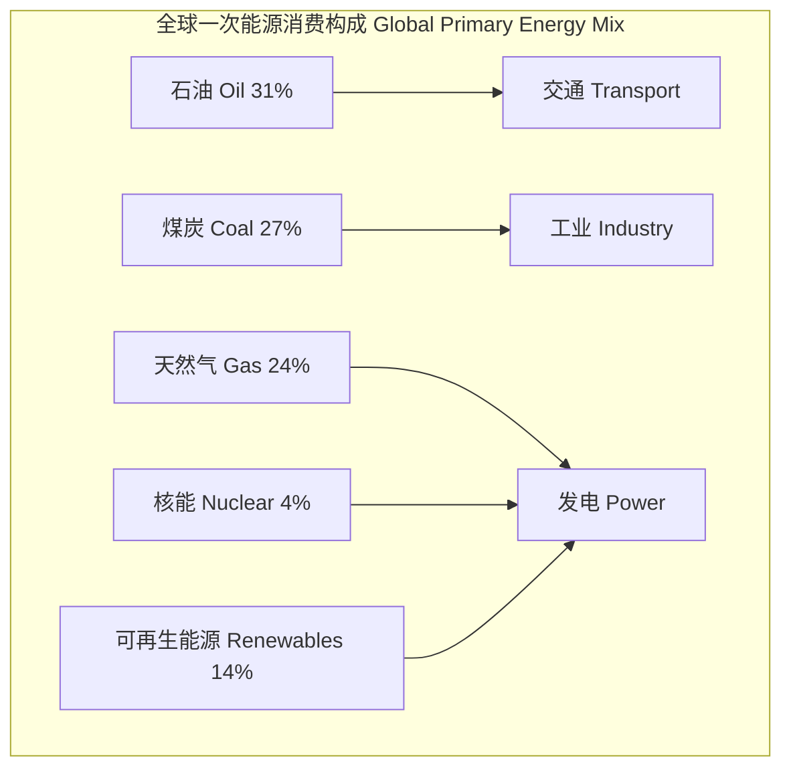
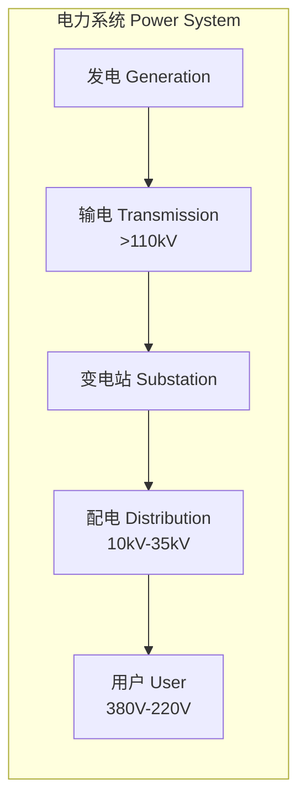
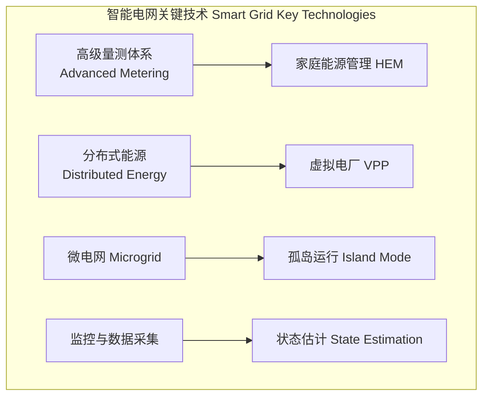
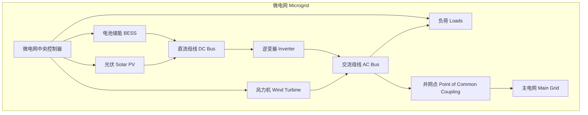

# 能源系统

## 概述

能源系统（Energy System）是由能源资源开采、转换、输配、储存和终端消费各环节组成的完整体系。现代能源系统正朝着清洁化、低碳化、智能化方向转型。

## 能源资源分类

### 按来源分类

| 类别 | 类型 | 示例 | 可再生性 |
|------|------|------|---------|
| 化石能源 | 煤炭、石油、天然气 | 烟煤、原油、页岩气 | 不可再生 |
| 核能 | 裂变、聚变 | 铀-235、钚-239 | 不可再生 |
| 可再生能源 | 太阳能、风能、水能 | 光伏、风电、水电 | 可再生 |
| 生物质能 | 固体、液体、气体 | 木柴、生物柴油、沼气 | 可再生 |

### 全球能源结构

## 能量转换

### 转换效率

热机效率（Carnot 效率极限）：

$$
\eta_{\text{Carnot}} = 1 - \frac{T_C}{T_H}
$$

其中 $T_H$ 为高温热源温度，$T_C$ 为低温热源温度。

### 主要转换技术

| 转换技术 | 输入 → 输出 | 典型效率 | 成熟度 |
|---------|------------|---------|-------|
| 燃煤发电 | 化学 → 电能 | 35% — 48% | 成熟 |
| 燃气联合循环（CCGT） | 化学 → 电能 | 55% — 62% | 成熟 |
| 光伏发电（PV） | 光 → 电能 | 15% — 24% | 成熟 |
| 风力发电 | 动能 → 电能 | 30% — 50% | 成熟 |
| 燃料电池 | 化学 → 电能 | 40% — 60% | 示范/推广 |
| 热电联产（CHP） | 化学 → 电+热 | 70% — 90% | 成熟 |

## 能源输配

### 电力系统架构

### 输配电损失

电力在传输过程中的线损：

$$
P_{\text{loss}} = I^2 R = \frac{P^2 R}{V^2 \cos^2\phi}
$$

其中 $P$ 为传输功率，$V$ 为电压，$\cos\phi$ 为功率因数。

| 电压等级 | 典型输送距离 | 线损率 |
|---------|-------------|--------|
| 超高压 500/750kV | 500 — 1500 km | 2% — 4% |
| 高压 110/220kV | 100 — 300 km | 3% — 6% |
| 中压 10/35kV | 10 — 50 km | 5% — 8% |
| 低压 380V/220V | 0.5 — 2 km | 8% — 12% |

## 能源储存

### 储电技术对比

| 技术类型 | 能量密度 (Wh/kg) | 循环寿命 | 响应时间 | 成本 ($/kWh) |
|---------|-----------------|---------|---------|-------------|
| 抽水蓄能（PSH） | 0.5 — 1.5 | 30 — 50 年 | 分钟级 | 50 — 150 |
| 锂离子电池（LIB） | 150 — 250 | 3000 — 10000 | 毫秒级 | 200 — 600 |
| 铅酸电池（Lead-Acid） | 30 — 50 | 500 — 1500 | 毫秒级 | 100 — 300 |
| 钠硫电池（NaS） | 150 — 240 | 2500 — 4500 | 毫秒级 | 300 — 500 |
| 液流电池（Flow Battery） | 15 — 40 | 10000+ | 毫秒级 | 300 — 700 |
| 飞轮储能（Flywheel） | 10 — 30 | 20000+ | 秒级 | 500 — 2000 |
| 压缩空气（CAES） | 3 — 10 | 30 — 40 年 | 分钟级 | 100 — 250 |

## 智能电网

### 关键技术

### 需求侧响应

| 响应类型 | 响应时间 | 激励方式 | 削峰比例 |
|---------|---------|---------|---------|
| 价格型（Price-based） | 15 min — 1 h | 分时电价（TOU） | 5% — 10% |
| 激励型（Incentive-based） | 1 min — 15 min | 直接负荷控制（DLC） | 10% — 20% |
| 紧急型（Emergency） | 秒级 | 可中断负荷 | 15% — 30% |

## 能源系统建模

### 优化模型

线性规划用于能源系统容量规划：

$$
\min \sum_{i} C_i \cdot P_i + \sum_{t} \sum_{i} O_i \cdot g_{i,t}
$$

约束条件：

$$
\sum_i g_{i,t} + \text{storage}_{t} = L_t \quad \forall t
$$

## 微电网

### 微电网架构

微电网（Microgrid）是局部化的能源系统，包含分布式电源、储能和可控负荷：

### 运行模式

| 运行模式 | 并网状态 | 控制目标 | 关键技术 |
|---------|---------|---------|---------|
| 并网运行（Grid-connected） | 闭合 PCC | 经济调度、功率交换 | PQ 控制 |
| 孤岛运行（Island Mode） | 断开 PCC | 电压频率稳定 | V/f 控制 |
| 并网转孤岛 | 检测脱网 | 无缝切换 | 孤岛检测 + 模式切换 |
| 黑启动（Black Start） | 全停后恢复 | 逐步恢复供电 | 储能启动 + 有序恢复 |

### 微电网保护

传统保护在微电网中面临的挑战：

| 问题 | 原因 | 解决措施 |
|------|------|---------|
| 保护盲区 | 逆变器故障电流小（< 2 倍额定） | 低阻抗保护、方向元件 |
| 孤岛保护 | 非检测区 NDZ | 主动式孤岛检测（频率偏移） |
| 选择性失效 | 双向潮流 | 方向过流保护、差动保护 |

## 综合能源系统

### 多能互补

多能互补（Multi-Energy Complementarity）系统架构包含电力、热力、燃气等多种能源形式：

| 耦合方式 | 能量转换路径 | 效率 | 典型工程 |
|---------|------------|------|---------|
| 热电联产（CHP） | 天然气 → 电 + 热 | 70% — 90% | 供热站 |
| 冷热电三联供（CCHP） | 天然气 → 电 + 冷 + 热 | 80% — 95% | 大型公建 |
| 电转热（P2H） | 电 → 热（热泵/电锅炉） | COP 3 — 5 | 弃风供暖 |
| 电转气（P2G） | 电 → H₂ → CH₄ | 30% — 50% | 季节性储能 |
| 氢能与燃料电池 | 可再生能源 → H₂ → 电 | 40% — 60% | 零碳园区 |

### 区域能源规划

区域综合能源系统优化模型：

$$
\min \sum_{t} \sum_{i} \left(C_{i}^{\text{op}} g_{i,t} + C_{i}^{\text{start}} y_{i,t}\right)
$$

约束条件：

- 功率平衡约束
- 设备运行约束（爬坡率、出力上下限）
- 储能约束（SOC 上下限、充放电功率）
- 网络潮流约束（电压、线路容量）

## 参考

- IPCC. (2022). *Renewable Energy Sources and Climate Change Mitigation*.
- 倪维斗等. (2019). 《能源系统工程》. 清华大学出版社.
- IEA. (2024). *World Energy Outlook 2024*.
- IEEE Std 1547. *Standard for Interconnection and Interoperability of Distributed Energy Resources*.
- 周孝信等. (2022). 《新一代能源系统》. 科学出版社.
- EnergyPLAN. (2023). *Advanced Energy System Analysis Model Documentation*.
