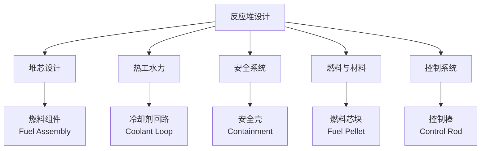
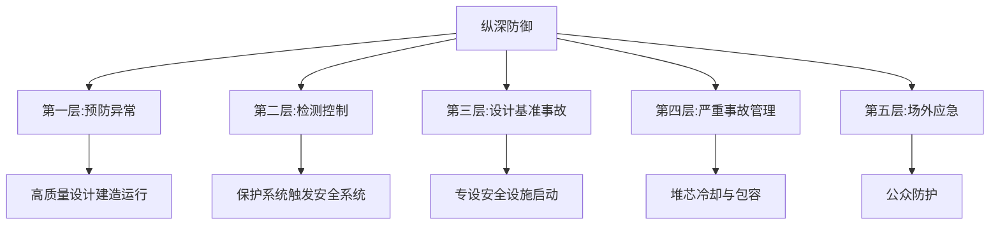

# 反应堆设计 (Reactor Design)

## 概述

核反应堆设计（Nuclear Reactor Design）是研究核反应堆的物理、热工水力、结构、控制和安全性设计的综合性工程技术学科。核反应堆是通过可控的核裂变链式反应释放核能的装置，其核心是将裂变产生的热能转化为电能或其他形式的能量。

反应堆设计需要在经济性、安全性和可持续性之间取得平衡，涉及核物理、材料科学、热工水力、辐射防护、控制工程和安全分析等多个学科领域。现代反应堆设计遵循"纵深防御"（Defense in Depth）原则，通过多重独立的安全屏障和系统确保核安全。

## 反应堆类型

### 轻水反应堆（Light Water Reactor, LWR）

轻水反应堆是目前全球应用最广泛的堆型，占运行核电站的 90% 以上，使用普通水（H₂O）作为冷却剂和慢化剂。

**压水堆（Pressurized Water Reactor, PWR）**：

| 参数 | 典型值 |
|------|--------|
| 一回路压力 | 15.5 MPa |
| 一回路温度 | 入口 290°C，出口 325°C |
| 二回路压力 | 6-7 MPa |
| 二回路温度 | 饱和蒸汽 275-290°C |
| 热效率 | 30-33% |

特点：

- 一回路高压防止水沸腾
- 蒸汽发生器（Steam Generator）将热量传递给二回路
- 二回路产生蒸汽驱动汽轮机
- 代表：西屋 AP1000、法国 EPR、华龙一号

**沸水堆（Boiling Water Reactor, BWR）**：

| 参数 | 典型值 |
|------|--------|
| 回路压力 | 7 MPa |
| 堆芯温度 | 约 285°C |
| 蒸汽品质 | 直接产生饱和蒸汽 |
| 热效率 | 32-34% |

特点：

- 堆内直接产生蒸汽，无需蒸汽发生器
- 系统简化，但汽轮机需辐射防护
- 代表：GE BWR/6、ESBWR

### 重水反应堆（Heavy Water Reactor, HWR）

使用重水（D₂O）作为慢化剂，可用天然铀（0.7% U-235）作为燃料。

**CANDU 堆（CANada Deuterium Uranium）**：

- 水平压力管式结构，在线换料
- 使用天然铀，燃料成本低
- 中子经济性好，适合钍燃料循环
- 代表：加拿大 CANDU 6、印度 PHWR

### 气冷堆（Gas-Cooled Reactor, GCR）

使用气体（氦气或二氧化碳）作为冷却剂，石墨作为慢化剂。

**高温气冷堆（High Temperature Gas-cooled Reactor, HTGR）**：

| 参数 | 典型值 |
|------|--------|
| 冷却剂 | 氦气（He） |
| 出口温度 | 750-950°C |
| 燃料形式 | TRISO 包覆颗粒 |
| 热效率 | 40-50% |

特点：

- 高温可用于制氢和工业供热
- 固有安全性好（负温度系数强）
- TRISO 燃料包容裂变产物能力强
- 代表：中国 HTR-PM、美国 X-energy Xe-100

### 快中子反应堆（Fast Breeder Reactor, FBR）

使用快中子维持链式反应，无需慢化剂。钠冷快堆（SFR）以液态钠为冷却剂，堆芯温度 360-550°C，使用 MOX 或金属燃料，增殖比 >1，可提高铀资源利用率并焚烧锕系元素。其他先进堆型包括熔盐堆（MSR）、铅冷快堆（LFR）和超临界水冷堆（SCWR）。

## 反应堆物理设计

### 临界条件

反应堆维持自持链式反应的条件是有效增殖因子 $k_{eff} = 1$：

$$k_{eff} = k_\infty \cdot P_{NL} = 1$$

- $k_\infty$：无限介质增殖因子
- $P_{NL}$：不泄漏概率
- $k_{eff} > 1$：超临界，功率上升
- $k_{eff} < 1$：次临界，功率下降

**反应性（Reactivity）**：

$$\rho = \frac{k_{eff} - 1}{k_{eff}}$$

### 中子通量分布与反应性控制

稳态裸堆中子通量近似分布：$\phi(r,z) = \phi_0 J_0(2.405r/R) \cos(\pi z/H)$，径向呈贝塞尔函数分布，轴向呈余弦分布。$R$ 为堆芯等效半径，$H$ 为堆芯等效高度。

**反应性控制**

**控制棒**：材料为 Ag-In-Cd 合金或 B₄C，用于启停反应堆、调节功率和补偿反应性变化，分为停堆棒、功率调节棒和温度调节棒。

**可燃毒物**：硼硅玻璃或 Gd₂O₃，补偿新燃料过剩反应性，随燃耗消耗。

**可溶毒物**：硼酸（H₃BO₃）溶解在冷却剂中，实现化学补偿控制（Chemical Shim）。

## 热工水力设计

### 热通道因子

堆芯内热工水力设计的核心是确保燃料元件不发生烧毁（DNB 或 Dryout）。

**热通道因子（Heat Flux Factor）**：

$$F_Q = \frac{q''_{max}}{\bar{q}''}$$

- $q''_{max}$：最大局部热流密度
- $\bar{q}''$：平均热流密度
- 典型值：2.0-2.5

### 偏离泡核沸腾比（DNBR）

$$DNBR = \frac{q''_{CHF}}{q''_{actual}}$$

- $q''_{CHF}$：临界热流密度（Critical Heat Flux）
- $q''_{actual}$：实际热流密度
- 设计限值：通常要求 DNBR > 1.3（W-3 公式）

### 燃料温度分布

燃料芯块内温度分布（圆柱坐标）：$T(r) = T_s + \frac{q'''}{4k}(r_0^2 - r^2)$。燃料中心最高温度需低于 UO₂ 熔点（约 2840°C），通常设计限值为 2100-2300°C。

## 反应堆安全设计

### 纵深防御（Defense in Depth）

现代核安全的基本理念，包含五个层次：

**安全屏障**：燃料基体（UO₂ 陶瓷）→ 燃料包壳（锆合金）→ 一回路压力边界 → 安全壳（预应力混凝土/钢衬里）。

### 专设安全设施

**压水堆安全系统**：安全注入系统（SI，LOCA 时向堆芯注冷却剂）、余热排出系统（RHR）、安全壳喷淋、辅助给水系统。

**先进非能动安全系统（AP1000）**：非能动堆芯冷却系统（PXS，利用重力与自然循环）、非能动安全壳冷却系统（PCS，空气自然对流），无需交流电源可运行 72 小时以上。

## 核燃料与材料

### 燃料类型

**二氧化铀（UO₂）陶瓷燃料**：

- 最常用燃料形式
- 熔点高（2840°C）、化学稳定性好
- 热导率较低，中心温度梯度大
- 富集度：3-5% U-235（LWR）

**MOX 燃料（Mixed Oxide）**：

- UO₂ 和 PuO₂ 混合物
- 利用后处理回收的钚
- 快堆中使用 PuO₂ 含量更高的 MOX

**金属燃料**：

- U-Zr 合金或 U-Pu-Zr 合金
- 热导率高，运行温度低
- 主要用于快堆

### TRISO 燃料颗粒与结构材料

高温气冷堆 TRISO 燃料颗粒由疏松 PyC 层（缓冲）、致密 PyC 层（阻挡）、SiC 层（结构强度）多层包覆。

**结构材料**：燃料包壳采用锆合金（Zr-4、M5、ZIRLO），低中子吸收截面；压力容器为低合金钢锻件（SA-508 Gr.3），内表面堆焊不锈钢，设计寿命 60 年。

**燃料包壳**：

- 锆合金（Zr-4、Zr-2、M5、ZIRLO）
- 低中子吸收截面
- 高温下与水反应产生氢气（包壳失效风险）

## 小型模块化反应堆（SMR）

SMR 是近年来发展迅速的先进反应堆概念：

SMR 功率一般 <300 MWe/机组，采用工厂预制、现场组装的模块化建造方式，配备非能动安全系统，可灵活组合运行，适用于发电、供热、制氢和海水淡化。代表性设计包括美国 NuScale（77 MWe）、中国玲龙一号（125 MWe）和加拿大 BWRX-300（300 MWe）。

## 经典教材与规范

- 谢仲生《核反应堆物理分析》
- 胡仲森《核反应堆物理》
- Todreas & Kazimi《Nuclear Systems I & II》
- Duderstadt & Hamilton《Nuclear Reactor Analysis》
- IAEA 安全标准系列（SSR、SSG、NS-G）
- 《核动力厂设计安全规定》（HAF102）

## 主要应用领域

- 商用核电站设计与建造
- 研究试验堆、船舶核动力
- 空间核电源、区域供热和海水淡化
- 核能制氢、医疗同位素生产堆

## 相关条目

- [[NuclearPhysics|核物理]]
- [[EnergySystems|能源系统]]
- [[EnergyEfficiency|能源效率]]
- [[HydrogenEnergy|氢能]]
- [[RadiationProtection|辐射防护]]
- [[NuclearFuelCycle|核燃料循环]]
